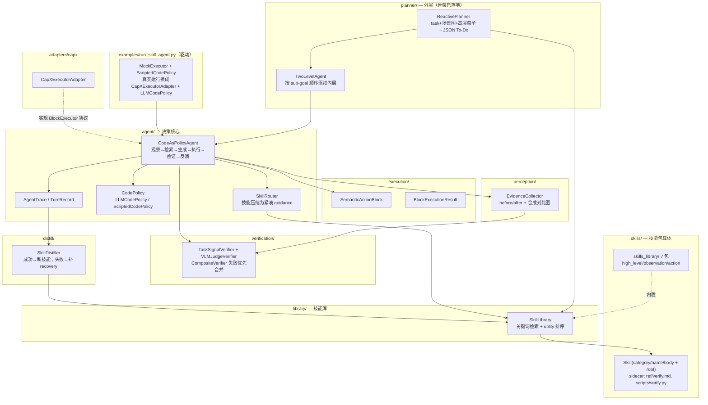
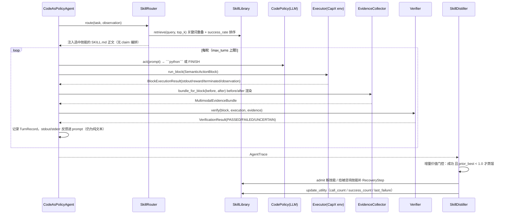
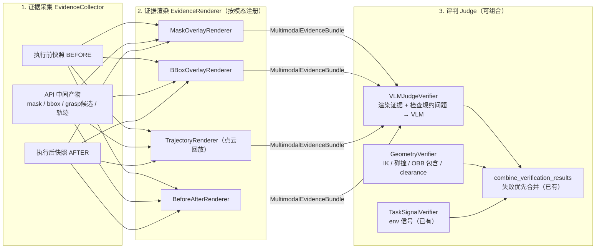

# RoboMEx 框架进度文档

> 本文档记录 `robomex/` 包的当前实现进度：整体架构、与目标设计之间的差距，以及下一阶段的开发路线。

> **⚠️ 2026-06 技能包重构（最新，重要）**：在 prose-first 基础上，技能载体进一步从“单个扁平 `.md`”升级为 **MMSkills/jianying 式的目录包（package）**，并按**读者**拆分文件：
>
> ```text
> skills_library/<category>/<skill_id>/
>   SKILL.md       # 执行 Agent：when / 分解 / 过程 / 失败恢复（Verify 只留一句指针）
>   ref/verify.md  # Verifier Agent：权威 pass/fail rubric（+ 可选视觉参考 *.png）
>   scripts/verify.py  # 可选：Verifier 参考的验证原语库（参考非强制，详见 §5.6；estimate_geometry 已有可跑实现）
> ```
>
> 同时把 `kind(observation/action) + compound` 两个字段**合并为单一 `category`**：`high_level` / `observation` / `action`（`compound` 改为派生属性 = `category==high_level`）。`schema.py` 仍是轻量容器（`skill_id / name / category / description / body + 开放 meta`），**无 typed `Claim` / `requires` / `produces` / `apis` 校验**。`seeds` 概念已删除——内置技能直接就是 `robomex/skills/skills_library/`（带自动生成的 `README.md` 清单）。`SkillRouter` 只做“关键词检索 + 注入 `SKILL.md` 正文”。
>
> 因此下文凡描述“`kind`/`compound` 字段、typed Claim 接口、claim 自动编排 / `producers_of`、`available_apis` 校验、扁平 `<skill_id>.md` 存储、`seeds/` 目录、8 个种子含 `pick_and_place`”的部分（尤其 §2 包结构、§2.1 架构图、§2.2 时序图、§3.1/§3.2、§5.1/§5.2、§6 清单相关行）**已过时**，以本 banner 与下文已更新章节为准。当前仍有效：验证升级阶梯思想（§4.2–4.6）、两层 ReAct + REPL 结构（§5.3）、分级技能/递归组合（§5.5）、路线图（§7）。

> 状态基线：2026-06。技能库（目录包 + 三类 category + README 清单）/ 关键词检索 / gate-3 VLM 评判 / 单流蒸馏已落地，每个技能已带 `ref/verify.md`（Verifier Agent rubric）；**外层 ReactivePlanner + TwoLevelAgent 骨架已落地**（输出 JSON To-Do list、暂不重规划、暂不接 VLMJudge），`examples/run_planner.py` 离线可跑、`run_planner_live.py` 已就绪待真机联调。当前内置 **7 个技能**：高层 2（`pick_object`/`place_in_container`）+ 观测 3（`segment_object`/`estimate_geometry`/`grasp_candidates`）+ 动作 2（`grasp_object`/`place_into_container`）。**验证原语、多模态反馈、`scripts/verify.py` 实现、双流蒸馏均尚未落地**，内层主循环仍是单层 flat。

---

## 1. 一句话定位

RoboMEx（**Robo**tic **M**ultimodal **Ex**ecutable Skills）的目标形态（v1.3）：

> **技能是可递归组合的——高层技能（body 为子技能编排的复合 A-Skill）给外层 ReAct planner 当能力菜单、并编码自身的 O/A 分解；叶子 O/A 技能（O 产出可验证 Claim、A 消费 Claim 承诺 effect）给内层 REPL Code Agent 当 building block。外层 planner 在 grounded 的能力菜单上选择排序高层技能并重规划；内层在每个 sub-goal（= 验证单元）里做感知 grounded 的写码-观察-验证。每个技能都自带 When-to-use 与可执行的 How-to-verify（verifier-as-code，可内部调 VLM，沿“程序化→几何→VLM→换视角”升级阶梯）。成功轨迹沉淀几何先验与高层方法、失败轨迹归因到具体 Claim 或 postcondition，形成自进化闭环。所有 novelty 仍落在“可验证的 Claim + 可执行的验证 + 可蒸馏的技能”这条主线。**

当前代码状态（经 prose-first + 技能包 + planner-first 几次重构后）：**目录包技能库**（三类 category，每技能带 `ref/verify.md`）+ 咨询式 guidance（关键词检索 + 注入 `SKILL.md` 正文）+ gate-3 VLM 效果评判 + 单流蒸馏 + **外层 ReactivePlanner/TwoLevelAgent 骨架**。早期 v1.1 的 typed Claim 接口 / claim 自动编排已**废弃**——串联与验证改为 agent/planner 读 prose 决定。核心主张（code 是感知、动作、验证与技能蒸馏之间的可执行桥梁）不变，且 v1.2 进一步主张 **code 同时是观察与执行的统一媒介**（观察即可执行代码，故无需把 grounding 隔离成独立子对话）。距目标的主要缺口在**内层控制结构**（仍是单层 flat、纯文本反馈、验证为框架插桩而非 agent 可调原语）与**验证深度**（gate-1/2、verifier-as-code 实现、双流蒸馏未落地）。

### 版本演进速览

- **v1（早期骨架，已越过）**：单层 flat 多轮主循环，单物种七元组技能，env 信号验证。
- **v1.1（已基本落地）**：技能拆双物种 O/A，typed Claim 做接口，markdown 技能库 + claim 自动编排，collect→render→judge 中的 gate-3（VLMJudgeVerifier + EvidenceCollector + before/after 渲染）已实现，单流蒸馏。
- **v1.2（设计，部分落地）**：保留 v1.1 全部 novelty；控制结构从“主循环 + Grounding Branch 子对话 + 三道固定门”收敛为**两层 ReAct + REPL Code Agent**；三道门从框架固定插桩改为 **agent 可调验证原语 + 升级阶梯**；**sub-goal = 验证单元**；Claim 增加 `frame` + 多实例 + `target_selection`；反馈通道升级为**多模态**（渲染证据图回流进 prompt）。
- **v1.3（最新设计，本文目标，未落地）**：技能**可递归组合**——“高层”不是第三物种，而是 body 为子技能编排的**复合 A-Skill**（O/A 仍按 claim 方向硬区分）；**规划层配技能库**，高层技能服务外层 planner（能力菜单 + 编码 O/A 分解）；显式区分两个分解（任务→高层由 planner 现场规划 / 高层→O/A 编码在技能内可复用）；技能门面扩成 **When-to-use + How-to-verify**，`verify` 升级为 **verifier-as-code**（沙箱可执行、可内部调 VLM）；蒸馏升到两个粒度（高层方法蒸馏分期）。详见 `insights.md` 的 v1.3 章节。当前未落地部分见 §6 清单。

## 2. 包结构与模块职责（当前代码，v1.1 已落地 + v1.2 部分落地）

```text
robomex/
├── skills/              # 技能容器 + 内置技能库
│   ├── schema.py        #   Skill(skill_id/name/category/description/body/meta + root)
│   │                    #   + from_dir/from_markdown/to_markdown
│   │                    #   + sidecar 钩子 verify_doc_path()/reference_paths()/verifier_path()
│   └── skills_library/  #   目录包技能库：<category>/<skill_id>/{SKILL.md, ref/, scripts/}
│       │                #   高层 2（pick_object/place_in_container）
│       │                #   观测 3（segment_object/estimate_geometry/grasp_candidates）
│       │                #   动作 2（grasp_object/place_into_container）
│       ├── __init__.py  #   load_skills_library() + render_inventory()（生成 README）
│       └── README.md    #   自动生成的技能清单（按 category 统计 + sidecar 徽章）
├── library/             # 磁盘技能库：按 category 分目录、正文关键词检索、utility、compound_skills
│   └── store.py         #   admit 落盘 <category>/<id>/{SKILL.md, ref/, scripts/, utility.json}
├── planner/             # 外层规划（骨架已落地）
│   └── planner.py       #   ReactivePlanner（task+场景图+高层菜单 → JSON To-Do）+ TwoLevelAgent
├── agent/               # 内层决策核心（仍为单层 flat 主循环）
│   ├── agent.py         #   CodeAsPolicyAgent：观察→检索→生成→执行→采证→验证→反馈
│   ├── router.py        #   SkillRouter：关键词检索 top-k + 注入 SKILL.md 正文（无 claim 编排）
│   ├── policy.py        #   CodePolicy：LLM / 脚本回放
│   └── trace.py         #   AgentTrace / TurnRecord（蒸馏原料）
├── execution/           # 执行抽象：SemanticActionBlock / BlockExecutionResult
├── verification/        # 验证
│   ├── verifier.py      #   Verifier 接口 + TaskSignalVerifier + CompositeVerifier + 失败优先合并
│   └── vlm_judge.py     #   VLMJudgeVerifier：渲染证据 + checks → VLM（gate-3，已实现）
├── perception/          # 多模态证据（已接通，非死代码）
│   ├── evidence.py      #   EvidenceArtifact / MultimodalEvidenceBundle / 角色与种类枚举
│   ├── collector.py     #   EvidenceCollector：before/after 快照 + 合成对比图
│   └── render.py        #   save_rgb / render_before_after（before/after 渲染器，phase 1）
├── distill/             # SkillDistiller：轨迹 -> 技能进化（单流，markdown 产物）
├── adapters/capx/       # CapXExecutorAdapter + api_surface.py
└── examples/            # run_skill_agent.py（内层离线）/ run_planner.py（两层离线）
                         # + run_skill_agent_live.py / run_planner_live.py（真机）
```

### 2.1 架构总览图




### 2.2 运行时主循环（当前实现）

`CodeAsPolicyAgent.run()` 的执行流：




## 3. 已实现的设计决策（v1.2 下仍然有效的部分）

### 3.1 技能是"知识"不是"脚本"

`SkillRouter.build_guidance` 把技能压缩成任务条件化的紧凑文本注入 prompt，并明确提示 "adapt it, do not copy it blindly"——技能被咨询、不被照搬执行，策略基于当前观察自己生成代码。这一原则在 v1.2 中不变。

当前 schema 是 **prose-first 轻量容器**：`Skill` 只有 `skill_id`（取自技能目录名）/ `name` / `category`（`high_level`/`observation`/`action`，决定库内分目录）/ `description` / `body`（注入 prompt 的 `SKILL.md` 正文）+ 开放 `meta` + `root`（磁盘包目录，sidecar 解析用）。`compound` 是派生属性（`category==high_level`）。**没有 typed Claim 接口、没有 `requires`/`produces`/`apis` 校验、没有 YAML 化的 `verify`/`recovery`**——验证、分解、失败恢复都写在正文 prose 小节（`When to use` / `Procedure` / `Decomposition` / `Verify`(一句指针) / `Failure modes`）或 sidecar 文件里。

### 3.2 技能 = 目录包，按读者拆文件；知识与学习元数据分离

技能不再是单文件，而是一个**目录包**，文件按**读者**拆分（详见顶部 banner）：`SKILL.md` 给执行 Agent、`ref/verify.md`(+视觉参考) 给 Verifier Agent、`scripts/verify.py` 是确定性代码闸。`library/store.py` 按 `category` 分目录落盘，每个技能包旁存一份本地学习统计：

```text
<root>/<category>/<skill_id>/SKILL.md       # 可迁移知识（执行者正文）
<root>/<category>/<skill_id>/ref/verify.md  # 可迁移知识（验证者 rubric）+ 可选 ref/*.png
<root>/<category>/<skill_id>/scripts/        # 可选可执行验证码（verifier-as-code）
<root>/<category>/<skill_id>/utility.json    # 本地学习统计（call/success/last_failure/source）
```

知识包（`SKILL.md` + `ref/` + `scripts/`）可跨 agent / 模型迁移；utility 是库本地的检索排序与淘汰依据。`admit` 落盘时会连带把源包的 `ref/`、`scripts/` 一起拷入库副本。`schema.py` 提供 sidecar 钩子 `verify_doc_path()` / `reference_paths()` / `verifier_path()` 懒解析这些文件。（已移除早期的 `available_apis`/L4 白名单 `apis` 校验。）

### 3.3 自进化闭环 + 增量价值门控

`SkillDistiller.evolve()` 实现了 Skill1 的 r(\tau)-\hat{U} 思想：

- 无论成败，先对所有被咨询技能 `update_utility`；
- **失败**：把最后一条错误转成 `RecoveryStep` 追加到被咨询技能；
- **成功**：仅当历史最佳成功率 < 1.0 时才蒸馏新技能入库，避免冗余技能污染库。

门控逻辑在 v1.2 中保留，但蒸馏会升级为双流（见 §5.4）。

### 3.4 接口解耦，离线/真实可切换

`BlockExecutor`、`CodePolicy`、`Verifier` 均为 Protocol/ABC：

- 离线：`MockExecutor` + `ScriptedCodePolicy`（示例可直接跑通全闭环）；
- 真实：`CapXExecutorAdapter(env)`（鸭子类型包装 `env.step(code)`，可选 line trace）+ `LLMCodePolicy`（走 `capx.llm.client.query_model`）。

## 4. 验证：collect → render → judge 共享机器 + 可调原语 + 升级阶梯（v1.2 核心）

这是整个框架里 **"Multimodal" 一词真正的落点**。gate-3（效果验证）这一环已经接通，但 gate-1/gate-2 与"验证原语化"尚未落地。

### 4.1 现状：gate-3 已通，gate-1/2 与原语化未通

**已落地（v1.1）：**

1. `EvidenceCollector` 在每个 block 执行前后采集 agentview RGB，并 `render_before_after` 合成带 BEFORE/AFTER 标注的对比图（`MultimodalEvidenceBundle` / `EvidenceRole.VERIFICATION_CUE` 已是活代码）；
2. `VLMJudgeVerifier` 把对比图 + 技能声明的 `verify` checks 发给 VLM（走 `capx.llm.client`），返回带 confidence 的 JSON 裁决，低置信落 `UNCERTAIN` 而非 `FAILED`；
3. `CompositeVerifier` + `combine_verification_results` 实现 env 信号与 VLM 评判的**失败优先合并**（"几何/信号硬检查与 VLM 组合"已有载体）。

**尚未落地（v1.2 缺口）：**

1. **只有 gate-3**：gate-1（Claim 验证）与 gate-2（可行性 dry-run）没有实现，O-Skill 产出的 mask/grasp 等中间产物还没有被采集和验证；
2. **渲染器只有 before/after**：mask 叠加、bbox、点云轨迹回放渲染器都还没写；
3. **没有 `GeometryVerifier`**：IK / 碰撞 / OBB 包含等几何硬检查缺位，验证升级阶梯的"几何"层是空的；
4. **验证仍是框架插桩、非 agent 可调原语**：`observe / check_feasible / assert_effect` 尚不存在，verify 由主循环在固定时机调用；
5. **反馈仍是纯文本**：渲染证据图没有回流进 prompt，policy 还不是多模态输入。

### 4.2 共享验证机器：collect → render → judge

核心洞察：**不同模态的能力需要"专门设计"的验证证据格式**——

- 分割（SAM3）：mask 叠加绘制到 RGB 上；
- 检测（DINO）：bounding box + label 画到图上；
- robot action：点云中回放运动过程的视频 + 末帧图像；

然后交给 VLM 做理解评判。**渲染产物不是调试图，而是 VLM 评判的瞬态一等输入**：裸 mask / 裸轨迹 VLM 读不懂，叠加图 / 回放视频才是 VLM 友好的证据格式。注意自 v1.1 起的明确决策：渲染产物**不是技能的静态资产**（区别于 MMSkills 的 Images 资产路径），技能里沉淀的是"怎么渲染、问什么"的规约（`self_evidence_spec`），而非图片本身。




### 4.3 三类验证不再是固定门，而是 agent 可调原语（v1.2 关键调整）

v1.1 把验证设想成框架在固定时机插桩的“三道门”，但 agent 在 REPL 里自由写 code，框架无法干净地切出 O/A block 来插门。v1.2 据此调整：**三类验证保留，但改为内层 Code Agent 可随时调用的原语，时机由 agent 自己决定**。

```python
mask   = observe("milk carton")     # ~门1：返回 Claim，内部已渲染+判定，低置信抛 UNCERTAIN
geom   = observe_geometry(mask)     # ~门1
ok     = check_feasible(grasp_pose) # ~门2：IK/碰撞，纯几何，返回 go/no-go + 原因
grasp(grasp_pose)
assert_effect("object_grasped")     # ~门3：before/after + env 信号 + 几何终态
```

| 验证原语                         | 角色（约等于旧门） | 问题                  | 默认手段（见升级阶梯）             |
| ---------------------------- | --------- | ------------------- | ----------------------- |
| `observe()` / `observe_*()`  | Claim 验证  | “这个断言是真的吗？”         | 程序化/几何，模糊关系才升级 VLM 叠加图  |
| `check_feasible()`           | 可行性（dry-run）| “Claims 满足 precondition 吗？” | 纯几何：IK、碰撞、clearance     |
| `assert_effect()`            | 效果验证      | “postcondition 兑现了吗？” | env 信号 + 几何终态，必要时 before/after VLM |

这样 **“验证即技能” 在 API 层面成立**，且 **sub-goal 边界（由外层 ReAct 给定）= 验证单元边界**：一个 sub-goal 一个内层 episode，`assert_effect` 在 episode 末对照该 sub-goal 的 postcondition 跑——不需要框架解析代码切块。注意：v1.1 的 “Grounding Branch 子对话” 被取消，**观察是可执行代码，无需隔离子对话**（这是 v1.2 相对 v1.1 的核心结构变化，详见 `insights.md` v1.2 §1–2）。

### 4.4 验证升级阶梯：VLM 是升级手段，不是默认

每个验证原语内部不默认调 VLM，而是沿成本递增的阶梯触发：

```text
程序化 assert（量/阈值） → 几何检查（IK/碰撞/OBB） → VLM judge（语义/遮挡/叠加图） → 换视角现采 / 多转一轮
      最便宜，默认                次之                   贵，升级触发              最后手段
```

对机器人，程序化与几何检查又快又可靠，应是默认；VLM 只在语义/遮挡/关系消歧时升级触发。这天然缩小了 “VLM 会错” 的影响面——大部分 claim 根本到不了 VLM 那层。

### 4.5 感知的两个角色：服务决策 ≠ 服务验证

v1.1 几乎把 perception 等同于 verification（三道门都在判成败）。但最强 motivating case 恰恰**不是验证**：

- **perception-for-planning（服务决策，主线）**：`geom = estimate_geometry(obj)` → 看到 height → 算 `place_z`；关系消歧选 target 同理。
- **perception-for-verification（服务门控）**：判 claim 真假 / postcondition 兑现。

两者共享 collect→render 机器；REPL 循环天然覆盖两者——观察 cell 的输出（含渲染图）既回流为下一步**决策输入**，也可被验证原语消费。

### 4.6 风险与对策

1. **VLM 评判本身会错**：升级阶梯已让多数 claim 不经 VLM；进到 VLM 的，要求给 confidence 而非裸 yes/no，低置信走 `UNCERTAIN`，由 agent 换视角现采或多转一轮，而非硬判失败（`VerificationStatus.UNCERTAIN` 已为此预留）。
2. **机器人动作验证最难**：末帧图能验终态，但“运动过程无碰撞”靠点云回放 + VLM 是弱信号——几何硬检查必须与 VLM 评判**组合**而非二选一，`combine_verification_results` 的失败优先合并就是为此准备的。
3. **成本控制**：sandbox 错误直接 FAILED（不调 VLM）；验证原语默认走阶梯低层，只有高风险节点（如关系消歧选 target、抓取提交前）才强制升级到完整渲染 + VLM。内层 episode 有 step / consult 预算，防止无限采证循环。
4. **多模态反馈通道（架构硬要求）**：升级阶梯到 VLM 这层依赖把渲染证据图回流进下一轮 prompt，故 policy 必须是**多模态 LLM**、内层 loop 必须支持**图片反馈**。当前 `CodeAsPolicyAgent` 只回纯文本 stdout/stderr，是 v1.2 必补的一环。

## 5. 现状 → 目标设计的重构差距

> 技能载体已是 prose 目录包（§5.1/§5.2 的“双物种 + Claim schema”内容已随 prose-first 重构删除）；外层 ReactivePlanner 骨架也已落地（§5.3，输出 To-Do list、暂不重规划）。当前真正的大头是内层 REPL 化 + 验证原语 + 多模态反馈。

### 5.1 Schema：已收敛为 prose 轻量容器（无遗留差距）

技能载体已彻底 prose 化（见顶部重构说明与 §3.1）：最小 frontmatter + markdown 正文，无 typed Claim、无 `requires`/`produces`/`apis` 校验。原 v1.2 计划的 “Claim 细化（`frame` / 多实例 / `target_selection`）、verify 升级为可编译规约” 这条线**已废弃**——关系指代、验证方法等改为写在技能正文里、由 agent/planner 读 prose 处理。关系指代任务（如“左边的碗”）后续作为一个 prose O-skill（描述 detect-all + 几何消歧步骤）落地，不再引入 typed claim 字段。

### 5.2 技能载体：已是目录包技能库（基本完成）

**已完成**：内置技能与蒸馏产物统一为**目录包**（`SKILL.md` 正文 + `ref/verify.md` + 可选 `scripts/`/`ref/*.png`），按 `high_level/`·`observation/`·`action/` 三类 category 分目录，知识包与 utility 分文件存储，`admit` 落盘连带拷贝 sidecar。`seeds` 概念已删除，内置库即 `robomex/skills/skills_library/`（带自动生成 `README.md` 清单）。与早期"Python `build_skill()`"、扁平 `<skill_id>.md`、L4 `apis` 校验的差距均已消除。

与 MMSkills 的对齐：技能现在是**自包含 package**，并按读者拆文件（`SKILL.md`→执行者、`ref/`→Verifier Agent、`scripts/`→代码闸）；当前不写实际 `ref/*.png` 视觉参考与 `scripts/verify.py`（钩子与目录约定已就位，留待验证闭环阶段填）。不强制 Images 资产、渲染产物为瞬态证据的决策保持不变（视觉参考仅在 `ref/` 里按需放，由 Verifier Agent 加载）。

### 5.3 主循环：单层 flat → 两层 ReAct + REPL Code Agent（v1.2 最大结构改动）

> **进度（2026-06）**：外层骨架已落地——`planner/planner.py` 的 `ReactivePlanner` 吃 task + 初始场景图 + 高层技能菜单（`library.compound_skills()`），一次 LLM 调用产出 **JSON To-Do list**（每项含 `goal` / `skill` / `postcondition`）；`TwoLevelAgent` 按顺序把 sub-goal 喂给内层 `CodeAsPolicyAgent`。**当前简化**：暂不重规划、外层暂不接 VLMJudge 校验 postcondition、内层仍是单层 flat。下面描述的是完整目标形态。

当前 `CodeAsPolicyAgent.run()` 是**单层 flat 多轮循环**：每轮生成一段代码 → 执行 → 纯文本 stdout/stderr 反馈，没有任务分解、没有验证原语、没有图片反馈。v1.2 重构为两层：

```text
外层 ReAct planner（薄，新增）
  输入：任务 + observation summary + 【高层技能库的能力菜单（name + when-to-use）】(v1.3)
  在能力菜单上选择 + 排序高层技能，落成 sub-goal 序列；每个 sub-goal 附带 postcondition；接收内层回报后重规划
        │ 下行：sub-goal + postcondition（= 选中的高层技能 + 其 effect 断言）
        ▼
内层 REPL 式 Code Agent（厚，由现 CodeAsPolicyAgent 演化）
  load 选中高层技能的 decomposition（推荐 O/A 子技能，建议性）→ REPL：
  observe()/写 code → 看证据（含渲染图）→ 再写 → check_feasible() → act → assert_effect()
  O/A skill、Claim、验证原语、双流蒸馏原料全在这里
        │ 上行：done + 已验证 claims  /  failed + 归因（claim 为假=感知错 / postcondition 违反=执行错）
        ▼
外层据回报推进下一个高层技能或重规划
```

具体改动：

1. **新增外层 ReAct planner（v1.3：配高层技能库）**：不再是 v1.2 的“朴素 ReAct”，而是吃一份**高层技能能力菜单**（name + when-to-use）+ observation summary，在 grounded 的菜单上**选择 + 排序**高层技能、产出带 postcondition 的 sub-goal 序列，并消费内层回报重规划。保持薄——胜负手仍在 grounding 不在 planning。
2. **内层升级为 REPL 式循环**：反馈通道从纯文本扩到**多模态**（渲染证据图回流进 prompt）；先 load 选中高层技能的 `decomposition`（推荐子技能，**建议性、可偏离**），再引入 `observe / check_feasible / assert_effect` 三个验证原语（取代 v1.1 的固定门与 Grounding Branch 子对话——观察是可执行代码，无需隔离子对话）。
3. **sub-goal = 验证单元 = 一个高层技能的 episode**：`assert_effect` 在 episode 末对照该 sub-goal 的 postcondition（= 高层技能的 effect 断言）跑，边界由 planner 选定的高层技能给定。
4. **层间契约**：下行 sub-goal + postcondition；上行结构化 `done + claims` 或 `failed + 归因`，归因既喂外层重规划、也喂双流蒸馏。
5. `TurnRecord` / `AgentTrace` 扩展记录 sub-goal、选中高层技能、Claims 与各验证结果，失败归因到 Claim 或 postcondition——RL credit assignment 的结构基础。

### 5.4 蒸馏：单流 → 双流


| 现状                          | v1.2 目标                                                                                           |
| --------------------------- | ------------------------------------------------------------------------------------------------- |
| 成功 → 整段代码打包成新技能             | 成功 → 更新 A-Skill **几何先验区间**（如 clearance: [2,4]cm, n=12，被验证过的参数范围而非猜测常量）/ 蒸馏新 A-Skill               |
| 失败 → 裸 `RecoveryStep` 字符串追加 | 失败 → 经验证原语 + 层间归因（claim 为假 / postcondition 违反）定位到具体 Claim 后，更新对应 **O-Skill 的可靠性画像**（"SAM 缺乏空间语义→换 vlm-prompt"）与 fallback 链；同类失败结构化合并计数 |


GraspNet quat、place height 两个 motivating case 由此分别沉淀为"grasp 候选验证" O-Skill 教训和"place 高度估计"几何先验，而不是散落在任务技能里。

### 5.5 分级技能（递归组合）+ verifier-as-code（v1.3 新增）

v1.3 在不改 O/A 物种区分的前提下，引入**技能递归组合**与**可执行验证**。详见 `insights.md` v1.3 章节，落到代码的差距如下。

**(1) 高层技能 = 复合 A-Skill，不是第三物种。** `open_cabinet` / `pick_object` 这类高层能力本质仍是 A-Skill（消费前置、承诺 effect），区别只在 body 是“子技能编排”而非“一段代码”。schema 增量：


| 现状（v1.1）                          | v1.3 目标（待补）                                                                                       |
| ----------------------------------- | ------------------------------------------------------------------------------------------------ |
| A-Skill body = guidance（代码草图）       | ✅ 已落地：高层技能用 `category: high_level`，分解写在 `SKILL.md` 的 `## Decomposition`（建议性 O/A 子技能读单）；叶子技能 body 是 code/过程 |
| `verify` 是 `tuple[str]`（喂 VLMJudge 当 checks） | 🟡 钩子就位 + 雏形：rubric 外置 `ref/verify.md`、代码闸位 `scripts/verify.py`（`verifier_path()` 钩子）；`estimate_geometry` 已有可跑 `verify.py`（provenance overlay + VLM judge）。**最终形态见 §5.6（Reference-Anchored Verifier）**：独立 Verify Agent 自写 judge code、以 `scripts/verify.py` 为参考原语库、读 manifest 验 executor 真实产物 |
| `description` 承担 When-to-use（隐式）     | When-to-use 显式化，供**外层 planner 选技能**与检索做 applicability 判断 |


**(2) 两个分解分给两个角色（HTN）。** 任务→高层技能（外层 planner 现场规划，新颖易变）；高层技能→O/A 子技能（编码在 `decomposition` 内，跨任务复用）。planner 职责 = 在能力菜单上选择排序 + 重规划，而非从零分解。

**(3) verifier-as-code 的运行环境。** 验证码与动作代码同一 sandbox，额外注入感知 API（取 mask/点云/位姿）+ `vlm_judge()` 帮手（把现有 `VLMJudgeVerifier` 包成沙箱可调函数）。每层 verify 自洽：O-Skill 验 claim 可信、原语 A-Skill 验 effect、复合高层 A-Skill 验 sub-goal 的 postcondition。仍走升级阶梯（程序化/几何默认，VLM 升级）。

**(4) O-Skill 服务两层。** 既服务 planner 选高层技能（验前置 affordance：有没有柜子、关着没、够得着没），也服务内层 code agent 写码。planner 不能只靠技能文本规划，需吃 observation summary，必要时先调 O-Skill 验前置再承诺高层技能。

**(5) 纪律：decomposition 是建议性而非强制。** 高层技能记录的子技能清单是默认读单/默认拆法，code agent 可按当前场景偏离（延续 `"adapt it, do not copy it blindly"`）；显式读单与 claim 隐式连线互补——读单给方向、claim 连线保证类型对接。

### 5.6 Reference-Anchored Verifier：全 Agentic 的独立验证者（最终定稿）

经多轮收敛，验证者的形态定为 **Reference-Anchored Verifier**：一个**独立的 Verify Code Agent**，它**自己写 judge code**，而每个技能自带的 `scripts/verify.py` 是它**参考的"验证原语库"**——简单 sub-goal 可直接调用/照抄技能的 `verify()`，复杂/组合 sub-goal 则检索多个技能的原语、**组合出新的验证程序**。与 executor 形成对称：executor 检索技能 prose → 组合**执行** code；Verifier 检索技能 verify 原语 → 组合**验证** code（拟配一个 `VerifyRouter`，与 `SkillRouter` 对称）。

**纪律取向：不设"确定性地板"。** 确定性数值检查只是 Verifier *可以选择* 写进 judge code 的一种手段，**不是 harness 强加的前置过滤**。要不要做、做哪些数值守卫，本身就是验证能力的体现——要 Agentic 就彻底,不给它套预过滤。`scripts/verify.py` 永远是**参考而非强制**。

**独立性的真正边界 = 事实 vs 解释（不是"代码 vs 无代码"）。** 会污染 Verifier 的不是"它知道 executor 做了什么"，而是"它继承了 executor *为什么相信自己成功* 的那套解释"。据此构建 Context：
- **永远给（声明性事实，零污染）**：① **用了哪些 skill**（`AgentTrace.loaded_skill_ids`，再由 manifest 的 `skill` 字段/op-trace 精化）→ 路由到对应 `ref/verify.md` + `scripts/verify.py`；② sub-goal / postcondition；③ **manifest = executor 的 Claim**（A 方案 artifact 路径 + 它*声称*的标量），以"断言"姿态给——"executor 声称 h=0.14，请验证或反驳"，保持对抗立场；④ rubric + 路由到的参考原语；⑤ 证据/观测访问权。
- **给"流程"，但要事实不要叙事（双轨）**：**期望流程** = 高层 skill 的 `## Decomposition` 读单（作者写、干净）；**实际流程** = **sanitized op-trace**（executor 实际调的 API+参数，**去注释去 CoT**，默认就给——污染极低、provenance 收益高）。"期望 vs 实际"的差异本身即验证信号（如读单要 `filter_noise` 而 op-trace 没有 → 高度可能含噪）。
- **按需披露**：原始完整执行代码**不默认推送**，仅当 Verifier 判 UNCERTAIN 或需弄清某 artifact 如何算出时**主动请求**。
- **永不给**：executor 的思维链 / 自我评估 / "我成功了"叙事。
- **裁决锚在证据 + 作者 rubric 上**：最终 verdict 走"渲染证据 PNG + `ref/verify.md` 固定 rubric → VLM judge"，Verifier 自写 code 的结论要被可视证据 + 固定 rubric 交叉验证，不是它自己说了算。

**产物交接 = manifest（A 方案，避免把数组当字符串注入）。** Verifier 验的是 **executor 的真实产物**，不是重跑一遍 SAM3。沙箱 `_exec_globals` 跨 step 持久（`capx/envs/tasks/base.py`，`RESULT` 预置 None 供跨步复用），但重数据**落盘**、`RESULT` 只放 JSON-safe 清单：

```
RESULT = {
  "skill": "estimate_geometry", "object": ...,
  "height": float, "top_z": float, "bottom_z": float, "n_points": int,
  "obb": {"center":[3], "extent":[3], "R":[3x3]},   # 小结构内联
  "points_path": ".../points.npy", "mask_path": ".../mask.npy",  # 重产物给路径
}
```

Verifier 端 `np.load` 取回数组 → 渲染 overlay → **只把 PNG + 标量给 VLM**（数组永不进 prompt、永不字符串化）。manifest 全程 JSON 干净,独立进程/审计/回放都安全。

**自进化飞轮。** Verifier 组合出的好用判据,可由 distiller 沉淀回某个技能的 `scripts/verify.py`——验证库像技能库一样越长越强,与主线自进化同构。

**当前落地 vs 目标。** 已落地:`observation/estimate_geometry` 带可跑的 `scripts/verify.py`(渲染 mask+投影点+OBB+最高/最低点标注的 provenance overlay,并接 VLM judge)与视觉版 `ref/verify.md`;`examples/run_code_agent_probe.py` 在真 LIBERO 跑"Code Agent 执行→沙箱内 verify"。**待改造**:① 现版 `verify.py` 仍是"独立重测"(应改为读 A 方案 manifest 验 executor 真实产物);② 抽出独立的 `Verifier` 组件 + `VerifyRouter`,把"原语库 + 组合"与上下文隔离落到代码;③ executor 侧按 manifest 契约落盘产物。

## 6. 进度清单

### 已落地（v1.1）

| 模块                                      | 状态    | 说明                                    |
| --------------------------------------- | ----- | ------------------------------------- |
| prose 技能容器（目录包 schema）                  | ✅ 已实现 | `schema.py`：`Skill(skill_id/name/category/description/body/meta+root)` + `from_dir/from/to_markdown` + sidecar 钩子，无 typed Claim/校验 |
| 技能包技能库（7 个，按 category 目录包）             | ✅ 已实现 | `skills_library/`：高层 2 + 观测 3 + 动作 2；每个 `<skill>/SKILL.md` + `ref/verify.md`；自动生成 `README.md` 清单 |
| ref/verify.md（Verifier Agent rubric）     | ✅ 已实现 | 7 个技能各一份；`SKILL.md` 的 `## Verify` 收成一句指针，消除重复 |
| 磁盘技能库（按 category 目录包 + utility 分离）      | ✅ 已实现 | 三类分目录，`admit` 连带拷贝 `ref/`·`scripts/`，正文关键词检索 + success_rate 排序，`compound_skills()` 取高层菜单 |
| 检索 + 正文注入（无 claim 编排）                  | ✅ 已实现 | `SkillRouter.route`：keyword 检索 top-k → `build_guidance` 注入 SKILL.md 正文 |
| EvidenceCollector + before/after 渲染器     | ✅ 已实现 | `collector.py` + `render.py`（gate-3 用，phase 1） |
| VLMJudgeVerifier（gate-3 效果验证）            | ✅ 已实现 | 渲染证据 + 可选 checks → VLM，confidence→UNCERTAIN |
| CompositeVerifier + 失败优先合并               | ✅ 已实现 | env 信号与 VLM 评判可组合 |
| CodePolicy（LLM + 脚本回放）/ CapX 执行适配器       | ✅ 已实现 | LLM 走 capx query_model；env.step(code) + 可选 line trace |
| SkillDistiller + 增量价值门控（单流）            | ✅ 已实现 | 门控保留，待升级双流；产物为技能包 |
| 端到端离线示例（含证据采集）                          | ✅ 已实现 | `run_skill_agent.py`（内层）/ `run_planner.py`（两层）全闭环可跑 |

### 部分落地 / 待补全

| 模块                                      | 状态    | 说明                                    |
| --------------------------------------- | ----- | ------------------------------------- |
| **外层 ReactivePlanner + TwoLevelAgent**  | 🟡 骨架已落地 | `planner/planner.py`：task+场景图+高层菜单→JSON To-Do list；按 sub-goal 顺序驱动内层。暂不重规划、外层暂不接 VLMJudge（§5.3） |
| 真机两层联调（run_planner_live.py）            | 🟡 就绪待跑 | 脚本已写好（内层仅 TaskSignalVerifier），等环境/server 起来实跑 LIBERO-PRO |
| collect→render→judge 三道门                | 🟡 仅 gate-3 | gate-1（Claim 验证）、gate-2（可行性 dry-run）未实现 |
| 模态化 Renderer                            | 🟡 仅 before/after | mask 叠加 / bbox / 点云轨迹回放渲染器未写（§4.2） |
| verifier-as-code（`scripts/verify.py`）   | 🟡 雏形可跑 | `estimate_geometry` 已有 `verify.py`（provenance overlay + VLM judge）+ `run_code_agent_probe.py`；目录/钩子就位。最终形态见 §5.6 |

### 未落地（v1.2 / v1.3 缺口）

| 模块                                      | 状态    | 说明                                    |
| --------------------------------------- | ----- | ------------------------------------- |
| **验证原语（observe / check_feasible / assert_effect）+ 升级阶梯** | ❌ 未实现 | §4.3/§4.4；verify 仍是主循环固定插桩，非 agent 可调 |
| **GeometryVerifier（IK/碰撞/OBB）**          | ❌ 未实现 | §4.4 阶梯的“几何”层缺位 |
| **独立 Verifier 组件 + VerifyRouter + manifest 交接** | ❌ 未实现 | §5.6：抽独立 Verify Agent（上下文隔离、自写 judge code、`scripts/verify.py` 为参考原语库、读 A 方案 manifest 验真实产物）；现版仍是 probe 内沙箱重测 |
| **内层 REPL Code Agent + 多模态反馈通道**        | ❌ 未实现 | §5.3；内层仍单层 flat、纯文本反馈 |
| **外层重规划 + 层间契约（postcondition↓ / 归因↑）** | ❌ 未实现 | §5.3；planner 现只产 To-Do 不重规划，内层回报未结构化喂回 |
| **关系指代 prose O-skill（“左边的碗”）**          | ❌ 未实现 | detect-all + 几何消歧步骤写进技能正文，无 typed claim |
| **双流蒸馏（几何先验 + 可靠性画像 + 失败归因）**          | ❌ 未实现 | §5.4；当前蒸馏单流，不分流归因 |
| **高层方法蒸馏（多子目标轨迹 → 新 compound 技能）** | ❌ 未实现 | §5.5；阶段 B，闭环后再上 |
| RL skill lifecycle training             | ❌ 未开始 | 按设计应在两层闭环验证后再上 |

> 注：① 高层技能（`category: high_level`）+ prose `Decomposition`/`Postcondition` 已落地（2 个高层技能）；② 外层 planner 与“规划层技能库接入”从“未落地”升为“骨架已落地”（见上表 🟡）；③ verifier-as-code 拆成“钩子就位（🟡）+ 实现未写（❌）”两行。


## 7. 后续路线（建议顺序）

> 技能库/检索/gate-3/单流蒸馏已完成，**外层 ReactivePlanner 骨架也已落地**（planner-first 调整，详见 §5.3）。下面的旧顺序待整体重写时同步；当前进行中的是第 1 步（真机联调）。

1. **真机最小验证（进行中）**：两条入口已就绪——`run_skill_agent_live.py`（内层单层 + `CompositeVerifier(TaskSignalVerifier, VLMJudgeVerifier)`）与 `run_planner_live.py`（两层：ReactivePlanner 产 To-Do → 内层逐 sub-goal，内层暂仅 `TaskSignalVerifier`、暂不接 VLMJudge）。目的：验证已落地部分（检索+正文注入 + 两层规划 + gate-3）在真观测下是否成立、VLM 评判质量与成本如何。这是后续一切的地基，且**不需要写新架构**。当前受环境/server 阻塞，待启动后实跑 LIBERO-PRO。
2. **验证原语化 + verifier-as-code + 升级阶梯**：把 verify 从主循环固定插桩改造为 `observe / check_feasible / assert_effect` 三个 agent 可调原语；同时把技能 `verify` 从字符串升级为**沙箱可执行验证码**，注入感知 API + `vlm_judge()` 帮手（v1.3）；补 `GeometryVerifier`（IK/碰撞/OBB）作为阶梯“几何”层，VLMJudge 降为升级手段。`assert_effect` 复用现有 gate-3 通道，改动最小。
3. **多模态反馈通道**：把 `CodeAsPolicyAgent` 反馈从纯文本扩到多模态——渲染证据图回流进 prompt，policy 接多模态 LLM。这是 gate-1/REPL 生效的前提。
4. **gate-1 采证 + 模态化 Renderer**：补 mask 叠加 / bbox / 点云轨迹渲染器与 O-Skill 中间产物采集，让 `observe()` 能现场验证 Claim。先在 Mock 数据上单测渲染与评判。
5. **内层 REPL Code Agent**：把 flat 主循环改造成 REPL 式 episode 循环（写一小段→看证据→再写），接入验证原语。
6. **分级技能库扩容**（v1.3，部分已落地）：高层技能容器（`category: high_level` + prose `Decomposition`/`Postcondition`）与 `compound_skills()` 菜单已就位（`pick_object`/`place_in_container`）。待补：扩写长程任务所需高层技能（`open_cabinet`/`place_in_cabinet`/`close_cabinet` 等）。
7. **外层 planner 重规划 + 层间契约**（v1.3，骨架已落地）：`ReactivePlanner`/`TwoLevelAgent` 已能产 To-Do 并逐 sub-goal 驱动内层。待补：内层结构化回报（`done+claims` / `failed+归因`）上行、planner 据此**重规划**，确立 “sub-goal = 验证单元 = 一个高层技能 episode”。decomposition 已作为内层建议性读单。
8. **Claim 细化 + 关系指代种子**：给 `Claim` 加 `frame`、新增多实例与 `target_selection` 类型，落地 `ground_referring_expression` O-Skill，跑通 “左边的碗” 这类 Case 3 任务。
9. **双流蒸馏**：`SkillDistiller` 按 claim/postcondition 归因结果分流更新（A-Skill 几何先验区间 / O-Skill 可靠性画像），结构化 failure modes 合并计数。
10. **实验与消融**：对照 baseline 序列（裸 code-as-policy / +技能咨询 / +gate-3 / +验证原语 / +分级技能+两层 ReAct / +双流蒸馏），为论文积累证据。尤其在 LIBERO-PRO 长程任务（开抽屉→放入→关）上体现高层技能价值。
11. **高层方法蒸馏 + RL lifecycle**（最后期）：让蒸馏从成功的多子目标轨迹凝结新的复合高层技能（识别可复用子目标序列 → 固化 decomposition）；闭环有效后再训练 selection / grounding / distillation 决策。

每一步都保持 `run_skill_agent.py` 离线可跑（Mock 链路同步更新），保证任意时刻有可演示的端到端闭环。