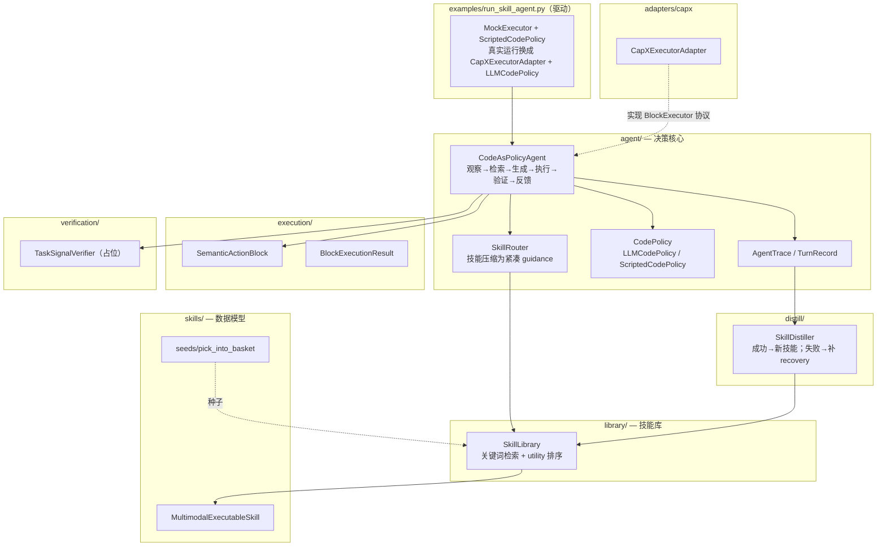
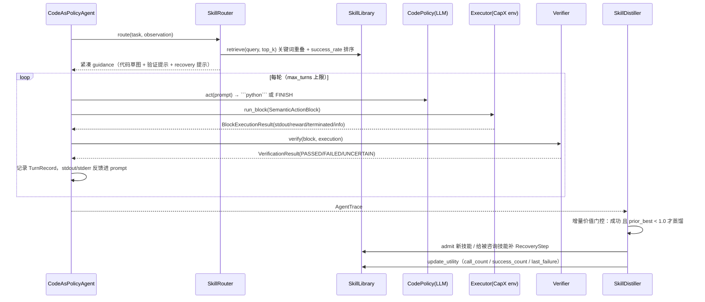
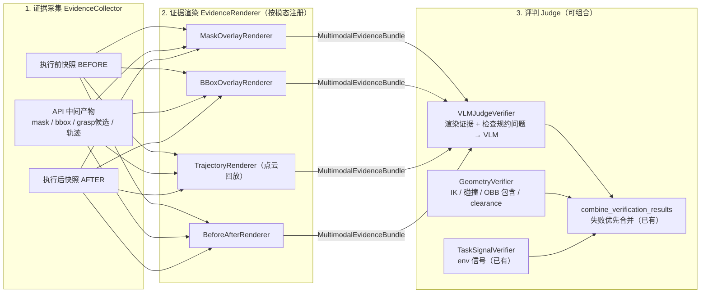

# RoboMEx 框架进度文档

> 本文档记录 `robomex/` 包的当前实现进度：当前代码实现到了 `insights.md` 哪个设计版本、整体架构长什么样、与最新 **v1.1 设计**（双物种技能 + Claim 接口 + 三道验证门）之间的差距，以及下一阶段的重构与开发路线。
>
> 状态基线：2026-06。当前代码是 **v1 形态的可运行骨架**（`examples/run_skill_agent.py` 可离线端到端跑通）；设计已演进到 **v1.1**，代码尚未跟进。

---

## 1. 一句话定位

RoboMEx（**Robo**tic **M**ultimodal **Ex**ecutable Skills）的目标形态（v1.1）：

> **技能分两个物种：O-Skill（观察技能）产出可验证的世界断言（Claim），A-Skill（动作技能）消费断言、承诺可观测变化；代码是两者的组合方式；一套共享的 collect→render→judge 验证机器在三道门上检验链条的每一环；成功轨迹沉淀几何先验、失败轨迹归因到具体 Claim 反哺感知可靠性画像，形成自进化闭环。**

当前代码实现的是其前身 v1 形态：单物种七元组技能 + 咨询式 guidance + env 信号验证 + 单流蒸馏。v1 的核心主张（code 是感知、动作、验证与技能蒸馏之间的可执行桥梁）在 v1.1 中保持不变。

## 2. 包结构与模块职责（当前代码，v1 形态）

```text
robomex/
├── skills/          # 技能数据模型 + 种子技能
│   ├── schema.py    #   MultimodalExecutableSkill 及其全部子结构
│   └── seeds/       #   pick_into_basket 种子技能（知识，非脚本）
├── library/         # 磁盘技能库：持久化、关键词检索、utility 统计
│   └── store.py
├── agent/           # 决策核心
│   ├── agent.py     #   CodeAsPolicyAgent 主循环
│   ├── router.py    #   SkillRouter：技能 -> 紧凑 guidance
│   ├── policy.py    #   CodePolicy：LLM / 脚本回放
│   └── trace.py     #   AgentTrace / TurnRecord（蒸馏原料）
├── execution/       # 执行抽象：SemanticActionBlock / BlockExecutionResult
├── verification/    # 验证：Verifier 接口 + TaskSignalVerifier（占位实现）
├── perception/      # 多模态证据结构：MultimodalEvidenceBundle（暂为死代码）
├── distill/         # SkillDistiller：轨迹 -> 技能进化
├── adapters/capx/   # CapXExecutorAdapter：鸭子类型桥接 CapX env.step(code)
└── examples/        # run_skill_agent.py 端到端离线示例
```

### 2.1 架构总览图



### 2.2 运行时主循环（当前实现）

`CodeAsPolicyAgent.run()` 的执行流：



## 3. 已实现的设计决策（v1.1 下仍然有效的部分）

### 3.1 技能是"知识"不是"脚本"

`SkillRouter.build_guidance` 把技能压缩成任务条件化的紧凑文本注入 prompt，并明确提示 "adapt it, do not copy it blindly"——技能被咨询、不被照搬执行，策略基于当前观察自己生成代码。这一原则在 v1.1 中不变。

当前 schema 完整落地了 v1 七元组（`SkillDescriptor` / `RuntimeStateCard` / `PerceptionStep` / `ActionBlockSpec` / `VerificationSpec` / `RecoveryStep` / `EvidenceRef`），JSON 可序列化。**但 v1.1 已指出这个单物种七元组是"一锅烩"的**（见 §5.1），它会被拆分重构，原有子结构大部分可在拆分后复用。

### 3.2 知识与学习元数据分离

`library/store.py` 把每个技能拆成两个文件：

```text
<root>/<skill_id>/skill.json     # 可迁移知识
<root>/<skill_id>/utility.json   # 本地学习统计（call/success/last_failure/source）
```

知识可跨 agent / 模型迁移；utility 是库本地的检索排序与淘汰依据。这一分离在 v1.1 的双物种目录布局中保留。

### 3.3 自进化闭环 + 增量价值门控

`SkillDistiller.evolve()` 实现了 Skill1 的 \(r(\tau)-\hat{U}\) 思想：

- 无论成败，先对所有被咨询技能 `update_utility`；
- **失败**：把最后一条错误转成 `RecoveryStep` 追加到被咨询技能；
- **成功**：仅当历史最佳成功率 < 1.0 时才蒸馏新技能入库，避免冗余技能污染库。

门控逻辑在 v1.1 中保留，但蒸馏会升级为双流（见 §5.4）。

### 3.4 接口解耦，离线/真实可切换

`BlockExecutor`、`CodePolicy`、`Verifier` 均为 Protocol/ABC：

- 离线：`MockExecutor` + `ScriptedCodePolicy`（示例可直接跑通全闭环）；
- 真实：`CapXExecutorAdapter(env)`（鸭子类型包装 `env.step(code)`，可选 line trace）+ `LLMCodePolicy`（走 `capx.llm.client.query_model`）。

## 4. 验证：collect → render → judge 共享机器 + 三道门（v1.1 核心）

这是整个框架里 **"Multimodal" 一词真正的落点，也是当前实现最薄弱的一环**。没有它，系统退化为普通 code-as-policy + 关键词检索。

### 4.1 现状的三个断点

1. **`TaskSignalVerifier` 只看 env 信号**（`terminated` / `reward` / `sandbox_rc`），完全忽略接口里预留的 `evidence` 参数——本质是"模拟器作弊信号"，真机或无 reward 环境下失效；
2. **Agent 调用 verify 时不传 evidence**，没有任何"执行后采集证据"的步骤；
3. **`VerificationSpec` 里的 checks 只是字符串**，被 router 拼进 prompt 当提示语，没有代码真正执行这些检查。

结论：`perception/evidence.py` 的 `MultimodalEvidenceBundle`、`EvidenceRole.VERIFICATION_CUE` 目前全是死代码，钩子留了但管线是空的。

### 4.2 共享验证机器：collect → render → judge

核心洞察：**不同模态的能力需要"专门设计"的验证证据格式**——

- 分割（SAM3）：mask 叠加绘制到 RGB 上；
- 检测（DINO）：bounding box + label 画到图上；
- robot action：点云中回放运动过程的视频 + 末帧图像；

然后交给 VLM 做理解评判。**渲染产物不是调试图，而是 VLM 评判的瞬态一等输入**：裸 mask / 裸轨迹 VLM 读不懂，叠加图 / 回放视频才是 VLM 友好的证据格式。注意 v1.1 的明确决策：渲染产物**不是技能的静态资产**（区别于 MMSkills 的 Images 资产路径），技能里沉淀的是"怎么渲染、问什么"的规约（`self_evidence_spec`），而非图片本身。



### 4.3 同一套机器部署在三道门（v1.1）

| 门 | 时机 | 问题 | 主要手段 |
|---|---|---|---|
| **门 1：Claim 验证** | O-Skill 之后 | "这个断言是真的吗？" | 渲染自证据 → VLM + 跨模态一致性（mask 深度覆盖率、多视角一致） |
| **门 2：可行性验证（dry-run）** | A-Skill 之前 | "已验证的 Claims 满足 preconditions 吗？" | 纯几何为主：IK、碰撞、clearance |
| **门 3：效果验证** | A-Skill 之后 | "postcondition 兑现了吗？" | before/after 渲染 + env 信号 + 几何终态检查 |

三道门共享渲染器和 judge，只是问题模板和证据类型不同。门 1+2 由 **Grounding Branch** 承载：主 code policy 在高风险 A-Skill 前暂停，分支里**主动执行 O-Skill 现场采证**（区别于 MMSkills 被动加载存储参照图——GUI 状态重复所以可以存图，机器人场景从不重复所以必须现采），返回 grounding package（已验证 Claims + go/no-go）后主策略才生成运动代码。

判定失败时归因到具体的 Claim（感知错）或 postcondition（执行错），这是后续 RL credit assignment 的结构基础。

### 4.4 风险与对策

1. **VLM 评判本身会错**：要求 VLM 给 confidence 而非裸 yes/no，低置信走 `UNCERTAIN`，由 agent 多转一轮或换视角重新采证，而不是硬判失败（`VerificationStatus.UNCERTAIN` 已为此预留）。
2. **机器人动作验证最难**：末帧图能验终态，但"运动过程无碰撞"靠点云回放 + VLM 是弱信号——几何硬检查必须与 VLM 评判**组合**而非二选一，`combine_verification_results` 的失败优先合并就是为此准备的。
3. **成本控制（分级触发）**：sandbox 错误直接 FAILED（不调 VLM）；低风险动作不开 Grounding Branch；只有声明了高风险 precondition / verification_cue 的关键节点才触发完整的渲染 + VLM 评判。每技能每轨迹有 consult 预算，防止无限采证循环。

## 5. v1 代码 → v1.1 设计的重构差距

这是当前最重要的一张差距表。

### 5.1 Schema：单物种七元组 → 双物种契约 + Claim 注册表

| 现状（v1 代码） | v1.1 目标 |
|---|---|
| `MultimodalExecutableSkill` 一个类打包感知+动作+验证 | 拆成 **O-Skill 契约**（api_plan + claim_schema + self_evidence_spec + reliability_profile + fallback_chain）和 **A-Skill 契约**（precondition_claims + code_sketch + geometric_priors + postcondition_spec + 结构化 recovery） |
| 感知输出和动作输入之间无类型约束 | **Claim 注册表**（`claims/schema.json`）：typed 世界断言（如 `ObjectMask` / `ObjectGeometry` / `GraspPose`），带出处、置信度、自证据引用 |
| `VerificationSpec` 是字符串声明 | 可编译的检查规约（渲染模态 + 问题模板 + 几何检查参数），且带判别力统计、可被蒸馏迭代 |

现有子结构的去向：`PerceptionStep` → O-Skill 的 api_plan；`ActionBlockSpec` → A-Skill 的 code_sketch；`RuntimeStateCard` / `RecoveryStep` 拆分后归属各自物种。

### 5.2 技能载体：Python seed → 磁盘技能包

种子技能目前是 Python 函数 `build_skill()`，与蒸馏产物（`skill.json`）形态不统一。v1.1 目标布局：

```text
skills/
├── observation/<skill_id>/   # SKILL.md + skill.json + utility.json
├── action/<skill_id>/        # SKILL.md + skill.json + utility.json
└── claims/schema.json        # 全库共享的 Claim 类型注册表
```

`SKILL.md`（frontmatter + 适用/不适用条件）作为人/VLM 可读门面，供检索与快速 applicability 判断；seed 与蒸馏产物统一为同一种磁盘表示，技能彻底变成"可迭代的内容"而非"代码"。不设 Images 资产目录；可选 `exemplars/` 仅作 VLM few-shot 瞬态缓存，删除不影响技能可用。

### 5.3 主循环：插入 Grounding Branch 与三道门

`CodeAsPolicyAgent` 主循环需要从"生成→执行→env 信号验证"升级为：

1. 生成代码前，对高风险 A-Skill 触发 Grounding Branch（执行 O-Skill → 门 1 验证 Claims → 门 2 dry-run）；
2. 执行后走门 3 效果验证；
3. `TurnRecord` 记录 Claims 与各门验证结果，失败归因到 Claim 或 postcondition。

### 5.4 蒸馏：单流 → 双流

| 现状 | v1.1 目标 |
|---|---|
| 成功 → 整段代码打包成新技能 | 成功 → 更新 A-Skill **几何先验区间**（如 clearance: [2,4]cm, n=12，被验证过的参数范围而非猜测常量）/ 蒸馏新 A-Skill |
| 失败 → 裸 `RecoveryStep` 字符串追加 | 失败 → 经三道门归因到具体 Claim 后，更新对应 **O-Skill 的可靠性画像**（"SAM 对透明物体不可靠→换 point-prompt"）与 fallback 链；同类失败结构化合并计数 |

GraspNet quat、place height 两个 motivating case 由此分别沉淀为"grasp 候选验证" O-Skill 教训和"place 高度估计"几何先验，而不是散落在任务技能里。

## 6. 进度清单

| 模块 | 状态 | 说明 |
|---|---|---|
| v1 七元组 schema（JSON 可序列化） | ✅ 已实现 | v1.1 下将拆分重构，子结构大部分可复用 |
| 种子技能（pick_into_basket） | ✅ 已实现 | 形态待改：Python `build_skill()` → 磁盘技能包 |
| 磁盘技能库 + utility 分离 | ✅ 已实现 | 关键词检索 + success_rate 排序 |
| SkillRouter（咨询式 guidance） | ✅ 已实现 | v1.1 下按物种检索，原则不变 |
| CodeAsPolicyAgent 多轮主循环 | ✅ 已实现 | 待插入 Grounding Branch 与三道门 |
| CodePolicy（LLM + 脚本回放） | ✅ 已实现 | LLM 走 capx query_model |
| CapX 执行适配器 | ✅ 已实现 | 鸭子类型 env.step(code)，可选 line trace |
| SkillDistiller + 增量价值门控 | ✅ 已实现 | 门控保留，待升级双流 |
| 端到端离线示例 | ✅ 已实现 | run_skill_agent.py 全闭环可跑 |
| **Claim 注册表 + O/A 双契约 schema** | ❌ 未实现 | §5.1，v1.1 的承重墙 |
| **技能载体目录化（SKILL.md + 双物种布局）** | ❌ 未实现 | §5.2 |
| **EvidenceCollector + 模态化 Renderer** | ❌ 未实现 | §4.2 共享机器第 1/2 层 |
| **VLMJudgeVerifier + GeometryVerifier** | ❌ 未实现 | §4.2 第 3 层；目前仅有 env 信号占位 |
| **Grounding Branch（门 1+2）** | ❌ 未实现 | §4.3 |
| **门 3 效果验证接入主循环** | ❌ 未实现 | agent.py 补 evidence 参数与归因记录 |
| **双流蒸馏（几何先验 + 可靠性画像）** | ❌ 未实现 | §5.4 |
| 真实 CapX/LIBERO 环境联调 | ❌ 未开始 | MockExecutor → CapXExecutorAdapter 实跑 |
| RL skill lifecycle training | ❌ 未开始 | 按设计应在 v1.1 闭环验证后再上 |

## 7. 后续路线（建议顺序）

1. **定契约（先纸面后代码）**：确定 Claim 类型注册表的首批类型（`ObjectMask` / `ObjectGeometry` / `GraspPose` / `PlacementTarget` 等）和 O/A 两份 `skill.json` 的 JSON schema。这是承重墙，定错了后面全返工。
2. **Schema 重构 + 技能载体目录化**：拆分 `schema.py` 为双物种契约；seed 从 `build_skill()` 改为磁盘技能包（SKILL.md + skill.json）；`SkillLibrary` 支持按物种加载与检索。把 pick_into_basket 拆成若干 O-Skill（segment_target / estimate_geometry / grasp_candidates）+ A-Skill（grasp / place_in_basket）作为第一组双物种 seed。
3. **共享验证机器**：实现 EvidenceCollector → 模态 Renderer（MaskOverlay / BBox / Trajectory / BeforeAfter）→ VLMJudgeVerifier + GeometryVerifier。先在 Mock 数据上单测渲染与评判。
4. **主循环插三道门**：门 3（效果验证）先接——改动最小、立即让 verify 脱离 env 信号占位；再实现 Grounding Branch 承载门 1+2，含证据门控与 consult 预算。
5. **双流蒸馏**：`SkillDistiller` 按归因结果分流更新（A-Skill 几何先验 / O-Skill 可靠性画像），结构化 failure modes 合并计数。
6. **真实环境联调**：LIBERO pick/place 上 `CapXExecutorAdapter + LLMCodePolicy` 实跑，重点观察三道门的判定质量与成本。
7. **实验与消融**：对照 insights.md v0 第 252 行的 baseline 序列（裸 code-as-policy / +技能咨询 / +门3 / +Grounding Branch / +双流蒸馏），为论文积累证据。
8. **RL lifecycle training**：闭环验证有效后，再按 v1 第 8 节训练 selection / grounding / distillation 决策。

每一步都保持 `run_skill_agent.py` 离线可跑（Mock 链路同步更新），保证任意时刻有可演示的端到端闭环。
