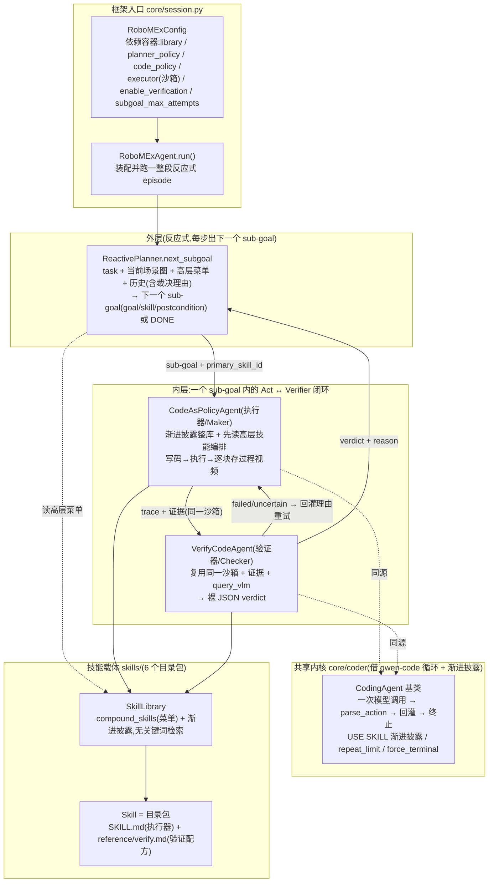

# RoboMEx 架构总览

> 用途:`robomex/` **当前实际落地结构**的高层快照——两层控制 + 子目标级闭环验证 + 技能目录包。
> 本文只描述结构与数据流,与代码冲突处以代码为准。
>
> **基线:2026-06-24。** 当前形态是一个**可跑通的 Agentic 闭环**:LIBERO → CapX 沙箱 →
> 反应式 planner 逐步出 sub-goal → 内层 Code Agent 自由组合技能写码 → 独立 Verifier 做
> 子目标级视觉裁决 → 不过则在同一 sub-goal 内回灌重试。验证子系统**已接入主循环**(不再是雏形)。

---

## 0. 一页结论

- **两层控制已通**:外层 `ReactivePlanner` 每步只出"下一个" sub-goal(读任务 + 当前场景图 +
  高层技能菜单 + 历史),由它主动输出 `DONE` 终止;内层 `CodeAsPolicyAgent` 在 sub-goal 内
  渐进披露技能、写码-执行多轮。
- **验证是子目标成败的唯一权威**:每个 sub-goal 跑完由独立的 `VerifyCodeAgent` 做一次视觉裁决,
  它**复用执行器的同一沙箱**,直接读执行期沉淀的证据(`EVIDENCE` / `OBS_BEFORE` / `OBS_AFTER` /
  过程视频 `CLIPS`),用 `query_vlm` 自主写 judge 代码,输出裸 JSON `verdict`。
- **Act↔Verifier 闭环(Maker-Checker)**:Verifier 判 `failed`/`uncertain` 时,把理由作为
  feedback 回灌执行器,在同一 sub-goal 内换思路重试,直到 `passed` 或耗尽 `subgoal_max_attempts`。
- **技能 = 目录包,prose-first**:6 个内置技能(2 高层 / 2 观测 / 2 动作),`SKILL.md` 给执行器、
  `reference/verify.md` 给验证器(验证配方,含示例 judge 代码)。技能只被**咨询**,不照搬执行;
  O/A 的顺序与组合由内层 Agent 自行编排,无写死管线。
- **客观判据并列落盘**:`summary.json` 同时记 agent 主观裁决(VLM Verifier)与 env 客观判据
  (LIBERO BDDL goal / reward),便于对照、暴露假阳性。
- **自进化蒸馏暂缓**:`SkillDistiller` 为 no-op 占位,待闭环稳定后再设计。

---

## 1. 设计主线

技能可**递归组合**:高层技能(复合 A-Skill,正文编排叶子技能)给**外层反应式 planner** 当能力菜单;
叶子 O/A 技能给**内层 Code Agent** 当 building block。外层在 grounded 的菜单上选择、排序、重规划;
内层在每个 sub-goal(= **验证单元**)里做感知 grounded 的"写码-执行-验证"。每个技能自带
**When-to-use(SKILL.md)+ How-to-verify(reference/verify.md 验证配方)**。验证由独立 Verifier
承担,保持"执行 vs 裁决"互不污染。

三根支柱:**① 两层控制(planner / 内层 coder) ② 双物种技能 + 可执行验证配方 ③ 子目标级闭环裁决**。

---

## 2. 当前结构全景



### 2.1 支柱 A — 技能载体(目录包 + 渐进披露)

- **结构**:`schema.py` 的 `Skill` = 目录包,按读者拆文件——`SKILL.md`(执行器:何时用 / 分解 /
  过程 / 失败恢复)、`reference/verify.md`(验证器:pass/fail 配方 + 示例 judge 代码)、可选的
  `scripts/verify.py`(确定性门,当前无)。`category ∈ {high_level, observation, action}`。
- **库存(6 个)**:
  - high_level:`pick_object`、`place_object`(planner 菜单;正文为**建议性读单**,引用叶子技能但
    不写死 claim 管线);
  - observation:`segment_object`(VLM 先定框 → SAM3 点提示分割,并把 VLM 框图 / SAM3 mask 叠加图
    存盘到 `ARTIFACTS_DIR` 供验证器查看)、`find_placement`;
  - action:`grasp_object`(自包含:从 segment 的 points 自取 top-down 位姿 → approach/close/lift)、
    `release_at`。
- **消费机制(唯一)**:**qwen-code 式渐进披露**——系统提示放整库 `name + description` 短清单,
  Agent 用 `USE SKILL: <name>` 按需拉全文(及验证器侧的 `reference/verify.md`)。**无关键词检索**。

### 2.2 支柱 B — 共享 CodingAgent 内核(执行器 / 验证器同源)

- **核心 `core/coder/agent.py`**:执行器与验证器是**同一种 agent**,共享循环骨架(每轮一次模型调用 →
  `parse_action` → 回灌 → 命中终止动作即停)与循环安全护栏(`max_turns` / `repeat_limit` 重复熔断 /
  `force_terminal_on_exhaust` 强制终止)。三处差异由子类钩子定制:角色提示词、上下文来源、终止判定。
- **执行器 `agents/executor.py: CodeAsPolicyAgent`**:菜单 = 整库;`run(goal, obs, primary_skill_id,
  video_dir, feedback)` —— planner 传入的高层技能 id 提示它**先 `USE SKILL` 读编排再自由组合**叶子技能;
  每个 python 轮逐块存过程视频(`turn_NN.mp4`,只存有动作的块)并收 before/after 帧;`feedback` 承载
  上一次裁决理由(闭环重试)。**不写死任何 O→A 流程**;仅报告 env 级 `terminated`。
- **验证器 `agents/verifier.py: VerifyCodeAgent`**:同核子类,上下文为只含事实的 `VerifierContext`
  (sub-goal、用过哪些技能、脱敏 op-trace、`reference/verify.md` 配方、过程视频清单、可选 env 旁证),
  **不含执行器的思维链**,故盲区互不相关;通过输出裸 JSON `verdict` 终止。

### 2.3 支柱 C — 子目标级验证(已接入主循环)

三层解耦:**Spec / Evidence / Judge**。

1. **Spec = `reference/verify.md`**:纯文档,声明"什么算达成",含 rubric + 示例 judge 代码。
   面向 VLM/人,不是死管线。
2. **Evidence = 执行期捕获 + 持久沙箱状态**(按技能类型而非统一 before/after 组织):
   - 框架在子目标开场种 `EVIDENCE = {}`、抓起始帧 `OBS_BEFORE`、注入 `ARTIFACTS_DIR`;技能把关键
     中间量发布到 `EVIDENCE`(如 `EVIDENCE['target_box']`)并把可视化叠加图落盘;
   - 沙箱 globals 跨 block 持久,验证器开场再补当前帧 `OBS_AFTER`、`draw_box`,以及过程视频
     `CLIPS`(每个动作块一段)+ `process_frames(start,end)`(内存帧零解码取帧)/ `clip_frames(path)`
     (兜底解码 mp4)。
3. **Judge = `VerifyCodeAgent`**:子目标结束后**只跑一次**,用沙箱里的 `query_vlm` 在证据上判断,
   输出 `verdict ∈ {passed, failed, uncertain}` + `confidence` + `reason`。
   - **铁律(写在 verify.md)**:标注不得污染被判物体的像素——只允许画**外框 bounding box** 或把坐标
     作为**文本**喂 VLM,**禁止**用颜色填涂 mask 盖在物体上。

**粒度:逐块"存",整目标"判一次"。** 块级正确性靠沙箱 `ok`/`stderr` + 技能内 `assert`(廉价自纠错,
驱动内层多轮);子目标级达成靠验证器一次性语义视觉裁决。

**结果如何用**:`passed → SubGoalResult.success=True`;`failed/uncertain → False`;`reason` 永远进
planner history。验证器是子目标成败的**唯一权威**,内层 `FINISH` 仅结束内层循环、不等于成功。

---

## 3. 端到端数据流(当前真实路径)

```
RoboMExAgent.run(task):                                   [core/session.py]
  loop(最多 max_subgoals):                                 [外层, 反应式步进]
    ReactivePlanner.next_subgoal(task, history, 当前场景图)
      → 下一个 sub-goal(goal/skill/postcondition) 或 DONE → 退出

    _run_subgoal:                                          [内层 Act↔Verifier 闭环]
      for attempt in range(subgoal_max_attempts):
        CodeAsPolicyAgent.run(goal, primary_skill_id, video_dir, feedback)
          USE SKILL 高层技能读编排 → 自由组合 observe/action 叶子
          每轮: 写 python → 执行 → 逐块存 turn_NN.mp4 + 收 before/after
          → AgentTrace(turns, success=env terminated, metadata.clips)
        VerifyCodeAgent.verify()  (enable_verification 时)
          复用同一沙箱 → query_vlm 在 EVIDENCE/OBS_*/CLIPS 上判断 → verdict
        passed → break ; failed/uncertain → feedback=理由, 重试

    on_subgoal_end 回调: 把这段 video_subgoal*.mp4 当场写进 subgoal_NN/
    scene_refresh: 用最新观测刷新 planner 下一步看到的场景图(真机)

  episode 末: 拼接全部 video_subgoal*.mp4 → video_full*.mp4
  落盘 summary.json: success(主观裁决) + env_*(客观 BDDL 判据)
```

**可选 env 旁证(默认关闭)**:`expose_env_signal=True` 时,把 LIBERO 的 `task_completed`/`reward`
作为一小段提示喂给 Verifier 上下文,仅作旁证、不直接决定裁决。

---

## 4. 产物布局(`artifacts_dir` 给定时)

```
<episode>/
  run.log                  完整日志
  planner.jsonl            每步 planner 原始回复 + 决策
  summary.json             episode 汇总(success + env_* 客观判据 + 各 sub-goal)
  scene*.png               每步 planner 看到的场景图
  video_full*.mp4          全部 sub-goal 拼接的完整 episode 视频
  subgoal_NN/
    meta.json              该 sub-goal 元信息 + 验证裁决
    turn_MM.py             内层第 MM 轮代码
    turn_MM.out.txt        该轮沙箱输出(status/ok/reward/terminated + stdout/stderr)
    turn_MM.mp4            该轮(有动作时)的过程视频
    video_subgoal*.mp4     整段 sub-goal 过程视频
    verify.txt             验证器各 judge 轮 + 最终裁决
    <skill 落盘的叠加图>     如 segment 的 VLM 框图 / SAM3 mask 图
    retry_KK/              第 KK 次重试的同构产物(闭环重试时)
```

---

## 5. 目标 vs 实际 对齐

| 支柱 | 目标形态 | 当前实际 | 状态 |
|---|---|---|---|
| 两层控制·外层 | 菜单上选择排序 + 重规划 + 消费内层归因 | `ReactivePlanner.next_subgoal` 反应式步进,主动 `DONE` 终止;裁决理由进 history 驱动重写 | 🟢 已通 |
| 两层控制·内层 | 感知 grounded 的写码-执行-验证 | flat 多轮 + 渐进披露 + `primary_skill_id` 引导;逐块存证 | 🟢 已通 |
| 双物种技能 | O 产中间量 / A 消费;高层 = 复合 | prose 化;O/A 组合由内层自行编排,不写死;高层 = 建议性读单 | 🟢 已通 |
| 可执行验证 | 每技能 verifier 配方 + 视觉裁决 | `reference/verify.md` 配方 + `VerifyCodeAgent` 复用沙箱 + `query_vlm`,**已接主循环** | 🟢 已通 |
| 子目标闭环 | sub-goal = 验证单元,不过即重试 | Act↔Verifier 闭环(`subgoal_max_attempts` + feedback 回灌) | 🟢 已通 |
| 客观判据对照 | 暴露假阳性 | `summary.json` 并列主观裁决 + env BDDL 判据;批量评测口径对齐 cap-x | 🟢 已通 |
| 自进化蒸馏 | 双流(几何先验 / 可靠性画像)+ 失败归因 | `SkillDistiller` no-op 占位 | ⚪ 暂缓 |

图例:🟢 已落地 / 🟡 骨架待续 / ⚪ 暂缓。

---

## 6. 模块定位速查

| 路径 | 角色 | 状态 |
|---|---|---|
| `core/session.py` | **★框架入口**:`RoboMExConfig`(依赖容器) + `RoboMExAgent.run()`(反应式两层 + Act↔Verifier 闭环 + 落盘) | 最新 |
| `core/coder/agent.py` | **★共享 CodingAgent 内核**(循环 + 渐进披露);执行器/验证器同源 | 最新 |
| `core/coder/action.py` | `parse_action` / `SkillEntry` / 渐进披露渲染 | 稳定 |
| `core/coder/policy.py` | `CodePolicy` / `CompletionPolicy`:LLM / 脚本回放 | 稳定 |
| `core/coder/trace.py` | `AgentTrace`(含 `metadata.clips`) / `TurnRecord` | 稳定 |
| `core/sandbox/action_block.py` | `SemanticActionBlock` / `BlockExecutionResult` | 稳定 |
| `core/sandbox/capx.py` | CapX 执行适配器(`run_block` 记 `info['video_range']`) | 最新 |
| `agents/planner.py` | `ReactivePlanner.next_subgoal` 反应式 + `SubGoal`/`SubGoalResult`(含 `note`) | 最新 |
| `agents/executor.py` | `CodeAsPolicyAgent` 执行器(`run` 增 `video_dir`/`feedback`,逐块存视频) | 最新 |
| `agents/verifier.py` | `VerifyCodeAgent` 独立验证 coder(复用沙箱 + `query_vlm` + 过程视频) | 最新 |
| `agents/evolve.py` | `SkillDistiller` no-op 占位 | 暂缓 |
| `skills/schema.py` | Skill 目录包数据模型(`reference/` sidecar) | 稳定 |
| `skills/store.py` | 磁盘技能库 `SkillLibrary`:admit/get/all/compound_skills(纯渐进披露) | 稳定 |
| `skills/builtin/` | **6 个**内置技能包 + 自动 README(`load_builtin_skills()`) | 最新 |
| `verification/context.py` | `VerifierContext`(sub-goal/op-trace/resources/clips/env_signal) + `collect_verify_resources` | 最新 |
| `verification/verifier.py` | 验证结果数据类型(`VerificationResult`/`Signal`/`Status`) | 稳定 |
| `perception/` | `EvidenceCollector`(逐块 before/after)+ `save_video` / before-after 渲染 | 最新 |
| `examples/run_planner_live.py` | **单 episode 真机入口**(build `RoboMExConfig` → `run()`;逐段存视频 + 拼 `video_full`) | 最新 |
| `examples/run_planner_batch.py` | **批量评测入口**:选 suite + task 范围 + trials,复用 `run_episode`,口径对齐 cap-x | 最新 |
