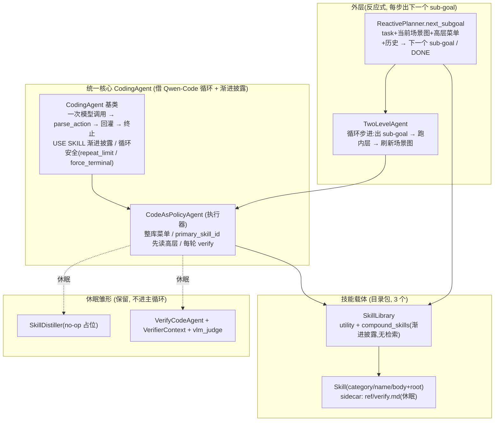

# RoboMEx 结构梳理与目标对齐审计

> 用途:给出 `robomex/` **当前实际落地结构**的高层快照,并对照北极星目标做一次**偏离审计**,
> 为 high-level 调整打底。本文只描述结构与对齐关系,不替代 `robomex_framework_progress.md`
> 的逐模块进度;两者冲突处以本文为准。
>
> **2026-06-22 最小化重构后基线**:本轮把项目收敛为一个**最小可跑的 Agentic 闭环**——
> 技能库砍到 3 个(1 高层 + 1 观测 + 1 动作),planner 改**反应式步进**(每步出"下一个"
> sub-goal),O/A 的组合**不再写死**(由内层 CodingAgent 依据各技能经验自行编排),
> 并**删除了上一版的"可验证产物契约"**(manifest/`RESULT`/`claim`/`executor_stdout`/
> `require_result`/终止守卫/`## Report`)。Reference-Anchored Verifier 与蒸馏**降级为休眠雏形**
> (代码保留、不进主循环)。
>
> **2026-06-22 结构重构(最新)**:在上面的最小化基础上,代码按 qwen-code 式"内核/角色/资产"重新归位。
> 下文凡出现旧路径(`agent/coding_agent.py`、`agent/agent.py`、`agent/router.py`、`agent/trace.py`、
> `planner/`、`distill/`、`library/`、`execution/`、`adapters/capx/`、`skills/skills_library/`)的描述,
> 路径均已迁移,对应关系:
>
> - `agent/coding_agent.py` → 拆为 `core/coder/agent.py`(CodingAgent 循环) + `core/coder/action.py`(parse_action/渐进披露)
> - `agent/agent.py` → `agents/executor.py`;`agent/policy.py` → `core/coder/policy.py`;`agent/trace.py` → `core/coder/trace.py`
> - `planner/planner.py` → `agents/planner.py`;`distill/distiller.py` → `agents/evolve.py`;`verification/verify_agent.py` → `agents/verifier.py`
> - `execution/action_block.py` → `core/sandbox/action_block.py`;`adapters/capx/executor.py` → `core/sandbox/capx.py`
> - `library/store.py` → `skills/store.py`;`skills/skills_library/` → `skills/builtin/`(`load_skills_library()` → `load_builtin_skills()`)
> - **新增唯一框架入口** `core/session.py`:`RoboMExConfig` + `RoboMExAgent.run()`(`import robomex` 直接暴露)。
> - 执行器与验证器是**同一种 coding agent**(`core/coder`)的两个角色,这条主张落实为目录结构。

---

## 0. 一页结论(先看这个)

- **目标主线没偏**:仍牢牢落在"可验证的 Claim + 可执行的验证 + 可蒸馏的技能"。本轮**没有**新增
  能力,而是**做减法**——把上一版围着单个样例(`estimate_geometry` + manifest 握手)堆起来的
  纵深验证设施拆掉,先把"libero→沙盒→图像→反应式 planner→内层 Coding Agent 自由组合技能"这条
  **最小骨架**跑通跑稳。
- **本轮明确收敛的三件事**:
  1. **技能库 7 → 3**:只留 `pick_object`(高层)/`segment_object`(观测)/`grasp_object`(动作)。
     高层技能的分解从"固定 4 步管线"改为**建议性读单**;`grasp_object` 改为**自包含**(从 segment
     的 points 自取 top-down 位姿),不再依赖已删的 grasp_candidates。
  2. **planner 反应式化**:`ReactivePlanner.next_subgoal(task, history, scene)` 每步只出**下一个**
     sub-goal,跑完刷新场景图再问,直到 `DONE`;替换了原"一次性整表 plan()"。
  3. **删掉写死的 O→A claim 流程 + 可验证产物契约**:observe 产 Claim / action 消费 Claim 的
     **硬编码连线全部移除**;manifest/`RESULT`/`require_result`/终止守卫/`## Report` 一并删除。
     O/A 的顺序与组合现在**完全由内层 CodingAgent 读各技能 prose 决定**。
- **有意搁置(休眠雏形)**:Reference-Anchored Verifier(`verification/`)、`scripts/verify.py` 验证原语、
  `SkillDistiller`(已砸成 no-op)。代码留着,不接主循环,待最小闭环跑通后再议。

---

## 1. 北极星目标(v1.3,浓缩)

> 技能可**递归组合**:高层技能(body 为子技能编排的复合 A-Skill)给**外层 ReAct planner** 当能力
> 菜单并编码自身 O/A 分解;叶子 O/A 技能(O 产可验证 Claim、A 消费 Claim 承诺 effect)给
> **内层 REPL Code Agent** 当 building block。外层在 grounded 的菜单上选择排序高层技能并重规划;
> 内层在每个 sub-goal(= 验证单元)里做感知 grounded 的"写码-观察-验证"。每个技能自带
> **When-to-use + 可执行的 How-to-verify**(verifier-as-code,沿"程序化→几何→VLM→换视角"升级阶梯)。
> 成功轨迹沉淀几何先验/高层方法,失败轨迹归因到 Claim 或 postcondition,形成自进化闭环。

三根支柱:**① 两层控制(planner / REPL inner) ② 双物种技能 + 可执行验证 ③ 自进化蒸馏**。
所有 novelty 落在"可验证 Claim + 可执行验证 + 可蒸馏技能"主线。

---

## 2. 当前实际结构(高层全景)



### 2.1 支柱 A — 技能载体(目录包 + 渐进披露)

- **结构**:`schema.py` 的 `Skill` = 目录包,按读者拆文件:`SKILL.md`(执行器)、`ref/verify.md`
  (验证器 rubric,休眠)、`scripts/verify.py`(确定性原语,本轮已随 estimate_geometry 删除)。
  `category` ∈ `high_level/observation/action`。
- **库存(3,最小集)**:high_level `pick_object`;observation `segment_object`;action `grasp_object`。
  3 个各带 `ref/verify.md`(休眠);**当前无 `scripts/verify.py`**。
  - `pick_object`:分解改为**建议性读单**(仅引用 `segment_object` + `grasp_object`),并显式声明
    "由 Coding Agent 依据各技能经验自行组织 O/A,无固定 claim 管线"。
  - `grasp_object`:**自包含**——从 segment 的 filtered points 取 top-down 抓取位姿(中心 xy + 顶 z +
    竖直 quat),再 approach/close/lift/verify。
  - `segment_object`:解耦了对 geometry 的措辞,保留 `filter_noise`。
- **消费方式(唯一机制)**:执行器走 **Qwen-Code 式渐进披露**——系统提示放**整库** `name+description`
  短清单,agent 用 `USE SKILL: <name>` 按需拉全文(`coding_agent.py: _load_skill_message /
  build_skill_llm_content`)。**关键词检索已彻底移除**(`SkillLibrary.retrieve`/`_keywords` 删除),
  `agent/router.py` 整体删除——技能选择只有渐进披露一条路径,不存在检索后备。

### 2.2 支柱 B — 统一 CodingAgent(执行器为主,验证器休眠)

- **核心**`robomex/agent/coding_agent.py`:执行器与验证器仍是**同一种 agent**(共享循环骨架、渐进披露、
  循环安全 `repeat_limit` / `force_terminal_on_exhaust`)。本轮删除了上一版加的 `terminal_reask_limit` +
  `_terminal_block_reason` 终止守卫。
- **执行器 `CodeAsPolicyAgent`**(`agent/agent.py`):菜单=整库;`run(task, obs, primary_skill_id)` ——
  planner 传入的高层技能 id 会提示 agent**先 `USE SKILL: <id>` 读编排再自由组合**叶子技能;
  每个 python turn 收证据 + `verify` → `TurnRecord`;env `terminated` 即停。**不写死任何 O→A 流程**。
- **验证器 `VerifyCodeAgent`**(`verification/verify_agent.py`,休眠):同核子类,上下文 `VerifierContext`
  只给事实(sub-goal、用了哪些 skill、脱敏 op-trace、rubric),终止 = 裸 JSON verdict。**不接主循环**。

### 2.3 支柱 C — 验证(休眠雏形)

- **理念(待续)**:Verifier 独立、全 Agentic、自写 judge code,`scripts/verify.py` 作为参考原语库,
  无强制"确定性地板";独立性边界 = 事实 vs 解释。
- **本轮状态**:上一版的"可验证产物契约"(manifest/`RESULT`/`BlockExecutionResult.result`/
  `AgentTrace.claim`/`executor_stdout`/`require_result`/`## Report`)**整体删除**——它把验证结构隐式
  拟合到了单个感知技能的形状,在技能设计稳定前不保留。`verification/` 模块作为**休眠雏形**留存,
  待最小闭环跑通、技能契约想清楚后再设计统一握手。

---

## 3. 端到端数据流(当前真实路径)

```
loop:                                                      [外层, 反应式步进]
  ReactivePlanner.next_subgoal(task, history, 当前场景图)
    → 下一个 sub-goal(goal+skill+postcondition) 或 DONE
  → CodeAsPolicyAgent.run(sub-goal, primary_skill_id=skill) [内层, flat 多轮 + USE SKILL]
      先 USE SKILL 高层技能读编排 → 自由组合 observe/action 叶子
      每轮: 写 python → 执行 → per-turn verify(env 信号)
  → AgentTrace(turns / success)
  → 刷新场景图, 记入 history, 回到 loop 直至 DONE

休眠(不在主循环): VerifyCodeAgent / VERIFY_PRIMITIVES / vlm_judge / SkillDistiller(no-op)
```

---

## 4. 目标 vs 实际 对齐审计

| 北极星支柱 | 目标形态 | 当前实际(最小化后) | 判断 |
|---|---|---|---|
| 两层控制·外层 | 能力菜单上选择排序 + **重规划** + 消费内层归因 | `ReactivePlanner.next_subgoal` **反应式步进**(每步读场景+历史出下一个 sub-goal,DONE 终止) | 🟡 反应式已通,结构化上行回报待加 |
| 两层控制·内层 | **REPL** + `observe/check_feasible/assert_effect` 原语 + **多模态反馈** | **flat 多轮 + 渐进披露**;`primary_skill_id` 引导先读高层;**无验证原语、无图片反馈(有意搁置)** | 🟡 最小形态,按计划暂留 |
| 双物种技能 | O 产 Claim / A 消费 Claim;高层=复合 A | prose 化已成;O/A 组合**不写死**,由内层自行编排;高层=建议性读单 | 🟢 写死流程已移除,符合本轮目标 |
| 可执行验证 | 每技能 verifier-as-code + **升级阶梯** | **休眠雏形**:Verifier 代码留存不进主循环;当前 0 个 verify.py | ⚪ 有意搁置 |
| 可验证产物契约 | 统一的 manifest/Claim 交接 | **已整体删除**(在技能设计稳定前不保留) | ⚪ 已移除,待重设计 |
| 自进化蒸馏 | 双流(几何先验 / 可靠性画像)+ 失败归因 | `SkillDistiller` 砸成 **no-op 占位** | ⚪ 有意搁置 |

图例:🟢 对齐 / 🟡 骨架待续 / 🟠 部分偏离 / ⚪ 有意搁置(休眠) / 🔴 未启动。

---

## 5. 偏离与张力(本轮重构前的诊断,促成了上面的减法)

> 下列 §5/§6 是**最小化重构之前**的审计诊断,记录"为什么要做这次减法"。多数张力已由本轮直接
> 化解(删写死流程、删 manifest 契约、Verifier/蒸馏降级休眠);保留于此作为决策溯源,**不代表
> 当前仍存在**。

1. **深度优先,围着一个样例设计验证**
   验证链路(manifest、provenance overlay、VERIFY_PRIMITIVES、独立 Verify Agent)只在
   `estimate_geometry` 上完整跑通。其余 6 个技能没有 `## Report` 也没有 `verify.py`,验证它们时
   verifier 拿不到结构化产物。**风险**:把"可验证产物契约"的结构隐式拟合到了单个感知技能的形状
   (mask/points/OBB),换到 action 技能(grasp/place)是否同构,尚未检验。

2. **路线图被抢跑,内层控制结构停在 flat**
   原路线第 2 步(验证原语化 + 升级阶梯)、第 3 步(多模态反馈)、第 5 步(REPL 内层)都在
   独立 Verifier(原属第 7 步之后的 §5.6)**之前**。当前直接做了 §5.6,内层却仍是 flat、纯文本反馈。
   后果:验证器很"重",但它验的执行器还跑在最简形态上;`observe/check_feasible/assert_effect`
   这套"验证即技能"的 API 主张在执行侧没有载体。

3. **`SkillRouter` → 渐进披露 的机制切换未沉淀进设计文档**
   执行器技能消费已换成 `USE SKILL`,这是结构性改动(影响检索、上下文预算、planner 接口),
   但 progress 文档仍按 SkillRouter 描述。**机制已分叉,叙事未对齐**。

4. **两层契约空转**
   `VerifierContext.expected_decomposition` 等字段为高层技能的 `## Decomposition` 预留,但 probe 没填、
   planner 不重规划、内层不结构化上行。"sub-goal = 验证单元"的闭环没有真正接上。

5. **`EVIDENCE_DIR` 是调用方(probe)注入,不是框架/技能契约**
   skill prose 直接引用 `EVIDENCE_DIR`,其存在却依赖外部注入——产物落盘约定是隐式耦合,
   尚未上升为框架一等契约。

---

## 6. high-level 调整的待决问题(供你拍板,不替你决定)

1. **重心**:继续在独立 Verifier 上纵深(把 §5.6 做满:VerifyRouter 组件化、多技能原语组合),
   还是**回补内层控制结构**(REPL + 验证原语 + 多模态反馈),让执行侧追上验证侧?
2. **技能契约标准化**:是否现在就把"可验证产物契约"(`## Report`/manifest + raw-vs-overlay 区分)
   定为**所有技能的统一结构**,并先在一个 action 技能(如 `grasp_object`)上验证它对动作类是否同构?
3. **验证归属**:验证保持"独立 Verify Agent"(当前),还是回到"执行 Agent 自带可调验证原语"
   (§4.3 的 `observe/assert_effect`),抑或两者共存(原语服务内层决策 + 独立 Verifier 做终判)?
4. **技能消费机制定稿**:渐进披露(`USE SKILL`)是否取代 `SkillRouter` 成为正式机制?若是,
   planner 的"能力菜单"与检索如何与渐进披露统一?
5. **闭环优先级**:是否先把"planner 重规划 + 内层结构化上行 + 单流→双流蒸馏"这条**自进化闭环**
   打通(哪怕验证只用最简 gate),再回头加深验证?

---

## 附:模块定位速查(当前代码)

| 路径 | 角色 | 最新状态 |
|---|---|---|
| `core/session.py` | **★框架入口**:`RoboMExConfig`(依赖容器) + `RoboMExAgent.run()`(反应式两层闭环) | 最新 |
| `core/coder/agent.py` | **★共享 CodingAgent 核心**(循环+渐进披露);执行器/验证器同源 | 最新 |
| `core/coder/action.py` | `parse_action`/`SkillEntry`/渐进披露渲染(自 coding_agent 拆出) | 最新 |
| `core/coder/policy.py` | `CodePolicy/CompletionPolicy`:LLM / 脚本回放 | 稳定 |
| `core/coder/trace.py` | `AgentTrace/TurnRecord`(对 verification 仅 TYPE_CHECKING 依赖) | 收敛 |
| `core/sandbox/action_block.py` | `SemanticActionBlock/BlockExecutionResult` | 稳定 |
| `core/sandbox/capx.py` | CapX 执行适配器 `CapXExecutorAdapter` | 收敛 |
| `agents/executor.py` | `CodeAsPolicyAgent` 执行器(`run` 增 `primary_skill_id`) | 最新 |
| `agents/planner.py` | `ReactivePlanner.next_subgoal` 反应式 + `TwoLevelAgent` 循环 | 最新 |
| `agents/verifier.py` | `VerifyCodeAgent` 独立验证 coder | **休眠雏形** |
| `agents/evolve.py` | `SkillDistiller` no-op 占位 | 休眠 |
| `skills/schema.py` | Skill 目录包数据模型 + sidecar 钩子 | 稳定 |
| `skills/store.py` | 磁盘技能库 `SkillLibrary`:admit/get/all/compound_skills/utility(纯渐进披露) | 收敛 |
| `skills/builtin/` | **3 个**内置技能包 + 自动 README(`load_builtin_skills()`) | 最小集,无 verify.py |
| `verification/context.py` | `VerifierContext` + `collect_verify_resources` | **休眠雏形** |
| `verification/primitives.py` | `vlm_judge` 沙箱原语 | **休眠雏形** |
| `verification/verifier.py` | `TaskSignalVerifier`(执行器用)/`VLMJudgeVerifier`/`Composite` | 部分活跃 |
| `perception/` | EvidenceCollector + before/after 渲染 | 备用 |
| `examples/run_planner.py` | 离线最小反应式 demo(3 技能) | 最新 |
| `examples/run_planner_live.py` | **唯一最小端到端真机入口**(薄壳:build `RoboMExConfig`→`RoboMExAgent.run()`) | 最新 |
