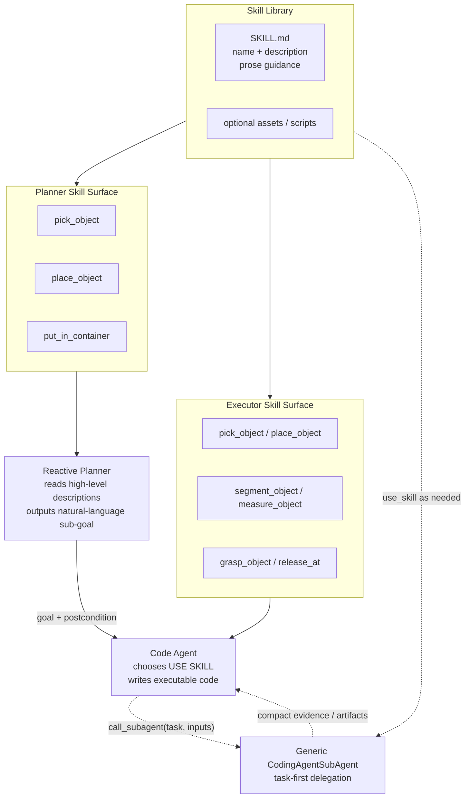

# Robot Skill 组织:Anthropic-style 薄 Skill + 分层 Skill Surface

## 问题

早期 `SkillCategory = {high_level, observation, action}` 把两个不同问题混在一起:一是
Planner 需要看哪些高层技能来避免乱规划;二是 Executor 需要哪些具体技能来写代码。若把
`planner_facing`、`tags`、`recommends` 写进每个 `SKILL.md` frontmatter,会背离 Anthropic
Agent Skills 的核心原则:frontmatter 只承载极少发现信息(`name` + `description`),组合关系、
触发条件、失败恢复都留在 prose 里,由 agent 按需读取和判断。

但完全取消分层也不对。机器人任务里 Planner 若看不到 `Pick Object`、`Place Object` 这种
高层任务模式,很容易把任务拆得过细或乱跳。更合适的设计是:**保留分层,但分层属于 agent
运行时暴露的 skill surface,不属于 skill 自己的 schema 字段**。

## 核心修正

每个 skill 对标 Anthropic,只需要:

```yaml
---
name: Pick Object
description: Guidance for planning and executing pickup of a named object. Use when a task requires an object to be grasped and lifted before another action.
---
```

Planner 和 Executor 看到的不是同一份 skill surface:

- **Planner Surface**:只暴露 task 类任务模式,如 `pick_object`、`place_object`。
  Planner 读取它们的 `description` 作为规划指导,输出自然语言 sub-goal 和视觉成功条件;它不输出
  “用哪个 high-level skill”,也不把 Executor 绑死到某个 skill。
- **Executor Surface**:暴露完整技能库,包括高层 orchestration skill 和 leaf skill。Code Agent
  收到自然语言 sub-goal 后,像 Anthropic Agent Skills 一样先看所有 `name/description`,再通过
  `use_skill` 渐进披露正文,自主组合 perception / affordance / motion / task guidance。
- **SubAgent Surface**:不预注册 Grounding/Affordance/Review 等固定 profile。Act 只用
  `call_subagent(task, inputs)` 提交 focused natural-language task;通用 CodingAgentSubAgent
  自己看完整技能菜单、按需 `use_skill`,然后返回 compact evidence 和 artifact 路径。

这样既保留层级,又不污染 `SKILL.md` schema。当前内置目录固定为
`perception/affordance/motion/task`,但代码不应要求每个 skill 在 frontmatter 里声明
`planner_facing/tags/recommends`。
组合关系仍写在 prose 的 “Building blocks / When to use / Failure recovery” 中。

## 收益

Planner 仍受高层 skill 指导,不会失去任务粒度;Executor 仍拥有完整技能库,不会被 Planner 的某个
skill 名硬绑定;`SKILL.md` frontmatter 与 Anthropic 对齐,保持轻薄、可扩展、适合渐进披露;未来若
skill 数量增长到几十/上百,可以再引入 description embedding 检索,而不是手写
`recommends` 依赖图或固定 SubAgent 路由表。

## 图:分层 Surface,薄 Skill Schema



## 完整例子:skills 会变成什么样

目录可以继续按人类可读的层级组织,但 frontmatter 不承载路由字段:

```text
robomex/skills/builtin/
  task/
    pick_object/
      SKILL.md
    place_object/
      SKILL.md
  perception/
    segment_object/
      SKILL.md
    estimate_object_geometry/
      SKILL.md
  affordance/
    find_placement/
      SKILL.md
    grasp_open_bowl/
      SKILL.md
  motion/
    grasp_object/
      SKILL.md
    release_at/
      SKILL.md
```

**High-level skill(Planner 可见,Executor 也可按需加载):**

```yaml
---
name: Pick Object
description: Guidance for planning and executing pickup of a named object. Use when a task requires an object to be grasped and lifted before another action.
---
```

正文里写:

```markdown
# Pick Object

Use this as a planning pattern for making a held object out of an object resting in the scene.
The concrete sub-goal should name the object and the visible success condition, not merely say
"use pick_object".

## Building blocks

- Use `segment_object` to ground the target.
- Use `measure_object` when height or top surface matters.
- Use `grasp_object` or a more specific grasp skill according to the observed affordance.

## Good planner-level sub-goals

- "Grasp the alphabet soup can from the table and lift it clear of nearby objects."
- "Pick up the bowl by its rim without disturbing the plate beside it."
```

**Leaf skill(只给 Executor 提供执行知识):**

```yaml
---
name: Grasp Object
description: Derive and execute a grasp for an already grounded object. Use when object points, mask, or visual evidence identify the target and the gripper is empty.
---
```

正文里写执行 recipe、自检、失败恢复;不写 `recommends/tags/planner_facing`。Planner 是否能看到某个 skill
由运行时 surface 决定,而不是由这个文件自我声明。

**Planner 输出协议:**

```json
{
  "goal": "Grasp the alphabet soup can from the table and lift it clear of nearby objects.",
  "postcondition": "The alphabet soup can is visibly held by the gripper and no longer resting on the table."
}
```

Executor 收到后自行选择 `use_skill` 加载 `pick_object`、`segment_object` 或其他 leaf skill。
Planner 不输出 `skill` 字段;SubAgent 也不通过固定字段或 profile 路由,只根据 task 和 skill guidance 工作。
