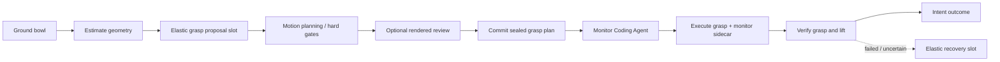
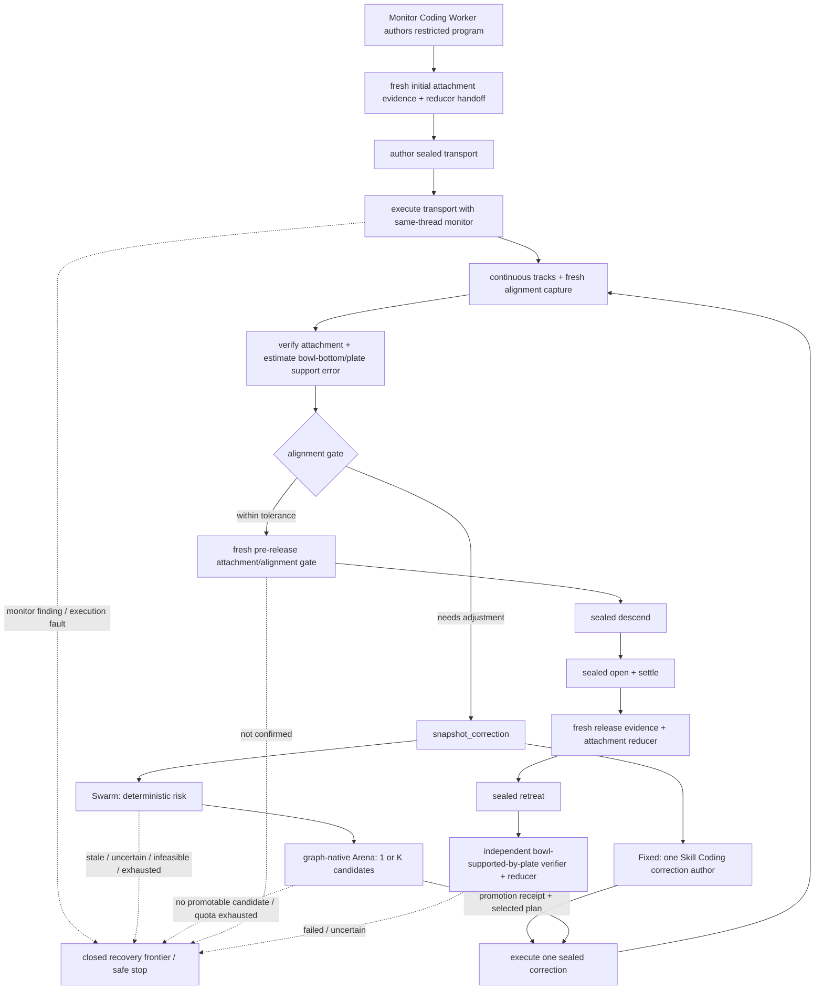

# RoboMEx 设计案例：将盘子旁边的碗放到盘子上

> 完整的代码落地顺序、文件映射、测试与论文消融见
> [M3.5 Elastic Agent Swarm 实施计划](robomex_m35_elastic_swarm_implementation_plan.md)。

> 状态：Executable Case v1.1（2026-07-22；fixed 与 risk-adaptive v2 production assembly 已实现，
> live 验收与论文实验待完成）。
>
> 本文用一个具体任务模拟 RoboMEx 下一阶段的目标运行方式。当前 v1 的
> `ReactivePlanner → Subgoal → SubgoalSwarmManager → Graph → Coding SubAgents`
> 只作为迁移起点、失败语料和独立 baseline；目标系统保留 Planner/Manager/Coding Worker
> 的**语义分工**，但平行建立 event-driven v2 control plane：`EpisodeOrchestrator`、
> `ActivationScheduler`、多生命周期 Agent、episode-scoped data plane 与 single action writer。
> 在这个 substrate 上再加入 **Elastic Graph、按风险展开的 Agent Swarm、Monitor Coding Agent、
> rendered motion evidence 与 optional action video**。
>
> 本文现在既是设计案例，也是 `robomex/protocols/bowl_place.py`、
> `robomex/protocols/risk_adaptive_bowl_place.py` 与两个 production builders 的运行语义说明。Graph 的
> 控制骨架、fresh evidence、bounded visual-servo loop、continuous tracker、sealed action、code-authored
> same-thread monitor、state proposal/reducer、final verifier 和 graph-native Arena 已实现；具体几何、
> motion 与 proposal 节点仍由 Skill-augmented Coding Workers 产生，不把任务退化成一段硬编码机器人
> 脚本。当前 builder 是 **place-only assembly**：它必须读取同一 episode 中已有、durable 且匹配
> action identity 的 pick handoff，不会在构造时伪造“已经抓住碗”。尚未完成的是上游 pick production
> assembly、真实 backend 接线、多 seed live 统计、evolve policy 和论文结论。

## 0. 案例要回答什么

用户提出：

> 将盘子旁边的碗放到盘子上。

这个案例需要同时说明：

1. 原有 Planner、Manager、Coding SubAgent 的哪些方法语义应保留，哪些控制结构必须替换；
2. Graph 如何从一次性 DAG 升级为安全受限、由事件驱动的运行图；
3. Agent Swarm 如何尝试不同 affordance/motion，而不是退化成固定流水线；
4. Monitor Agent 如何检索 Skills、编写 code，并在动作过程中持续检测异常；
5. 碗在运输中掉落时，为什么系统不会继续执行 release；
6. 如何只在困难时扩大 Swarm，避免运行成本随 Agent 数量线性增长。

本文所有 `passed`、`selected` 和掉落分支均是**预期运行模拟或测试语义**，不是已测得的真实机器人
成功率。没有 live/multi-seed 数据之前，不据此声称方法优于 fixed baseline。

## 1. 本案例采用的折中架构

### 1.1 角色分工继承，控制主干重构

```text
User Task
→ EpisodeOrchestrator opens/revises a SubgoalIntent
→ TaskPlanner + bounded Manager admit an executable scaffold
→ ActivationScheduler drives graph activations and Agent lifecycle
→ Skill-augmented Coding Workers publish typed proposals/evidence
→ ActionSupervisor admits exactly one sealed physical action
→ episode-scoped data plane reduces evidence and emits the next event
```

`ReactivePlanner`、一次性 `SubgoalSwarmManager` 和单 cursor `SubgoalGraphExecutor` 可以继续作为
v1 baseline，但不再约束 v2 的 class、调用顺序或内部 artifact 布局。目标系统中的 Manager
仍不是每个小动作都重新规划的全局中央 Agent；长期存在的是可序列化 session record，
每次 sleep/wake 只发起一次 bounded LLM invocation，避免常驻 chat context 腐化。它只在 intent authoring、
risk expansion、recovery 或结构 patch 请求时介入。普通 node completion、control tick
和已声明的 alignment iteration 由确定性 scheduler 路由。

当前 production run 使用 model-free `PinnedBaselineManagerInvoker`，不在 risk expansion 时调用 LLM；
deterministic risk 与 manifest-pinned Arena binding 直接决定 1/K。上述可重新唤醒的
`SwarmManagerSession` 是 evolve-ready mode，而不是当前 baseline 的隐藏在线调用。

### 1.2 Graph 是 elastic scaffold，不是任意可变工作流

目标架构允许 Manager 为 active intent author 可执行 scaffold，并预留两类 elastic slot：

- **Proposal Slot**：按风险启动 1～K 个 Affordance/Motion/Critic Coding Agents；
- **Recovery Slot**：Monitor/Verifier 失败时，按当前证据展开有限恢复节点。

当前 bowl-place production graph 中，correction Swarm 已实现为 fixed-topology 的 graph-native Arena
activation（risk 决定调用 roster 中 1 或 K 个已 pin candidates），不是运行时填充 Proposal Slot；
Recovery Slot/ComposableFrontier 已声明，但 pinned baseline 只 safe-stop，不在线物化 regrasp fragment。
这样既保留完整目标架构，也不把 evolve-ready contract 误写成当前启用行为。

Graph/Runtime 遵循三条不变量：

```text
committed execution history and published artifacts are immutable
only an inactive future region in a declared elastic slot is patchable
an admitted physical action is frozen until completion/interruption
```

这里不用 `executed prefix`：并行 service、重试和 bounded loop 不存在唯一线性前缀。不可变的是已经
commit 的 activation event、artifact、attempt 与 receipt；future graph 可以变化，但不能重解释这些
历史。正在执行的 sealed plan 也不能被 LLM 偷换。

还必须区分两种操作：

- **Roster update**：在已声明 Slot/role/budget 内 spawn、suspend、resume 或 terminate Agent 实例；
  它改变运行 roster，不改变 graph topology，也不产生 `GraphPatch` revision；
- **GraphPatch**：填充或替换声明过的 inactive future control/dataflow fragment；它必须携带 base
  revision、重新编译并原子 commit。

Runtime 同时实现保守的 global-quiescence profile 和默认的 **affected-scope barrier**：被替换区域
及其 causal dependents 没有 running activation、未决 artifact
reservation 或 admitted action 即可，独立 Tracker/Monitor service 不必停机。single action writer
仍保证任何时刻最多一个 runtime-owned physical action 改变世界。

### 1.3 Agent 与确定性服务的边界

| 组件 | 类型 | 职责 |
|---|---|---|
| `EpisodeOrchestrator` | event-driven control plane | 管 active intent、事件、预算及 Planner/Manager/Agent 生命周期 |
| `TaskPlanner` | task-level language agent | 根据任务、场景和历史产生或修订开放 `SubgoalIntent`；v1 Planner 是 adapter/baseline |
| `PinnedBaselineManagerInvoker` / future `SwarmManagerSession` | bounded orchestration agent | 当前 admission/exception close；未来经新 manifest 才管理 roster/有限 GraphPatch |
| Grounding/Geometry/Affordance/Motion Agent | Skill-augmented Coding Agent | 检索、选择、使用 Skills 并编写 bounded code |
| Monitor Agent | Skill-augmented Coding Agent | 编写 action-specific monitoring code |
| Verifier/Critic Agent | Skill-augmented Coding Agent | 编写/调用证据分析代码，提出判断或修改意见 |
| Tracker API、Renderer | deterministic service | 提供感知跟踪和确定性渲染能力 |
| Graph Compiler/ActivationScheduler | deterministic service | 校验 graph/patch，依据 typed event 激活节点与 bounded loop |
| ActionSupervisor/SealedActionRunner | deterministic service | 唯一物理写者；原样执行 sealed action、记录 evidence、stop/hold |
| EpisodeDataPlane/StateReducer | deterministic service | append-only 保存 artifacts/history，提交少量封闭控制状态 |

因此 RoboMEx 的具体 specialist Workers 仍然是 Coding Agents；Planner 和 Manager 是
上层 Agent，但不冒充执行 specialist，也不直接调用物理动作 API。Tracker、Monitor Runtime
等 service 可跨 node 或 subgoal 存活，临时 proposal worker 则在 Slot 结束后销毁。

### 1.4 开放任务语义与封闭控制状态分开

原始用户指令和 Planner 的自然语言 postcondition 继续保留，不要求先把任务完整翻译成固定
谓词合取。“碗在盘子上”可以结合视觉、几何、环境信号和用户语义判断。

只有影响动作 admission 与恢复的少量状态需要封闭，例如：

```text
attachment ∈ {not_held, attempted, verified_held, unknown}
localization ∈ {localized, unlocalized, ambiguous}
plan ∈ {fresh, stale}
controller ∈ {ready, executing, quiescent, indeterminate}
```

`inside_support_region`、`upright` 等可以作为本次 Verifier 使用的证据问题，不是所有
“put A on B”任务的固定必要定义。

### 1.5 当前可构造的两个 v2 mode

| Mode | Production builder | Alignment correction | 共同基础 |
|---|---|---|---|
| Fixed v2 baseline | `build_fixed_bowl_place_application` | 一个 Skill Coding Worker author 一个 sealed bounded plan | 同一 transport/release/verification graph、tracker、monitor、data plane、reducer、action runtime |
| Risk-adaptive Swarm | `build_risk_adaptive_bowl_place_application` | fresh snapshot 后 `deterministic risk→1/K Arena→promote one plan` | 复用 fixed assembly 与同一个 episode-owned `SkillCodingAgentProvider` |

Risk-adaptive mode 不是把所有节点都变成多 Agent，也不是另起一个 simulator 同时试 K 次动作。它只在
`alignment_gate` 给出 `needs_adjustment` 后替换 correction authoring segment；transport、descend、open、
settle、retreat 和 independent relation verification 仍走经过审计的 fixed protocol。K 个 candidate 是
串行调度的逻辑 Swarm，拥有独立 workspace/artifact scope；只有 Arena promotion 的一个
`MotionPlan.v2` 进入 `execute_correction`。

两个 builder 都生成 immutable `RunManifest`，pin model、prompts、Skills/functions、actor profiles、graph/
schema/runtime digest、authoritative/perception/shadow backends、robot/checker configuration；启用
pointcloud preview 时还 pin renderer 与 geometry provider provenance。当前
`mutation_policy=disabled`：runtime/contract 已为 ComposableFrontier、GraphPatch 与 future evolution
准备好，但本 baseline 不在线 evolve Skill、candidate roster 或 graph topology。

## 2. Subgoal 0：抓住并抬起目标碗

> 本节保留“完整任务从 pick 开始”的设计主线，但当前 production builder 不执行本节。它从同一
> episode 的 durable pick handoff 开始，并验证 bowl/plate entity、track、attachment action ID，以及
> matching `ATTEMPTED` transition；`attempted` 或 fresh `verified_held` 均可作为 place protocol 的安全
> 入口。以下 pick Swarm 仍是下一阶段需要实现和实验验证的 upstream application。

### 2.1 TaskPlanner 打开 `SubgoalIntent`

`EpisodeOrchestrator` 请求 `TaskPlanner` 读取原始任务和当前观察，输出：

```yaml
intent_id: pick_bowl
revision: 1
instruction: "识别盘子旁边的目标碗，将其稳定抓住并抬离桌面"
success_rubric:
  "视觉与机器人状态证据支持目标碗正在稳定随夹爪运动"
protected_invariants: [single_physical_writer, no_unsealed_motion]
```

Planner 不生成具体 grasp pose，也不决定应调用多少 Agent。

### 2.2 Manager Session 生成初始 v2 scaffold

`SwarmManagerSession` 检索 task skill 与 leaf contracts，生成 `G_pick@rev1`：



Proposal/Recovery Slot 是 graph 中显式声明的可扩展位置。其他节点和已声明 capability 仍由
compiler 校验，Manager 不能在执行中任意发明 raw robot API。编译后由 `ActivationScheduler`
根据 artifact availability、typed outcome 和 budget 激活节点，而不是由旧 Executor 的单 cursor
从头走到尾。

### 2.3 Grounding 与 Geometry Coding Agents 执行

Grounding Agent 检索并使用：

```text
language_grounding
segment_object
segmentation_to_points
```

它编写代码识别目标碗和盘子，并发布稳定 entity ID 与 artifact refs：

```text
bowl_1  → mask / point-cloud refs
plate_1 → mask / point-cloud refs
```

Geometry Agent 检索：

```text
estimate_object_geometry
compute_obb
```

它发布碗的中心、尺度、OBB、点云置信度和退化原因。原始点云仍保存在 sidecar，不会作为
大段数组广播给所有 Agent。

此时 episode data plane 已 commit 两条 activation history：

```text
ground_bowl@attempt1: succeeded
estimate_geometry@attempt1: succeeded
```

其 events、consumed/published artifact IDs 和 lineage 已不可修改。Proposal Slot 仍 inactive；它不是
这两条 history 之后的一段可重写“线性前缀”。

### 2.4 Proposal Slot 先走低成本单候选路径

Manager 默认只实例化一个 Skill-based Affordance Agent，而不是一开始启动整个 Swarm。
该 Agent 检索 `grasp_open_bowl`，生成候选 `H1`。Motion Agent 再检索
`plan_bounded_motion`，产生 IK 后的 sealed joint plan。

确定性 gate 报告：

```yaml
candidate: H1
ik: passed
collision: passed
minimum_clearance: low
risk_reason: "碗靠近盘子，手腕/手指对盘边余量较小"
```

因为 clearance 偏低，Proposal Slot 触发升级，而不是直接执行。

### 2.5 Manager 用 roster update 在同一 Slot 展开 Swarm

Manager 不改 graph topology，而是在 `G_pick@rev1` 已声明的 Proposal Slot 内提交
`RosterUpdate`，spawn：

- OBB Affordance Coding Agent，检索 `compute_obb_short_axis_grasp`；
- Learned Grasp Coding Agent，检索 `grasp_graspnet`；
- 两个使用不同 approach/clearance 目标的 Motion Coding Agent；
- 一个只在候选通过硬 gate 后运行的 Motion Critic。

这不是 `GraphPatch`：Graph revision 仍是 `G_pick@rev1`，只是该 Slot 的 Agent roster 与 candidate
budget 发生变化。Grounding、Geometry 及其 artifacts 继续保留；`AgentRuntime` 为各候选分配隔离
namespace，`ActivationScheduler` 在既有 Slot contract 内调度并收集统一 candidate schema。
只有当 control/dataflow fragment 本身需要改变时才申请 GraphPatch。

候选结果示例：

| 候选 | 来源 | IK/碰撞 | Rendered evidence | Critic 判断 |
|---|---|---|---|---|
| `H1` | open-bowl skill | 通过 | 手腕靠近盘边 | 可行但脆弱 |
| `H2` | OBB short-axis | 通过 | 侧上方余量更大 | 推荐 |
| `H3` | learned grasp | 通过 | 单侧接触、lift 时可能滑动 | 风险较高 |

Renderer 使用 **真正 sealed、将被执行的 joint plan** 生成：

- 当前 RGB overlay；
- 局部点云的顶部/侧面视图；
- pregrasp、grasp、lift 关键帧；
- 完整 gripper、TCP axes 与 swept path；
- 碗、盘子和桌面的相对位置。

Manager 根据 hard certificates、Critic 和成本选择 `H2`，然后 graph 进入 Commit。未选择的
候选作为 trace 保留，但不会在真实机器人上逐一执行。

### 2.6 Monitor Coding Agent 编写在线监控代码

`MonitorAgent` 读取：

- 已选择的 `H2`；
- `bowl_1` tracker handle；
- action phase；
- bowl geometry 与 tracker uncertainty；
- Skill catalog 中的 `track_entity`、`monitor_attachment`、`capture_action_evidence`。

它编写 action-scoped monitoring code，例如：

```python
monitor_state = {"reference_tcp_T_bowl": None}

def monitor(obs, phase):
    bowl = obs.latest_published_track("bowl_1")
    gripper = get_gripper_state()

    if bowl.confidence < min_track_confidence:
        emit("attachment_uncertain", evidence=capture_recent_window())
        return

    if phase == "approach":
        check_object_near_initial_pose(bowl)

    elif phase == "lift":
        check_object_moves_with_gripper(bowl, gripper)

    elif phase == "stabilize":
        if monitor_state["reference_tcp_T_bowl"] is None:
            monitor_state["reference_tcp_T_bowl"] = relative_pose(gripper, bowl)
        else:
            check_relative_transform(
                bowl,
                gripper,
                monitor_state["reference_tcp_T_bowl"],
                tolerance=geometry_scaled_tolerance,
            )
```

Monitor code 经过 sandbox/contract 检查：它只能读取声明过的 fresh tracker/robot telemetry 并发出 typed
finding，不能在 action hook 内跑视频模型、sensor polling 或 world-changing API；recorder 可独立保存
同步 frame/video evidence。Monitor Agent 完成 authoring 后可以
休眠；其 code 由 Monitor Runtime 在整个 action lease 内持续运行，无需 LLM 每帧参与。

### 2.7 抓取执行与验证

`ActionSupervisor` 先 arm Monitor Program，再由唯一 `SealedActionRunner` 原样执行 sealed plan：

```text
approach → close → lift → stabilize
```

同步记录：

- planned/actual joint 与 EE trajectory；
- gripper state；
- bowl track；
- optional action video 与关键帧；
- Monitor findings 与 runtime action outcomes。

Primitive `converged` 只进入 `ExecutionReceipt`，不自动代表抓取成功。Verifier Coding Agent 检索
`verify_grasp_and_lift_via_robot_state` 等 Skills，编写/调用证据分析代码，提出：

```yaml
verdict: passed
proposal:
  attachment:
    entity: bowl_1
    status: verified_held
evidence:
  - bowl followed gripper during lift
  - relative transform remained stable during observation window
  - action video keyframes agree
```

Reducer 检查 action/plan/revision identity 后提交控制状态。`G_pick` 正常结束，`IntentOutcome`
返回 `EpisodeOrchestrator`，由其决定请求 TaskPlanner 打开下一 intent。跨 intent 保留的是
episode-scoped verified attachment belief 与 evidence refs，而不是让下一个 LLM 用自然语言重新猜
“机器人是否拿着碗”。

## 3. Subgoal 1：将已抓持的碗放到盘子上

### 3.1 TaskPlanner 打开 place intent

当前 application 使用 `OutcomeAwareFixedIntentPlanner` 打开一个 operator-pinned place intent；构造前先
验证已有 durable handoff，而不是让 Planner 用自然语言推断是否抓住了碗。intent 形如：

```yaml
intent_id: place_bowl
revision: 1
instruction: "将当前抓持的 bowl_1 运输并释放到 plate_1 上"
success_rubric:
  "释放后，目标碗稳定留在目标盘子上，夹爪已安全离开"
```

### 3.2 Fixed baseline 与 risk-adaptive graph



这是两个 mode 共享的一张 audited protocol；图中 `FIX` 与 `RISK→ARENA` 是互斥的 assembly-time
替换。alignment 是带显式 bound、exit condition、fresh-observation dependency 的正常 loop，不需要
Manager 每轮重新 author，也不需要 GraphPatch。`held_bowl_tracker` 与 `plate_tracker` 是 workflow-lifecycle
service activations；它们由 `ContinuousTrackSampler` 异步更新，action thread 只读 latest fresh tail。

Risk/Arena/execute 全部属于同一个 bounded alignment loop。若 loop 最多 I 轮、每轮最多 K 个 candidate，
Arena 的 durable candidate quota 与 run budget 都是 **I×K**；`RiskPolicy/ArenaPolicy` 的 K 只是单轮上限。
当前 `PinnedBaselineManagerInvoker` 负责打开 sealed scaffold，并在 exceptional Recovery Frontier 安全
收口；它不在 `mutation_policy=disabled` 的 run 内在线生成新 topology。

### 3.3 Placement/Motion Swarm 只在需要时展开

当前 Swarm 的 production scope 是**微调 correction motion**，不是对整段 transport/release 同时跑 K
套方案。`alignment_gate` 只有在 fresh evidence 证明仍需调整时才进入：

```text
snapshot_correction
→ assess_correction_risk(observation, attachment_evidence, alignment_error, servo_decision)
→ correction_arena(snapshot, risk, 同一组 exact context refs)
→ selected_action_spec
→ execute_correction
```

low-risk 时 Arena 只启动一个 candidate；high-risk 时最多启动 manifest-pinned K 个。默认 K=3 的语义
roles 是：

- `direct_bounded_servo`：优先最短可行 bounded correction；
- `clearance_biased_servo`：先保留 obstacle/support clearance；
- `conservative_waypoint_servo`：偏向平滑、保守的 waypoint geometry。

它们都通过共享的 `SkillCodingAgentProvider` 检索 `author_sealed_phase_motion` 并 author exact
`MotionPlan.v2`，但拥有独立 actor profile、namespace、workspace 和 budget。候选顺序执行，避免共享
CapX/GPU backend 的竞态；这只是计算调度串行，**不是**在真实或 shadow robot 上逐条 replay。candidate
effect scope 是 read-only，不能拿到 motion/gripper authority。

默认 utility、estimated risk 与 clearance prior 完全相同，不能在 plan 生成前硬编码赢家。runtime
检查 exact frame、world/resource、TCP、robot model/config、planner backend/config、start state、fresh
snapshot lineage、joint/collision feasibility 和实际 path；然后 deterministic selector promotion 一个
plan。可选 `PointCloudMotionPreviewRenderer` 用 trusted scene+FK provider 对 exact candidate plan 生成
content-addressed key views，但 preview 只是选择证据，不能替代 feasibility certificate。

选定后 `promotion_receipt`、candidate/hypothesis records 与 consumption ledger 落盘，只有
`selected_action_spec` 绑定到 authoritative `execute_correction`。其余候选保留为审计 trace，不产生
物理动作。

### 3.4 Place Monitor Agent 编写 phase-conditioned code

Place Monitor Coding Worker 检索 `author_attachment_monitor`，根据当前实体、phase 与可用 telemetry
author restricted program。下面是概念等价的伪代码；production runtime 实际编译为受限 AST，并只给
closed signals/findings：

```python
def monitor(obs, phase):
    bowl = obs.latest_published_track("bowl_1")
    plate = obs.latest_published_track("plate_1")
    gripper = get_gripper_state()

    if phase in {"transport", "hover", "descend"}:
        check_attachment_stable(bowl, gripper)
        check_target_drift(plate)

    elif phase == "release":
        # attachment breaking is expected here, not an anomaly
        check_gripper_opened(gripper)

    elif phase in {"settle", "retreat"}:
        check_bowl_stops_following_gripper(bowl, gripper)
        check_bowl_motion_settles(bowl)
```

这说明“是否翻车”不是全局手写 task rule，而是 Agent 根据 action phase、预期物理关系和可观测信号
写出的 executable constraint。`ContinuousTrackSampler` 在独立 service lifecycle 中 poll；controller
thread 上的 telemetry bridge 只读已发布且未过期的 bowl track 与 authoritative attachment revision，
不在 hook 内跑相机、VLM、点云或 LLM。program exception、stale/lost sample、NaN 或 signal mismatch
均 fail closed。

### 3.5 正常执行路径

1. `SealedActionRunner` 执行 sealed transport plan，Monitor code 持续检查 attachment；
2. 到达 hover checkpoint 后，fresh observation 估计当前被抓碗的底部和盘子 support target；
3. 若仍在 tolerance 外，fixed mode author 一个 plan；Swarm mode 先做 deterministic risk，再串行运行
   1/K 个只读 candidates，并 promotion 一个 plan；每段 correction 都是独立 sealed action，执行后回到
   fresh observation；整个正常 loop 不调用 Manager、不 patch graph；
4. 收敛后执行 descend、open、settle、retreat；若超出 loop budget 或 observation stale，则路由到
   Recovery Frontier 并安全停止；
5. 若配置了 recorder，保存与 action/plan/monitor/phase/sequence 同 identity 的 frame refs 和 action
   video；没有 recorder 时 receipt 明确为空，不伪造证据；
6. Verifier Coding Agent 检索 placement verification Skills，结合 before/after、关键视频帧、
   bowl/plate geometry 和环境信号判断自然语言 postcondition。

如果独立证据均通过，一个**预期**最终报告可以是：

```yaml
verdict: passed
semantic_assessment:
  "bowl_1 was released and remains stably on plate_1"
supporting_evidence:
  - bowl no longer follows gripper
  - bowl motion settled after release
  - bowl/plate visual and geometric relation is consistent with the instruction
  - environment task signal agrees
```

这里不会把“碗必须完全处于盘子 footprint 内”预先写成全局真值；它只是 Verifier 可以使用的
一个场景相关 evidence feature。

## 4. 失败分支：运输中碗掉落

现在回到 `G_place` 的 transport 阶段，假设碗从夹爪中滑落。

### 4.1 Monitor code 发现约束被违反

连续若干帧出现：

```text
T_gripper_bowl error exceeds geometry-scaled tolerance
bowl motion no longer follows the gripper
bowl vertical velocity is inconsistent with the commanded EE path
track confidence remains sufficient
```

Monitor Runtime 发出 finding；若 recorder 已启用，finding/receipt 还携带同步 frame/video refs：

```yaml
finding: attachment_anomaly
entity: bowl_1
phase: transport
plan_id: place_transport_p2
evidence:
  video_window_ref: artifact://...
  relative_pose_trace_ref: artifact://...
  robot_trace_ref: artifact://...
```

Monitor 不直接宣称“物理真值已经确定”，也不直接控制机器人。`ActionSupervisor` 根据编译好的
finding policy 要求唯一 writer stop/hold，生成
`ActionOutcome(interrupted, reason=attachment_anomaly)` 与 interrupted `ExecutionReceipt`。

### 4.2 当前 baseline：stop、保守失效、关闭 future release

事件发生后：

- grounding/proposal 的 activation records、published artifacts、commit 和部分 transport trace
  已进入 append-only history，保持不可变；
- 当前 admitted transport action 被安全中止并产生 receipt；
- 尚未执行的 hover、descend、release、settle、verify tail 不再获得 control token；
- attachment 控制状态保守降级为 `unknown`；
- graph 路由到 `recovery_frontier`；`PinnedBaselineManagerInvoker` 按 sealed policy safe-stop/close。

这就是当前 fixed 与 risk-adaptive production assembly 的真实行为。它们不会在掉落后继续 correction、
descend 或 open，也不会让 LLM 临时拼一个 regrasp script；`RunManifest.mutation_policy=disabled`，因此
当前 run 在 recovery frontier 终止并保留 finding、attempt、receipt、tracker/optional video evidence。

### 4.3 Evolve-ready contract：未来授权 run 可恢复，但不是当前结果

GraphPatch/ComposableFrontier、RosterUpdate、affected-scope barrier 与 long-lived tracker substrate 已实现，
因此未来独立的 evolution/recovery experiment 可以创建一个**新的 manifest-pinned run policy**：先 active
observe，再在 recovery frontier 内 spawn 已授权 regrasp workers；只有确实需要改变 future control/data
topology 时才申请 `G_place@rev2`，例如：

```diff
- hover → descend → release → settle → verify_place
+ active_observe_bowl
+ → refresh_bowl_grounding
+ → recovery grasp proposal slot
+ → regrasp + monitor
+ → verify_attachment
+ → return to placement proposal slot
```

Patch 只能使用 catalog 中允许的角色、Skills、capabilities 和 recovery budget，并必须重新编译。runtime
只等待 recovery region、causal dependents 及 single physical writer 到达 affected-scope barrier，持续
跟踪 bowl_1 的 Tracker service 不必退出。
旧 activation/artifact/receipt history 不能被新 revision 删除或重解释。
如果碗仍在桌面、可定位且可达，Recovery Swarm 可以重新抓取；如果掉到不可达区域，或恢复
已经超出当前 place intent 的合理范围，`G_place` 安全结束并把 evidence/failure kind 返回
EpisodeOrchestrator，由 TaskPlanner 生成新的 recovery intent 或请求用户帮助。

这段是 evolve-ready **运行设计**，尚未计入当前 baseline 的 live 能力或论文 recovery success。两种
模式共同保证：系统不会继续移动到盘子上方执行一次空 release，也不会允许 LLM 在机器人运动中
任意重写当前 trajectory。

## 5. 运行成本如何受控

Agent Swarm 在方法中占比提高，不意味着每个动作都运行完整 swarm。

| 风险等级 | Graph 行为 | 典型 Agent 调用 |
|---|---|---|
| 低 | correction Arena 只调用 roster 中第一个 candidate | 1 Skill Coding motion candidate |
| 高 | 同一 graph-native Arena 串行调用 manifest-pinned K candidates | K Skill Coding motion candidates；可选 deterministic preview |
| 失败/不确定 | 不 promotion、路由 closed recovery frontier | 当前 baseline safe-stop；不在线 regrasp |

成本控制规则：

- Renderer、Tracker Runtime、Compiler 与 action recorder 不调用 LLM；
- Monitor Coding Worker author 一次 program，之后由 runtime 在 action hook 高频执行；
- 视频默认转为 before/after + 稀疏关键帧，只有 uncertain 时读取短 clip；
- 单轮 K 和累计 `max_alignment_iterations×K` 都有显式、durable budget；
- model calls/tokens/wall time、physical attempts、renderer 和 recovery 都有独立上限；
- 当前 pinned Manager 只 author/close scaffold，不参与每轮 candidate selection；
- 简单路径不为了“像 Swarm”而强制制造多候选。

## 6. 这个案例中的 Graph 与 Swarm 关系

本案例最终采用的定义是：

> **Graph 是可审计的物理执行与恢复骨架；Agent Swarm 是在 Graph 的 elastic decision slots
> 中产生、比较和修正具身 action hypotheses 的搜索与协作机制。**

它不是纯静态 workflow，也不是无边界的 runtime multi-agent chat：

```text
SubgoalIntent-in
→ EpisodeOrchestrator opens a manifest-pinned v2 run
→ Pinned Manager admits the compiled scaffold
→ ActivationScheduler drives typed activations and lifecycle events
→ deterministic risk chooses one or K manifest-pinned Coding candidates at correction Arena
→ candidates run in isolated logical workspaces; Arena promotes one sealed plan
→ ActionSupervisor admits exactly one sealed physical action at a time
→ continuous trackers publish; same-thread Monitor code consumes only fresh telemetry
→ evidence advances the fixed loop or routes to safe recovery frontier
→ IntentOutcome returns to EpisodeOrchestrator / TaskPlanner
```

在 evolve-ready extension 中，RosterUpdate 才改变 declared frontier 内的 worker lifecycle，GraphPatch 才
改变 inactive future topology；二者 contract/runtime 已存在，但当前 production manifest 不授权 mutation。

## 7. 当前实现闭环

该案例对应的 v2 implementation baseline 已包括：

1. **EpisodeOrchestrator + ActivationScheduler**：以 typed event 驱动 run、bounded loop 与 lifecycle，
   不复用 v1 的同步 Session/单 cursor Executor 作为 v2 内核；
2. **Elastic slot schema**：Graph 显式声明 Recovery Slot/ComposableFrontier、role、budget 和 patch 边界；
3. **Roster protocol**：spawn/suspend/resume/terminate Agent 不冒充 GraphPatch；
4. **Graph revision/patch protocol**：committed activation/artifact/action history 不可变，只 patch
   inactive future region；affected-scope barrier 已实现，但当前 baseline mutation 关闭；
5. **Graph-native Swarm Arena**：risk node 与 Arena 是 typed activations，支持 1～K 个异质 Coding
   Agents、exact context refs、hard gates、durable ledger 与 promotion receipt；
6. **Plan commit identity + single writer**：render、execute、receipt 绑定同一个 sealed plan，只有
   `SealedActionRunner` 持有 world-changing API；
7. **Continuous tracker + Monitor sidecar**：Coding Agent author restricted monitor program，Sampler
   异步发布 track，Runtime 在 physical action same-thread hook 执行 monitor 与 stop/hold；
8. **Episode data plane**：append-only evidence bundle 同步 action receipt、optional frame/video、track、
   phase 与 event，并让 durable attachment handoff 跨 intent 可消费；
9. **Fixed/risk-adaptive production assembly**：共享真实 SkillCoding provider，pin model/backend/checker/
   renderer provenance，并检查累计 candidate quota `iterations×K`；
10. **Evolve-ready contracts**：RosterUpdate、GraphPatch、ComposableFrontier、registry/evaluation hooks 已
    存在，但 baseline manifest 固定 `mutation_policy=disabled`。

完整 baseline **直接**运行在 v2：`EpisodeOrchestrator`、`ActivationScheduler`、`EpisodeDataPlane` 与
`ActionSupervisor` 完成 transport→observe→bounded correction→release；risk-adaptive assembly 在
correction loop 内接入 `snapshot→risk→1/K Arena→selected execute`。当前 v1 保持可独立运行的
historical baseline，不承担 v2 兼容内核。

## 8. 尚待 live 与论文实验回答的问题

1. 真实 CuRobo/IK/collision/FK 与 scene geometry provider 是否在 bowl correction 上提供可靠 gate/preview？
2. continuous camera tracker 的 freshness、identity stability、drop recall/false-positive 与 control stop
   latency 是否达到预注册阈值？
3. deterministic risk 的哪些特征/阈值能在 success–cost Pareto 上优于 always-1 与 always-K？
4. 相同 model/Skill/backend、physical opportunity 与 compute-matched budget 下，Swarm 是否改善不同
   rim grasp offset/orientation、target drift 与 occlusion 的成功率？
5. 小模型是否从 typed contexts、hard gates 与 render evidence 中获得更大相对收益？
6. evolve/recovery policy 应在什么 intent boundary 创建新 graph revision；其收益是否值得额外故障面？
7. fixed、risk-adaptive、render off/on、monitor off/phase/control、large/small model 与 evolution 条件如何
   做 multi-seed 统计，并报告实际 candidate/token/latency/physical-attempt 消耗？

这些是实验问题，不是用更多代码接口即可回答的问题。当前文档只主张 production assembly、数据流、
authority、安全停止和可审计性已经实现；在 live、多 seed、compute-matched 和 evolution experiment 完成
之前，不主张真实成功率提升、小模型结论或论文可接收性。
