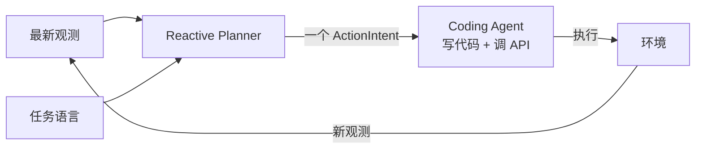

# RoboMEx 高层设计

> 本文只记录核心命题。具体分层、契约与接口等想清楚后再逐步补充。

## 核心命题：Code 是与 VLA 对齐的中间动作语言

把 Code-as-Policy 重新理解为一种**与 VLA 对齐的机器人控制范式**，而不是"让模型学会正确调 API"的工程问题。

传统 VLA：视觉观测 + 任务语言 → 神经网络 → 低层控制量。

RoboMEx：视觉观测 + 任务语言 → VLM Agent → **代码 + 机器人 API** → 动作。

两者控制结构同构，差别只在动作的表达介质。动作不一定是神经网络生成的低层控制量，也可以由 VLM Agent 通过代码和机器人 API 表达。

> **Code 是视觉语言推理与真实机器人能力之间的中间动作语言。**

## 真正的问题：语义腐化

现有 Code-as-Policy 方法的主要问题，并不只是模型能否正确调用 API，而是**机器人关键物理信息在传递链条中逐级失真**：

```
视觉观测  →  语言描述  →  代码变量  →  实际动作
```

腐化的危害在时间维度上放大。环境稍有变化——物体被遮挡、抓取姿态发生偏移、目标在移动中掉落——先前生成的代码并不知情，会**继续忠实地执行一个已经失效的策略**。

这是开环结构的固有缺陷，与模型能力无关。只要采用"一次生成长代码 → 盲执行"的形态，再强的模型也承受同样的缺陷。

## 对策一：闭环，每次只决定一个 ActionIntent

既然 Code 处在 VLA 中"动作"的位置上，它就必须继承 VLA 的闭环时序特性。VLA 不会一次性输出未来数百步再闭眼执行，它每一拍都重新看。

机器人需要形成连续的 **观察 → 动作 → 再观察** 闭环：



Reactive Planner 根据任务语言和最新观测，生成**细粒度、接近人类操作语义**的 ActionIntent。例如抓取瓶子被分为「移动到瓶盖上方」「抓住瓶盖」「抬起瓶子」。

两条硬约束：

1. **每次只输出一个 ActionIntent**，绝不预先展开为固定流程。
2. **每个 ActionIntent 都基于最新观测重新决策**，而不是沿着上一次的设想续接。

### 粒度判据

一个 ActionIntent 应当是**单次视觉落地的有效性可以覆盖的最大动作单元**。一旦需要重新看一眼才能安全推进，就必须切开。

- 过粗：「把瓶子拿起来」——跨越抓取前后两个不同物理状态，中间必须重新观测。
- 过细：「关节 3 转 0.1 弧度」——低于推理层的抽象，属于代码内部。

ActionIntent 的粒度同时**约束了代码的爆炸半径**：Coding Agent 写的代码只服务于当前 intent，其时间跨度被 intent 边界卡死。这是抑制语义腐化的结构性手段——不是提示模型"小心点"，而是把可腐化的窗口物理缩短。

## 对策二：让 Agent 知道自己是一个身体

VLA 之所以能"像身体一样使用自己的能力"，不是因为它更聪明，而是因为**本体状态天生就是它输入的一部分**——每一拍它都知道末端在哪、爪子开合、有没有夹住东西。

Coding Agent 没有这个。它每一轮都要从对话文本里重新推断自己的状态，并且经常推断错：重复已经做过的计算、沿用几拍之前就已失效的坐标、以为自己抓着东西而其实早就掉了。这是语义腐化在**自身状态**上的表现——前面讲的是对世界的认知腐化，这里是对自己的认知腐化。

对策是每一拍无条件注入一块**本体感觉**。设计原则如下。

**字段准入以行为为准。** 判据只有一条：缺了它 Agent 的行为会不会不同。末端位姿、夹爪开合与宽度、当前持有物、上一动作及其结果、已跟踪物体的位置与陈旧度、剩余步数预算——留下。关节角、相机内外参、速度、时间戳——砍掉。这一块必须短到每拍重复也不心疼；一旦臃肿，它自己就会成为淹没其他信息的噪声。

**系统算结论，模型读结论。** 上一拍的状态保留在系统侧，而不是把两块状态一起塞进提示。位移增量、命令位移与实际位移之差、物体是否跟着手在动，都由系统算好后以结论形式呈现。让模型自己做三维向量减法，等于引入一类不报错、但后续全错的失败。

**派生的判断比原始数字有用。** "持有物"不应是"爪子合上了所以大概拿着"，而应是**物体位移与末端位移是否一致**这一谓词的计算结果：两者背离就是掉了，系统在模型开口之前就知道。这是"把常数改写成关于观测的谓词"在自身状态上的应用，且对任意物体成立。

**陈旧度是语义腐化唯一看得见的地方。** 每个被跟踪物体都带一个"距上次观测过了几拍"。语义腐化在别处都是抽象命题，只有这个字段把它变成模型每一拍都看得见、并据以决定要不要重新看一眼的东西。

**不猜。** 把新的检测结果关联回已跟踪物体时，若出现无法区分的候选，如实上报歧义，绝不静默选一个。静默的错误关联是灾难性的：Agent 会正确地执行一个针对错误对象的动作，并且永远不知道。反过来，闭环本身让关联变容易——观测越频繁，每个物体在两拍之间移动得越少。

配套的**操作规程**同样要短：一拍一个有界动作、单次代码执行中最多一次改变世界状态的调用、不使用本拍之外观测到的坐标、动作前写下预期、同一种失败不重试第三次、有技能覆盖时先加载技能。其中第二条可由执行侧机械检查——这把闭环从一句劝告变成系统约束，比任何措辞都可靠。

## 当前状态

闭环的两条边，观测边已通、执行边仍断：

- **观测边（通）**：`robomex/env.py` 每拍从 LIBERO-pro 渲染真实画面并落盘，以多模态 image part 随 prompt 送进 Reactive Planner。这是单步纪律能够成立的物质前提——没有画面可看，模型除了凭空展开流程别无选择。
- **执行边（断）**：Coding Agent 与 robot port 尚未重建。环境不执行任何动作意图，反馈恒为 `IntentFeedback.status == "not_executed"`，文字说明恒为「没有执行成功」。

由此产生一个看起来奇怪、实则正确的现象：连续多步运行时，planner 会**反复给出同一个动作意图**。因为画面确实没变，该做的那一步确实还没做。这正是闭环在执行层缺失下应有的表现，不是缺陷。

代码只剩 Reactive Planner 一层：`contracts.py`（四个数据类）、`planner.py`（单步决策）、`env.py`（出图不执行）、`policy.py` / `images.py` / `trace.py` / `cli.py`（边界与落盘）。
