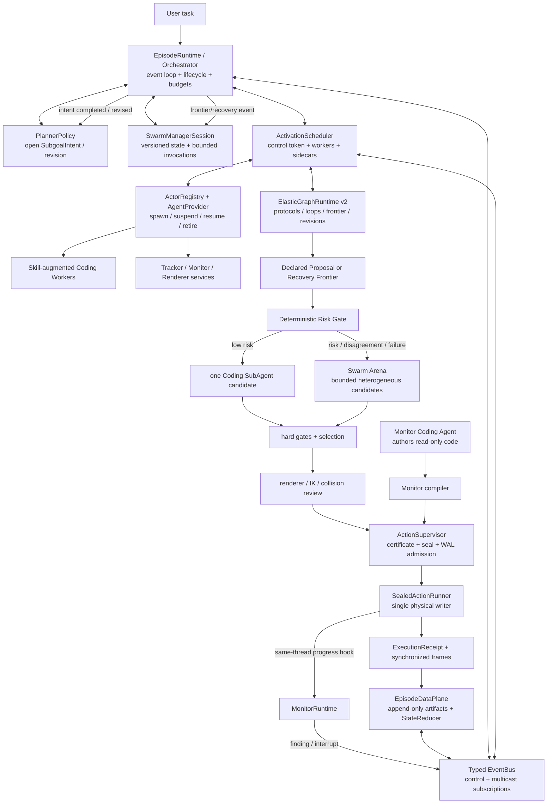
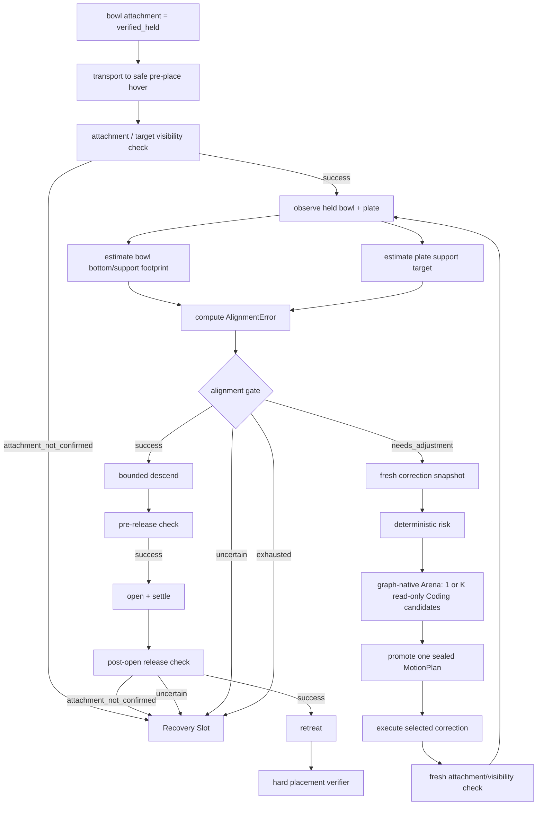
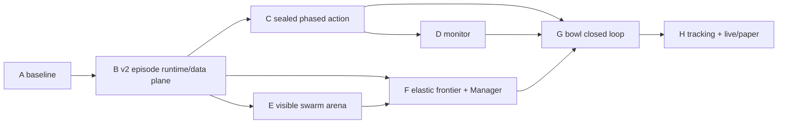

# RoboMEx M3.5：Elastic Agent Swarm 完整实施计划

> 状态：Implementation + Acceptance Plan v2.1（2026-07-22；fixed 与 risk-adaptive
> production assembly 已落地，完整回归已通过，等待 live 接入验收）  
> 范围：本文同时记录已实现架构、剩余机器人接入、测试门槛和论文消融。  
> 相关设计：[M3.5 Causal Embodied Data Plane](robomex_m35_embodied_data_plane.md)；
> [“碗放到盘子上”运行案例](robomex_case_bowl_to_plate.md)。

## 0. 最终决策

当前 RoboMEx 是**迁移起点、failure corpus 和论文 baseline**，不是目标架构必须原样保留的骨架。
本计划保留已经证明有价值的研究抽象，但允许替换其具体 class、调用关系、数据结构和控制流。

必须保留的是四项方法不变量：

1. **Skill-augmented Coding Workers**：具体 Grounding、Geometry、Affordance、Motion、Monitor Author
   和 Verifier 仍通过 Skill + code 完成开放世界计算，而不是退化为手写 task script。
2. **Contracted communication**：Agent 间数据经 typed artifact/ref 和显式 outcome 流动，不靠共享
   自然语言或隐藏 Python 变量。
3. **Swarm under bounded orchestration**：risk gate/runtime/Manager 在各自授权边界内管理 Agent
   生命周期、候选和恢复；默认不强制多 Agent，也不让 Agent 无边界群聊。
4. **Deterministic physical authority**：只有 runtime-owned action supervisor/runner 能改变世界，
   Agent 只能 author/propose/verify。

可以而且应当重构的是：同步 `Session` 循环、只有 `goal + postcondition` 的 Planner 输出、一次性
`SubgoalSwarmManager`、`SpecialistSpec`-only graph、单 cursor `SubgoalGraphExecutor`、per-subgoal
覆盖式 `ArtifactStore`、共享 persistent globals，以及 raw API ActionExecutor。

目标系统新增五项核心能力：

1. **Episode Orchestrator**：事件驱动地管理 Planner、subgoal intent、长期 Agent/service 生命周期、
   graph run 和 episode state；`RoboMExAgent.run()` 最多保留为外部 facade。
2. **Elastic Graph Runtime v2**：新的 fixed-topology/loop/slot/patch runtime，不通过不断扭曲 v1 DAG
   获得动态能力。
3. **Risk-adaptive Agent Swarm**：普通情况一个候选；风险升高时 graph-native Arena 才在 manifest-pinned
   roster 内展开有限候选；future Manager 只在声明好的 Proposal/Recovery Frontier 内改变 roster/topology。
4. **Code-authored Monitor**：Monitor Agent 编写受限程序，由确定性 runtime 在 phase/waypoint/control
   hook 执行，而不是每帧调用 LLM。
5. **Sealed physical execution**：计划、monitor、admission、attempt、primitive receipt 和视频属于
   同一 action identity，异常可 fail closed。

本文同时做一个重要减法：**不先建设一个包含所有世界事实、所有时钟和所有 Agent 消息的通用
黑板系统**。M3.5 第一阶段只传递会改变动作选择、安全 admission 或验证结论的数据；大数组、
视频和点云一律走 artifact ref，Manager 只看 compact summary。

在论文叙事中，**Agent Swarm 是方法主体，Elastic Graph 是保证 Swarm 在物理世界中可控、可恢复、
可审计的执行载体**。工程上先建设新的 v2 control/runtime substrate，再迁移 Swarm；旧 v1 只保留为
独立 baseline 和紧急回退，不反向限制 v2 的接口与内部结构。

### 0.1 2026-07-22 实现状态

本文不再以“最小 vertical slice”作为交付定义。当前代码已经形成一套可运行、可恢复、可审计、
且可继续 evolve 的 **RoboMEx v2 baseline**：

- `robomex/contracts/` 与 `robomex/evolution/manifest.py`：严格、版本化、内容寻址的 Skill、
  Actor、Protocol、effect、backend、schema 与 run identity；
- `robomex/data/`：episode-scoped append-only artifact/event plane、依赖域 freshness、稳定 entity/
  attachment/localization/relation state 和唯一 deterministic reducer；
- `robomex/elastic/` 与 `robomex/runtime/activation.py`：multi-lane activation、bounded loop、
  Composable Frontier、RosterUpdate、GraphPatch、affected-scope barrier 与 durable recovery；
- `robomex/orchestration/actors.py`、`manager.py`、`task_orchestrator.py`、`episode.py`：多生命周期
  Actor、bounded Manager session、Planner→Intent→Workflow→Outcome 和事件驱动 episode；
- `robomex/orchestration/coding_provider.py`：真实 Skill-augmented Coding Worker，独立 workspace、
  typed I/O、proposal-only capability、bounded model call/token/wall time 和 crash-safe调用边界；
- `robomex/runtime/action_protocol.py`、`authority.py`、`capx_action_backend.py`：fresh action snapshot、
  immutable plan/command、feasibility certificate、WAL、same-thread monitor hook、stop/hold、primitive/
  terminal receipt 与同步 action evidence；
- `robomex/runtime/observation.py`、`monitor_telemetry.py`：workflow-lifecycle continuous tracker sampler，
  以及只读取已发布 fresh track tail/attachment revision 的 monitor telemetry bridge；action thread
  不调用相机、感知模型或 LLM；
- `robomex/orchestration/arena.py`、`arena_coding_provider.py`：risk-adaptive 1→K candidate、独立
  candidate workspace、hard gates、deterministic selection、promotion receipt 和 graph-native Arena；
- `robomex/orchestration/motion_preview.py`：对 exact sealed joint plan 做可选的点云 + FK trajectory
  preview；renderer 只有只读 geometry/FK 接口，没有 action backend；
- `robomex/protocols/bowl_place.py`、`manipulation/bowl_place.py`、
  `orchestration/bowl_provider.py`：transport→fresh observe→bounded correction loop→pre-release gate→
  open/settle→post-release evidence→retreat→independent relation verification 的完整 fixed bowl protocol；
- `robomex/protocols/risk_adaptive_bowl_place.py`、`orchestration/bowl_arena.py`、
  `orchestration/bowl_swarm_application.py`：把 fixed protocol 的单一 correction author 精确替换为
  `snapshot→deterministic risk→graph-native Arena(1/K)→selected sealed execute`，并形成闭合的
  risk-adaptive production assembly；
- `robomex/orchestration/bowl_application.py`：完成 place-only handoff、真实 Skill catalog、共享
  `SkillCodingAgentProvider`、backend/checker admission、manifest 和 runnable v2 Agent 的 fixed
  production assembly。Arena candidates 与普通 bowl Coding Workers 复用同一 episode-owned Skill
  library、crash-safe invocation ledger 和 proposal-only capability boundary。

这里“完整 baseline”不等于论文结论已经成立：真实相机/跟踪 backend、不同抓取偏置下的多 seed
live 统计、compute-matched 消融和 evolve policy 仍分别属于接入与研究验收。未完成这些实验前，
文档不得声称真实机器人成功率提升或论文假设已被验证。

### 0.2 当前交付的两个 production mode

当前不是“一个最小 demo 加若干未来接口”，而是同一套 v2 substrate 上的两个完整、可构造模式：

| 模式 | 入口 | correction 决策 | 用途 |
|---|---|---|---|
| Fixed v2 baseline | `build_fixed_bowl_place_application` | 一个 Skill-augmented Coding Worker author 一个 bounded sealed correction | 论文 single-proposal/fixed treatment、工程回归与故障定位 |
| Risk-adaptive Swarm | `build_risk_adaptive_bowl_place_application` | fresh snapshot 后先做 deterministic risk；低风险运行 1 个候选，高风险运行 manifest-pinned K 个候选，Arena promotion 后只执行一个 plan | 完整 RoboMEx v2 方法 treatment |

两者共享 transport/release/verification、continuous tracker、code-authored monitor、data plane、sealed
action runtime 和 reducer；risk-adaptive mode **只替换 alignment correction authoring segment**，不会另造
一套动作执行器，也不会绕过 fixed protocol 的 pre-release/relation verifier。生产 builder 会检查：

- pick→place durable handoff 已存在，不能伪造 `verified_held`；
- model/prompt/Skill/function/actor profile、graph/schema/runtime code digest 已 pin；
- authoritative/perception/shadow backend 的 implementation/configuration/version provenance 完整；
- arm/gripper/controller resource 与各自 feasibility checker 的 exact provenance/configuration 匹配；
- Arena planning frame、TCP、robot model/config、planner backend、candidate profiles、risk policy 与
  renderer/geometry provenance（若启用 preview）没有漂移；
- run budget 覆盖 graph 的 worst-case envelope，其中 correction candidate durable quota 是
  `max_alignment_iterations × K`，不是单轮 K。

`RunManifest.mutation_policy` 在这两个 baseline 中都固定为 `disabled`。GraphPatch、ComposableFrontier、
actor/Skill/evaluation registry 等 contract 已经 evolve-ready，但当前 run 既不会在线改 Skill，也不会
根据结果偷偷改 candidate/policy。未来 evolution controller 必须创建新的、重新 pin 的 manifest/run，
不能借当前 baseline manifest 获得 mutation authority。

## 1. 现有实现基线

### 1.1 保留抽象，不冻结模块

| 现有资产 | 保留的思想/资产 | 目标代码处理 |
|---|---|---|
| [`ReactivePlanner`](../robomex/agents/planner.py) | task-level 语言推理与逐步分解 | 抽象为 `TaskPlanner`；输出可修订的 `SubgoalIntent`，旧 Planner 作为一个 adapter/baseline |
| [`RoboMExAgent.run`](../robomex/core/session.py) | 单一用户入口、episode 落盘与结果汇总 | 仅保留 facade；内部同步 for-loop 由 `EpisodeOrchestrator` 事件循环替换 |
| [`SubgoalSwarmManager`](../robomex/authoring/swarm_creator.py) | Skill progressive disclosure、contract catalog | 旧 class 留给 v1；新建 versioned `SwarmManagerSession` + bounded invocation，API 不受 `use_skill→submit_graph` 限制 |
| [`SubAgentFactory`](../robomex/authoring/adapters.py) | contract/capability/Skill-view 装配逻辑 | 仅作 legacy Coding provider；新建 `ActorRegistry/AgentProvider/AgentHandle` 管 lifecycle 与隔离 |
| [`SubgoalGraphSpec/Executor`](../robomex/authoring/graph.py) | 显式 graph、typed binding、compile-before-run | v1 冻结；平行实现 graph/runtime v2，不要求复用单 cursor/DAG 内核 |
| [`ArtifactStore`](../robomex/authoring/artifacts.py) | typed artifact envelope、显式 ref、atomic validation | v1 store 留作 adapter；目标改为 episode-scoped append-only data plane + graph view |
| [`MotionLeaseGuard`](../robomex/core/sandbox/guards.py) | 单物理写者原则 | 由 `ActionSupervisor + SealedActionRunner` 接管 admission/WAL/stop/receipt；旧 guard 只服务 v1 |
| CapX trace/video/controller | 真实 API、反馈、控制与录像能力 | 修改底层 hook 和 action context；不把现有 blocking `env.step` 当不可改变接口 |

具体工作 Agent 仍以 **Skill-augmented Coding Agent** 为默认实现，但它只是 `AgentRuntime` 的一种
worker。Manager、Tracker、Monitor Runtime、Renderer、Graph Compiler 和 Action Supervisor 可以拥有
不同生命周期与确定性实现；没有必要为了“所有东西都叫 SubAgent”继续挤进当前 Factory。

### 1.2 当前阻碍新设计的真实边界

| 代码位置 | 当前行为 | 对新方案的影响 |
|---|---|---|
| [`ReactivePlanner.next_subgoal`](../robomex/agents/planner.py) | 只返回自然语言 `goal + postcondition` | 缺少 entity refs、evidence rubric、protected invariants、risk/budget hint 和 intent revision |
| [`RoboMExAgent.run`](../robomex/core/session.py) | Planner 后同步阻塞等待一次 `authoring.run()` 完整返回 | 无法管理跨 subgoal tracker、睡眠/唤醒 Agent、运行中 event 或多个生命周期 |
| [`SubgoalSwarmManager.run`](../robomex/authoring/swarm_creator.py) | `submit_graph` 后立刻调用 executor，Manager 随即退出 | Manager 不能被 slot、monitor 或 verifier 再唤醒 |
| [`SubgoalGraphSpec`](../robomex/authoring/graph.py) | 无 graph ID、revision、slot、guard、patch；success path 必须是 DAG | 不能表达受限动态图和正常的 bounded alignment loop |
| [`SubgoalGraphExecutor.run`](../robomex/authoring/graph_executor.py) | 一个 `current` 指针串行跑完整图，只在 node 结束后路由 | 无 pause/resume、无 action 中事件、无 graph revision |
| [`ArtifactStore`](../robomex/authoring/artifacts.py) | 每次 executor 新建；key 仅为 `producer.port`；重试会覆盖 | patch/retry 后无法保留完整因果链，也不能跨 subgoal 传 held state |
| [`RuntimeSafetyState`](../robomex/core/sandbox/guards.py) | 只有全局 observation epoch、motion holder、末态 | 缺少 plan/action identity、controller phase、monitor/cancel 状态 |
| [`CapXExecutorAdapter.run_block`](../robomex/core/sandbox/capx.py) | `env.step(code)` 同步阻塞，视频区间在 block 完成后才得到 | 上层另起 Monitor 线程并不能安全实时观测或中断动作 |
| [`move_to_joints_blocking`](../capx/envs/simulators/libero.py) | 真正控制循环位于同线程 `_tracking_step` | 在线 Monitor 必须插在该控制循环，而非并发调用 MuJoCo |
| [`execute_joint_trajectory`](../capx/integrations/franka/libero_reduced.py) | waypoint 串行执行，失败才停止 | 可作为第一版 waypoint monitor hook |
| [`SubAgentFactory`](../robomex/authoring/adapters.py) | 每个 node 临时创建 Agent，无显式 lifecycle；共享底层 code env | 不适合长期 tracking/monitor author context，也无法安全并行候选 |

另有两个容易被“图已经能跑”掩盖的限制：当前 validation 要求所有 node 都位于 entry 可达的
success DAG，纯 recovery-only fragment 也无法自然表达；所有 Coding SubAgent 最终又进入 CapX
持久 Python globals，候选即使顺序执行也可能通过同名变量互相污染。v2 必须分别解决 all-edge
reachability/bounded-cycle validation 与 scoped execution namespace。

### 1.3 当前 place 链路中的具体缺口

当前 [`place_object`](../robomex/skills/builtin/task/place_object/SKILL.md) 的实际主路径是：

```text
target grounding
  → find_placement
  → build_place_trajectory(transport, descend, open, retreat)
  → release_at
  → verify_placement
```

这里存在四个直接影响“碗放盘子”案例的问题：

1. [`find_placement/contract.yaml`](../robomex/skills/builtin/affordance/find_placement/contract.yaml)
   只声明 `target_points` 输入，但实现和 Skill 文档假设存在 `held_object_frame`；这个信息目前没有
   通过 graph contract 正式流入 Affordance Agent。
2. [`placement_affordance.py`](../robomex/skills/builtin/affordance/find_placement/scripts/placement_affordance.py)
   主要依赖 `object_center_offset_from_grasp` 将 object center 反推为 TCP。当 rim grasp 的位置和姿态
   不稳定时，这个固定 offset 正是误差来源。
3. [`place_trajectory.py`](../robomex/skills/builtin/motion/plan_bounded_motion/scripts/place_trajectory.py)
   一次生成 transport、descend、open、retreat 的完整模板，中间没有“看一眼—小步纠偏—再看”的
   闭环。
4. [`verify_placement`](../robomex/skills/builtin/verification/verify_placement/contract.yaml) 只消费
   execution evidence，没有显式 target geometry/entity observation，因此最终关系验证容易重新依赖
   自由文本或临时感知。

这意味着第一版不能只“加一个 Monitor Agent”。如果动作仍是不可分割的同步 code block，Monitor
既无法看到中间状态，也没有安全的停止点。

## 2. 目标架构



`SubgoalIntent` 不是固定谓词集合。它至少包含开放 `instruction/success_rubric`、相关 entity refs、
必须保护的物理 invariant、可接受 evidence 类型和预算；Manager 可请求 split/refine，Planner 在
intent boundary 接受、修改或结束。第一版仍限制同一时刻只有一个 active physical-action branch，
但 Tracking/Monitor service 和 suspended Coding Agent 可以跨 node、必要时跨 subgoal 存活。

职责边界必须稳定：

| 层 | 负责 | 不负责 |
|---|---|---|
| Episode Runtime / Orchestrator | event loop、Planner/Manager/Actor lifecycle、active intent、episode budgets | 生成精确运动或篡改 evidence |
| Manager | 当前 intent 需要哪些 Agent、何时展开/收缩 Swarm、如何修订 future frontier | 每帧计算位移、直接控制机械臂 |
| Graph + Activation Scheduler | 可执行 control/dataflow、activation、预算、roster/patch invariant | 用自然语言猜物理状态 |
| Coding SubAgents | 使用 Skill 和 API 计算 grounding、geometry、candidate、monitor code、verification | 绕过 contract 或直接共享隐藏变量 |
| Action Runtime | exact-plan admission、单写者执行、停止、证据和末态 | 自主改变任务语义或生成新策略 |

因此，“Graph 是 Agent Swarm 的实现形式”可以成立，但更精确的说法是：

> EpisodeRuntime 管生命周期和事件；Graph 是 Swarm 的可执行 control/data protocol；Manager 管理 Swarm；
> Scheduler 管 activation；Agents 产生计算与 proposal；Action Runtime 拥有最终 admission 和 stop authority。

## 3. 运行语义与不变量

### 3.1 新建 event-driven EpisodeRuntime

目标内核不是带一个 `cursor` 的可暂停 Executor，而是 episode-scoped 的多生命周期
runtime：

```text
RoboMExAgent.run（兼容 facade）
  → EpisodeRuntime / EpisodeOrchestrator
      → PlannerPolicy
      → SubgoalWorkflowScope（语义、预算、评测边界）
      → ActivationScheduler
      → ActorRegistry + AgentProvider
      → EpisodeDataPlane + EventBus + ActionSupervisor
```

`EpisodeRuntimeState` 至少保存：

```text
episode_id, active_intent/workflow scopes, global budgets
graph_id, graph_revision, compiled_graph_digest
ready/running/waiting/suspended/terminal activations
one primary control token, read-only worker roster, sidecar subscriptions
actor handles and lifecycle states
event-log offset, data-plane snapshot/revision refs
slot/roster usage, recovery count, model/action/candidate budgets
controller state, single action lease, admitted_action_id
terminal status
```

runtime 通过命令/事件界面工作：

```text
start_episode(task, manifest)                         -> EpisodeRuntimeState
open_workflow(intent, compiled_graph)                 -> WorkflowHandle
next_commands(state)                                 -> spawn/invoke/admit/suspend requests
on_event(state, TypedRuntimeEvent)                    -> new state + commands
update_roster(state, RosterUpdate)                    -> RosterReceipt
apply_patch(state, compiled_revision)                 -> PatchReceipt
close_workflow(state)                                 -> IntentOutcome
```

MVP scheduler 可以为了 CapX 隔离而顺序 invoke Coding Worker，但状态模型不能只容纳一个
active node：Tracker、Monitor Runtime、Recorder 和只读 candidate 必须是一等 activation/service。第一
阶段只启用 fixed-topology v2、封闭 outcome routing 和 declared bounded loop，不启用
frontier patch；这样 bowl alignment 从一开始就在目标 runtime 上实现。

旧 `SubgoalGraphExecutor` 冻结为 `LegacyGraphRuntime`，不改造为 v2 内核。二者只在外部
`IntentOutcome`、run manifest 和评测指标处对齐，不要求 node 顺序、artifact 布局、Agent
数量或内部 cost ledger 一致。

### 3.2 Graph 的动态边界

Graph 不允许任意自修改。v2 的方法不变量是：

1. **Committed history immutable**：已 started/terminal 的 activation、已解析 binding、已发布
   artifact、已录入 event 不得删除或重解释。串行 v1 的 executed prefix 只是该规则的特例。
2. **Admitted action immutable**：一旦 action admitted，其 plan、monitor、resolved refs、digest 和
   continuation 均冻结，直到 terminal receipt。
3. **Affected-scope commit barrier**：patch 准备/编译可与无关只读 work 并行，commit 时只暂停受影响
   activations。MVP 可使用更保守的 global-quiescence profile，但它不是最终方法定义。
4. **Declared frontier only**：patch 只能改变 initial graph 声明的 Proposal/Recovery Frontier，不能改动
   committed history 或未授权 effect domain。
5. **Optimistic concurrency + compile before commit**：`base_revision` 必须匹配；新 fragment 通过
   type、effect、capability、budget、must-availability、loop-bound 和 verifier-obligation 后才原子 commit。
6. **One physical writer**：任意时刻只有 runtime-owned `SealedActionRunner` 可改变世界。

v2 compiler 的 input availability 不只做串行 dominance；它还要处理 Arena alternative producer、stream
subscription、selector/join 和 loop-carried generation。每次 activation admission 都将 symbolic ref
解析到具体 artifact ID，禁止隐式“取最新同名输出”。

v2 不再把“一个 Skill = 一个 Agent = 一个 node”绑成一个 contract，而是拆分为：

- `SkillManifest`：可检索知识、API 和代码资产；
- `ActorProfile`：model、capability、workspace/isolation 和 lifecycle；
- `InvocationSpec`：本次 objective、typed I/O、budget 和 deadline；
- `ProtocolSpec/SlotPolicy`：control/data interface、effect ceiling、扩张规则与 verifier obligation。

runner 使用封闭 `runner_kind`：`coding_worker`、`deterministic_gate`、`arena`、
`monitor_program`、`tracking_service`、`system_action`、`reducer`。`system_action` 只能由 compiler/runtime
绑定 `SealedActionRunner`，模型不能自造 system code 或 capability。

Agent roster 和 graph topology 必须分开：

- `RosterUpdate/ArenaExpansion`：在已授权 `SlotPolicy` 内 spawn/suspend/retire candidate，写入 event
  log，**不增加 graph revision**；
- `GraphPatch`：改变 future control/data topology、continuation 或 protocol fragment，才经 compiler 产生新
  graph revision。

Graph v2 首先只支持两种 topology patch operation：

```text
fill_slot(slot_id, compiled_fragment)
replace_unexecuted_fragment(slot_id, compiled_fragment)
```

工程 MVP 可使用 `ClosedSlot`：额外冻结 allowed fragment/skill IDs。论文完整方法使用
`ComposableFrontier`：冻结 typed cut、effect/capability ceiling、唯一主 continuation、budget 和 verifier
obligation，Manager 可从 contract catalog 组合未预枚举 fragment，再由 compiler 判定是否 commit。
如果实验最终只实现 `ClosedSlot`，paper 应诚实称为 adaptive graph instantiation，不声称完整
elastic composition。

不在第一版支持任意 node 删除、跨已执行节点重连、运行中 action 改写或多个 patch 自动合并。

### 3.3 Routine loop 与 structural patch 分开

闭环微调的正常循环不是 graph mutation。它应当是编译时可见、带上限的 control-flow：

```text
observe
  → estimate_alignment
  → alignment_gate
      ├─ success（within tolerance）→ descend/release
      ├─ needs_adjustment → bounded_correction → post_motion_check → observe
      └─ uncertain/exhausted → Recovery Slot
```

这一循环实现为一个 hierarchical `Protocol/SubgraphScope`：内部 phase、evidence 和 correction
都在 event log 可见，但 Manager 不在每次 correction 上被唤醒。每个 loop 必须声明
`max_iterations`、单步位移/旋转上限和 progress artifact。只有 estimator 不适用、
持续不可见、动作策略需更换或发生 attachment loss 时，才请求 structural patch。

compiler 实现上可将每个声明过的 bounded loop 视为一个 strongly connected component，再要求折叠
后的 component graph 为 DAG；任何跨 loop 边界或未声明的 cycle 仍在编译期拒绝。reachability 要
检查全部 outcome edge，而不再要求 recovery node 伪装成 primary success path 的一部分。

### 3.4 Manager 生命周期

新增 `SwarmManagerSession`，但“persistent”指可序列化的 versioned session/event/context record，不是一个
无限增长的 LLM chat。每次 wake-up 是 bounded invocation，只获得 fresh compact snapshot、当前 frontier、
candidate cards 和剩余预算。它复用 progressive Skill disclosure 与 contract catalog 思想，但不复用
当前一次性 TurnEngine/tool protocol 作为架构边界；可分别处理 `author_scaffold`、
`expand_roster`、`repair_frontier`、`refine_intent_request` 与 `close`。提交初始图后逻辑上 sleep，
仅在以下事件被唤醒：

- Proposal Slot 的 risk gate 请求更多候选；
- 所有候选被 hard gate 拒绝或候选出现有意义分歧；
- Recovery Slot 收到 structured monitor/verifier/runtime event；
- loop exhausted；
- compiler 拒绝 patch，需要在剩余 Manager budget 内修复。

普通 node success、正常 correction iteration 和每个视频帧都不唤醒 Manager。每个 subgoal 应设置
独立的 initial-authoring、reactivation、candidate 和 patch 上限。

### 3.5 Control transition 与 event multicast 分开

当前 runtime 主要从 `failure_kind` 推导 edge event，无法表达“验证未失败，但还需要继续微调”，
也无法让同一事件在不改变主控制流的情况下通知 Tracker、Reducer、Manager 和 Recorder。
v2 使用 discriminated typed event union：

```text
MonitorFinding（非 graph edge）:
  attachment_anomaly | target_motion | unsafe_deviation | unobservable

runtime-owned ActionOutcome:
  succeeded | interrupted(reason=finding) | execution_fault | stale_plan |
  indeterminate_after_crash

NodeOutcome（唯一主 control transition）:
  success | needs_adjustment | target_drift | attachment_not_confirmed |
  uncertain | exhausted | 现有失败词表

LifecycleEvent / RosterUpdate / StateProposal / PatchRequest:
  spawned | suspended | retired | artifact_published | state_proposed | patch_requested
```

Monitor finding 先让 runtime pause/interrupt；fresh verifier 再决定 attachment 是否仍可确认，并向
Reducer 发布 state proposal。finding 不能直接宣告 `not_held`。alignment gate 在 tolerance 内仍发
`success`，因此不必增加同义的 `aligned` event。每个 `(activation, NodeOutcome)` 保持确定的
单一主 continuation；同一事件由 EventBus 按 typed subscription 多播给 Manager、Reducer、Tracker 和
Recorder。旧 `AuthoringNodeResult.outcome_event` 只是 run-to-completion leaf 的 adapter，不是所有长生命周期
Agent 的统一容器。

### 3.6 Sealed action 必须有真正的执行边界

仅给现有 raw `goto_pose/execute_joint_trajectory/open_gripper` 外面加 plan digest，不能保证执行的是
原计划。graph v2 的 action path 固定为：

```text
Coding Action Author 输出 MotionPlan.v2 / GripperCommand.v1
  → runtime-owned feasibility certificate
  → admission 解析并冻结所有 refs/digests
  → durable ActionAttempt WAL
  → deterministic SealedActionRunner 原样调用 raw primitive
  → PrimitiveReceipt(s)
  → ExecutionReceipt.v2
  → verifier / state-transition proposal
```

`SealedActionRunner` 是 system runtime，不是另一个 LLM Agent。v2 Coding Agent 的 namespace 不再暴露
raw world-changing API，也不能自己调用 `execute_sealed(action_id)`；ActivationScheduler 只在
ActionSupervisor admission 成功后调用 runner。已规划 joint segment 不得在 runner 中再次
`goto_pose/solve_ik`，不得未记入 digest 地
改变 subsample、waypoint、gripper command 或 collision config。

`ActionAttempt(admitted)` 必须在首个 primitive 前 durable flush。若进程在 primitive 与 terminal
receipt 之间崩溃，恢复时写 `indeterminate_after_crash`，相关 attachment/geometry 保守失效并等待
controller quiescence + fresh observation；绝不自动重放未知是否已执行的 action。

## 4. 因果数据面

### 4.1 不复制大数据

Agent 间只传 typed metadata 与 immutable refs：

- mask、point cloud、trajectory array、overlay、render、video、frame log 保存为文件；
- graph binding 传 artifact ID/ref，不把数组塞进 Manager prompt；
- Manager 只看到 schema、frame、freshness、confidence、risk、摘要和可视化路径；
- action admission 时将 symbolic ref 解析到唯一 immutable artifact ID，之后禁止“latest”漂移。

### 4.2 第一阶段真正需要的 schema

| Schema | 核心字段 | 用途 |
|---|---|---|
| `ObservationSnapshot.v1` | sensor/camera、timestamp、frame/extrinsics、revision、RGB/depth refs | 原始观测边界；derived geometry 必须引用它 |
| `ObjectGeometry.v2` | entity ID、OBB/axis、bottom/support footprint、frame、method/confidence、snapshot/transform refs | 被抓物几何；identity/state 不藏在自由 payload 中 |
| `SupportRegion.v1` | target entity ID、support region/center/normal/margin、frame、method/confidence、snapshot ref | plate 等放置目标几何，与 held-object geometry 分型 |
| `ActionHypothesis.v1` | candidate ID、strategy、affordance/plan ref、preconditions、expected effect、risk summary | Arena 的统一候选卡片 |
| `MotionPlan.v2` | plan ID、一个 exact joint segment/phase、start joints、scene/robot/attachment stamps、limits、digest | 规划与实际执行一一对应；不再把整个 place 塞进一项 plan |
| `GripperCommand.v1` | command ID、open/close target、limits、state stamp、digest | open/close 也走 admission/receipt，不混进 motion fallback |
| `WaitSpec.v1`（可选） | settle duration/steps、hold command、timeout、digest | backend 无原子 open-settle 时显式表示时间推进，禁止临时 sleep |
| `FeasibilityCertificate.v1` | plan ID/digest、backend/config、IK/joint/collision/clearance result | runtime-owned gate 结果；不能信任 Agent 自报 `feasible=true` |
| `MonitorProgram.v1` | monitor ID、input schema、phase scope、pure code/DSL、threshold source、events、code digest | Coding Monitor 的可执行输出 |
| `ActionAttempt.v1` | action ID、sealed spec/digest、resolved inputs、admission stamps、WAL state | 首个 primitive 前 durable 记录，crash 后禁止自动重放 |
| `PrimitiveReceipt.v1` | action ID、primitive index、exact args hash、status、timestamps、terminal telemetry | runtime 为每项实际调用生成的局部回执 |
| `ExecutionReceipt.v2` | action/plan/monitor ID、digest、phase outcomes、terminal state、event、frame/video refs | verifier 和 recovery 的权威执行证据；替代 action path 上的 `execution_evidence.v1` |
| `AlignmentError.v1` | held-geometry/target-region refs、translation/rotation error、uncertainty、tolerance | 闭环 place 的测量；不夹带可直接执行的 delta |
| `StateTransitionProposal.v1` | source evidence、before revision、proposed attachment/relation、confidence | Verifier 只能提议；不能直接写 episode state |
| `GraphPatch.v1` / `PatchReceipt.v1` | graph/base revision、slot、operation、fragment digest、validation result | 动态 graph 审计 |

M3.5 原设计中的更完整 FrameGraph、通用 StateLedger 和细粒度 revision domain 保留为后续扩展，不是
上述能力的前置条件。MVP 只维护三个 action-facing stamp：

- `robot_rev`：关节/TCP 状态；
- `scene_rev`：被观察场景；
- `attachment_rev`：gripper-object 关系。

无法证明仍有效的 artifact 直接 re-observe，不尝试用复杂规则“猜它仍然新鲜”。
`TypedArtifact.observation_epoch` 在 graph v1 中继续生效；graph v2 增加可选 `validity_stamp` 并通过
adapter 显式升级。不能让 v1 epoch 和 v2 revision vector 在同一 action binding 上隐式混用。

上表为论文/正文简称；`contract.yaml` 和 payload registry 必须使用完整 schema ID，例如
`robomex.observation_snapshot.v1`、`robomex.object_geometry.v2`、`robomex.support_region.v1`、
`robomex.action_hypothesis.v1`、`robomex.motion_plan.v2`、`robomex.gripper_command.v1`、
`robomex.wait_spec.v1`、
`robomex.feasibility_certificate.v1`、`robomex.monitor_program.v1`、`robomex.action_attempt.v1`、
`robomex.primitive_receipt.v1`、`robomex.execution_receipt.v2`、`robomex.alignment_error.v1` 和
`robomex.state_transition_proposal.v1`。禁止把文档简称直接复制成新的不兼容 schema。

### 4.3 Episode-scoped append-only data plane

v2 的 Artifact Ledger、event log、state reducer、tracker refs 和 recorder index 与 **episode** 同生命周期；
subgoal/workflow 目录只是 view/manifest，不再拥有独立 store。每次 publish 生成 immutable
`artifact_id`，包含 episode、workflow、activation、attempt/generation 和 port。规则如下：

1. publish 永不覆盖旧 generation；
2. activation admission 将 symbolic ref 解析成具体 `artifact_id + digest` 并写入 record；
3. retry、roster expansion 或 patch 后的同名输出产生新 generation；
4. action path 禁止 late-bound `latest`，admission 后所有 input refs 冻结；
5. workflow 结束只关闭其 activation/view，不重建 episode ledger 或杀死被明确保留的 service。

legacy exporter 可从 ledger 生成当前 `artifact_store.json` 的 `producer.port → latest` view，
但 v2 runtime 不反向依赖该布局。目标落盘至少包含 append-only `artifact_events.jsonl` 和
content-addressed `artifact_index.v2.json`。

`EpisodeEmbodiedState` 只保留少量权威 fluent：

```text
held_entity_id
attachment_status: unknown | not_held | attempted | verified_held
attachment_observation_ref
grasp/held geometry ref（若仍有效）
last_verified_relation
revision stamps
```

新 `ArtifactResolver` 只允许通过 `artifact_id + digest` 解析 episode root 下的 content-addressed
对象；裸相对/绝对路径、`..` escape、跨 episode ref 和 digest mismatch 全部拒绝。普通 Agent、
Monitor 和 learned Verifier
都只能发布 measurement/finding/`StateTransitionProposal`；一个窄化的 deterministic
`EmbodiedStateReducer` 是 `EpisodeEmbodiedState` 的唯一写入口。Monitor finding 可以立即让 admission
fail closed，但“看到异常”本身不能直接把 attachment 写成 `not_held`。

## 5. Risk-adaptive Swarm Arena

### 5.1 Arena 不是多条物理轨迹同时试错

Arena 内的候选 Agent 只能做 perception、geometry、affordance、planning、render 和 review。它们可以
提出多个方案，但只能选择一个方案进入 action admission；任何候选不得直接调用 motion/gripper API。

当前实现采用**串行逻辑 Swarm**：同一 Arena activation 内按固定 candidate roster 依次调用只读 Coding
Workers。串行是为了控制 CapX/GPU 资源与可复现成本，不等于共享状态；每个 candidate 仍有独立
`actor_handle + namespace_id + workspace/artifact scope`，一个 worker crash、写同名变量或产出 malformed
artifact 不会污染其他 candidate。以后可以并行隔离的 LLM/CPU proposal，但这不会改变“只能 promotion
一个 sealed plan”的物理 authority 规则。

Arena 已经是 `RunnerKind.ARENA` 的 graph-native activation，不再是藏在普通 Coding leaf 里的本地
helper。Episode runtime 把 graph/attempt identity、fresh admission snapshot、deterministic `RiskReport`
和 graph 中解析出的四项 exact context refs（observation、attachment evidence、alignment error、servo
decision）交给 manifest-pinned `ArenaBinding`。candidate activation/hypothesis、hard-gate result、selection、
promotion receipt 和消费 ledger 都可审计；Arena bridge 再把选中的 `MotionPlan.v2` 发布给唯一
`execute_correction` physical writer。

候选通过同一个 `SkillCodingAgentProvider` 检索 production catalog 中的
`author_sealed_phase_motion`，但每个 profile 拥有不同的 planning objective/model pin/预算。bridge 只接受
exact schema/frame/world/resource/TCP/plan-kind/backend/configuration 与 snapshot lineage 匹配的 plan；
候选自报的 `feasible`、utility 或 clearance 不能替代 runtime-owned gate。默认 candidate prior 完全中性，
不会用硬编码分数预选赢家。

### 5.2 展开策略

```text
fresh snapshot + attachment/alignment/servo evidence
  → deterministic RiskReport
      ├─ low risk → target 1 candidate
      └─ high risk → target K candidates (K bounded)
  → serial isolated Coding proposals
  → runtime hard gates + optional render + deterministic selection
      ├─ promote exactly one sealed plan
      └─ no admissible candidate / quota exhausted → Recovery Frontier
```

RiskReport 最初由确定性特征产生，例如：

- grounding confidence/fragmentation；
- target free-space margin；
- IK/collision result 与 clearance；
- grasp/held pose uncertainty；
- candidate 间终点或 orientation 分歧；
- 当前 subgoal 已有失败次数；
- monitor 所需可观测性是否满足。

默认 `min_candidates=1`、`K=3`；schema 允许显式配置到 8，但实际 K、risk thresholds 与完整 candidate
profiles 必须写入 run manifest，不能由结果反向调整。

这里必须区分两类上限：`K` 是**一次 alignment round** 最多启动的候选数；alignment loop 最多运行
`I=max_alignment_iterations` 轮，因此 durable `ArenaConsumptionLedger` 与 run manifest 的 candidate quota
必须是 `I×K`。每轮 `RiskPolicy/ArenaPolicy/actor_spawns` 仍只允许 1 或 K，累计 ledger 跨 loop iteration
复用同一个 `candidate_budget_id`；任何一轮都不能把“还有 K 个”误当成重新获得一份总预算。

### 5.3 选择顺序

候选选择遵循固定顺序：

1. schema、frame、freshness、finite value；
2. contract/capability；
3. IK、joint limit、collision、workspace、step bound；
4. plan/render 与目标几何一致性；
5. 当前 production baseline 用 deterministic selector；Manager/Critic tie-break 只能作为单独 pin、单独
   manifest 的研究 treatment，不能在当前 run 中临时加入。

这保证小模型不需要从原始点云中凭语言“想象”哪个动作更好，也防止更多 Agent 只带来更多 token。
其中第 3 项必须由 runtime-owned validator 产生绑定 plan digest 的
`FeasibilityCertificate.v1`；Agent 输出中的 `feasible/reachable` 只能作为 proposal metadata，不能
直接通过 hard gate。若当前 backend 不提供 clearance 或某项检查无法运行，certificate 必须把该项
标为 `unknown` 并按 `SlotPolicy` fail closed/route review，不能伪造数值、默认为零碰撞或默认通过。

### 5.4 Rendering 作为 Agent 间证据

当前 production Arena 可选接入 `PointCloudMotionPreviewRenderer`。它对 candidate 真正提交的 sealed
joint plan 做 FK，渲染 point cloud 上的 trajectory key views，并把 content-addressed PNG/digest 写入
candidate evidence。geometry provider、renderer implementation/configuration/version 都必须与 manifest
pin 一致；renderer 没有 authoritative/shadow action backend，不能借 preview 执行动作。preview
`failure_mode` 可配置为 fail-closed 或 omit，并由 manifest 明示。

完整视觉证据路线包括：

- 2D gripper/TCP/target/approach overlay；
- point-cloud trajectory polyline 与关键 waypoint；
- collision/clearance 标记；
- held-object estimated footprint/bottom 与 plate support region；
- 候选对比 contact sheet。

point-cloud/FK preview 是 proposal-side **可选证据**，不是 feasibility certificate，也不是 action 成功
证据。物理执行侧另有 `ActionEvidenceRecorder`，可把 runtime/monitor samples、frame refs 与可选 action
video 绑定到同一个 `ExecutionReceipt`。生产配置不应默认给每个 candidate 生成 action video；candidate
从不物理执行，只有被 promotion 的 plan 才可能产生 action evidence。

## 6. Code-authored Monitor

### 6.1 Agent 与 runtime 的边界

Monitor Coding Agent 的工作是：

1. 加载 monitoring/tracking/verification Skill；
2. 根据当前 plan phase 和可获得 observation 编写纯监控函数；
3. 声明输入、阈值来源、debounce/hysteresis、可能事件和 evidence 字段；
4. 输出 `MonitorProgram.v1`。

Monitor compiler 必须拒绝 import、文件/网络访问、机器人动作 API、动态执行和未声明全局状态。
Monitor-1/2 不能在控制线程运行任意 Python：Author 写出的函数必须编译为无循环、无递归、typed input
的表达式 DSL/受限 AST，并有 instruction/time bound；exception、NaN、timeout 或越界一律 fail closed
为 `unobservable` 并由 runtime pause/interrupt。Monitor program 只能返回 closed finding，例如：

```text
continue
pause_reobserve
attachment_anomaly
target_motion
unsafe_deviation
unobservable
```

`continue/pause_reobserve` 是 monitor runtime 内部 directive，其余值是 finding；它们都不是 episode
state。真正的 `hold/stop/cancel` 和 `ActionOutcome` 由 runtime 生成。Monitor Agent 没有动作权限。

### 6.2 三种监控粒度与主张边界

**Monitor-0：phase boundary evidence**

- 先拆开 monolithic place action；
- 在 transport、alignment correction、descend、open、retreat 之间重新观察；
- Monitor program 在 phase 结束时读 fresh snapshot/video keyframes；
- 这一阶段只能防止错误继续进入下一 phase，不能声称在一个 blocking primitive 中即时停止。

**Monitor-1：waypoint hook**

- 在 `execute_joint_trajectory` 的 waypoint 边界调用同线程只读 callback；
- callback 只读 proprioception、controller status 和已经计算好的 O(1) telemetry，不在 hook 内运行
  segmentation、VLM 或点云重建；
- callback 返回 continue/pause/stop；
- event 与 plan ID、waypoint、frame range 一同进入 receipt。

**Monitor-2：control-loop hook**

- 在 `move_to_joints_blocking/_tracking_step` 增加同线程 progress observer 和 cancel/hold flag；
- 按固定 subsample 读取 proprioception/controller telemetry；只有 admission 的 tracker backend 已异步
  提供满足 freshness/latency bound 的 summary 时才允许消费，不能在 control hook 内临时跑视觉模型；
- 触发 stop 后，controller 不再执行后续 waypoints；
- cooperative stop 的最低语义是保持当前关节 command、清空未执行 waypoint，并继续读取
  proprioception 直到末端/关节速度在 timeout 内收敛；未收敛则记录 execution fault/indeterminate，
  不能把“发过 stop flag”当成已经安全停止；
- MuJoCo/renderer/API 始终由控制线程调用，Monitor 不直接并发操作 env。

具体接线由 runtime 完成：`ActionSupervisor` 在 admission 后 arm 一个 runtime-owned action context，
CapX action adapter 在进入 primitive 前将只读 monitor handle 注册到 backend，底层 motion API 只
读取该 handle。Action Agent 不能把任意 Python callback 参数传进 controller，也不能自行清除 stop
token。没有实现 progress-observer capability 的 backend 只能声明 `monitor_mode=phase`，不得假装
支持 waypoint/control interruption。

当前仓库已经实现 `ObservationRegistry/TrackHandle` 与 `ContinuousTrackSampler` 的 lifecycle、独占 poll、
fixed-interval sampling、LOST/health event 和 bounded stop/suspend/resume 语义；bowl production provider
要求 `tracking_mode=continuous`。`BowlMonitorTelemetryBridge` 在 action thread 中只读取异步发布的 immutable
stream tail 与 bounded in-memory attachment state，检查 entity/world/resource、UTC/monotonic age 和 revision
一致性。它不会在 controller callback 内调用 `TrackHandle.poll`、相机、segmentation/VLM 或 LLM。

同时，runtime 已实现 code-authored monitor 的 restricted AST、plan/monitor seal、same-thread hook、typed
finding、cooperative stop/hold 和 receipt 接线；production assembly 会拒绝没有 monitor telemetry、CONTROL
hook/signals、cooperative stop 与 watchdog controllability 的 backend。这里“已实现”指 contract、runtime、
admission 与 fault fixture 已闭合，**不表示某个真实相机 tracker 的 latency/recall 已经合格**。具体
camera/tracker backend、真实控制器 stop latency 与误报率仍属于 live acceptance。

快速滑落也不能只靠约 5 fps 的主相机录像：simulation 中高频 object pose 只能作为 monitor 开发、
fault injection 和独立 ground truth，不得泄漏为方法输入或成功判据。若真实 backend 无法在动作期间
提供满足 freshness bound 的 observation，bridge/monitor 必须 fail closed 为 `unobservable/uncertain`，
runtime stop/hold 或在下一安全点 re-observe，不能声称检测到了未被采样的事件。

### 6.3 Action video 是同步证据，不只是日志

在现有 `video_range` 基础上新增 append-only frame record：

```text
frame_index, sim/robot_time
action_id, plan_id, monitor_id
phase, waypoint/control step
joint/TCP/gripper summary
optional tracked-entity summary
monitor finding/confidence + runtime action outcome
```

启用 `ActionEvidenceRecorder` 时，每个 `ExecutionReceipt` 必须能定位对应 frame/video refs；未配置
recorder 时字段显式为空，不能伪造路径或把普通运行日志冒充同步证据。Verifier 可以消费这些 refs；
LLM 默认只接收关键帧/摘要，需要时才看 clip。

当前 LIBERO 默认 20 Hz 控制、每 4 个 control step 录一帧，约为 5 fps；而现有 video writer 固定按
30 fps 编码，frame buffer 又在每个 subgoal flush/clear。因此旧 MP4 的播放时间和 frame index 都不能
当作物理时间。M3.5-C 必须先记录 monotonic timestamp、segment-local frame index、采样频率与 action
ID；编码 fps 只能是呈现参数，monitor latency 必须按原始 timestamp/control step 计算。

## 7. “碗放到盘子上”的目标运行方式

### 7.1 Subgoal 0：抓碗

1. Manager 生成 grounding → geometry → grasp Proposal Slot → motion → action → hard verifier。
2. Proposal Slot 默认只生成一个 grasp/motion hypothesis。
3. OBB/axis、grasp affordance、IK、collision 和 2D/3D render 共同形成 RiskReport。
4. 风险高时，Arena 才展开不同 grasp/approach specialist；候选只读，不同时试抓。
5. Monitor Author 生成 approach/contact/close/lift 的 attachment monitor。
6. Runtime seal 唯一 plan + monitor，执行并产生 receipt。
7. verifier 发布 `StateTransitionProposal`；deterministic reducer 验证 evidence/revision 后，才把
   episode state 更新为 `held_entity=bowl, attachment=verified_held/unknown`。

### 7.2 Subgoal 1：place 分为安全运输与闭环放置



这里不再把一个未知的 `object_center_offset_from_grasp` 当唯一真值。对 rim grasp：

- 在当前相机/世界 frame 直接估计被抓碗底部或 support footprint；
- 直接估计盘子的可放置中心/region；
- 计算两者的当前误差；
- 保持 wrist orientation 时，先做小幅 XYZ translation，每步之后重新观察；
- 如果 orientation 本身需要改变，则作为单独的 bounded candidate，必须重新 render、IK 和 monitor，
  不能把旋转混进一个不透明 offset。

Fixed baseline 中，Graph 在 `snapshot_correction` 后由一个 Coding Worker author plan；risk-adaptive
production mode 则走上图的 `snapshot→risk→Arena→selected execute`，且整段都属于同一个 bounded loop。
Graph 决定“何时观察、何时计算、何时小步、何时停止或恢复”；确定性 helper 计算具体 error 和 bounded
delta；Skill-augmented Coding Agents author candidate code/plan；Runtime 只执行 promotion receipt 指向的
exact selected plan。

### 7.3 运输中碗掉落

如果 attachment monitor 在 transport 中发出 `MonitorFinding(attachment_anomaly)`：

1. runtime 立即在当前 hook 停止/hold，取消未执行 waypoints；
2. 当前 action 以 `ActionOutcome(interrupted, reason=attachment_anomaly)` receipt 结束；
3. graph 已执行前缀和该 receipt 不可修改；
4. reducer 先将旧 `verified_held` 保守失效为 `unknown`；fresh verifier proposal 之后，才可转为
   `not_held` 或重新确认 `verified_held`；
5. future place frontier 被禁止继续进入 descend/open；
6. 当前 `PinnedBaselineManagerInvoker` 仅在 Recovery Frontier 被唤醒并按 sealed baseline policy 安全
   结束，不在线生成 re-grasp patch；
7. evolve-ready mode 未来可以在新的、明确授权的 run 中基于 fresh evidence 提议 re-ground/re-pick
   fragment，经 compiler/affected-scope barrier 产生新 graph revision，但该能力不由当前
   `mutation_policy=disabled` 的 production baseline 启用。

Phase-only backend 的语义只能是“transport phase 后发现异常，阻止 release”；只有运行在已 admission
的 waypoint/control hook、并且 live backend 的 observation frequency 与 stop latency 通过验收时，才可
宣称“运动过程中检测并中断”。实验必须分别报告 finding、runtime outcome 和 verifier/reducer state，
不把三者合成一个 `lost` 标签。

## 8. 文件级改造方案

### 8.1 模块迁移决策

| 当前文件/模块 | 目标处理 | 原因 |
|---|---|---|
| `robomex/core/session.py` | **Facade 化**：保留 public run API，内部委托 `EpisodeOrchestrator` | 同步 subgoal for-loop 不适合事件和跨 subgoal lifecycle |
| `robomex/agents/planner.py` | **接口升级**：`TaskPlanner → SubgoalIntent`；旧 `ReactivePlanner` 做 adapter | 不把 `goal+postcondition` 固化为唯一任务接口 |
| `robomex/authoring/swarm_creator.py` | **冻结为 legacy**；新建 `SwarmManagerSession` | 当前 Manager 提交整图即退出，继续打补丁会污染 lifecycle |
| `robomex/authoring/graph.py`、`graph_executor.py` | **冻结 v1 baseline**；平行新建 v2 compiler/runtime | v1 的 DAG、单 cursor、Specialist-only node model 与目标根本不同 |
| `robomex/authoring/adapters.py`、`agents/subagents.py` | **legacy Coding provider**；新建 `ActorRegistry/AgentProvider/AgentHandle` | 保留 Skill/capability 装配，不保留临时 Agent/共享 namespace 假设 |
| `robomex/authoring/artifacts.py` | **legacy adapter**；新建 episode data plane/index/resolver | target 是 append-only、跨 graph/subgoal 的受控 ref 与 state proposal |
| `robomex/core/sandbox/guards.py` | **v1 保留**；v2 由 ActionSupervisor/SealedActionRunner 替代 | mutex + block-end epoch 不是 admission、WAL、interrupt supervisor |
| `robomex/agents/executor.py` | **拆分** Coding Action Author 与 runtime physical execution | v2 Agent 不再持有 raw action API |
| `robomex/dysc/contracts.py`、`contract_checks.py` | **v1 adapter**；v2 拆为 SkillManifest/ActorProfile/InvocationSpec/ProtocolSpec | 保留机器可验证约束，解开 Skill=Agent=node 绑定 |
| `robomex/prompts/authoring.py` | **重写 v2 prompts**，legacy prompt 不复用 | versioned Manager session 每次只接收 event-specific compact context |
| `robomex/core/edge_events.py`、`payload_specs.py` | **legacy 词表保留**；v2 新建 discriminated event registry | control outcome、finding、lifecycle、state proposal 不塞进一个全局 enum |
| `robomex/core/sandbox/capx.py` | **重构 v2 adapter**：scoped namespace、action context、primitive/frame trace | 当前 block wrapper 只能事后观察 |
| `capx/envs/tasks/base.py` | **允许修改执行接口**：scoped namespace 与 runtime monitor handle | persistent globals 不是目标架构不变量 |
| `capx/envs/simulators/libero.py`、`franka/libero_reduced.py` | **增加 cooperative controller hook/hold** | 在线 Monitor 必须进入真实控制循环 |
| `robomex/perception/render.py` | **扩展** trajectory/gripper/held-footprint/target evidence | 复用已有 rendering 基础 |

### 8.2 已落地的 v2 模块边界

```text
robomex/orchestration/episode.py     # EpisodeRuntime / Orchestrator / global budgets
robomex/orchestration/intent.py      # SubgoalIntent / IntentOutcome / revision
robomex/orchestration/manager.py     # versioned Manager session + bounded invocation
robomex/orchestration/actors.py      # ActorRegistry / AgentProvider / AgentHandle
robomex/orchestration/coding_provider.py       # shared Skill-augmented Coding provider
robomex/orchestration/arena.py                 # graph-native Arena / ledger / promotion
robomex/orchestration/arena_coding_provider.py # Arena-to-Coding bridge + isolation
robomex/orchestration/risk_provider.py         # deterministic fresh-evidence risk
robomex/orchestration/motion_preview.py        # optional read-only pointcloud/FK preview
robomex/orchestration/production_manifest.py   # exact pins + graph budget envelope
robomex/orchestration/bowl_application.py      # fixed production assembly
robomex/orchestration/bowl_arena.py            # correction candidate production factory
robomex/orchestration/bowl_swarm_application.py # risk-adaptive production assembly
robomex/runtime/activation.py        # multi-lane ActivationScheduler / action lease
robomex/runtime/events.py            # discriminated event union + typed subscriptions
robomex/runtime/action_protocol.py   # plan/admission/WAL/primitive/terminal receipts
robomex/runtime/authority.py         # ActionSupervisor / SealedActionRunner
robomex/runtime/observation.py       # streams, TrackHandle, ContinuousTrackSampler
robomex/runtime/monitor_telemetry.py # fresh read-only tracker-to-action bridge
robomex/elastic/graph_spec.py        # v2 protocol/loop/frontier/revision model
robomex/elastic/compiler.py          # must-availability + effect/patch validation
robomex/elastic/graph_patch.py       # GraphPatch / ComposableFrontier / roster records
robomex/contracts/skill.py           # searchable SkillManifest knowledge/API assets
robomex/contracts/actors.py          # ActorProfile / InvocationSpec
robomex/contracts/protocol.py        # ProtocolSpec / SlotPolicy / verifier obligations
robomex/authoring/monitoring.py      # MonitorProgram compiler/runtime interface
robomex/data/episode_plane.py        # episode-scoped ledger/events/views
robomex/data/embodied_state.py       # narrow episode attachment/entity reducer
robomex/data/artifact_resolver.py    # episode-scoped artifact_id/digest resolver
robomex/protocols/bowl_place.py       # fixed fresh-evidence bowl protocol
robomex/protocols/risk_adaptive_bowl_place.py # fixed protocol + risk/Arena correction
```

上表描述当前代码，不再是建议目录。legacy v1 路径继续保留作为独立 baseline；v2 production builder
直接从这些模块装配，不通过 v1 `SubgoalGraphExecutor`。

### 8.3 place Skills 与共享 Coding provider

当前 episode-owned production library 精确 admission 五个 contracted Skills：

```text
author_attachment_monitor
estimate_support_alignment
author_sealed_phase_motion
propose_attachment_transition
propose_relation_transition
```

每个 Skill 的 exported function、interface/implementation digest 与 compatible actor profiles 都进入
contract catalog/manifest。Fixed Workers 与 Arena candidates 共享同一个 `SkillCodingAgentProvider`，但各自
保有 actor-scoped policy state、workspace 与 invocation budget。真实计算仍由 coding worker 检索 Skill
并 author code；Graph 中的 deterministic gate/provider 只做 freshness、closed decision、state reducer 或
authority enforcement。

兼容旧 Skill 路线时仍遵循：

- `find_placement` contract 显式接收 snapshot-derived `ObjectGeometry/SupportRegion`，而不是从隐藏的
  `EVIDENCE` 读取；
- `release_at` 只负责一个已经 admitted 的 release phase，不再吞掉完整 transport-to-retreat 策略；
- `verify_placement` 显式接收 target/held geometry、source snapshot refs 和 execution receipt；
- 旧 fixed-offset path 保留为 baseline/weak prior，不作为闭环方法的唯一输入。

## 9. 分阶段实施与验收

每个阶段单独合并；后续阶段不得成为前一阶段兼容测试通过的条件。

截至 2026-07-22，阶段名称应解释为 acceptance track，而不是“是否存在代码”的 checklist：

| Track | 工程状态 | 仍缺的证据 |
|---|---|---|
| A：baseline/fixture | manifest、failure taxonomy 与兼容入口已具备 | 冻结正式 benchmark split 与论文分母 |
| B：runtime/data plane | v2 compiler/runtime、scheduler、episode plane、resolver/reducer 已实现 | 长时间压力、进程恢复与完整兼容回归 |
| C：sealed action | admission/WAL/primitive+terminal receipt、single writer 已实现 | 目标真实 backend 的 controller/IK/collision live admission |
| D：monitor/tracker | restricted code、continuous sampler、fresh telemetry bridge、same-thread hook/stop 已实现 | 真实 tracker recall/latency、controller stop latency/false-positive 统计 |
| E：Arena/render | graph-native 1→K Arena、Coding bridge、ledger、promotion 与 optional pointcloud preview 已实现 | 真正 CuRobo/FK/scene provider 接线和质量/成本实验 |
| F：elastic/Manager | RosterUpdate、GraphPatch、ComposableFrontier、affected-scope barrier 与 bounded Manager substrate 已实现 | 当前 production baseline 有意关闭 online mutation；evolve policy/实验尚未做 |
| G：bowl integration | fixed 与 risk-adaptive production assembly、bounded correction、release/relation gates 已实现 | live bowl task、多 grasp-offset/multi-seed 和故障注入统计 |
| H：paper acceptance | contracts/manifests/ablation hooks 已准备 | live robot、compute-matched ablation、small/large model、evolve 与论文结果 |

因此，下列每阶段的“退出门槛”仍是最终验收标准；测试通过只能证明接口与安全语义，不自动证明任务
成功率、泛化或论文假设。



D 与 E 可在 B/C 接口冻结后并行；F 不等待 control-loop Monitor-2，但依赖 v2
ActivationScheduler 和可见 roster event；G 把 sealed action、Monitor、Arena 和 Elastic Frontier 汇合到同一
物理 case。旧 v1 无任何阶段依赖图中，只作为 A 的独立 baseline。

### M3.5-A — Baseline freeze 与 failure fixtures

**目标**：先把现有行为、失败和坐标约定固定下来。

工作：

- 保存 pick/place 的成功、前抓偏、rim grasp offset、掉落、target drift、IK infeasible replay；
- manifest 固定 task、seed、camera、quaternion/frame convention、模型、token/action budget；
- 为 world-to-pixel、quaternion、held-frame/target-frame 添加数值测试；
- 去掉 production selection 中依赖 `±z` 猜测的投影，投影失败应显式 uncertain；
- 记录当前 success、physical attempts、token、latency、candidate count、failure taxonomy。

退出门槛：现有 test suite 通过；至少一个 bowl-on-plate replay 能稳定复现 fixed-offset 误差；论文指标的
分母和独立 simulator truth 定义完成。

### M3.5-B — v2 EpisodeRuntime + fixed Graph + EpisodeDataPlane

**目标**：平行建立目标 control plane 的最小内核，不先重构一次 v1 Executor。

工作：

- 定义 `SubgoalIntent/IntentOutcome`、discriminated runtime events 和 legacy-outcome adapter；
- 实现 `EpisodeRuntime`、`SubgoalWorkflowScope` 和 multi-lane `ActivationScheduler`，含唯一 action
  lease、read-only worker roster 和 typed sidecar subscriptions；
- 实现 fixed-topology v2 compiler/runtime：封闭 `NodeOutcome`、must-availability、selector/join 和
  declared bounded loop，此阶段 patch 关闭；
- 实现 `ActorRegistry/AgentProvider/AgentHandle`，先支持 Coding Worker 的 spawn/invoke/suspend/resume/
  retire 和隔离 namespace；
- 实现 episode-scoped append-only ledger、typed EventBus、`EpisodeEmbodiedState`、唯一 reducer 和
  content-addressed resolver；
- 在此阶段定义 `ObservationStream/TrackHandle` 界面与 episode lifecycle，backend 先可用
  checkpoint re-segmentation；
- 保留旧 v1 文件与 tests 原样运行，只用 exporter/adapter 映射到共同 manifest 和评测指标。

退出门槛：v1 baseline 独立通过原 tests；v2 fixed graph 能在 activation 边界暂停/恢复，
能同时表示主 control activation 与长生命周期 sidecar，bounded loop 能正常终止；无要求
v1/v2 内部 node 顺序、cost 或 artifact layout parity。retry 不覆盖旧 artifact，跨 workflow ref
不能路径逃逸。序列化 state 此时只是 audit snapshot，不承诺恢复 CapX sim、LLM RNG 或运行中
Agent；C 的 WAL 只保证未知 action 不被自动重放。

### M3.5-C — Sealed action protocol + phased place

**目标**：建立 exact plan → exact attempt → exact receipt，并创造有效监控边界。

工作：

- 加单 phase `MotionPlan.v2`、独立 `GripperCommand.v1`、action ID/digest、admission record、
  `ExecutionReceipt.v2`；
- runtime-owned validator 生成绑定 plan digest 的 `FeasibilityCertificate.v1`；
- `ActionAttempt.v1` 在首个 primitive 前 durable WAL；`SealedActionRunner` 生成逐项
  `PrimitiveReceipt.v1` 和 terminal `ExecutionReceipt.v2`；
- v2 Coding Agent 移除 raw motion/gripper APIs；runner 校验 start joints/stamps/plan/config digest，
  拒绝 stale/替换计划、Cartesian 二次 IK、未声明 subsample 或 config drift；
- phased place 直接运行在 B 的 fixed-topology v2 `Protocol/SubgraphScope`，不建设 Graph-v1.5 或在
  legacy `AuthoringNodeResult` 上叠新控制语义；
- 将 place 拆为 transport、correction、descend、open/settle、retreat phase；
- open target、settle steps/time 和 tolerance 全部进入 `GripperCommand.v1` digest；若 settle 不是
  gripper command 的原子语义，则拆成显式 `WaitSpec.v1`，禁止 executor 临时 sleep；
- open 被 admitted 时，reducer 立即把旧 `verified_held` 保守失效为 `unknown`；只有 post-open fresh
  evidence 才能 proposal/commit 为 `not_held`（释放成功）或重新 `verified_held`（仍粘住）；
- 每个 world-changing phase 后直接进入只读 checkpoint/verifier；
- video/primitive trace 绑定 action ID 和 phase。

v2 action protocol 对 safety-dependent primitive 采用 fail-stop：transport/correction/descend 未收敛或
monitor 中断时，后续 open/retreat plan 不得按原模板盲目继续，而是由 receipt 进入显式 safe hold/
recovery。当前 `execution_evidence.v1` 中“primitive failure 只是证据，允许继续”的语义只保留给 v1
baseline，不能进入 v2 release path。

退出门槛：所有 state-changing execution 都只能经过 `SealedActionRunner`，并有唯一 matching
plan/command、attempt、primitive receipts 和 terminal receipt；修改 admitted plan、subsample/config
或把 A 计划的 evidence 绑定到 B action 必须失败；joint plan 的执行期二次 IK 和 raw API bypass 均为
0。primitive 已调用但 terminal receipt 未写完的 crash fixture 产生 `indeterminate_after_crash` 且不
自动重放；`returned=True` 但 `converged=False` 不得记录 succeeded；transport 异常后不会继续 open。

### M3.5-D — Monitor sidecar

**目标**：先实现诚实的 phase/waypoint monitor，再进入 control-loop。

工作：

- 新 `monitor` role/contract、Monitor Author Skill 和 restricted compiler；
- action admission 同时冻结 plan digest 与 monitor code digest；
- Phase Monitor-0 接入；随后在 `execute_joint_trajectory` 接 waypoint hook；
- 最后在 simulator control loop 接 progress callback 和 cancel/hold；
- frame record 与 receipt 对齐。
- `ObservationStream/TrackHandle` 作为稳定输入接口；Monitor-0 可用 checkpoint backend，但不得
  把 backend 限制写进 contract。

退出门槛：Monitor code 无法调用任何 world-changing API；synthetic
`MonitorFinding(attachment_anomaly)` 能产生 runtime-owned interrupted outcome 并阻止下一 phase；
waypoint/control hook 版本能在 finding 后停止后续 waypoint；stale monitor finding 不影响新 action；
没有 Monitor 时现有 CapX 行为保持兼容。

### M3.5-E — Swarm Arena + render gate

**目标**：让“尝试多种方案”发生在只读 hypothesis 空间，且按风险付费。

工作：

- `RiskReport`、`ActionHypothesis`、Arena budget 和 candidate workspace；
- 低风险单候选，高风险最多 K 个异构 contracted specialists；
- 首个工程 PR 可用 `SwarmArenaRunner`，但本阶段退出前 candidate spawn/selection/retirement 必须以
  `RosterUpdate` 和 activation/event record 可见；不为增减 candidate 修改 graph revision；
- hard gate、deterministic rank；E 阶段只允许独立 Critic tie-break，Manager tie-break 在 F 的
  bounded session 完成后启用；
- trajectory/gripper/target overlays 与 candidate contact sheet；
- candidate trace/cost/selection reason 全部落盘。

退出门槛：低风险 fixture 只产生一个候选；风险 fixture 按配置展开且不超 K；候选 Agent 无 action
capability；每个候选有独立 namespace/workspace，一个候选失败或写同名变量不污染其他候选；同
inputs/seed 下 deterministic selector 可复现。

### M3.5-F — Elastic Frontier + bounded Manager

**目标**：开放受限 future-frontier patch，而不是任意动态图。

工作：

- Proposal/Recovery Frontier、MVP `ClosedSlot` 与论文目标 `ComposableFrontier`；
- GraphPatch compiler、atomic receipt 与 affected-scope barrier；MVP 可配 global-quiescence profile；
- committed-history/admitted-action invariant，patch commit 后 scheduler 从未受影响 activation 继续；
- `SwarmManagerSession` 保存 versioned record，每次 event 以 fresh compact context bounded invoke；
- prompt 只提供 compact run state、candidate cards、structured event 和剩余预算。

退出门槛：修改 committed history、admitted action、错误 base revision、超 budget/effect fragment
全部被拒绝且 state 不变；合法 topology patch 产生 revision+1 并保留旧 artifacts/events；
RosterUpdate 不改 graph revision；Manager 不因普通 node success 或 frame tick 被调用。

### M3.5-G — Bowl visual-servo placement integration

**目标**：跑通用户提出的“安全运输 + 一点点微调后放置”。

工作：

- held bowl bottom/support footprint 与 plate support target estimator；
- `AlignmentError` 与 bounded correction helper；
- predeclared observe/adjust loop，迭代/位移/旋转预算；
- attachment/pre-release monitor；
- fixed-offset baseline 与 closed-loop method 并存；
- 对不同 rim grasp 位置、姿态、plate shift、短暂遮挡和 synthetic drop 随机化评测。

退出门槛：每次 correction 后都使用 fresh observation；attachment 未达 `verified_held` 或 alignment
未在 tolerance 内时绝不 descend/open；
达到 tolerance 时不做多余 correction；超迭代进入 Recovery Slot；不同 grasp offset 下的最终
object-to-plate error 和 task success 显著优于 fixed-offset baseline。统计阈值在 M3.5-A 之后预注册，
不能看完结果再挑。

### M3.5-H — Tracking lifecycle 与 live/paper acceptance

**目标**：在 B 已固定的 `ObservationStream/TrackHandle` 后面换入长期 Tracking Agent
backend，并完成系统与论文验收。

工作：

- episode-scoped tracker handle、start/update/stop 生命周期；
- tracker 只发布 observation artifact，不直接控制 action；
- sim fault injection 后再做 live smoke；
- 统一 run manifest、budget matching、CI 和 failure audit。

退出门槛：tracker 消失/漂移时系统显式 uncertain 或 re-ground，不使用幽灵坐标；live 中 monitor、
video、receipt、graph revision 可完整对齐；所有论文条件可由 manifest 一键复现。

## 10. 测试计划

当前实现已按职责拆成 `test_*_v2.py` suites；关键生产闭环包括：
`test_bowl_application_v2.py`、`test_risk_adaptive_bowl_protocol_v2.py`、
`test_bowl_arena_factory_v2.py`、`test_bowl_swarm_application_v2.py`、
`test_graph_arena_context_inputs_v2.py`、`test_arena_coding_provider_v2.py`、
`test_continuous_track_sampler_v2.py`、`test_monitor_telemetry_contract_v2.py`、
`test_sealed_monitor_integration_v2.py`、`test_motion_preview_renderer_v2.py`、
`test_action_evidence_recorder_v2.py` 与 `test_production_manifest_v2.py`。下面的条目保留为语义覆盖
checklist；文件拆分可不同，不能把 unit/fault fixture 的通过误写成 live task 成功。

### 10.1 新增测试文件

`robomex/test/test_elastic_graph.py`

- fixed-topology v2 的 activation pause/resume 与 bounded-loop termination；
- committed history 不可重解释，admitted action 的 refs/digest/continuation 不可修改；
- MVP global-quiescence 与最终 affected-scope barrier 两个 profile；
- stale base revision；
- ClosedSlot allowed IDs 与 ComposableFrontier ports/effect ceiling/continuation/budget/obligation 越权；
- patch compile 失败原子回滚；
- `RosterUpdate` 不改 graph revision，topology patch 必须 revision+1；
- alternative producer selector/join、stream subscription 和 loop-carried must-availability；
- 唯一 control continuation + EventBus multicast exactly-once；
- append-only artifacts 跨 revision 保留。

`robomex/test/test_episode_runtime.py`

- 同时表示 primary control、read-only workers 和 long-lived sidecars；
- AgentHandle spawn/invoke/suspend/resume/retire 幂等与 namespace 隔离；
- workflow 结束不误杀 episode-scoped tracker/recorder；
- single action lease 和 bounded Manager wake-up；
- v1 adapter 只对齐 `IntentOutcome/manifest/metrics`，不检查内部 parity。

`robomex/test/test_swarm_arena.py`

- low-risk 1 candidate / high-risk bounded-N；
- candidate capability isolation；
- workspace/global namespace 隔离；
- candidate failure containment；
- 非法 candidate template、异构输出绕过 catalog adapter、缺失/unknown certificate 时按 policy 拒绝；
- deterministic selection、candidate/token/wallclock budget。

`robomex/test/test_monitor_sidecar.py`

- AST/compiler 禁止 action/import/I/O；
- while/for/recursion/oversized AST/instruction-budget 越界拒绝；
- monitor/action ID 与 digest；
- phase、waypoint、control synthetic slip/drop；
- finding debounce、stale finding、false positive；
- callback timeout/exception/NaN/unobservable 必须 fail closed；
- simulator oracle 只能进入 fault truth，泄漏到 method input 立即失败；
- stop authority 仅属于 runtime；
- video/frame record 与 receipt 对齐。

`robomex/test/test_visual_servo_place.py`

- tolerance 内直接 aligned；
- translation/rotation correction 单步和累计上限；
- 每步必须 fresh observation；
- attachment != `verified_held` 时禁止 descend/release；
- target drift、occlusion、drop、iteration exhausted；
- two-bowl identity swap 与 target/held entity mismatch；
- 随机 grasp offset/orientation 收敛。

`robomex/test/test_action_protocol.py`

- plan digest/start state/stamp admission；
- v2 raw Cartesian/goto_pose/执行期二次 IK 拒绝；subsample/config 变化导致 digest/admission 失败；
- exact attempt/receipt pairing；
- primitive 返回但 `converged=false` 不得记 succeeded；
- cancel/interrupted/partial execution；primitive 后、terminal receipt 前 crash 写 indeterminate 且不重放；
- open admitted 后 attachment 立即变 unknown，fresh post-open evidence 后才转移；
- receipt 不可用于另一 action/verifier epoch。

`robomex/test/test_episode_artifact_resolver.py`

- v2 episode events/index append-only；legacy exporter 可生成 latest view；
- 跨 subgoal artifact ID + digest 正确解析；
- 跨 episode、裸绝对路径、`..` escape、digest mismatch 全部拒绝。

`robomex/test/test_embodied_state_reducer.py`

- Agent/Monitor/Verifier 直接写 state 被拒；
- stale proposal、重复 effect ID、错误 before revision、矛盾 evidence 不得 commit；
- action interruption/open admission 的保守失效与 replay 幂等；
- 无法裁决的冲突只能降为 `unknown`，不得 last-writer-wins。

### 10.2 扩展现有测试

- `test_swarm_creator.py`：v2 slot/contract composition、普通 node/frame 不唤醒 Manager、
  reactivation/patch budget 耗尽后显式 exhausted；
- `test_authoring_runtime.py`：v1 baseline 原样回归；v2 测试放到新 runtime suite；
- `test_run_planner_live_config.py`：feature flag、CapX hook、frame/action trace；
- `test_placement_release_scripts.py`：phased path 与 fixed-offset baseline；
- `test_affordance_render.py`：真实 camera convention、gripper/trajectory/target overlay；
- `test_authoring_strategies.py`：v1 universal/dynamic_swarm 独立回归，v2 facade/adapter 可选路由。

### 10.3 Fault injection

至少覆盖：

- transport 中 attachment loss；
- target 在 plan 后移动；
- segmentation 暂时丢失/错误实体；
- IK infeasible、waypoint stall、collision gate fail；
- monitor false positive/late event；
- graph patch version race；
- candidate 输出 malformed/stale/wrong frame；
- action partial execution 后异常。

每个 fault 必须定义独立 simulator truth、预期 structured event、允许的 recovery 和禁止发生的后续
动作，而不是只检查最终文本中是否出现 “failed”。

## 11. 配置、兼容与 rollout

v1 入口仍保留 feature flag；v2 production 不再靠一组松散布尔值拼装，而是通过 sealed config 选择
以下两个显式 assembly：

```text
FixedBowlPlaceApplicationConfig
  ├─ BowlPlaceProtocolConfig
  ├─ BowlPlaceProviderConfig
  ├─ model/prompt/runtime/robot/checker pins
  └─ RunBudgets + task/planner/manager limits

RiskAdaptiveBowlPlaceApplicationConfig
  ├─ base: FixedBowlPlaceApplicationConfig(protocol=RiskAdaptiveBowlPlaceProtocolConfig)
  ├─ MotionRiskProviderConfig
  ├─ BowlCorrectionArenaFactoryConfig
  ├─ candidate ModelPins
  └─ optional PointCloud preview config + renderer/geometry provenance
```

Production preflight 会在物化/运行前检查 exact pick handoff、entity/track IDs、backend resource coverage、
monitor/control capabilities、feasibility checker pin、Skill/provider identity、graph budget envelope，以及 risk/
Arena/planner/renderer 的 cross-config equality。配置 drift 是 assembly error，不降级为“尽量运行”。

剩余 rollout 顺序：

1. 对 fixed 与 risk-adaptive builders 跑完整 v2 regression、crash/replay/fault fixtures；
2. 接入真实 CuRobo/IK/collision/FK/scene geometry 与 tracker backend，验证它们的 operator-owned provenance；
3. 先 simulation/replay shadow，再做低速 live smoke，逐级验收 tracker freshness 与 stop/hold latency；
4. 固定 task/seed/model/Skill/backend 与预算，采集 fixed、risk-adaptive、always-K、render/monitor ablations；
5. 完成多 seed、不同 rim grasp/target drift/drop 的 live 统计后，才形成论文 efficacy claim；
6. evolution controller 作为独立实验启用，必须生成新 manifest；不能改变当前 baseline 的
   `mutation_policy=disabled`；
7. v1 `universal` 和 `dynamic_swarm` 始终作为独立 historical baseline/紧急回退，不与 v2 共享内核。

任何 live 阶段失败都应回到已 pin 的 fixed v2 baseline 或停止，不得临时换 checker、planner、TCP、
candidate profile 或 Skill 后继续沿用原 run identity。

## 12. 成本控制与遥测

每个 run 必须记录：

```text
manager initial/reactivation calls
candidate count per round / cumulative consumption / per-candidate tokens/time
renderer/IK/collision time
monitor compile/runtime cost
graph revisions and rejected patches
physical action/waypoint/correction count
video/frame storage
verification and recovery count
```

成本策略：

- 低风险：1 candidate、deterministic gate、无 Critic；
- 中/高风险：本轮最多 K candidates、可选 pointcloud/FK keyframe render；
- 失败：当前 baseline 路由 closed Recovery Frontier 并 safe-stop；Recovery Arena 是独立 evolution treatment；
- correction loop 的 durable candidate ceiling 固定为 `max_alignment_iterations×K`，ledger 跨轮累计；
- 只有 visual ambiguity 才看短视频；
- control loop 不调用 LLM；
- 达到任一 token/candidate/patch/physical-attempt 上限时，显式 exhausted/uncertain，不无限自愈。

## 13. 论文问题、对照与指标

### 13.1 可验证的研究假设

- **H1 — Swarm hypothesis search**：在相同 physical-attempt budget 下，按风险展开的异构候选提高
  grasp/place action proposal 的可行性和几何质量。
- **H2 — Elastic coordination**：受限 frontier patch 和 Agent lifecycle 比 frozen one-shot graph 更能
  处理 attachment loss、target drift 和 repeated alignment。
- **H3 — Executable physical contracts**：sealed plan/receipt 与 code-authored monitor 减少“证据与
  动作错配”和异常后继续执行，而不是单纯依靠更大模型。
- **H4 — Small-model usability**：typed refs、hard gates、render evidence 和 closed events 让小模型在
  相同结构中获得更大相对收益。

### 13.2 核心 2×2 消融

| | Single proposal Agent | Risk-adaptive Swarm |
|---|---|---|
| Fixed-topology v2（patch off） | v2 + single candidate | v2 + visible Arena roster |
| Elastic-frontier v2 | frontier + single candidate | **完整 RoboMEx** |

这个 2×2 必须共享同一 v2 runtime、action protocol 和 data plane，只改变 Swarm expansion 与
frontier patch 两个 treatment。v1 `universal/dynamic_swarm` 作为额外 historical baseline 单独报告，
不塞入 2×2，避免把 runtime 重写与方法效果混为一个变量。

所有条件固定相同 task/seed/model/skills/backend，并匹配 token、wallclock、physical-attempt 和
perception-call 上限；**candidate count 是 Swarm 的自变量，不能强行匹配**，必须报告实际使用量。
同时报告两组结果：真实 risk-adaptive cost–success/Pareto frontier，以及 compute-matched 对照（把
Swarm 实际使用的额外 token/time 给 single Agent 做 self-revision，而不是伪造多个 candidate）。另做：

- monitor off / phase / waypoint-control；
- fixed TCP offset / closed-loop held-bottom alignment；
- render gate off/on；
- large model / small model；
- always-K swarm / risk-adaptive swarm。

### 13.3 主要指标

- task success 与 subgoal verified success；
- grasp/place pose error、object-to-target relation error；
- recovery success；
- fault-to-stop latency（phase、waypoint或 control steps，必须标清粒度）；
- 异常后错误后续动作率，例如 drop 后仍 descend/open；
- collision/infeasible/stale-plan/action-evidence mismatch rate；
- physical attempts、correction count、token、latency、GPU/renderer time；
- candidates/patches/Manager wake-ups；
- monitor recall、false-positive rate 和 unobservable rate。

最终成功使用 simulator/benchmark truth 或独立标注，不使用提出动作的 Agent 自己的文字 verdict 充当
ground truth。

## 14. 完成定义

M3.5 Elastic Agent Swarm 只有同时满足以下条件才算完成：

1. 冻结的 v1 graph、universal 和 dynamic_swarm baseline 独立通过回归，v2 不依赖其内核；
2. EpisodeRuntime 可暂停/恢复 activation，episode artifacts append-only，RosterUpdate 与 GraphPatch
   可区分，合法/非法 patch 均有可审计 receipt；
3. 任意物理动作只经 `SealedActionRunner`，并有 immutable spec、certificate、WAL attempt、primitive/
   terminal receipts、terminal state；配置 evidence recorder 时还必须有同步视频/帧 refs；
4. candidate、Monitor 和 Action Author Coding Agents 都无法访问 raw world-changing API；
5. episode embodied state 只能由 deterministic reducer commit；Agent/verifier/monitor 只能 proposal；
6. Manager 不在每帧或每个正常节点上运行，Swarm candidate 数严格受风险和预算控制；
7. bowl place 能在不同 rim grasp offset/orientation 下用 fresh observation 做 bounded correction；
8. attachment anomaly/interrupted 后，在 fresh verifier 重新确认前，future frontier 不会继续
   descend/open；
9. simulation fault injection 通过后才开放 live control-loop monitor；
10. 2×2 消融、budget-capped 与 compute-matched manifests 可复现；
11. 失败时系统输出明确 finding/action outcome/graph event/state proposal 和证据，而不是靠自由文本
    假装完成。

## 15. 实际开发顺序与当前收口

下面是历史上的第一轮 vertical slice 顺序；它已经完成，当前实现也已继续覆盖 graph-native Arena、
ComposableFrontier、bounded Manager、全局预算、continuous tracker 与 same-thread monitor lifecycle：

```text
M3.5-A baseline fixtures
  → M3.5-B EpisodeRuntime + fixed-topology v2 + EpisodeDataPlane
  → M3.5-C phased place + sealed receipt
  → code-authored monitor + phase/waypoint/control runtime hooks
  → fixed v2 bowl-alignment Protocol（declared bounded loop，patch off）
  → risk-adaptive production assembly（snapshot→risk→1/K Arena→sealed execute）
```

这个顺序首先回答了以下工程问题：

- 运输后物体是否仍在；
- 碗底与盘子目标现在相差多少；
- 每轮是否只执行一个被 promotion 的 bounded correction；
- 是否在每步之后重新观察；
- 是否在异常时阻止 release；
- action、monitor、optional video 和 verifier 是否指向同一次物理尝试。

该切片从第一天使用目标 v2 compiler/runtime，不依赖 Graph-v1.5、不展开成为 legacy DAG，
也不要求先保持旧 Executor 内部 parity。它先验证结构性断开是真的，再验证物理闭环。

随后实现了 **scientific vertical slice** 的闭合代码基础：在同一 bowl fixture 中，低风险 correction
只调用一个候选，高风险调用 manifest-pinned K 个异构只读 Skill Coding candidates；Arena 以 exact
fresh contexts、hard gates、可选 pointcloud/FK evidence 和 deterministic selector promotion 一个 plan。
单轮最多 K，整个 servo loop 的 durable quota 为 `iterations×K`。候选串行运行，但 workspace、artifact
scope 与 invocation ledger 相互隔离；没有任何并行物理试错。

完整 v2 与可收集的全仓回归已经通过。当前收口重点不是继续横向堆抽象，而是：接入并 pin 真实
CuRobo/IK/collision/FK、tracker 和 controller backend；跑 fault injection/live smoke；再进行 multi-seed、small-model、
compute-matched、always-K/risk-adaptive 与 evolution 消融。在这些数据产生之前，只能声称完整 v2
**implementation baseline** 已完成，不能声称成功率提升、small-model 假设成立或达到论文接收标准。
