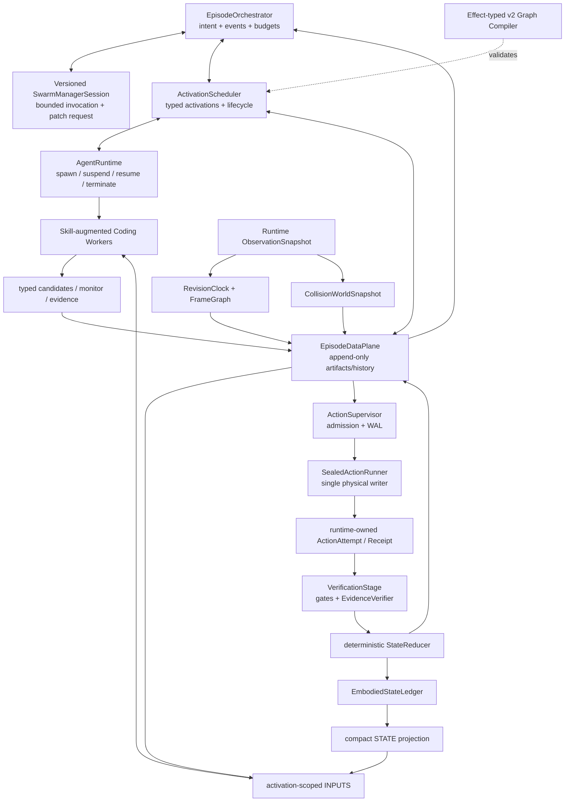

# RoboMEx M3.5：Causal Embodied Data Plane

> **实施入口（2026-07-21）**：本文保留完整数据面设计与研究依据；当前采用的简化落地边界、
> Elastic Graph 修订、Agent Swarm/Monitor 生命周期和分阶段代码计划，以
> [M3.5 Elastic Agent Swarm 实施计划](robomex_m35_elastic_swarm_implementation_plan.md)
> 为准。当前 v1 是冻结 baseline/迁移起点，不是目标 class graph；M3.5 平行建立 event-driven v2
> `EpisodeOrchestrator + ActivationScheduler + AgentRuntime + EpisodeDataPlane + single action writer`。
> 尤其是后文“整张 graph 完全冻结”或“唯一 executed prefix”的旧假设均不再成立：不可变的是
> committed activation/artifact/attempt/receipt history 与 admitted action；Agent roster update 不等于
> GraphPatch；MVP 的 global quiescence 最终升级为 affected-scope barrier。

> 状态：完整设计稿 v0.3（2026-07-21，已完成实现级审阅；通过 M3.5a0 failure census
> 与 runtime-evidence spike 后再冻结）。本里程碑位于 M3 Skill Library 与 M4
> 稳定性基线之间。它不是再增加一类 Agent，而是把 Agent Swarm 的物理数据流变成
> runtime 可验证、可失效、可恢复、可重放的系统。

## 0. 决策摘要

M3 的 v1 已经回答了“Manager 能否生成一张由受契约约束的 Coding Agent 组成的图”；
M3.5 要回答更难、也更接近论文贡献的问题：

> 当几何、姿态、轨迹、抓持关系和验证结论跨越语言通道、代码变量、Agent 边界、
> subgoal 边界与真实动作时，系统如何保存其**声明的表示语义、来源与可用条件**，
> 并阻止未解决的歧义静默进入动作？

因此 M3.5 的正式名称定为：

**Causal Embodied Data Plane（因果具身数据面）**，副标题为
**Declared-Semantics-Preserving Agentic Code-as-Policy**。

这里的 **causal** 指 runtime 显式记录“由哪个输入/动作产生、依赖哪些 revision、
哪些 effect 会使其失效”的工程因果链，不主张统计因果发现或反事实辨识。

完成 M3.5 后，RoboMEx 应满足五条总性质：

1. 物理量只能通过 closed schema、stamped semantic value、revision、lineage 与 validity
   进入下游动作；自然语言 claim 不能成为动作参数来源。
2. 瞬时观测、派生几何、运动计划、动作回执和跨 subgoal 物理状态具有不同有效期；
   不再用一个全局 epoch 同时杀死全部数据。
3. Agent、runtime telemetry 与 learned verifier 都只能提出 belief transition；只有
   deterministic `StateReducer` 能写入 episode ledger。机器不变量检查与概率证据判断分离。
4. recovery edge 不只匹配错误标签，还必须在当前 abstract belief 下 contract-admissible，
   并能重新生成路径上已失效的数据；这不等于保证真实几何或接触一定成功。
5. Agent 不能直接调用 raw world-changing API；它只能产生 sealed action spec 并提交
   admission layer，真正的 motion/gripper primitive 只由 deterministic runtime adapter 调用。

M3.5 不是通用共享内存，也不是把更多 trace 塞回 prompt。它由三个平面组成：

- **Embodied data plane**：typed artifacts、版本向量、transform/frame、lineage；
- **Workflow/control plane**：event-driven EpisodeOrchestrator、ActivationScheduler、Agent lifecycle、
  状态账本、确定性 reducer 与 effect-typed graph compiler；
- **Evolution plane boundary**：只定义 M5 将来可安全演化的配置空间，本阶段不在线学习。

## 1. 调研结论与取舍

### 1.1 相关系统到底解决了什么

| 系统 | 已解决的核心问题 | 数据流/状态机制 | M3.5 借鉴 | 不照搬的部分 |
|---|---|---|---|---|
| [CaP-X](https://arxiv.org/abs/2603.22435) / CaP-Agent0 | 代码执行后的多轮视觉反馈、visual differencing、ensemble、skill synthesis | persistent Python namespace + 当前 observation + stdout/stderr + 对话历史 | 每个动作后的真实反馈、视觉差分、成功轨迹结晶 | 旧点云/姿态可藏在 Python 变量中继续使用；没有 typed physical state、依赖失效或 plan identity |
| [Playful RATs](https://arxiv.org/abs/2606.19419) | proposer→planner→writer→verifier→diagnoser 的 play/evolve 闭环 | Pydantic 风格阶段记录、step verifier、failure/skill memory | first-failed-step、验证/诊断分离、raw log 与 distilled memory 分层、active re-perception | freshness 与 held state 主要靠 prompt/VLM 判断；物理 precondition/effect 不是 runtime invariant |
| [GaP](https://arxiv.org/abs/2607.05369) | 语言任务编译为 typed robot graph，canonical script 与严格图校验 | 子图内显式 `$ref`；跨子图按同名 output 取最近值；typed registry | 显式 ref、strict loader、canonical function、代码签名导出 schema、rehearsal | 同名隐式绑定、latest-wins、plain value cache、单一 `on_error`、无 causal freshness；当前文档也说明跨子图 field compatibility 尚未完全静态执行 |
| [EvoMAS：configuration evolution](https://arxiv.org/abs/2602.06511) | 在结构化配置空间演化 role/model/prompt/tools/topology | 配置池 + execution trace + experience memory；单组件 mutation；crossover 从一个 parent 整体继承 topology，再混合 node attributes | 为 M5 定义安全 genotype；结构池与经验记忆分离；reward 用 task/judge score 减 token/latency cost | 公开实现中的 Agent 数据传递仍主要是文本；不能先演化 topology，再期待物理语义自动正确 |
| [EvoMAS：execution-time workflows](https://arxiv.org/abs/2605.08769) | 根据执行中 task state 动态选择阶段性 Agent workflow | Planner–Evaluator–Updater 构造 structured textual task state；state-conditioned 三层 workflow adapter | 借鉴 deterministic Updater 与当前状态驱动的已编译 fragment 选择 | 相邻层全连接并聚合上游消息；其 GPT-4o-mini 实验是 compact proprietary API model，不能作为本地小模型证据；真机在线 REINFORCE 成本和风险过高 |
| [EvoMAS：Heuristics in the Loop](https://openreview.net/forum?id=0rJUulYnow) | 用 Rule/Gene Pool 与 curriculum 演化 agentic workflow | 经验规则、gene pool、逐级任务 | 仅作为 M5 memory/promotion 参考 | 不进入 M3.5 runtime，也不让在线 mutation 改写物理不变量 |

“EvoMAS”存在同名工作。本文后续使用的 **EvoMAS-config**、**EvoMAS-runtime** 是
RoboMEx 为消歧自定义的简称，不是原论文命名。

### 1.2 非 Agent 先例与真正的新意边界

M3.5 的组成件单独看都不是新概念：ROS messages/tf2 已有 typed、stamped frame data；
BehaviorTree.CPP 用 typed ports/blackboard 显式建模节点数据流；MoveIt Task Constructor
用 stage interface state/properties 组合 manipulation pipeline；PDDL/STRIPS 与
PDDLStream/TAMP 用 precondition/effect 连接离散状态和连续 sampler；runtime verification
监测执行假设；W3C PROV 与 event sourcing 记录 entity/activity lineage 和状态事件。

因此论文不能声称“首次提出 schema、effect、trajectory identity 或 event log”。可辩护的
贡献是：**把这些原则合成面向 coding-agent swarm 的统一 embodied contract calculus，
并实证其是否减少 LLM–code–agent–action 边界上的 silent embodied-semantic failure。**
它不是“重新实现 ROS + PDDL + typed blackboard”，差异在于 contract 必须贯穿 LLM 生成
代码、canonical builder、Agent edge、物理副作用与 evidence-based recovery。

### 1.3 Agentic 系统留下的共同缺口

这些工作分别优化了代码反馈、Agent 分工、图结构或 skill evolution，但都没有完整回答：

```text
哪个 observation 产生了这个点？
它在哪个坐标系、采用什么单位和 quaternion convention？
哪些物理动作会让它失效？
机器人现在是否仍持有那个物体？这个事实是谁验证的？
planner 验证的 IK 解是否就是 executor 实际执行的解？
失败后这条 recovery edge 在当前世界状态下是否仍成立？
```

ROS 的长期工程实践也支持这个方向：标准 `Header` 将 timestamp 与 `frame_id`
绑定到高层数据，`tf2` 按时间维护坐标系关系；ROS 2 文档还明确提醒，只有一个
`data` 字段的 primitive wrapper 缺少语义，不适合长期接口。M3.5 不复刻 ROS，
但采用同一原则：物理值必须是 stamped semantic type，而不是裸 list/dict。

### 1.4 研究定位与可证明边界

M3.5 相对现有工作的可检验主张是：

> In the agentic CaP systems examined here, reasoning around code execution is explicit,
> while physical state often remains implicit in prompts, Python variables, or untyped
> traces. RoboMEx preserves declared representation semantics, provenance, and validity
> conditions across LLM–code–agent–action boundaries, and prevents artifacts with
> unresolved schema, frame, freshness, state preconditions, or plan identity from
> silently reaching execution.

中文表述：**现有工作主要优化“谁在何时与谁协作”；RoboMEx 研究“经过这些边的数据
如何保持已声明且可检查的表示语义，并在不满足动作条件时 fail closed”。** 这里
`StateLedger` 是 runtime-authoritative belief，不是真实世界 oracle。

目标安全性质必须拆成静态结构保证与运行时 admission 保证，不能把动态 freshness 归因给
compiler：

\[
Compile(G) \Rightarrow \forall\ \text{action } n,\quad
inputs(n)\ \text{have unique compatible producers, and every path to }n
\text{ contains the required admission checks};
\]

\[
Execute(n,t) \Rightarrow
AdmissionChecks(inputs(n), state_t, revisions_t, plan_t)=pass.
\]

该性质依赖以下假设：schema 与 abstract effects 声明正确；revision clock 能观察相关变化；
关键路径只使用受 instrumentation 的 sealed builders/executors。未监测的外界移动仍可能
破坏 freshness；perception/evidence verifier 仍可能形成错误 belief；编译器不证明连续
几何、碰撞、接触动力学或任务必然成功。因此本文用 **execution-gated by construction**，
而不用 `executable by construction`。

## 2. 当前实现的失效证据

本设计不是抽象扩建，而是从 live run
`outputs/robomex_planner_live/20260720_132620` 反推出来的最小充分修复。

| ID | 当前现象 | 结构根因 | M3.5 对策 |
|---|---|---|---|
| D1 | Geo Agent 发布平铺 `center/extent/quaternion`，grasp helper 查找 `payload["obb"]`，于是 OBB 明明计算了却静默回退到点云统计量 | schema 只同名，没有字段级语义闭包；optional input 与 fallback 不可见 | `ObjectGeometry.v2` + strict validator + 显式 selection/degradation record |
| D2 | 一个错误的 `approach_dir_world` 实际装入完整 approach position，仍通过验证 | validator 只检查 3 个有限数，不检查 direction 的单位范数与语义 | semantic validator 检查 vector kind、norm、frame 与 producer method |
| D3 | pick subgoal 产出 `held_object_frame`，place subgoal 无法消费；`find_placement` contract 也没有该 input | 每个 graph 新建 `ArtifactStore`；没有 episode-level physical fluent；抓前预测还被误命名为“held” | 把预测改为 `GraspFrameCandidate`；抓后 evidence 产生 proposal，Reducer 更新 attachment belief |
| D4 | `failed_placement → place_affordance` 后立刻因 epoch 1 的 basket points 在 epoch 4 stale 而失败 | recovery 只校验 event label，不分析动作 effect 与输入 freshness | path-sensitive recovery compilation；必须先 refresh producer |
| D5 | transport/release primitives 都 converged，但物体已经滑落，executor 仍报告 success | primitive success 被误当成 world predicate；缺少 authoritative attachment/localization/relation belief | `ExecutionReceipt` 只报动作；EvidenceVerifier 分别提议 attachment、localization 与 closed relation，Reducer 唯一 commit |
| D6 | planner 对 Cartesian waypoint 求 IK 后丢弃 joints；executor 再通过 `goto_pose` 求另一遍 IK | `trajectory.v1` 表示“待重新解释的意图”，不是不可变可执行计划 | `MotionPlan.v2` 保存 sealed joint path/trajectory 与 start/world guards；executor 禁止重解 IK |
| D7 | 所有 artifact 都按同一个 observation epoch 失效 | snapshot、plan、historical evidence 与 episode belief 没有生命周期类型 | revision vector + validity class + dependency-aware invalidation |
| D8 | 现有 8 个跨节点 schema 中，只有 trajectory/affordance/execution evidence 有真实结构 validator；mask/points/verifier 仅验证 mapping，geometry/held 未注册 | nominal typing；未注册 schema 默认放行 | schema registry closed-world：未注册物理 schema 编译失败 |

直接证据：

- `robomex/authoring/artifacts.py`：当前 envelope、全局 epoch stale 规则、open registry；
- `robomex/authoring/graph_executor.py`：每个 subgoal graph 创建独立 store；
- `robomex/core/context.py`：已有 `StateFact`/`EvidenceTimeline`，但尚非 runtime 权威状态；
- `robomex/core/payload_specs.py`：只有三个真实 payload spec；
- `subgoal_01/authoring/swarm/node_events.jsonl`：placement failure 回到旧 affordance，
  下一条即 `stale_observation`；
- `subgoal_00/.../03_plan_motion_a1/turn_01.py` 与
  `subgoal_00/.../04_execute_grasp_a1/turn_00.py`：plan IK 与 execute IK 分离。

D1–D8 是一条 live episode 的机制性 case study，足以驱动 regression fixture，但不足以
证明它们是一般性主瓶颈。M3.5a0 必须先对多任务、多模型、多次 run 做 failure census，
按 `schema/frame/identity/freshness/state/plan/evidence` 封闭 taxonomy 标注自然失败，
再报告每类的 episode rate、action-opportunity rate 与置信区间。若 census 不支持广泛性，
论文主张应收窄为“防止一类高风险 silent failure”，而不是“Code-as-Policy 的核心瓶颈”。

### 2.1 Running design case：将盘子旁边的碗放到盘子上

M3.5 的 Manager、Graph、开放任务语义、封闭控制状态、Agent lifecycle、rendered motion
hypothesis、action video、在线 Monitor 与掉落恢复，统一通过
[`robomex_case_bowl_to_plate.md`](robomex_case_bowl_to_plate.md) 这一 running case
继续打磨。该案例不是手写冻结的 task graph；其控制语义与实施顺序已经进入
[`robomex_m35_elastic_swarm_implementation_plan.md`](robomex_m35_elastic_swarm_implementation_plan.md)。

案例 v0.3 不再保留“一次 ReactivePlanner subgoal 对应一张旧 Executor graph”的实现主干，而是
保留 Planner/Manager/Coding Worker 的语义角色，直接在 event-driven v2 上运行：
`EpisodeOrchestrator` 管 `SubgoalIntent` 与 lifecycle，`ActivationScheduler` 驱动 fixed-topology
bounded loop 和 typed outcome，episode data plane 保留跨 intent belief，single action writer 执行
sealed action。旧 v1 只作为 baseline 与 failure corpus。

**Elastic Graph** 的不可变边界也改为 committed history，而非线性 `executed prefix`。已经 commit
的 activation event、artifact、attempt 与 receipt，以及当前 admitted action 均不可删除、替换或
重解释；只有声明 Slot 中 inactive future region 可以通过 versioned GraphPatch 改变。在已声明
Slot/role/budget 内增减、休眠或唤醒 Agent 只是 roster update，不产生 graph revision。MVP 可以在
global quiescence patch；目标 runtime 使用 affected-scope barrier，不强迫无依赖的长期 Tracker/
Monitor service 停机。本文仍出现的 frozen-supergraph 描述仅作为旧 baseline/消融条件，不代表
full system。

同时，`SubgoalIntent`/success rubric 保持开放且可修订，只有用于 admission、状态一致性与
恢复路由的控制状态采用封闭语义。本文后续出现的 `inside/on_surface` 等 relation predicate
应据此理解为当前工作假设或控制投影，而不是所有自然语言任务的完整、固定定义。

## 3. 目标架构



`EpisodeDataPlane` 是逻辑边界，不要求第一版把所有对象塞进一个通用数据库。它统一 episode identity、
append-only history、artifact addressing 和 reducer replay；大点云/视频仍可放 sidecar。v1 的
per-subgoal `ArtifactStore` 可通过只读 adapter 进入评测，但不规定 v2 的地址或生命周期。

核心组件职责如下。

### 3.1 `RevisionClock`：把“时间”拆成相关物理域

现有 `observation_epoch` 同时扮演“动作次数”“世界版本”“观测新鲜度”，语义过载。
M3.5 引入 runtime-owned revision vector：

```yaml
revision:
  scene: 4
  robot.arm: 12
  robot.gripper: 3
  attachment: 2
  camera.front: 0
observation:
  id: obs_0018
  captured_at: 1784525734.86
```

- `scene`：外部物体关系或可见几何可能变化；
- `robot.arm`：joint/TCP state 变化；
- `robot.gripper`：开度、夹持命令或传感器状态变化；
- `attachment`：TCP 与物体的抓持关系变化；
- `camera.*`：相机外参或可动相机姿态变化；
- `observation.id`：一次成功采集的不可变 snapshot，而不是动作计数器。

每个 runtime primitive 声明**可能**影响的 domain。motion lease 一旦 admitted，即使
primitive 返回 `converged=false`、Python 随后抛错或 Agent 没有合法 `finish`，runtime
仍在进程内 `finally` 中保守推进这些 revision；进程级 crash 走后文 WAL reconciliation。
不能用软件事务回滚已经发生的物理动作。
第一版可对 `object_manipulation` 保守推进 `scene + attachment`，随后再细化到
object-level revision；正确性优先于最大复用率。

`get_observation()` 也必须纳入 runtime trace。`ObservationSnapshot.v1` 将同步的 RGB、
depth、intrinsics、extrinsics、joint/gripper state 绑定到同一 runtime-issued handle；mask
必须引用产生它的 image/snapshot。world builder 只能消费显式 snapshot，不得内部再次
观测并把 obs-A 的 mask 与 obs-B 的 depth 混合。

CuRobo 的 collision world 不能继续作为 API 对象里的隐藏 `_curobo_world_config`。
`CollisionWorldSnapshot.v1` 显式引用 source observation、参与建图的 masks/geometry、
robot/config revision 与 canonical content digest；`MotionPlan.v2` 必须绑定该 artifact ID
与 digest。这样 observation lineage 由 runtime 盖章，而不是由 Agent 自报字符串。

### 3.2 `ArtifactStore`：保存计算事实，不保存隐式世界状态

`TypedArtifact` 升级为 causal envelope。envelope 只描述 identity、lineage、observation、
revision、validity 与 quality；frame/unit 放在 payload 内的 `Point3Stamped`、
`Direction3Stamped`、`PoseStamped`、`TransformStamped` 等 semantic primitive 中，避免
复合 artifact 出现一个全局 unit/frame 与字段内标注互相冲突。示意字段：

```python
ArtifactEnvelope[T] = {
    "artifact_id": "art:<run_id>:<monotonic_seq>",
    "payload_digest": "sha256:<canonical-payload-and-blob-hashes>",
    "schema": "robomex.object_geometry.v2",
    "payload": T,
    "producer": {
        "run_id": "...", "subgoal_id": 0, "node_id": "estimate_geom",
        "attempt": 1, "skill_id": "estimate_object_geometry",
        "function_version": "source-hash",
    },
    "observation": {"id": "obs_0018", "captured_at": 1784525385.6},
    "depends_on_revisions": {"scene": 0, "camera.front": 0},
    "validity": {"class": "derived", "predicate": "dependencies_match"},
    "lineage": ["segment_soup.object_points@..."],
    "quality": {"confidence": 0.85, "uncertainty": {}, "method": "pca_obb"},
}
```

规则：

1. artifact payload 与 envelope 都由 builder 构造；Agent 只选择变量，不手抄数值；
2. `depends_on` 记录精确 artifact IDs，不能只记 producer 名；
3. node trace 记录实际消费的 artifact ID/revision，而不是仅保存压缩后的 payload；
4. 未注册 schema、未知字段、错误 semantic type/frame/unit/convention 均拒绝；
5. 核心物理链路禁止 `Any`/任意 dict escape hatch；debug metadata 可保持开放；
6. 主存储是 append-only `artifact_id -> immutable artifact`；graph-local alias 只解析到
   一次确定的 artifact ID，retry/version 不覆盖旧值；lineage 由 runtime 从实际 resolved
   handles 自动生成，Agent 不能手填；
7. episode store 的完整地址至少包含 `(run, subgoal, node, attempt, port)`；现有
   `producer.port` 只作为当前 graph view 内的局部 alias，禁止不同 subgoal 同名节点
   静默覆盖。跨 subgoal 的物理连续性走 StateLedger，不走“最近同名 artifact”。
8. `payload_digest/content_digest` 的 preimage 固定为
   `robomex-digest-v1 || schema-id+version || canonical semantic payload || referenced blob digests`。
   canonical payload 排除 digest 自身、run-scoped artifact/display ID、envelope ingest/log
   wall-clock 与随机 nonce；schema 声明为物理语义的 sensor capture timestamp 必须规范化并包含；
   mapping key 按 UTF-8 byte 排序，scalar float 用 finite IEEE-754 binary64 little-endian，array
   固定 dtype/shape/C-order/endianness 后取 raw bytes，blob 先独立 SHA-256。NaN/Inf 拒绝；
   execution-relevant guard/policy/world content digest 必须包含，lineage handle 用其 content
   digest 而非易变 ID。schema version 或 canonicalization version 改变必然改变 digest；
9. replay state hash 同样排除 wall-clock、run-scoped ID 与随机 nonce，只覆盖 canonical
   ledger current view 与 ordered semantic event contents；
10. `compact_json`/摘要只属于 prompt 与 debug presentation plane；machine payload 与
   `INPUTS` 始终保留原始 typed value。摘要不得反序列化后重新进入 ArtifactStore，
   runtime-stamped method/lineage 也不能由 Agent 自报覆盖。

### 3.3 生命周期与选择性失效

| validity class | 例子 | record integrity | action admissibility |
|---|---|---|---|
| `snapshot` | RGB、mask、point cloud | snapshot/blob digest 完整，永远可作历史证据 | source observation 与相关 scene/camera revision 满足 consumer policy |
| `derived` | OBB、shape fit、affordance | payload/lineage digest 完整 | 全部 action-relevant lineage 与相关 revision 满足 consumer policy |
| `plan` | IK / joint path | digest 完整、planner evidence 可重放 | start joints、world/scene、attachment、robot/config guards 匹配 |
| `action_receipt` | 动作尝试与回执 | immutable historical record | verifier 消费时需匹配 action ID 与 post-action revision |
| `episode_state` | held-object / relation belief | event log 完整 | 当前 reducer state machine 仍处于相应状态 |
| `session_static` | intrinsics、extrinsics、URDF、TCP calibration | digest 完整 | config hash 相同 |

这解决了两个相反错误：旧 OBB 在物体移动后必须 stale；attachment belief 与带 uncertainty
的 nominal/observed transform 不应仅因机械臂 revision 改变就被全局 epoch 杀死，但
attachment-affecting effect 或新反证仍可把它降级为 `unknown`。

### 3.4 `EmbodiedStateLedger`：跨 subgoal 的权威物理 fluent

StateLedger 是 episode-level、append-only、event-sourced。`StateFact` 可作为迁移
起点，但必须增加封闭状态机、revision、authority 与 invalidation。它按一次
`RoboMExAgent.run()` 创建，不能随 Agent 实例泄漏到下一 episode。最小 canonical state：

```yaml
robot:
  arm:
    commanded: {action_id: action_0041}
    observed: {joint_positions_rad: [...], revision: 12}
  gripper:
    commanded: {mode: close, action_id: action_0041}
    observed: {status: closed, width_m: 0.031, revision: 3}
entities:
  obj_017: {semantic_label: soup_can, track_id: track_9}
attachment:
  status: verified_held       # unknown|not_held|attempted|verified_held
  entity_id: obj_017
  nominal_tcp_T_object: [...] # pre-grasp candidate，不能当 observed truth
  observed_tcp_T_object: null # 有 post-lift pose + FK 才填写
  transform_quality: uncertain
  covariance: null
  grasp_candidate_id: grasp_affordance@...
  established_by: verify_lift.verifier_report@...
  supporting_evidence: [...]
  revision: 2
localization:
  obj_017:
    status: localized         # localized|unlocalized|ambiguous
    world_pose: {...}
    source_observation_id: obs_0019
    revision: 5
relations:
  obj_017:
    containment:
      target_entity_id: target_004
      value: unknown          # inside|outside|unknown
      revision: 1
    support:
      target_entity_id: table_001
      value: unknown          # on_surface|not_on_surface|unknown
      revision: 1
```

attachment、localization 与 relation 是三条正交状态轴。`held_by` 只能由 attachment 派生，
不能在 relations 中再存一份；`lost_object` 只能是 control-plane `failure_kind`，不是
attachment enum 或 relation predicate。relation key 固定为
`(subject_entity_id, family, target_entity_id)`，每个 family 内的 value 互斥，跨 family
可以同时成立（例如物体既 `inside(basket)` 又 `on_surface(basket_bottom)`）。

状态权威矩阵：

| 角色 | 可以发布 | ledger 写权限 |
|---|---|---|
| Grounding / Geometry / Affordance | measurement、estimate、candidate | 无 |
| Motion Planner | plan 与 feasibility evidence | 无 |
| Action Executor / runtime trace | command、telemetry、runtime-owned receipt、effect proposal | 无；命令已发送不等于 gripper/抓取/放置已成立 |
| deterministic gate | digest、revision、joint/gripper telemetry 的机器判定与 proposal | 无 |
| learned `EvidenceVerifier` | `passed/failed/uncertain`、predicate assessment、evidence refs 与 proposal | 无；可以判断错，也必须允许 uncertain |
| `StateReducer` | 校验 proposal，应用封闭 transition，解决 contradiction，推进 canonical state | **唯一写入口** |

重要重命名：当前抓取前由 affordance 计算的 `held_object_frame` 不是“已持有”事实，
而是 **`GraspFrameCandidate`**。只有 `close + lift + gripper/visual evidence` 通过后，
Reducer 才把 attachment 提升为 `verified_held`。它保留
`nominal_tcp_T_object`，但不能把 candidate transform 直接改名为 observed transform。
只有 post-lift object pose 与 robot FK 可观测时，才估计 `observed_tcp_T_object` 与
covariance；否则 `transform_quality=uncertain`。这一步对论文叙事也重要：系统明确区分
prediction、execution 与 verified belief，且“held=true”不等于抓持变换精确。
placement 必须把 uncertainty 纳入 margin，必要时用 wrist/scene evidence 再校正。

`entity_id` 是 episode 内稳定 handle，不等于类别字符串。每次 re-grounding 必须显式
声明“继续关联旧 handle”或“创建新 handle”及其证据；歧义时进入
`wrong_grounding` 或 `unknown`，不能因为两个 mask 都叫 `soup_can` 就自动继承
held/relation state。

Verifier/runtime 产生的是封闭 `StateTransitionProposal`；Reducer 只接受 schema 中允许的 key、
合法状态迁移和匹配 action/evidence revision 的 proposal。冲突证据追加到 ledger，按
规则降为 `unknown/uncertain`，不能让模型用任意 `state_delta` 覆盖历史。

首版 attachment 状态机必须实现而不是停在示意图：

| 当前状态 | 触发与证据 | Reducer 下一状态 | 说明 |
|---|---|---|---|
| `not_held/unknown` | close/lift `ActionAttempt` admitted | `attempted` | 仅记录尝试，不宣布成功 |
| `attempted` | fresh gripper + visual evidence passed | `verified_held` | nominal transform 仍可 uncertain |
| `attempted` | evidence failed / contradictory | `not_held` 或 `unknown` | 无充分反证时保守 unknown |
| `verified_held` | arm transport receipt completed | `verified_held` 或 `unknown` | 只有 telemetry 不足以证明未滑落；按 contract 决定是否要求 checkpoint |
| `verified_held` | open command admitted | `unknown` | 物理副作用已可能发生，不能继续保留 held |
| `unknown` | post-settle evidence confirms detached + relation | `not_held` + localization/relation update | `released` 是历史 event，不是持久 attachment state |
| 任意 | evidence confirms detached and localized elsewhere | `not_held`；localization=`localized` | relation 由独立 proposal 更新，recovery 可 reacquire |
| 任意 | evidence confirms detached but cannot localize | `not_held`；localization=`unlocalized` | relation 全部置 `unknown`，先 re-ground |
| 任意 | evidence cannot decide attachment or localization | attachment=`unknown`；localization=`ambiguous` | 先 active verification，不猜 attachment/location |

`open_gripper()` 返回或命令完成只能形成 command/telemetry proposal，不能直接证明实际
open；证据矛盾时按封闭优先级降级为 `unknown`，而不是让某个 Agent 任意选一方。

relation 也使用封闭 proposal：

```yaml
subject_entity_id: obj_017
family: containment
target_entity_id: target_004
proposed_value: outside
source_observation_id: obs_0024
action_id: action_0042
evidence_refs: [...]
confidence: 0.94
```

Reducer 校验 entity identity、observation/action revision 与 family enum 后才 append；新值
只替换同一 `(subject, family, target)` 的 current view，并保留历史 event。定位变为
`unlocalized/ambiguous` 时，该 subject 的 action-facing relation views 一律变成 `unknown`。

### 3.5 `FrameGraph`：坐标变换必须带时间和来源

第一版不需要实现完整 ROS tf2，但接口应遵循同类不变量：

- pose/vector/point 均携带 `frame_id` 与 capture time / revision；
- transform 以 `T_parent_child` 明确方向，禁止含糊的 `offset`；
- quaternion 字段名包含 convention（统一 wire format `wxyz`）；
- vector 与 point 使用不同 semantic type，不能互换；
- nominal/observed `T_tcp_object` 随 attachment belief 持久并带 quality/covariance；
  world-frame object pose 随 robot transport 更新；
- 任何跨 frame 消费必须记录 transform artifact ID，便于 replay。

## 4. 核心 schema 闭包

M3.5 先给现有 8 个 schema 补全 validator，再迁移核心物理链路。建议目标集合：

```text
robomex.observation_snapshot.v1
robomex.collision_world_snapshot.v1
robomex.mask.v1
robomex.points3d.v1
robomex.object_geometry.v2
robomex.affordance.v2
robomex.motion_plan.v2
robomex.gripper_command.v1
robomex.action_attempt.v1
robomex.primitive_receipt.v1
robomex.execution_receipt.v2
robomex.verifier.v2
robomex.state_transition_proposal.v1
robomex.grasp_frame_candidate.v1
robomex.alignment_error.v1
```

attachment/localization/relation current views 属于 StateLedger schema，不再作为任意节点
可发布的 artifact；节点只能发布 closed `StateTransitionProposal.v1`。
legacy `object_geometry.v1/trajectory.v1/execution_evidence.v1/held_object_frame.v1`
只允许通过显式 adapter 进入非动作链路；迁移完成后，admission/runtime adapter 的核心输入不得
包含 legacy schema。

### 4.1 `ObjectGeometry.v2`

最小结构：

```yaml
entity_id: obj_017
semantic_label: soup_can
track_id: track_9
source_observation_id: obs_0018
visible_support:
  points_artifact_id: segment_soup.object_points@...
  inlier_fraction_of_observed_points: 0.88
  visible_azimuth_span_rad: 2.1
obb:
  center: {xyz_m: [x, y, z], frame_id: world, observation_id: obs_0018}
  full_extents_m: [ex, ey, ez]
  rotation_world_from_obb: [[...], [...], [...]]
  extent_convention: full_length
  fit_residual_m: 0.006
shape_model:
  type: upright_cylinder
  center_xy_m: [x, y]
  radius_m: 0.033
  axis: {xyz_unit: [0, 0, 1], frame_id: world, observation_id: obs_0018}
  fit_residual_m: 0.004
center_selection:
  selected_center_xyz_m: [x, y, z]
  xy_source: shape_model.center_xy_m
  z_source: obb.center.z
  reason: partial_view_surface_bias
```

`entity_id` 是 episode stable handle，`semantic_label` 只是语言类别。单视角不能声称知道
完整物体 coverage，因此这里只报告分母明确的 observed-support 统计。validator 分两层：

- **structural validator**：有限值、正 extent/radius、rotation 正交与行列式、axis 单位
  范数、字段闭包、semantic primitive 的 frame/observation 一致；
- **policy selector**：按 method-specific residual/visible-support/uncertainty threshold 判断
  是否足以进入某类 action，并显式给出 `exact/degraded/rejected`。

consumer 不能再用 `.get("obb") or median(points)` 静默降级；不同方法的 threshold 必须
版本化，不能用无定义的“fit quality 有界”。

### 4.2 `Affordance.v2`

```yaml
affordance_id: grasp_soup_top_01
action_type: grasp
object_entity_id: obj_017
target_pose:
  position_xyz_m: [x, y, z]
  quaternion_wxyz: [w, x, y, z]
  frame_id: world
approach:
  direction_world_unit: [0, 0, -1]
  distance_m: 0.08
strategy: top_down_cylinder
source_geometry_id: estimate_geom.object_geometry@...
selection:
  status: exact            # exact|degraded
  method: cylinder_axis_center
  degradation_reason: null
  confidence: 0.86
predicted_tcp_T_object: {matrix: [...], parent_frame: tcp, child_frame: obj_017}
```

方向向量必须近似单位向量；position 与 direction 使用不同字段类型；quaternion 必须
近似单位长度；fallback 必须以 `degraded + reason + confidence` 显式出现。若提供的
geometry 格式错误，必须报 `invalid_geometry`，不能假装“optional input 不存在”。

placement 不能复用一个含糊 `source_geometry_id`。其 schema 至少闭合为：

```yaml
affordance_id: place_obj_017_in_target_004
action_type: place
object_entity_id: obj_017
target_entity_id: target_004
held_state_revision: 2
object_geometry_id: object_geom@...
target_geometry_id: basket_geom@...
desired_relation: inside
desired_region_id: basket_interior@...
release_tcp_pose: {position_xyz_m: [...], quaternion_wxyz: [...], frame_id: world}
margins:
  clearance_m: 0.015
  support_m: 0.010
  containment_m: 0.012
selection: {status: exact, method: held_frame_compensation, confidence: 0.81}
```

它必须显式依赖 attachment belief revision、object/target identity 与两侧 geometry，才能
修复当前 `held_object_frame` 在 subgoal 间丢失以及多个同类 can 错绑的问题。

### 4.3 `MotionPlan.v2`

```yaml
plan_id: plan_place_0007
content_digest: sha256:...
plan_kind: descend_to_release_pose
source_affordance_id: place_affordance@...
planner:
  backend: curobo
  version: "..."
  robot_model_hash: "..."
tcp_frame_id: panda_hand
collision_world:
  artifact_id: collision_world@...
  content_digest: sha256:...
guards:
  joint_names: [panda_joint1, ...]
  start_joint_positions_rad: [...]
  max_start_deviation_rad: 0.02
  depends_on_revisions: {scene: 1, attachment: 2}
  config_hash: "..."
motion:
  representation: joint_path       # 当前 wrapper 尚不是 timed trajectory
  joint_names: [...]
  positions: [[...], [...]]
  execution_policy: {subsample: 1, mode: blocking_waypoint}
planning_evidence:
  requested_tcp_goal: {...}
  solver_tolerances:
    position_xyz_m: [0.010, 0.010, 0.050]
    rotation_rad: 0.08
  achieved_terminal_fk: {...}
  terminal_residual: {xyz_m: [...], rotation_rad: 0.04}
constraints:
  min_collision_margin_m: 0.012
  max_execution_time_s: 12.0
```

首版 `MotionPlan.v2` **严格表示一段连续 arm motion**。transport-to-hover、correction、
descend、retreat 分别规划和执行；open/close、settle wait、active observation 与 verification
都是独立 graph node，不能塞进一个假装原子的 gripper schedule。未来若确有需要，可另设
deterministic `ActionProgram`，但不属于 M3.5 首版。

当前 CuRobo wrapper 只返回 `(T, 7)` joint positions，`execute_joint_trajectory()` 逐 waypoint
blocking 且允许 `subsample`，所以此处诚实命名为 `joint_path`。M3.5d 要么扩展 integration
保留 velocity/time 并由 controller 遵守，才升级为 `joint_trajectory`；要么固定并记录 path
execution policy。任何 subsample/path 修改都会改变 digest，必须拒绝，不能宣称“原样执行”
却在 executor 端改路径。

`plan_id` 只是可读 handle，真正 identity 是 runtime seal 后的 `content_digest`。起点检查
同时比较 joint name/order、数值向量与 tolerance；同名 plan 篡改 joints 仍会被拒绝。
若 start state、collision-world digest 或 dependency revision 不匹配，runtime 发出
`stale_plan/replan_required`；runtime adapter 不得重新调用 IK 解释原 pose。solver 的 requested
goal、逐轴 tolerance、achieved terminal FK 和 residual 必须成为 evidence，避免把放宽 Z
误实现为 XY 同时放宽却仍记录 planner success。

#### `GripperCommand.v1`

open/close 虽不属于 `MotionPlan`，仍是可能改变世界的 sealed action spec：

```yaml
command_id: gripper_open_0042
content_digest: sha256:...
mode: open                    # open|close
target_width_m: 0.08
max_effort_n: null
timeout_s: 2.0
guards:
  gripper_revision: 3
  attachment_status: verified_held
possibly_affected_revisions: [robot.gripper, attachment, scene]
```

它与 `MotionPlan.v2` 共用 `ActionAttempt → PrimitiveReceipt → ExecutionReceipt` protocol。
Agent 不能绕过 sealed command 直接把裸 `open_gripper()` 调用写进未记账代码；命令被
admit 后即使返回值为空或后续 block 崩溃，也必须保守更新相关 revisions/belief。

### 4.4 `ExecutionReceipt.v2`

`ExecutionReceipt` 必须由 runtime trace 生成，而不是由 Executor Agent 自报。在获取
motion lease 且原子复查 guards 后，runtime 先持久化 `ActionAttempt.v1`；每个 primitive
return/exception 都立即追加 `PrimitiveReceipt.v1`。对同一进程内的 block exception 或
`finish` 非法，`finally` 合成 `partial/unknown` receipt、推进可能受影响的 revisions，并把
attachment/gripper belief 保守降级。示例：

```yaml
action_id: action_0042
effect_id: effect_0042_runtime
action_spec: {type: motion_plan, artifact_id: plan_place.motion_plan@..., content_digest: sha256:...}
display_plan_id: plan_place_0007       # 非 identity source
attempt_status: admitted
primitive_receipts:
  - {primitive: execute_joint_path, status: returned, converged: false, waypoint_range: [0, 63]}
executed_waypoint_range: [0, 63]
execution_policy: {subsample: 1, mode: blocking_waypoint}
actual_joint_trace_artifact: null
telemetry_coverage: terminal_only
tracking:
  max_error_rad: null
  first_divergence_index: unknown
terminal_robot_state: {...}
runtime_status: partial             # rejected|completed|partial|unknown|indeterminate_after_crash|indeterminate_after_timeout
abort_reason: primitive_not_converged
possibly_affected_revisions: [robot.arm, scene, attachment]
proposed_state_effects: [attachment_unknown]
```

`runtime_status=completed` 只表示该单段命令链完成，不等于物体已抓住或已放好。现有 API
只有 terminal/return evidence 时，不得虚构 actual trace、tracking error 或 controller timing；
M3.5d 必须先增加 joint sampling，才把这些字段纳入 live quantitative gate。primitive 正常
return 但 `converged=false` 也不能被 trace wrapper 记为 succeeded。

`finally` **不等于 crash safety**：它覆盖不了 SIGKILL、断电、API 永久卡死或主机重启。
因此 attempt/receipt 必须写入 durable WAL，首版 durability boundary 固定为：

```text
append ActionAttempt(admitted) + durable flush
→ 才允许调用第一个 raw primitive
→ 每个 primitive return/exception 后 append PrimitiveReceipt + durable flush
→ append terminal ExecutionReceipt + conservative revision proposal + durable flush
→ Reducer append canonical state/revision transition keyed by effect_id + durable flush
```

M3.5 不声称 physical exactly-once。相同 attempt ID 的日志投递可幂等，但 crash 后绝不能
因为“没有 completed receipt”就自动重放同一物理命令。

另由 runtime supervisor（不与可能卡死的 API 调用共享同一控制流）监控 lease heartbeat/
deadline；超时后请求 controller stop/hold，记录 `indeterminate_after_timeout` 并关闭新
admission。只有 quiescence + fresh observation gate 通过才恢复；若 controller 无法确认
停止则保持 blocked 并要求 operator recovery。

### 4.5 `Verifier.v2`

`VerificationStage` 包含两类 authority 不同的组件：deterministic gate 检查 digest、revision、
joint order、terminal telemetry 等机器不变量；learned/VLM `EvidenceVerifier` 评价
`attachment/localization/inside/on_surface` 等未完全可观测 predicate，并允许 `uncertain`。
两者都只发布 proposal。

```yaml
predicate: inside(obj_017, target_004)
outcome: failed            # passed|failed|uncertain
confidence: 0.94
evidence_refs: [...]
action_id: action_0042
first_failed_phase: transport
physical_assessment:
  gripper: open
  attachment: not_held
  localization: {entity_id: obj_017, status: localized}
  relations:
    - {family: containment, target: target_004, value: outside}
    - {family: support, target: table_001, value: on_surface}
state_transition_proposal:
  set_attachment: not_held
  set_localization: {entity_id: obj_017, status: localized, world_pose: {...}}
  set_relations:
    - {subject: obj_017, family: containment, target: target_004, value: outside}
    - {subject: obj_017, family: support, target: table_001, value: on_surface}
failure_kind: failed_placement
recommended_recovery: reacquire_object
```

`failure_kind` 负责 control routing，`physical_assessment/state_transition_proposal` 负责状态连续性；
两者不能再压缩成一个粗粒度字符串。

### 4.6 `AlignmentError.v1`

用于精细操作闭环，严格区分“测得的误差”与“要执行的动作”：

```yaml
source_artifact_id: held_or_tool_geometry@...
target_artifact_id: basket_or_slot_geometry@...
expressed_in_frame: target
translation_error_m: [dx, dy, dz]
rotation_error_axis_angle_rad: [rx, ry, rz]
uncertainty: {translation_std_m: 0.004, rotation_std_rad: 0.05}
tolerance: {translation_m: 0.006, rotation_rad: 0.08}
status: correction_required   # within_tolerance|correction_required|unobservable
```

它不能直接进入 executor；bounded correction planner 根据 skill contract 的最大平移/
旋转、碰撞约束和当前 joint state 生成新的 `MotionPlan.v2`。

## 5. Effect-typed contracts 与 graph compiler

### 5.1 skill contract 增量

在现有 role/capabilities/ports/budget/exit_conditions/functions 之上增加：

```yaml
state_contract:
  requires:
    - attachment.status == verified_held
  effects:
    - robot.arm
    - scene
  proposes:
    - attachment.status := unknown
  invalidates:
    - type: plan
      scope: robot.arm
  establishes_on_verified_success:
    - relation(object_entity, target_entity) == inside
```

原则：

- `capabilities` 回答“允许调用什么 API”；
- `state_contract` 回答“调用前世界必须满足什么、调用后哪些事实可能变化”；
- deterministic runtime effects 与 verifier-only physical effects 必须分开；
- function signature 从真实 Python type hints 导出，contract 只补 frame/unit/effect；
- critical precondition 不再只写在 SKILL.md prose。

从 M3.5 起，上述 `capabilities` 对 Agent 只暴露 perception、planning、builder 与
`submit_sealed_action`；raw `goto_pose/execute_joint_trajectory/open_gripper/close_gripper`
等 world-changing capability 只存在于 runtime adapter。`ActionExecutor` 作为 graph role
仍可用，但其 Agent 代码只能选择、构造或在 admission 前修复 spec，不能作为“兜底”绕过
digest、write-ahead attempt 或 receipt。

### 5.2 recovery edge 增量

```yaml
- from: verify_place
  to: refresh_target
  on: failed_placement
  guard: {op: eq, path: attachment.status, value: verified_held}
  refreshes: [target_geometry]

- from: verify_place
  to: reacquire_object
  on: failed_placement
  bindings:
    object_entity: {from_state: attachment.entity_id}
  guard:
    op: and
    args:
      - {op: eq, path: attachment.status, value: not_held}
      - {op: eq, path: {root: localization, entity: $object_entity, field: status}, value: localized}
  refreshes: [object_geometry, grasp_affordance]

- from: verify_place
  to: relocalize_object
  on: failed_placement
  bindings:
    object_entity: {from_state: attachment.entity_id}
  guard:
    op: and
    args:
      - {op: eq, path: attachment.status, value: not_held}
      - {op: in, path: {root: localization, entity: $object_entity, field: status}, values: [unlocalized, ambiguous]}
  refreshes: [object_mask, object_geometry]

- from: verify_place
  to: verify_attachment
  on: failed_placement
  guard: {op: eq, path: attachment.status, value: unknown}
  refreshes: [attachment_evidence]
```

第一版 guard 是 typed AST（仅 `eq/in/and/or/not`、catalog path 与 enum literal），不接受
任意 Python/字符串 eval。Manager 只能从 catalog 选择 predicate 与预声明 graph fragment，
不能发明状态 key 或执行期生成新 topology。

entity-indexed path 不允许 `localization.object.status` 这类伪字段。每个 `$entity` 必须在
edge `bindings` 中显式绑定到唯一 node input artifact field 或 frozen state field（如
`attachment.entity_id`）；compiler 检查 type、dominance 与可能为空的分支。运行时先在
同一 frozen ledger snapshot 解析 bindings，再求 guard；未绑定/歧义/null 必须走显式
branch 或产生 `binding_resolution_failed`，不能默认取“最近一个同类物体”。

这要求把当前 edge 唯一键从 `(source, on)` 扩展为 `(source, on, guard)`：允许同一
event 按物理状态分流，但编译器必须证明 guards 在有限 abstract state 上两两互斥，
并要求一个显式 default 或对声明状态穷尽覆盖。运行时在 frozen ledger snapshot 上必须
恰好一个 guard 命中；零命中产生 `no_guard_match`，多命中产生
`ambiguous_recovery`，均 fail closed，绝不 first-match。

这不是只改 YAML。当前 v1 `SubgoalGraphSpec.validate()` 禁止同一 `(source, event)` 多边，
`SubgoalGraphExecutor._edge()` 只取第一条；它们作为 baseline 冻结，用来证明为什么目标内核不能
继续建立在 first-match cursor 上。v2 `ElasticGraphSpec/Compiler` 编译 guarded branch set，
`ActivationScheduler` 在同一 immutable ledger snapshot 上求唯一匹配并发出 activation；legacy
无 guard edge 只通过外部 outcome adapter 参与对比，不规定 v2 内部 schema。

动态图有明确 event boundary：Manager 初次 author/compile 后 sleep；普通 outcome、bounded loop 与
Agent lifecycle 由 EpisodeOrchestrator/ActivationScheduler 处理。Manager 在已声明
Slot/role/budget 中增加候选 Agent、暂停 critic 或终止临时 worker 是 **RosterUpdate**，不改 topology、
不增加 graph revision。只有需要填充或替换声明的 inactive future control/dataflow region 时，才提交
带匹配 base revision 的 **GraphPatch**，经 compiler 校验后原子产生新 digest/revision。

Patch 不依赖线性 `executed prefix`：所有 committed activation events、published artifacts、attempts
和 receipts 永久保留，new revision 不得重解释它们；admitted action、未声明区域和 safety contract
也不可修改。MVP 可以只在全局无 running activation/action 时 patch。目标实现采用
**affected-scope barrier**：被替换 region、其 causal dependents 和 single physical writer 没有
running/admitted work 或未决 output reservation 即可，不相关的 Tracker/Monitor service 可继续运行。
跨 episode learned promotion/evolution 与不受限 topology mutation 仍属于 M5。

### 5.3 编译期必须新增的分析

1. **Schema closure**：producer/consumer schema 与 semantic primitive 兼容；
2. **Outcome-sensitive availability**：分别传播 must/may artifact set；只有相应 outcome
   原子发布的 output 才进入 must，不能把“producer 到达过”误当成“output 已存在”；
3. **Validity flow**：world-changing node 之后，后继与 recovery 所需 artifact 是否仍 valid；
4. **State precondition**：到达节点的所有可行状态都满足 `requires`；
5. **Recovery admissibility**：恢复路径在 abstract contract 上重新建立 effect 破坏的前置
   条件；不声称证明真实物理可行；
6. **Verification post-dominance**：提出 attachment/localization/containment/support effect 的 action，
   所有相关 continuation path 都必须被匹配 predicate 的 EvidenceVerifier post-dominate；
   robot-only effect 可由 runtime receipt/proprioceptive deterministic gate 闭合；
7. **Sealed fallback**：关键链路只允许发布 sealed canonical-builder 返回值；其 fallback
   必须变成 typed degradation/outcome。任意 Python 内部行为不能被静态完全证明，AST lint
   只是辅助；
8. **Plan protocol link**：静态检查 `MotionPlan.v2 → SealedActionRunner → ExecutionReceipt.v2` schema/
   link；digest、joint start 与 revision identity 是 motion lease 内的运行时原子检查；
9. **Guard determinism**：同 event 多条 guard edge 两两互斥且对声明的可达状态完备；
10. **Bounded recovery**：对 `(node, abstract_state, remaining_recovery_budget)` 做有限
    fixpoint；无预算仍循环、无状态进展 cycle 或无法到 terminal 的 branch 编译失败；
11. **Activation isolation**：可能重叠的 read-only candidate/service activation 必须消费 immutable
    refs、拥有隔离 namespace 与不冲突的 output reservation；world-changing activation 全部汇聚到
    single action writer。

抽象域首版固定为：`attachment ∈ {not_held, attempted, verified_held, unknown}`、
`localization ∈ {localized, unlocalized, ambiguous}`、containment/support family 的封闭
enum、`gripper_observed ∈ {open, closed, unknown}`、每个 required artifact 的
`admissibility ∈ {valid, stale, unknown, absent}`、revision equality 与 remaining budget。
transfer 由 skill contract/outcome 定义；branch join 对 may set 取并、must set 取交，对冲突
fluent 提升为 `unknown`。恢复循环在有界 budget 上求 fixpoint。v2 允许多个 Agent/service 同时处于
live/suspended/running 生命周期，但第一版可以串行执行 candidate code；以后只有通过 activation
isolation 检查的 read-only branches 才并发。真实动作始终由 single writer 串行 admission。
当前 graph 的“所有 world-changing node 必须直接连接 Hard Verifier”规则也应替换为上述
effect-aware closure：robot-only action 直接接 deterministic gate；relation-effect action
则要求 EvidenceVerifier 在相关 continuation 上 post-dominate。这样不会让每个微调或
return-home 都额外烧一次 VLM，同时不放松 object relation 的验证。

本轮 live graph 的：

```text
verify_place --failed_placement--> place_affordance
```

应在编译期被拒绝：`release_at` 的 abstract effects 已让旧 basket points 可能 stale，
而无 guard 的 `failed_placement` 边必须覆盖 attachment/localization/relation 的所有可达
belief；它既未 refresh target，也未在 not-held 分支重新建立 held precondition。实际 belief
由运行时 verifier proposal 决定走哪一条已静态验证的 guarded edge。

### 5.4 运行期事务顺序

普通计算节点与物理动作必须采用不同 commit 语义。

纯计算/Agent 节点按事务执行：

```text
resolve artifact IDs + state snapshot
→ validate schema / validity / state preconditions
→ run specialist or canonical function
→ validate complete output batch
→ atomically publish artifacts
→ emit artifact lineage + revision diff + state diff
→ route typed outcome under current state guard
```

物理动作不可回滚，按 write-ahead protocol 执行：

```text
resolve sealed MotionPlan/GripperCommand + freeze ledger snapshot
→ acquire motion lease
→ atomically recheck digest + declared guards（motion: start-joints/world/revision；
  gripper: gripper/state revision）（TOCTOU gate）
→ persist ActionAttempt(admitted) before first physical primitive
→ after every primitive return/exception, append runtime-owned PrimitiveReceipt immediately
→ in-process finally: synthesize completed/partial/unknown ExecutionReceipt
→ conservatively advance every possibly affected revision
→ StateReducer applies closed telemetry/effect proposal; uncertain side effects become unknown
→ optional EvidenceVerifier proposes relation transition; Reducer alone commits
→ route typed outcome with the resulting frozen state snapshot
```

Agent 派生 output batch 仍可全部拒绝；runtime action log 与保守 revision 推进不能依赖 Agent
成功 `finish`。event append 需幂等 event ID，并覆盖“动作后、ledger commit 前进程崩溃”的
replay case，避免机器人已经 open 而 ledger 仍保留 `verified_held`。

启动与 motion-lease 恢复必须先做 reconciliation：扫描所有
`ActionAttempt(status=admitted)` 且没有 terminal receipt 的 orphan attempt；runtime 为其
追加 `ExecutionReceipt(status=indeterminate_after_crash)`，按 sealed spec 的
`possibly_affected_revisions` 保守推进 revision，并将 attachment/gripper/scene-dependent
belief 与 plans 降为 `unknown/stale`。随后进入 recovery mode：确认 controller 已
idle/stopped，采集 fresh robot + scene `ObservationSnapshot`，通过 deterministic safety
gate 后才重新开放 admission；若无法确认静止/安全状态则保持 blocked，要求 operator
recovery。这个 protocol 处理的是“不知道动作做到了哪里”，不猜 completed，也不偷偷 retry。

reconciliation 还必须扫描第二类半提交：已有 durable terminal receipt，但没有同
`effect_id` 的 Reducer commit。runtime 以 `action_id/effect_id` 幂等重放 receipt 中的
conservative revision proposal 与 closed reducer transition；若 commit 已存在则 no-op。
因此 uniqueness key/commit marker 是 protocol 的一部分，不能只靠 state hash 猜测是否应用。
这闭合了“terminal receipt 已落盘、Reducer flush 前崩溃”的窗口。

## 6. 面向小模型的接口

小模型不应负责在长 prompt 中维护物理世界。每个 leaf 只看到：

```python
INPUTS = {                 # 已验证、当前可用的 edge-scoped artifact
    "target_geometry": ...,
    "motion_plan": ...,
}

STATE = {                  # runtime 生成的 task-relevant compact projection
    "attachment": {"entity_id": "obj_017", "semantic_label": "soup_can",
                   "status": "verified_held", "transform_quality": "uncertain"},
    "target": {"entity_id": "target_004", "semantic_label": "basket"},
    "target_geometry": {"status": "stale", "reason": "scene revision changed"},
    "allowed_recoveries": ["refresh_target", "reacquire_object"],  # compiled edges only
}
```

并直接使用预绑定 builder/function：

- runtime 负责精确 copying、frame conversion、schema validation、freshness 与 state reducer；
- Agent 负责选择 strategy、有限参数与 recovery class；
- “向左一点/向右一点/绕轴微调”先由 perception/geometry 产生 typed alignment error，
  Agent 只选 correction class，canonical planner 直接消费误差变量生成 bounded plan；
- 数值结果通过 `result_var` 发布，不通过自然语言重写；
- 编译错误给局部 Manager 修复，不让 leaf 用 token 猜 contract；
- full trace 只进 artifact/debug view，不默认塞给每个 Agent。

Action leaf 所见的 canonical function 只返回 sealed `MotionPlan/GripperCommand` 或提交该
spec；沙箱 AST/capability gate 对任何 raw world-changing primitive fail closed。fallback
只能修 spec 后重新 admission，不能直接动作。

`allowed_recoveries` 是 compiler 对当前已声明 edge 的投影，不是让模型在执行时创造新
fragment。小模型只在有限、已编译选项中选择；guard 仍由 runtime 对 ledger snapshot
确定性求值。

这才是“小模型也能用”的机制性解释：不是声称小模型拥有更强物理直觉，而是把
记账、复制、时序一致性和安全守卫从语言模型移到确定性 runtime。

## 7. Active perception 与恢复状态机

M3.5 首版提供五个可复用 graph fragment，而不是固化一张 task graph：

1. **pre-grasp refresh**：目标相关 revision 变化时重新 grounding/geometry；
2. **post-lift verify**：根据 evidence proposal 把 attachment belief 提升为
   `verified_held` 或降级为 `not_held/unknown`；
3. **transport-to-hover checkpoint**：先执行独立 hover plan，再验证仍为 held；
4. **placement-hover refresh/correct**：用新 observation 产生 `AlignmentError`，从当前
   robot state 构造一个带**新 digest** 的 bounded XY/yaw correction 或 descend plan；
5. **post-release settle verify**：独立 open/wait 后判断最终 relation，并提议
   attachment、localization、containment/support 三轴 transition。

placement 不再是一条“transport→release”后才看结果的长 action。它拆成：

```text
plan(transport_to_hover) → execute single arm motion → verify held
→ fresh target grounding + AlignmentError(target frame)
→ [plan(bounded correction) → execute → verify/refresh] × at most 2
→ plan(descend_to_release_pose) → execute single arm motion
→ open-gripper ActionAttempt → settle wait → verify relation
→ plan(retreat) → execute single arm motion
```

`AlignmentError.v1` 至少包含 source/target artifact IDs、target-frame translation、axis-angle
rotation、uncertainty 与 stop tolerance。旧 plan 不允许原地 patch；每次微调都从当前
joint/revision/world snapshot 产生新 plan + digest，循环受 `max_alignment_corrections`
（首版 2）限制。这样图中
的“左一点、右一点、稍微 rotate”来自新物理证据，而不是 LLM 猜一个位姿字面量。

核心恢复表：

| Evidence outcome + ledger belief | 合法恢复 | 非法恢复 |
|---|---|---|
| `failed_placement + verified_held` | refresh target → new affordance → replan transport | 重新 close gripper、复用旧 target points |
| `failed_placement + not_held + localized` | reacquire → refresh target → replace | 直接回 place affordance |
| `failed_placement + not_held + unlocalized/ambiguous` | re-ground/disambiguate → reacquire | 猜一个旧 object pose |
| `failed_placement + attachment unknown` | active attachment verification | 猜 held/not-held 后继续 |
| `failed_grasp + object unmoved` | fresh geometry → switch/offset grasp | 复用同一失败 pose |
| `wrong_grounding` | refresh/candidate disambiguation | motion retry |
| `stale_plan` | replan from current robot/state revisions | executor 内部重新 IK |
| `uncertain held state` | active observation / wrist view / evidence verifier | 猜测 held=true 后继续 release |

RATs 的“只修 first failed step 及其下游”保留为原则，但 first failed step 必须由
receipt + verifier evidence 定位，不能仅靠 Diagnoser 阅读 prose 推断。

## 8. 与 M5 evolution 的接口

本节**只定义 M5 interface**。memory retrieval/promotion、pool、mutation/crossover、learned
workflow adapter、RATs-style skill distillation 均不属于 M3.5 的实现或贡献；M3.5 runtime
只执行预声明、已编译 graph/edge/fragment。

M3.5 冻结一组不可演化的不变量，并开放有限 genotype：

```yaml
frozen:
  - schema/frame/unit/quaternion semantics
  - capability and physical effect declarations
  - state authority and verifier commit rules
  - safety guards and exact plan-execute identity

evolvable_after_M3.5:
  - specialist skill selection
  - model assignment
  - bounded parameters
  - valid recovery topology / graph fragments
  - prompts and canonical-function choice
```

借鉴本文简称的 EvoMAS-config，未来 mutation 每次只改一个 component；其 crossover
机制是从一个 parent 整体继承已验证 topology，再混合 node attributes。借鉴 RATs，
M5 的长期记忆分两层：

- **Structural Memory**：通过 gate 的 graph template/fragment/function；
- **Causal Episodic Memory**：触发 state、实际 consumed artifacts、state/revision diff、
  outcome、first failed step 与代价。

候选晋升链固定为：

```text
schema compile
→ recorded-trace deterministic replay
→ regression fixtures
→ simulation seeds
→ shadow execution
→ limited live deployment
```

M3.5 不在真实机器人上做在线 RL/mutation，也不让 evolution 修改物理不变量。

## 9. 实施拆分与依赖顺序

真实依赖顺序是 **a0 → a1 → b → d → c → e**。可以提前做 `c0` guard parser spike，
但完整 compiler 必须建立在稳定的 observation/state/plan/receipt 语义上，避免围绕 legacy
trajectory 重做一次。

### M3.5a0 — Runtime evidence foundation + failure census

目标：先取得不能由 Agent 伪造、也不会因 block 崩溃而丢失的因果证据。

- 对多任务、多模型、多 run 做 D1–D8 taxonomy failure census；自然失败与注入失败分开；
- trace `get_observation()`，实现 runtime-issued `ObservationSnapshot/Handle`，mask/depth/
  calibration/robot state 强绑定同一 snapshot；
- 把 CuRobo world builder 改为只消费显式 snapshot，产出
  `CollisionWorldSnapshot.v1 + digest`，禁止 hidden mutable world；
- 在 motion lease 内实现 write-ahead `ActionAttempt`、逐 primitive receipt 与
  exception-safe partial/unknown receipt；实现 durable flush、orphan-attempt restart reconciliation 与
  controller-quiescence gate；解析 `converged=false` 等真实返回语义；
- 固化当前 live trace 为 regression fixtures，并加入动作后 Python/schema 失败用例。

### M3.5a1 — Semantic schema closure

目标：让错误的物理表示在进入 state/plan 前稳定失败。

- 为 core contract ports 引用的所有 physical schema 建 closed-world registry；
- 新增 `Point3Stamped`、`Direction3Stamped`、`QuaternionWXYZ`、`PoseStamped`、
  `TransformStamped` 与 joint-state semantic primitives；
- 实现 `ObjectGeometry.v2`、grasp/place `Affordance.v2` builders、structural validators 与
  versioned policy selectors；
- legacy schema 只能走显式 adapter；sealed canonical path 禁止 silent fallback；
- fixtures：flat-vs-nested OBB、position-as-direction、non-unit quat、visible-center bias、
  obs-A mask + obs-B depth、多个同类 object identity。

主要改动面：`robomex/core/payload_specs.py`、`robomex/authoring/artifacts.py`、
Cap-X observation/world adapters、skill sidecars 与 schema tests。

### M3.5b — v2 Episode Runtime + data plane + selective validity

目标：在不改造 v1 Executor 的前提下，让 fixed-topology v2 与 pick→place belief continuity 可运行。

- 新增 event-driven `EpisodeOrchestrator`、`ActivationScheduler`、`AgentRuntime` lifecycle 和
  fixed-topology bounded loop；
- 新增 `RevisionClock`、append-only `EmbodiedStateLedger`、唯一写入口 `StateReducer`；
- 新建 `EpisodeDataPlane`（episode append-only store + activation-scoped resolved view），v1
  `ArtifactStore` 只经只读 adapter 参与 baseline 评测；
- `EpisodeOrchestrator` 把只读 compact state projection 注入 TaskPlanner、Manager Session 与
  Coding Worker；Planner/Manager 可据此选择预声明 fragment，但所有 Agent 都不能写 ledger；
- `AgentRuntime` 支持 spawn/suspend/resume/terminate 和隔离 namespace，让 Tracker/Monitor
  service 可长期存活、proposal worker 可及时回收；
- 抓前输出改 `GraspFrameCandidate`；post-lift evidence 只提升 attachment status，nominal 与
  observed transform/covariance 分开；
- `find_placement` 通过 declared state requirement 获取 attachment projection，再由 runtime
  adapter 传给 canonical function，不新增隐式全局变量；
- 实现 attachment 封闭状态机、command/observed separation、contradiction→unknown；
- event append 幂等、replay deterministic、同一 Agent 连续两 episode 状态隔离。

主要新增面：`robomex/orchestration/`、`robomex/elastic/`、`robomex/data/`；
`robomex/core/session.py` 只 facade 化，旧 `robomex/authoring/graph_executor.py` 保持 v1 baseline。

### M3.5d — Sealed Plan–Attempt–Receipt Protocol

目标：planner 验证的单段 joint motion 就是 runtime 执行的内容。

- 实现单段 `MotionPlan.v2`、sealed `GripperCommand.v1`、content digest、
  `ActionAttempt/PrimitiveReceipt/ExecutionReceipt.v2`；
- PyRoKi/cuRobo 输出可重放 joint path；只有拥有真实 timing/velocity 后才称 trajectory；
- 新增 `ActionSupervisor.admit(sealed_plan)` 与
  `SealedActionRunner.run(admitted_action) → runtime_owned_receipt`，
  在同一 motion lease 内完成 guard recheck 与执行；禁止二次 IK、路径修改和未记录 subsample；
- v2 Agent sandbox 不暴露 raw world-changing capabilities；Action Author fallback 只能返回
  新 sealed spec，所有真实 primitive 调用集中在 single writer；
- 绑定 explicit collision-world digest、joint names/order、numeric start tolerance、solver
  tolerances、achieved FK/residual；
- 增加 actual joint sampling 后才计算 planned–actual deviation；gripper command/wait 是独立节点。

### M3.5c — Effect-typed compiler + guarded recovery

目标：执行前拒绝 contract 上不自洽的图，而非声称证明物理必然可行。

- contract 增加 `state_contract`；`GraphEdge.guard` 使用 closed AST；
- 同 event guarded branches 做 mutual-exclusion/completeness，运行时 0/多匹配 fail closed；
- outcome-sensitive must/may availability、validity/state、verification post-dominance、bounded
  recovery fixpoint；
- 区分 `RosterUpdate` 与 `GraphPatch`；patch 不能改 committed history，MVP global quiescence
  随后升级为 affected-scope barrier；
- 编译器拒绝当前 `failed_placement → stale place_affordance` fixture；
- node event 记录 resolved IDs、revision/state before/after、guard result 与 plan digest。

### M3.5e — Predeclared active checkpoints + live acceptance

目标：完整闭合 pick→place 与失败恢复。

- 接入 post-lift、transport-hover held、placement alignment、open/settle/relation checkpoints；
- target shift fixture 在至多 2 次 bounded correction 内进入 tolerance 或安全退出；
- forced failure 覆盖 attachment unknown/not-held、localization unlocalized/ambiguous、
  containment outside、stale target/world/plan 与 partial action；
- 统一指标与可视化；
- 3 seeds 只作为 live smoke/preflight，之后才进入 M4 统计。

## 10. 验收门槛

### 10.1 代码、静态与 replay 门槛

- core schema validator coverage = **100%**；分母是 core contracts ports 引用的唯一 schema；
- unregistered physical schema accepted = **0**；
- sealed/instrumented canonical paths 的 silent fallback = **0**；所有 degradation 有
  method/reason/confidence；不把任意 Python 的不可证明性质纳入该分母；
- consumed lineage trace coverage = **100%**；分母是实际 resolved physical input bindings，
  不含无 physical input 节点；
- 每条 recovery edge 都有 typed guard；同 event 分支互斥/完备，recovery budget 有界；
- relation-effect action 被匹配 EvidenceVerifier post-dominate；robot-only effect 由 runtime
  receipt/deterministic gate 闭合；
- replay hash 只覆盖 canonical ledger state 与 ordered event contents，排除 wall-clock、
  random/run ID；重复事件投递幂等；
- invariant violation 使用封闭清单：unresolved schema/frame、inadmissible stale input、
  state-precondition breach、plan/world digest mismatch、unrecorded admitted action、ambiguous/
  missing guard、raw-API bypass、illegal state transition、cross-episode leakage。

必须具备的 negative regression 至少包括：

1. obs-A 的 mask 与 obs-B 的 depth/world build 被拒绝；
2. `goto/close/open` 后 Python exception 或非法 `finish` 仍产生 partial receipt 并保守变更 belief；
3. primitive return 但 `converged=false` 不得记作 succeeded；
4. 同 `plan_id` 篡改 path、joint order 或 subsample policy 被 digest 拒绝；
5. start-joint 小控制噪声在 tolerance 内通过，真实 mismatch 被拒绝；
6. transport 掉落、open 成功但后续失败、release 后反弹/滚出目标均进入正确 unknown/recovery；
7. `verified_held` 但实际 transform 偏离 candidate 时不伪造 observed transform；
8. 多个同类 can re-ground 不继承错误 entity state；
9. stale hidden collision world 或 plan 后 target 移动被拒绝；
10. verifier uncertain/证据冲突降级为可恢复 unknown；
11. event duplicate、SIGKILL/断电等价 fault 后 orphan-attempt reconciliation、terminal-
    receipt-after/reducer-before crash 的 `effect_id` 幂等补提交流程、controller quiescence/
    fresh-observation gate、连续两个 episode 的 replay/isolation；
12. 旧 OBB、position-as-direction、旧 basket points、release 后直接 place 等原始 fixtures。

### 10.2 Live smoke 门槛

一次 pick→place 必须在 trace 中证明：

1. pick affordance 只产生 candidate；
2. post-lift evidence proposal 经 Reducer 提升 `verified_held`；无法估计实际
   `tcp_T_object` 时保持 transform uncertain；
3. place subgoal 无需 LLM 复述即可机械消费 stable entity/attachment belief；
4. placement-hover 使用同一 fresh observation lineage 的 target geometry/world；
5. receipt 的 plan ID + content digest 与输入一致，且无二次 IK/隐式 subsample；
6. open/settle 后 relation evidence 经 Reducer 使 attachment 迁移；
7. 强制失败时，预声明分支按 attachment × localization × relation × validity 正确路由；
8. 3 seeds 中 invariant violation 为 0。

第 8 项只是 implementation smoke/preflight，不是 paper 统计证据。

### 10.3 论文指标：必须有分母与独立真值

```text
invalid artifact reaching-action rate
invalid/stale detection recall + false-block rate
recovery routing accuracy per injected opportunity
verifier accuracy / coverage / uncertain rate / calibration
plan identity acceptance + planned–actual deviation（有 actual sampling 后）
state continuity / contradiction-resolution rate
task success / first-attempt success / action cost
LLM calls / action turns / wall time / tokens / runtime overhead
```

只报 `prevented_count` 会奖励“制造更多错误再拦截”，因此 count 仅作诊断。simulation 使用
simulator state 作为独立 truth；真机用独立相机/marker/gripper sensor 或 blinded human
annotation，不能让同一 EvidenceVerifier 同时提交 belief 又充当自己的 GT。自然失败与固定
fault injection 分开报告分子/分母。

M3.5 的工程 gate 是 contract correctness，不要求立即证明任务成功率 SOTA。paper evidence
则必须覆盖多任务、多 episode、足够 repetitions 与置信区间；3 seeds 不能代替统计证据。

## 11. 实验接口与消融

实验分成不可混用的三组。

**外部系统基线**：

- 官方 CaP-X（环境/API 可兼容时）；若复用其思想但重写 harness，必须明确命名
  `CaP-X-inspired reimplementation`；
- GaP static graph baseline；若使用本项目 adapter，同样披露差异；
- RoboMEx full M3.5。

**matched internal ablation**：所有条件固定相同 graph、模型、skills、canonical functions、
perception/planning backend、prompt/token/action budget：

```text
I0  M3 nominal artifacts
I1  I0 + semantic schema closure
I2  I1 + StateLedger / selective validity
I3  I2 + effect-typed guarded recovery
I4  I3 + active perception checkpoints
I5  I4 + immutable MotionPlan→ActionAttempt→ExecutionReceipt
```

这里的 “same graph” 冻结 initial graph、declared slots、candidate catalog、patch policy 与预算：
frozen treatment 禁止 patch，elastic treatment 只允许相同 slot/policy 内的 versioned patch；
其他 checkpoint 可用预注册 no-op/bypass 对齐。若某项科学问题必须超出这些声明边界改变 topology，
则另列为 structural/evolution ablation，不能仍声称 matched
same-graph comparison。

另做 full-system leave-one-out；guarded recovery 与 active perception 必须分开。cuRobo/PyRoKi
切换、更多硬编码 functions 或不同 Agent 数量不能混进 data-plane ablation。M5 evolution
单独比较 `full M3.5` 与 `full M3.5 + evolution`。

每个 paper run 必须由不可变 experiment manifest 定址：

```yaml
tasks: [{suite: ..., task_id: ..., object_layout: ...}]
seeds: [...]
fault_injector: {version_hash: ..., schedule: ..., natural_or_injected: ...}
model: {id: ..., weights_or_api_version: ..., parameter_count: ..., quantization: ..., decoding: ...}
software: {git_commit: ..., prompt_hash: ..., skill_hashes: [...], function_hashes: [...]}
budgets: {token: ..., action: ..., recovery: ..., wall_time_s: ...}
backend: {planner: ..., config_hash: ..., robot_model_hash: ..., simulator_or_robot: ...}
metrics: {definitions_hash: ..., denominator_policy: ..., ground_truth_source: ...}
statistics: {unit: episode, ci_method: hierarchical_bootstrap, confidence: 0.95}
compiled_supergraph_digest: sha256:...
```

manifest 在运行前冻结；任务/seed/fault schedule、metric denominator 与 CI 方法不能看到结果
后再改。自然失败和注入失败使用不同 strata，episode 属于 task 的层级结构进入置信区间。

最小评测矩阵不只跑自然成功 episode，还要主动注入语义压力：

| 压力轴 | 任务/注入 | 主要观测指标 |
|---|---|---|
| partial-view geometry | 直立 can 的单侧点云、可见表面中心偏置 | center method、OBB/shape validity、grasp XY error |
| attachment continuity | can→basket、bowl→plate 的 off-center grasp | `tcp_T_object` continuity、placement compensation |
| physical contradiction | transport 中滑落、close 命令成功但抓空 | verifier state transition、非法 release prevented |
| stale recovery | action 后强制 `failed_placement` / target shift | refresh coverage、invalid recovery prevented |
| plan drift | 规划后扰动 joint start 或 scene revision | stale plan detection、executor 二次 IK = 0 |
| grounding identity | 同类别多个 can / re-observation | stable object handle、wrong inheritance = 0 |

live task success 之外，simulation fixture 可确定性注入这些条件，避免 recovery 指标完全
依赖随机失败。精细插入/接触任务留作外部有效性实验，不作为 M3.5 首版 blocker。

模型维度至少包含一个参数规模/quantization 明确的 open-weight local model 与一个较强模型，
做 `model capability × data-plane condition` 因子交互。GPT-4o-mini 一类 API 模型只能称
compact API model，不能当作参数透明的“小模型”证据。小模型主张应建立在：

- schema repair turn 减少；
- stale/physical-state 错误被 runtime 拦下；
- compact state view 降低 prompt/token；
- 在相同或更少动作预算下 recovery 更正确。

## 12. 非目标

- 不实现一个所有 Agent 任意读写的通用 blackboard；
- 不用自然语言聊天替代 artifact edge；
- 不在 M3.5 学习 topology/router，也不在真机在线 mutation；
- 不实现完整 SLAM、scene graph 或通用物理 simulator；
- 不要求所有 perception/control 问题都由 schema 解决；
- 不把 verifier 的概率判断伪装成确定真值，`uncertain` 仍是一等状态；
- 不提前实现 M5 的 skill distillation，只保存其所需的 causal lineage。

## 13. 官方资料

- [GaP paper](https://arxiv.org/abs/2607.05369)、[workflow v3 schema](https://graph-robots.github.io/graph-as-policy/reference/workflow-schema.html)、[official code](https://github.com/graph-robots/graph-as-policy)
- [CaP-X paper](https://arxiv.org/abs/2603.22435)、[official code](https://github.com/capgym/cap-x)、[project page](https://capgym.github.io/)
- [Playful Agentic Robot Learning / RATs project](https://playful-rats.github.io/)、[paper](https://arxiv.org/abs/2606.19419)、[official code](https://github.com/Playful-RATs/RATs)
- [EvoMAS: Evolutionary Generation of Multi-Agent Systems](https://arxiv.org/abs/2602.06511)、[official code](https://github.com/amazon-science/EvoMAS)
- [EvoMAS: Learning Execution-Time Workflows for Multi-Agent Systems](https://arxiv.org/abs/2605.08769)
- [EvoMAS: Heuristics in the Loop](https://openreview.net/forum?id=0rJUulYnow)
- [ROS 2 Header](https://docs.ros.org/en/ros2_packages/humble/api/std_msgs/msg/Header.html)、[tf2 overview](https://docs.ros.org/en/jazzy/Concepts/Intermediate/About-Tf2.html)
- [BehaviorTree.CPP ports vs blackboard](https://www.behaviortree.dev/docs/guides/ports_vs_blackboard/)
- [MoveIt Task Constructor properties/interfaces](https://moveit.github.io/moveit_task_constructor/tutorials/properties.html)
- [PDDLStream, ICAPS 2020](https://ojs.aaai.org/index.php/ICAPS/article/view/6739)
- [W3C PROV-DM](https://www.w3.org/TR/prov-dm/Overview.html)、[Event Sourcing](https://martinfowler.com/eaaDev/EventSourcing.html)
- [Assumption Monitoring Using Runtime Verification for Robot Plans, ICRA 2021](https://software.imdea.org/~cesar/publication/2021-zudaire21assumption/)
