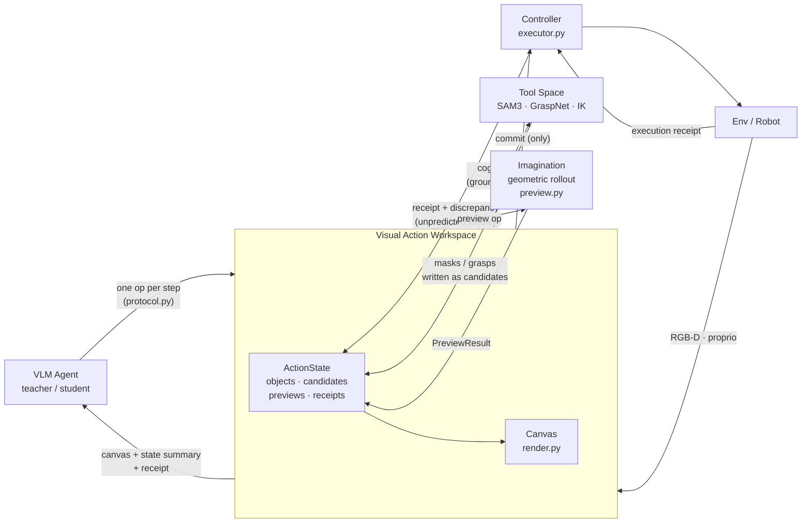

# VAW 实现计划（Visual Action Workspace）

> **历史设计归档（M0–M1.2）**：本文描述的 ActionState、旧 Canvas、legacy ops 与
> `smoke_*` runner 已于 2026-08-04 从当前代码删除，文中的命令不再是可执行入口。
> 当前运行入口以 [`vaw/README.md`](../vaw/README.md) 为准，当前实现契约见
> [`vaw/CURRENT_ARCHITECTURE.md`](../vaw/CURRENT_ARCHITECTURE.md)，研究目标和 Milestone 见
> [`vaw/M1_5_AGENTIC_SYSTEM_COMPLETION.md`](../vaw/M1_5_AGENTIC_SYSTEM_COMPLETION.md)。
> `vaw/CONTEXT_RUNTIME_MILESTONES.md` 现为 M0–M1.4 历史记录；删除前代码保存在 Git checkpoint
> `fd8d89a`。论文故事与训练目标仍见 `docs/gui_as_policy_v2_cvpr_plan.md`。

## 1. 系统架构



### 1.1 读图规则（也是系统不变量）

1. **Agent 与 Env 无直连**。Agent 的入边只有一条（画布 + 状态摘要 + 回执），出边只有
   一条（每步一个 op）。这条"缺席的边"就是与 tool-ReAct/CaP 的本质区别。
2. **Workspace 是所有操作的执行中介（dispatcher）**。从 W 出发的三条边表示操作集的
   三类归宿：认知操作 → Tool Space（只改 belief）、preview → Imagination（只改
   belief）、commit/move_xyz/commit_gripper → Controller（唯一改变世界的路径，
   物理边界）。其中 `move_xyz` 是 VIA 式的伺服通道：直接按世界系增量移动末端、
   保持姿态、不建候选也不 preview，代价是它不产生"先验证再提交"的训练信号，
   因此步长上限压到 ±0.05 m，大范围重定位仍必须走候选与 commit。
3. **一切结果汇入 ActionState**。工具输出实例化为候选、想象输出为 PreviewResult、
   执行输出为 Receipt；Agent 不私藏任何信息，下一步看到的是"已经画上去的画布"。
4. **Execution monitoring 闭环**：Receipt 与 Preview 比对 → discrepancy →
   `unpredicted_failure` 写回状态（推理时失败归因）+ 计入 P_viol（训练时惩罚）。

### 1.2 决策权分配（讨论定稿）

- **Imagination 产证据，Agent 做断定**（"Imagination proposes evidence, the Agent
  disposes"）。preview 只输出事实（IK 可行性、路径间隙、预测位姿），不拦截 commit、
  不自动换候选。
- **commit 不做硬门控**：Agent 可以不 preview 就 commit。原因：(a) "何时 commit"
  本身是训练目标（commit decision），硬门控会把策略写死进框架；(b) 几何 rollout 有
  盲区（接触任务的意图性接近会误报碰撞），最终裁决需要语义判断；(c) 软边界下
  P_viol 才能把"先验证再提交"塑造成被学出来的行为。
- preview 判不可行后的对策空间归 Agent：nudge/rotate 编辑（自动作废旧 preview）、
  select 换候选、重新 propose、observe 刷新、done(false) 放弃。

### 1.3 快慢系统对应

- 慢环（秒级）：Agent ↔ Workspace 的认知/想象/决策循环；
- 快环（毫秒级）：Controller ↔ Env 的执行与回执采集。
- 训练视角标注：Agent = **trained**（SFT+RL）；Tool Space / Imagination /
  Controller / TOPReward 打分器 = **frozen**。

### 1.4 Canvas 设计方向（M1.2 的设计目标）

M0 的 canvas 是固定机位 2D：agentview RGB + mask/候选/路径叠加。它的天花板是
遮挡与深度歧义——这恰好是 VIA 界面设计最精妙处的反面：VIA 的主工作区不是物理
相机画面，而是多相机重建的**点云**，视角因此是虚拟的、可操作的（orbit/pan/zoom），
agent 可以从任意角度观察来消解遮挡，不受物理机位限制。但 VIA 的工作区里只有裸
几何加一个虚拟 gripper，没有任何语义标注；我们的 canvas 从第一天起画的就是
belief state（物体 id、候选、preview 路径、回执）。Canvas v2 把两者合起来：

1. **主视图升级为可控虚拟视角的点云渲染**。`geometry.py` 已有 depth→world 点云，
   mask/候选/路径全在世界系；任意虚拟相机下的渲染用纯 numpy 投影 + z-buffer
   splatting + PIL 完成，所有标注投影到同一虚拟视角下绘制。
2. **视角控制做成离散认知 op（`view`）**，参数为方位角/俯仰/缩放或预设机位。
   这是比 VIA 巧妙的一步：VIA 的视角操作是浏览器交互、不进任何训练信号；我们的
   `view` 注册在 ops 里，进 trace、进 SFT、进 RL——**"何时换视角消解遮挡"本身
   成为可学的策略**（论文可单独成段）。
3. **坚决不走浏览器**。训练要求 canvas 从 trace 逐字节可复现（确定性渲染），RL
   rollout 要求 headless 批量并发，浏览器两条都不满足。VIA 是 training-free 所以
   可以用浏览器；这个约束差异本身就是方法差异的一部分。
4. **分工原则：数字与文字走 prompt 里的 state summary，canvas 只承担空间关系**。
   VLM 读 prompt 文本远比读渲染进图里的小字可靠。
5. 用真模型的失败归因数据迭代的布局量：分辨率（VLM 可读性，预计 768–1024px）、
   标注密度、过期证据降饱和。

**布局定稿（2026-07-29 对着交互 mockup 讨论收敛，手绘稿 + 修正）**——单帧 PNG 内：

```
+--------------------------------------------------+----------------+
| header: rev | gripper | sel | view az/el | instr  |                |
+--------------------------------------------------+  DataPanel     |
|                                                  |  (图例)        |
|   主视图: 点云虚拟视角 + 稀疏标注                   +----------------+
|   (mask/标签/selected + top-k 候选/preview 路径/   |  Focus         |
|    虚拟夹爪)                                      |  (密集标注)     |
|                                                  +----------------+
|   [左下角: 世界系 xyz gizmo]                       |  wrist         |
+--------------------------------------------------+----------------+
```

- **DataPanel = 图例而非数据表**：每行 id + 标记形状/颜色（与主视图 marker 一致）+
  类别 + 状态（sel/stale），一个数值都不放（数值全在 summary）。价值是 Set-of-Mark
  式的 marker↔id 挂钩。
- **Focus = 焦点实体的放大视口，标注密度分级的高密度端**：主视图保持稀疏（selected
  + top-k），focus 里渲染该实体的全部候选 + 接近轴姿态 + obb 线框 + 局部坐标系 /
  铰接 DoF 轴（本质是空间的信息才画，数值仍走文本）。focus 由 op 设定：升级现有
  `inspect(object_id)` 为一次调用同时做三件事——focus 视口切到该实体、summary 中该
  实体展开为全字段（其余实体压缩为单行，context 有界）、返回文本几何详情。兜底
  `focus(region=像素框)` 供未 ground 区域使用，set 时立刻反投影为世界系锚点存入
  ActionState（视角无关、trace 确定性）。"何时细看"与"何时换视角"同为可学的认知动作。
- **视角状态指示而非控件**：header 内 `view az/el` 读数 + 主视图左下角世界系 xyz
  gizmo（"往左挪"类指令的方向消歧依据）。**不渲染任何按钮/十字键**（VIA 画控件是
  因为界面真的给人点；我们的动作通道是 op，画控件浪费像素且暗示不存在的点击
  affordance）。
- wrist inset 保留在右条底部（close 后确认爪内有物的主要证据）。

**冻结时间点**：canvas / state summary 字段 / context 窗口 K / system prompt 必须
在 M3（教师采集）之前定稿——SFT 会把界面烘进权重，之后再改界面等于重新采数重训，
是全计划最贵的返工路径。

### 1.5 Scene Memory（自动场景清单，M2 实现，开关控制）

需求来源：当前 belief state 只包含 agent 显式 ground 过的物体，未 ground 的物体
不可指代、stale 只能整体作废、被夹持物体在 preview 里被当障碍。解法**不是**后台
进程（异步刷新破坏 trace 逐字节可复现，且准静态世界里场景只在动手时才变，"实时"
无需求），而是**挂在 `observe` 上同步执行**的感知流水线：

1. **每次 observe**：agentview 上跑类无关实例分割（SAM3 everything）+ 世界系 obb
   提取，产出匿名实体 `e1..eN` 写入 ActionState。同步、进 trace、确定性。
2. **系统维护几何，不维护语义**：自动流水线只给 id + obb + 位置，canvas 画细线框
   + id，不给名字。理由：错误标签比没有标签更毒（VLM 信文本高于信像素）；语义绑定
   留给 agent 的 `ground`（文本 → 绑定到既有 eN，继承其 id），标签错误归属于策略、
   可被训练修——感知自动化不侵蚀 grounding 决策的可学性（ETU 故事保住）。
3. **跨观测身份关联是已解问题**（讨论定稿）：世界系 xyz 是身份锚点，虚拟 `view`
   只是重渲染、不触发感知、无关联成本。三条规则覆盖全部情形：
   - 静止实体 → 世界系 obb 重叠匹配（比纯质心距离扛深度噪声与部分遮挡）；
   - 被夹持实体 → 运动学直推（夹爪位姿即其位置），确定性重关联；
   - 意外位移且匹配不唯一 → **宁可断链不错接**：开新 id、旧实体标 gone；
     被遮挡不可见 → 实体保留，标"本轮未见"+ stale，位置沿用旧值。
   附带收益：同款物体（如 libero_spatial 的两只碗）只有世界系身份能区分，匿名
   实体机制比语义身份更强，不只是够用。
4. **顺手解决的已有问题**：preview 排除被夹持实体点云（M1.1 遗留误报）；stale 从
   整体作废改为逐实体作废（位移超阈值才作废，位移本身是执行证据）；`focus` 兜底
   通道从像素框换成 `focus(entity_id)`（未 ground 也有 id 可指）。
5. **实体状态机**：每个实体两条正交状态轴 + 派生谓词，转移全部由现成信号驱动
   （mask / obb / 夹爪宽度 / 位姿 / 回执），确定性、进 trace：
   - 可见性轴 `visible ↔ unseen → gone`：本轮无 mask 不判死（遮挡），位置沿用 +
     stale；连续多轮 unseen 或关联断链才 gone。
   - 附着轴 `free ↔ held`：close 回执 + 宽度 > 空爪合拢 + 夹爪位姿与实体重合 →
     held（M1.1 的 holding 判定升级为状态）；open 回执 → free，位置由夹爪位姿直推。
   - 派生谓词 `operable = visible ∧ free ∧ 工作空间内 ∧ 尺寸可夹`：全部廉价规则
     （可达边界用实测的 solve_ik x≤0.75；尺寸 = obb 最小两轴 vs 开度 0.08m）。
     **以证据身份进 summary（附 reason），不做硬门控**（同 §1.2）；语义可操作性
     （"抽屉能不能拉"）绝不进自动层，同错误标签一个道理。
6. **本体感知 = 0 号实体**：机器人作为 scene memory 常驻实体 `robot`，字段来自
   observe 已读的 proprio：EE 位姿（统一 hand/TCP 约定，见 M1.1 教训）、夹爪宽度、
   `holding: eN | null`（附着轴的另一半，preview 排除点云直接查它）。Header 的
   gripper 状态与 DataPanel 的 robot 行从该实体渲染；proprio 只在 observe 边界采样。
7. **节奏**：M1.2 渲染层预留"匿名实体线框"这类标注；流水线在 M2 实现、带开关；
   M1.4 失败归因数据评估收益（预期减少"撞未 ground 物体"与"stale 误判"两类失败）；
   **M3 采集前定夺开关**——它改变 canvas 与 summary 内容，属于要冻结的界面。

## 2. Agent Runtime 设计（已实现，见 `vaw/agents/`）

形态是 ReAct（think → act → observe）。实现方式是**把仓库里的 `agentx/` fork 进
`vaw/agents/`**：agentx 本身是 Qwen-Code headless `AgentCore` 的 Python 移植，
provider/chat 两层可直接用，循环层按下面的取舍重写。选 fork 而不是依赖 `agentx`：
要改的四处都在循环内部（单 op、强制观测、显式 done、确定性上下文），在原包上加
开关会让两个用途互相拖累，而 agentx 还要继续服务 coding agent。

保留：`providers/`（OpenAI 兼容端点 + `<tool_call>` 文本协议）、`chat.py`（孤儿
tool call 修复 + 图像窗口）、循环骨架与幻觉守卫。
丢弃：`ToolScheduler`（并行批次，与单 op 冲突）、`tools/`（shell/文件/搜索）、
`skills.py`、`cli.py`、`prompt.py`、`trace.py`（Workspace 已有 TraceLogger）。
共约 1400 行，其中新写的只有 `runtime.py`。

### 2.1 设计决策

| # | 决策 | 依据 / 对照 |
|---|------|------------|
| D1 | **每轮恰好一个 op**（不允许并行 tool calls） | 画布是全量状态渲染，动作之间强顺序依赖；单 op 使 trace 成为干净的 (s, a, r) 序列，SFT/RL 无需拆分 |
| D2 | **think-then-act**：允许并记录 tool call 前的思考文本 | ReAct/Claude Code 惯例；思考文本进 trace，是 SFT 的 rationale 监督 |
| D3 | **观测是体制不是选择**：物理 op 后强制回灌新画布+回执 | AgentX `RunConfig.observe` 钩子的设计哲学；代码上 `commit`/`move_xyz`/`commit_gripper` 内部已调用 `refresh_observation` |
| D4 | **错误即回执，不抛异常**：坏 id、空结果、协议违规都变成 agent 可见的错误消息 | Claude Code 的 tool-error-as-result；恢复行为本身是训练目标。`workspace.step` 已实现 |
| D5 | **确定性上下文窗口**：最近 K 张画布（默认 3）作为图片，更早轮次只保留 op+receipt 文本；state summary 每轮全量重发（不做增量 diff） | 画布是全量状态渲染 → 历史可以浅。相比 Claude Code 的自动压缩，确定性策略保证**训练时上下文 == 推理时上下文**（SFT 数据可复现的前提）；diff 会让上下文依赖历史而非状态，同样破坏这一点 |
| D6 | **双动作通道**：teacher（frontier API）默认原生 function calling；student（Qwen3-VL）默认文本协议 `<tool_call>` JSON | 原生有 schema 约束、教师产出的坏动作更少；文本协议是 Qwen 原生训练格式，且 RL 中途的 checkpoint 未必稳定守住原生 schema。保留幻觉守卫（模型在正文里编造工具结果的正则检测） |
| D7 | **显式 `done` op**（与 AgentX 的"无 finish 工具"相反） | episode 终止是物理边界事件，且 success 断言是可训练输出（commit decision 的一部分）；纯文本回复不终止任何东西、只被 nudge，预算耗尽时 runtime 自己补 `done(success=False)`，保证每条 trace 都有终止步 |
| D8 | **runtime 与 workspace 职责分离**：runtime 管消息/模型 I/O/预算，workspace 管状态/执行/渲染/trace | AgentScope 的 message-centric + memory 分离；两者只通过 `step(op, **args) -> StepResult` 交互 |
| D9 | **teacher 与 student 同一个 runtime 与同一个 `run_episode` 入口**，只换 provider | trace 字节级同构 = SFT 数据无转换层（TraceLogger 已保证落盘格式统一） |

### 2.2 代码结构

```text
vaw/agents/
  contracts.py   # 纯数据：ToolCall / ModelResponse / StepRecord / EpisodeResult
  providers/     # base（Protocol）/ openai（兼容端点）/ text_protocol（<tool_call>）
  chat.py        # history：孤儿 tool call 修复 + prune_images（= D5 的画布窗口）
  runtime.py     # VAWRuntime + run_episode
  teacher.py     # teacher_provider()：capx proxy :8110，默认 native
  student.py     # student_provider()：本地 vLLM :8120，默认 text
```

实现中几个值得记住的细节：

- **图片只能挂 user 消息**（多数端点不接受 tool 消息带图）。所以每步回灌两条：
  tool 消息装回执 + 全量 state JSON，紧随一条 user 消息装画布，头部标注
  `[canvas after turn N: op]`，免得模型当成用户新指令。
- **多余的 op 调用必须被回答**。一轮里模型发了 N>1 个调用时，只执行第一个，其余
  各回一条拒绝的 tool 消息——不回的话那些 call id 就是孤儿，端点会拒掉整个下一次
  请求（不是拒掉那一条）。
- **动作解析统一走 `protocol.parse_action`**，native / text / RL rollout 三条路
  共用同一套校验；解析失败经 `Workspace.reject()` 变成错误回执并**照常写进 trace**
  ——协议犯错与自我恢复是要学的行为，从数据里删掉等于训出一个从不犯错的世界观。
- **观测是结构性的，不是钩子**。`Workspace.step` 永远返回新渲染的画布，物理 op 在
  渲染前已刷新观测，所以不存在"模型行动后看不到结果"的代码路径（agentx 需要
  `RunConfig.observe` 钩子来保证这件事，这里不需要）。

离线验证：`python -m vaw.scripts.smoke_runtime`（假 provider + 假机器人，无需环境
与模型）覆盖幻觉回复、一轮多 op、未知 op、缺参数、正常 commit 链路、预算耗尽强制
`done`、文本协议下画布不丢。

### 2.3 与 verl 的接缝（M5 预留）

RL 时 runtime 的循环被 verl 的多轮 AgentLoop 接管：`VAWEnv.reset/step` 包装
`Workspace`，动作解析复用 `protocol.parse_action`，上下文构建复用 D5 的同一函数
——保证 RL rollout 分布与 SFT/推理一致。runtime 不做第二套实现。

## 3. Milestones

| # | 内容 | 验收标准 | 状态 |
|---|------|---------|------|
| M0 | 框架：types/state/geometry/render/ops/protocol/workspace，12 个 op 注册 | `python -m vaw.scripts.smoke_render` 出画布 + 工具定义 | **已完成** |
| M0.5 | Agent Runtime（§2）：从 agentx fork 出 `vaw/agents/`，单 op 循环 + 双协议 + 强制终止 | `python -m vaw.scripts.smoke_runtime` 全部断言通过（含协议违规与预算路径） | **已完成** |
| M1 | **VAW agent loop 接通 LIBERO-PRO**（四步见下） | M1.4 的验收 | 进行中 |
| M2 | preview/receipt 完善：cuRobo 轨迹替换直线路径、place 候选生成、discrepancy 容差按任务类别标定；Scene Memory 流水线（§1.5，开关控制，含 preview 排除被夹持实体） | 人为扰动（挪物体/给错 mask）下 unpredicted_failure 触发符合预期；scene memory 开启时跨观测身份关联在 pick-place 全程无错接 | 待做 |
| M3 | 教师采集：`teacher_provider()` 接真模型，3–5 个 LIBERO 任务批量跑；**采集前界面定稿（§1.4）** | 教师成功率可用（≥50%），成功 trace 可批量收集（成功判据 = trace meta 里的 env 判定） | 待做 |
| M4 | 数据管线 → SFT 基线：trace 过滤（env 成功 + 无 unpredicted_failure）→ 图文交错多轮 SFT 样本（LLaMA-Factory/ms-swift 格式）→ 训练学生模型 | SFT 后学生在留出任务的 zero-shot 成功率显著高于未训基座 | 待做 |
| M5 | RL：verl AgentLoop 接入 + `train/rewards.py` 实现（R_task / R_progress-TOPReward / P_viol / cost）；episode 级 env reward 在此接入训练 | GRPO（不稳则 PPO）训练曲线上升；ETU 与 preview 校准度指标可产出 | 待做 |
| M6 | 论文实验：对照（CaP-X 裸 ReAct / VIA 式无工具界面 / 本方法 ×{training-free, trained}）+ 消融（去 R_progress / 去 P_viol / 去持久状态 / 去 preview / 去 view） | 见论文计划 §3.4 指标与 §4 里程碑 5 | 待做 |

### 3.1 M1 分解

| 步 | 内容 | 验收标准 | 状态 |
|----|------|---------|------|
| M1.1 | **环境接线**：`FrankaLiberoApiReduced` + 感知/IK 服务栈绑进 `Workspace`，跑真实 LIBERO 任务；episode 结束时把 env 判定（`task_completed()`）写进 trace `meta.json`（M4 筛数据的成功判据，`claimed_success` 不可信） | `vaw/scripts/scripted_pick.py`：脚本化 op 序列在一个任务上全链路跑通，trace 含画布序列/preview/receipt，人工检查正确 | **已完成**（见下方实跑记录） |
| M1.2 | **Canvas v2**（§1.4）：点云虚拟视角主视图 + `view` op + `inspect` 设 focus + 四区布局 | 首版已实现（见下方实现记录）；布局仍要用 M1.4 的失败归因数据迭代，界面归因的失败占比降到可接受后冻结 | **首版已完成** |
| M1.3 | **env reward：明确推迟**。LIBERO 的 reward 稀疏（完成才 1），episode 级过程评分短期无收益；训练接入留到 M5。M1 只保留 M1.1 里的 episode 末判定落盘 | —（无独立验收） | 已定 |
| M1.4 | **真模型实跑**：`run_episode` 用 Qwen-3.5-27B（界面可用性试金石）+ 一个 frontier 模型（上界对照）在 3–5 个 LIBERO 任务上跑完整 loop | **不看成功率**：episode 正常终止、每步动作可解析、trace 完整、每个失败可归因到界面/工具/模型三类之一；frontier 系统性失败处 = 界面/工具问题 | 待做 |

**M1.1 实跑记录（libero_object task 0，pick 成功，抬起后夹持宽度 0.130）**，
暴露并修掉/记下的问题：

- **坐标约定偏置**：候选位姿是 TCP 约定目标，观测回报的是 panda_hand 位姿，直接
  相减产生 ~0.14m 的幻影偏差（大头是 ~9cm 的 TCP 偏移）。已修：`executor.py` 统一
  换算到 hand 坐标系再比较（`_expected_hand_position`），修后偏差 0.028m，容差内。
- **单段长运动不收敛**：控制器插值粗糙，一段到底横向欠冲 ~6cm 导致抓空。已修：
  grasp commit 自动两段接近（悬停 +0.075m 再下降，API 文档本身的建议值）。
- **`solve_ik` 静默把 x 裁剪到 0.75**（本任务物体在 x=0.772）：现在偏差会如实出现
  在回执里（~2cm），暂不专门处理；参见 `scripts/manual_pick_pipeline.py` 头部对
  三个已知静默失真的记录。
- **抓住物体后 preview 误报碰撞**（lift preview 报 clearance 0.7cm）：手中物体的
  点云被当成障碍。执行照常、回执如实（`preview_feasible=False` 但执行成功不算
  unpredicted failure），修复归 M2（preview 需感知"已抓取物体"并排除其点云）。
- 本地 BDDL 无 `*_task` 变体套件，可用：`libero_object/spatial/goal/10` 及其
  `_swap`；任务选型时注意。
- pick-only 脚本的 `env_success` 恒为 False（任务要求放进篮子），脚本用抬起后的
  夹爪宽度作为 pick 判据；claimed 与 env 判定的 gap 语义从第一条 trace 起就成立。

**M1.2 实现记录（`camera.py` / `cloud.py` 新增，`render.py` 重写；离线验收
`python -m vaw.scripts.smoke_render`，1024×576 画布 ×9 视角 + 渲染确定性断言）**

落地与设计稿一致的部分：四区布局（主视图 768px + 右条 DataPanel/Focus/wrist）、
DataPanel 只做 id↔marker 图例不放数值、Focus 为焦点物体放大视口并画全部候选 +
接近轴 + obb 线框、header 显示 `view az/el/zoom`、主视图左下世界系 gizmo、无任何
按钮控件、`inspect` 一次调用同时设视觉焦点与展开 summary 全字段。

实现中定下来的、设计稿没写或写错的决策：

- **虚拟相机就是 `(intrinsics, pose_mat)`**，与物理相机同构 → `project_world_to_pixel`
  一份代码同时服务物理视角、虚拟视角、focus 视口，没有分支。
- **默认视角直接用物理相机 RGB，不用点云**。点云是几何而非外观，重建视图必然稀疏
  有洞；真实 RGB 在物体识别上明显更强。`view` 的语义因此是"离开物理相机去看几何"，
  header 与主视图角标都标注当前是哪种来源。Focus 视口同理（物理视角下是 RGB 裁剪
  放大，虚拟视角下是点云放大）。
- **azimuth 只允许绕物理机位 ±75°，elevation 限 10–85°**：单视角深度只有该相机看见
  的表面，转到背面渲染的是点壳的内侧——一幅看起来合理但没有证据的图。越界不报错
  而是裁剪 + 在回执里说明裁到哪，让 agent 学到包络而不是猜。
- **zoom = 收窄视场（长焦），不是拉近相机**。先按拉近实现，结果 `close` 预设把相机
  怼进桌面点云内部、目标出画；改长焦后视角几何不变、纯放大。
- **orbit 中心跟随 focus 物体**（预设角度仍锚定在场景中心算，避免 focus 一变角度就
  漂）。于是 `inspect` + `view close` 组合是符合直觉的"围着手上这件东西转"。
- **splat 半径按每个点的真实 footprint 定**（`z·stride/f`，再用深度梯度估计掠射角
  拉伸，上限 4×base 防止轮廓处糊到背景）。只按深度定半径会让斜面渲染成条纹——腕
  相机看竖直面时最明显。这也是多相机融合能对齐的前提：每个点画它真实的大小，画面
  就看不出点来自哪个相机。
- **splat 在半分辨率算完再放大**：strided 深度图的点在全分辨率下本就相隔数像素，
  在那个分辨率上光栅化是花四倍代价画同样的信息。虚拟视角渲染 470ms → 122ms
  （物理视角 35ms，是常态路径）。
- **物体身份在点云里靠 obb 内的点染色（40% 混色）传递**，mask 是像素、换视角就没了，
  染色的点子集是几何、任意角度都投得回来。染色归属用 obb 包含判定而非球半径——球
  半径足以包住高物体时会连桌面一起染，而染错的桌面是一句关于场景的假话。注意
  `get_oriented_bounding_box_from_3d_points` 拟合的是**单相机可见表面**，盒子偏向
  相机侧、在深度方向偏薄（focus inset 里线框略偏是这个原因，不是 bug），所以包含
  判定给的是按 extent 成比例的余量（8mm + 10%），让另一相机贡献的点仍算同一物体。
- **focus 有隐式回退**（未 `inspect` 时取 selected 候选所属物体，再退到最近 ground
  的物体），并在画布上标 `(auto)`：否则 1/6 的画布长期空着；标注 auto 是因为隐式焦点
  不能读成 agent 做过的决定。summary 里同步给 `focus.requested` 布尔。
- **summary 的详略跟着 focus 分级**：焦点物体与其候选给全字段（含 obb center/yaw、
  点数、像素框），其余压缩（物体只给 centroid+extent，候选只给 position+score）。
  §1.4 的"数值全在文本"配上这条才在实体变多后仍然 context 有界。
- **本体感知已进 state**（`ee_pose` / `gripper_width`，observe 边界采样），header 与
  DataPanel 的 robot 行从它渲染 —— §1.5 "0 号实体"的前半截，状态机留在 M2。
- 尚未做（M2）：匿名实体线框（等 scene memory 流水线）、铰接 DoF 轴（等有铰接任务）、
  `focus(entity_id)` 兜底通道（现在只能 focus 已 ground 的物体）。

执行顺序：M1.1 → M1.2（已完成首版）→ M1.4 首跑 → 拿失败归因迭代 M1.2 布局 →
M1.4 复跑。

**M1.2 第二轮 Web renderer（2026-07）**：

- 新增固定 `1024×576` 的明亮只读 Web workspace；它仍输出 RGB observation，
  Agent action space 仍是 structured ops，不提供点击或 DOM 控制；
- 同一 ActionState 同时支持 `pil-v2` 与 `web-v1`，并可在同一个真实 LIBERO state
  上保存成对截图；policy trace 始终只选择其中一个 renderer；
- Focus 改为只有 `inspect` 才展开；候选使用“一卡一候选”视觉绑定，主图不再叠加
  多组 approach axes；Self 与 Now→Next 分开当前本体和 imagined target；
- M1 只展示 endpoint IK 证据，明确标注 trajectory/collision 未检查；不引入新的
  affordance 模型或 M2 motion-planning 声明；
- Web snapshot 只含 RGB raster 与屏幕语义，不含 depth、camera matrix、raw mask、
  point cloud 或 privileged success。精确 EE/关节/OBB/receipt 数值继续由同一份
  `state_summary` 提供。

任务套件对齐 `docs/robomex_libero_pro_evaluation.md`（六个 10-task suites：
object/spatial/goal × {swap, task}），非特权边界同样沿用：agent 只见 RGB-D、
proprio、workspace 产物；BDDL predicate、真值位姿、reward 均不可见，env 判定只
落 trace meta、不进 prompt。评测入口复用 capx 的 config→env 构建路径
（`capx/envs/simulators/libero.py` 的 `FrankaLiberoTask`），不拼第二套语义。

依赖关系：M1 → M2 → M3 → M4 → M5 → M6；M2 的 cuRobo 项可与 M3 并行（不阻塞教师
采集）。界面冻结（§1.4）是 M3 的前置门。

## 4. 风险与当前缺口（滚动更新）

- M1 依赖 Cap-X 服务栈（SAM3/GraspNet/PyRoKi，`capx/serving/launch_servers.py`）
  与 LIBERO 环境可用性；接线参照 `scripts/agentx_capx_eval.py` 的 launch 路径。
- **界面在 M3 前未冻结**是全计划最贵的返工路径：SFT 把 canvas/summary/prompt 烘进
  权重，教师采集后再改界面 = 重新采数重训（§1.4）。
- 教师成功率不足 → M3 允许训练期特权提示 / rejection sampling；任务选型避开 VIA
  已饱和的简单任务（详见论文计划 §5）。
- 奖励设计的已知陷阱（对称一致性奖励可被保守策略 hack）已在论文计划 §3.3 与
  `vaw/train/rewards.py` 注释中记录，实现时勿回退。
