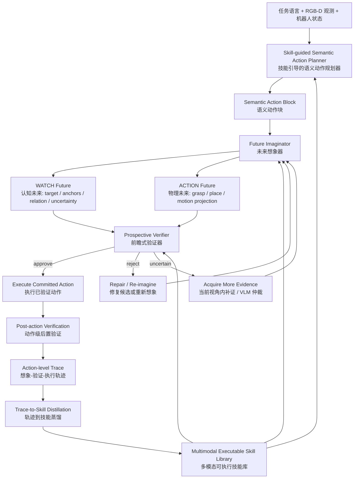

# 想象、验证与蒸馏：面向 Code-as-Policy 机器人的自进化语义技能 Proposal

## 0. 暂定标题

**Imagine, Verify, and Distill: Self-Evolving Semantic Skills for Code-as-Policy Robots**

中文标题：

**想象、验证与蒸馏：面向 Code-as-Policy 机器人的自进化语义技能**

可选标题：

- **Imagination-Guided Skill Evolution for Code-as-Policy Robots**
- **Self-Evolving Verified Semantic Skills for Embodied Code Agents**
- **Imagine-Before-Commit: Multimodal Skill Evolution for Code-as-Policy Robots**

本文不是单纯给 CaP-X 加一个 verifier，也不是单纯做一个 skill library。本文的核心是两个互相耦合的闭环：

1. **执行前想象-验证闭环**：每个语义动作在执行前先构造候选未来，再验证这个未来是否可以 commit。
2. **执行后技能内化闭环**：每次动作的想象、验证、执行、失败和修复轨迹被蒸馏为多模态可执行技能，反过来指导后续代码生成、未来想象和动作验证。

一句话 slogan：

> **先想象，再验证，后蒸馏。**

更完整地说：

> **WATCH 想象认知未来，ACTION 想象物理未来，SKILL 内化可复用经验。**

英文 slogan：

> **Imagine before commit; distill after execution.**

### 0.1 术语澄清：想象 = 前瞻性检查

需要在全文一开始就把话说死：本文的"想象 / imagination"是一个名词化的表达，其技术实质是**前瞻性检查（prospective verification）**——在动作 commit 之前，用确定性工具（SAM3、点云几何、GraspNet、IK、碰撞代理、渲染 overlay）构造该动作的候选未来证据，并对照 postcondition 做检查。

本文不主张、也不依赖任何可学习的 dynamics model 或视频预测式世界模型。这样定义有三个好处：

```text
1. 防御性：避免世界模型方向的审稿人质疑 "dynamics prediction 在哪"。
2. 诚实性：所有未来证据均可由当前观测和确定性几何计算导出，可复现、可解释。
3. 区分性：与 world-model planning 的区别不在预测能力，而在验证对象——
   我们验证的是 "该语义动作承诺的 postcondition 在构造出的未来证据下是否成立"。
```

后文继续使用"想象 / future imagination"作为简洁的机制名，但其语义始终等同于"前瞻性证据构造 + 检查"。

---

## 1. 摘要

Code-as-Policy 方法通过让大语言模型生成可执行机器人代码，将语言理解、视觉感知、几何推理和机器人控制接口统一到程序中。然而，现有 Code-as-Policy 系统通常将生成程序作为一个整体执行，并在执行后通过粗粒度视觉反馈或任务 reward 判断是否成功。这种流程存在两个关键缺陷：第一，它缺少执行前的未来想象和动作级验证，因此无法在机器人真正改变世界之前判断抓取、放置或运动是否可靠；第二，它缺少动作级技能内化机制，因此即使一次 trial 暴露出明确失败，系统也难以将该失败转化为下次可复用的多模态技能。

我们在 CaP-X / LIBERO 实验中观察到两个典型 failure mode。其一是 WATCH 层面的关系指代 grounding 失败：SAM3 等视觉基础模型可以分割 `cup`、`bowl`、`plate` 等类别，但面对 “left cup” 或 “black bowl between the plate and the ramekin” 这类空间关系表达时，可能选错具体实例。其二是 ACTION 层面的 metric grounding 失败：GraspNet 和 LLM 生成的抓取、放置代码经常依赖固定距离和高度，例如上抬 15cm、从物体上方 10cm 接近、在目标表面上方 3cm 松爪，但这些参数没有被当前点云、物体尺寸、夹爪几何和 IK 可达性充分约束。

本文提出 **Self-Evolving Semantic Skills for Code-as-Policy Robots**。核心思想是将整段机器人程序拆成一组语义动作技能，每个技能同时包含未来想象 schema 和技能内化 schema。对于每个语义动作，系统先构造候选未来：WATCH 构造认知未来，即目标、anchor、空间关系和不确定性；ACTION 构造物理未来，即候选抓取、放置或运动在点云、夹爪、物体和机器人约束下的预期结果。Verifier 不再直接判断代码是否合理，而是判断这个被想象出的未来是否满足该语义动作的 postcondition。只有通过验证的动作才被 commit 到环境。

执行后，系统保存 action-level trace，包括任务、代码、感知结果、未来想象、verifier 决策、真实执行结果和失败原因。Trace-to-skill distiller 将这些轨迹蒸馏为多模态可执行技能。一个 skill 不只是代码片段，而是包含适用场景、语义动作 schema、WATCH schema、future imagination schema、verification schema、execution schema、postcondition schema、recovery schema 和 utility statistics 的程序性知识。该 skill library 反过来指导后续 semantic action planning、future imagination 和 prospective verification，形成自进化闭环。

本文的目标不是做一个 task-specific patch，而是提出一种新的具身代码智能体范式：**LLM 生成的机器人代码不是立即执行的命令，而是需要被拆解为可想象、可验证、可蒸馏的语义技能。**

---

## 2. 背景与动机

### 2.1 Code-as-Policy 的优势

Code-as-Policy 的核心价值在于，代码可以显式组织机器人任务中的多个异质模块：

```text
语言任务理解
视觉感知工具调用
RGB-D / 点云 / 几何计算
抓取候选生成
IK / motion planning
机器人 API 执行
条件分支、异常处理和恢复逻辑
```

这使得 Code-as-Policy 比纯自然语言 action 更可解释，也比端到端 VLA 更容易编辑和调试。因此，CaP-X 这类系统是研究 embodied code agent 的合适平台。

### 2.2 当前 CaP-X 式方法的局限

当前 CaP-X 多轮流程大致是：

```text
任务 + 图像 + API 文档
  -> LLM 生成完整 Python 程序
  -> 执行完整程序
  -> 根据 stdout/stderr/视觉反馈判断 FINISH 或 REGENERATE
```

这个设计的问题是：反馈粒度是 trial-level 或 whole-program-level，而机器人失败往往发生在 action-level。

当任务失败时，系统很难回答：

```text
是不是目标对象选错了？
是不是 SAM mask 偏了？
是不是 depth / point cloud 不可靠？
是不是 GraspNet top-1 pose 不适合？
是不是 quaternion 顺序或方向错误？
是不是 IK 不可达？
是不是 place height 靠猜？
是不是 release pose 不在目标区域？
是不是模型错误判断 FINISH？
```

因此，整段程序级反馈只能告诉我们“失败了”，但无法可靠告诉我们“哪个语义动作失败、为什么失败、下次如何避免”。

### 2.3 两个具体 failure mode

我们当前最关心两个 failure mode。

#### Failure 1: 关系指代 grounding 失败

例如任务：

```text
Pick the black bowl between the plate and the ramekin.
```

SAM3 可能能分出 black bowl，但不一定真正理解 between 关系。如果场景中存在多个相似 bowl，它可能选错实例。

这类错误属于 WATCH failure：

```text
模型看到了正确类别，但没有确认正确实例。
```

#### Failure 2: 动作参数 metric grounding 失败

例如 LLM 生成：

```text
move 0.10m above the object
lift by 0.15m
release at target_z + 0.03m
use the first GraspNet grasp pose
```

这些数值可能在某些场景有效，但它们通常不是从当前场景几何计算出来的。对于不同物体高度、不同容器形状、不同夹爪姿态和不同障碍物，固定经验参数可能导致抓取失败、碰撞或放置失败。

这类错误属于 ACTION failure：

```text
模型可能操作了正确对象，但动作本身缺少几何和物理 grounding。
```

### 2.4 更深层原因：缺少两个闭环

这两个 failure mode 背后有两个更深层问题。

第一，缺少 **执行前想象-验证闭环**：系统没有在真正执行动作前构造候选未来，也没有验证这个未来是否满足动作目标。

第二，缺少 **执行后技能内化闭环**：系统即使经历了失败，也没有将“为什么失败、应该如何验证、下次如何修复”沉淀为可复用的技能。

因此，我们的目标不是单独修一个 verifier，也不是单独做一个 skill library，而是建立一个完整闭环：

```text
语义动作生成
  -> 未来想象
  -> 前瞻验证
  -> 执行
  -> 动作级轨迹
  -> 技能蒸馏
  -> 反哺下一次语义动作生成、未来想象和验证
```

---

## 3. 核心 Thesis

本文核心 thesis 是：

> **可靠的 Code-as-Policy 机器人智能体需要两个互相耦合的闭环：执行前的想象-验证闭环，以及执行后的技能内化闭环。前者通过为每个语义动作构造候选未来并验证其 postcondition，避免错误 grounding 和不可逆动作失败；后者将想象、验证、执行和修复轨迹蒸馏为多模态可执行技能，反过来提升后续代码生成、未来想象和动作验证。**

这一定义包含两个同等重要的核心机制。

### 3.1 核心机制一：Future Imagination + Prospective Verification

这个机制回答：

```text
当前这个语义动作能不能执行？
```

对于 WATCH：

```text
构造未来 belief state
验证目标对象、anchor 和空间关系是否明确
```

对于 ACTION：

```text
构造未来 physical state
验证抓取、放置、运动候选是否可 commit
```

核心不是直接验证动作代码，而是：

> **验证动作所想象出的未来。**

### 3.2 核心机制二：Trace-to-Skill Distillation + Skill Reuse

这个机制回答：

```text
这次执行经验能不能变成下次可复用的能力？
```

一个 skill 不只是代码片段，而是包含：

```text
什么时候用
如何拆解语义动作
应该观察什么
如何构造候选未来
如何验证未来
如何执行动作
失败后如何修复
历史成功率如何
```

这个 skill 反过来指导三个地方：

```text
指导 planner 拆解动作
指导 imaginator 构造未来
指导 verifier 检查关键 evidence
```

因此，skill 不是系统尾部的附属 memory，而是贯穿整个 agent 的可复用程序性知识。

---

## 4. 研究问题

本文围绕五个研究问题展开。

### RQ1：如何将整段 Code-as-Policy 程序分解为语义动作技能？

需要定义一种中间表示，使得 LLM 不再只生成一整段 monolithic program，而是生成一组有意图、有前置条件、有未来想象、有验证器、有执行代码和后置条件的 semantic action skills。

### RQ2：如何为每个语义动作构造候选未来？

需要分别定义 WATCH 和 ACTION 的未来想象：

```text
WATCH future: 认知未来，描述 agent 应该知道什么
ACTION future: 物理未来，描述执行候选动作后世界可能如何变化
```

### RQ3：如何验证候选未来是否可以 commit？

需要设计 prospective verifier，让它基于 VLM、SAM3、点云、几何、GraspNet、IK、collision proxy 等证据判断未来状态是否满足 postcondition。

### RQ4：如何从动作级轨迹中蒸馏多模态可执行技能？

需要将每个语义动作的想象、验证、执行和结果记录为 action-level trace，并从中提取可复用 skill。

### RQ5：如何让 skill 反过来提升 planner、future imaginator 和 verifier？

需要证明 skill library 不是静态代码仓库，而是一个可复用的 knowledge base，能够提升后续任务的动作拆解、未来想象质量和 verifier 判别质量。

---

## 5. 核心定义

### 5.1 语义动作技能 Semantic Action Skill

本文的基本单元不是 code block，而是 semantic action skill。

它可以定义为：

```text
s = (
  description,
  applicability,
  semantic_action_schema,
  watch_schema,
  future_imagination_schema,
  verification_schema,
  execution_schema,
  postcondition_schema,
  recovery_schema,
  utility_statistics
)
```

其中：

```text
description: 技能做什么
applicability: 适用于哪些任务、物体和视觉场景
semantic_action_schema: 该技能应该如何拆成动作步骤
watch_schema: 执行前应该观察和 ground 什么
future_imagination_schema: 应该构造什么候选未来
verification_schema: 应该检查哪些未来 evidence
execution_schema: 推荐代码流程和 API 调用
postcondition_schema: 执行后如何确认成功
recovery_schema: 失败或不确定时如何修复
utility_statistics: 历史成功率、失败类型和适用边界
```

### 5.2 Semantic Action Block

一次具体任务中，skill 会被实例化成 semantic action block：

```text
b_t = (
  intent_t,
  current_state_t,
  selected_skill_t,
  candidate_t,
  imagined_future_t,
  verification_result_t,
  executable_code_t,
  postcondition_result_t
)
```

例如 pick-and-place 可以分解为：

```text
1. Ground target object
2. Verify relation with anchors
3. Estimate target geometry
4. Generate grasp candidates
5. Imagine grasp future
6. Verify grasp future
7. Execute grasp
8. Verify holding
9. Ground target receptacle
10. Imagine placement future
11. Verify placement future
12. Execute place
13. Verify final relation
```

### 5.3 Future Imaginator

Future imaginator 将当前状态和候选动作转化为可验证的候选未来 evidence。

形式上：

```text
I(s_t, b_t, c_t) -> \hat{e}_{t+1}
```

其中：

```text
s_t: 当前多模态状态，包括 RGB、depth、point cloud、robot state
b_t: 当前语义动作块
c_t: 候选 grounding / grasp / place / motion 参数
\hat{e}_{t+1}: 被想象出的未来 evidence
```

Verifier 判断：

```text
V(\hat{e}_{t+1}, postcondition_t) -> approve / reject / uncertain / repair_hint
```

### 5.4 WATCH Future

WATCH future 是认知未来。它不描述物体如何移动，而描述执行观察和 grounding 后 agent 应该知道什么。

例如：

```text
target candidates
anchor objects
relation graph
selected target
confidence
ambiguity report
mask overlay
```

WATCH 的核心问题是：

> **我准备操作的对象，到底是不是任务说的那个对象？**

### 5.5 ACTION Future

ACTION future 是物理未来。它描述如果执行候选动作，物体、夹爪、目标区域和机器人状态可能如何变化。

例如 grasp future：

```text
gripper-object overlay
contact point projection
approach direction
gripper width vs object extent
IK reachability
collision / clearance report
```

例如 place future：

```text
virtual object placement
support surface estimate
release height
object center inside target region
after-release relation
motion reachability
```

例如 transit (carry) future：

```text
场景物体全部 box 化（AABB：中心、尺寸、top_z）——box 是最适合计算的表示
被抓物体 = 悬挂在 TCP 下方的 box（悬垂距离来自抬升后实测）
运送走廊 = 起点到终点的 xy 线段，按被抓 box 半宽 + 余量加粗
逐障碍物输出一行：top_z、距走廊距离、是否侵入、垂直间隙、PASS/FAIL
min_safe_tcp_z = max(侵入障碍物 top_z + 余量) + 悬垂距离 —— 拒绝时自带修复值
```

Transit 检查的要点：危险的不是夹爪而是悬在 TCP 下方的被抓物体扫过的体积；"抬这么高 OK"的标量判断信息量不够，必须给出逐障碍物的间隙表和算出来的最小安全高度。

ACTION 的核心问题是：

> **这个动作所想象出的未来，是否足够可靠，可以 commit 到环境？**

---

## 6. 总体系统：双闭环架构

### 6.1 总体流程图



这张图的重点是：skill library 不只在最后被更新，它还反过来指导三个关键阶段：

```text
planner: 如何拆动作
imaginator: 如何想象未来
verifier: 如何检查未来
```

因此，系统不是单链路，而是双闭环：

```text
执行闭环: action -> imagination -> verification -> execution
学习闭环: trace -> skill distillation -> skill reuse -> better action/imagination/verification
```

### 6.2 与原始 CaP-X 的差异

原始 CaP-X：

```text
current state -> generate full code -> execute -> post-hoc finish judgment
```

本文方法：

```text
current state + skill library
  -> semantic action blocks
  -> imagined future
  -> prospective verification
  -> execute or repair
  -> action-level trace
  -> skill distillation
  -> better future actions
```

最关键的变化是：

> **verifier 的对象从“整段任务是否完成”，前移到“每个语义动作所想象出的未来是否可以 commit”；skill 的对象从“成功代码片段”，升级为“可复用的想象-验证-执行 schema”。**

---

## 7. 核心机制一：Future Imagination + Prospective Verification

### 7.1 WATCH：认知未来想象

WATCH 不改变物理世界。它的未来是 belief state。

对于：

```text
black bowl between the plate and the ramekin
```

WATCH future imagination 执行：

```text
SAM3("black bowl") -> bowl candidates
SAM3("plate") -> plate anchor
SAM3("ramekin") -> ramekin anchor
Geometry/VLM -> relation graph
Future evidence -> selected target + ambiguity report
```

输出：

```text
target candidates
anchor masks
relation scores
selected target
mask overlay
confidence
ambiguity report
```

Verifier 检查：

```text
被选中的 bowl 是否确实在 plate 和 ramekin 之间？
是否存在另一个 candidate 更符合关系？
anchor 是否 ground 正确？
mask 是否覆盖目标物体？
不确定性是否低到可以进入 ACTION？
```

这解决的是：

> **类别 grounding 不等于关系实例 grounding。**

#### 固定视角原则

WATCH 的所有证据构造都在**当前视角**（agentview + 腕部相机的当前帧）内完成。我们不通过移动机械臂去获取新视角：一旦"看"需要运动，WATCH 就不再是无副作用的观察，WATCH/ACTION 的类型边界会被破坏。

当单视角证据不足以消解歧义时，递补顺序是：

```text
1. 当前视角内补充证据：换 prompt 重新分割、point prompt 重定位、深度/点云几何重估
2. 仍不确定：渲染候选 overlay，交给 VLM 做最终仲裁
3. VLM 也无法仲裁：显式输出 uncertain，拒绝进入 ACTION
```

这保证了 WATCH 永远是世界中立的，typed program 的类型纯净性得以保持；代价是部分单视角下本质不可分辨的歧义只能被诚实地报告为 uncertain，而不是被强行消解。

### 7.2 ACTION：物理未来想象

ACTION 会改变世界。因此未来想象器需要构造轻量级物理未来。

#### Grasp future

对于 grasp，future evidence 包括：

```text
目标点云
gripper mesh / gripper frame overlay
grasp pose
contact points
approach direction
gripper opening width
IK reachability
clearance / collision proxy
```

Verifier 检查：

```text
grasp 是否落在目标 point cloud 上？
contact 是否在目标 mask 内？
approach direction 是否合理？
gripper width 是否匹配物体尺寸？
quat 是否单位化且顺序正确？
pregrasp / grasp pose 是否可达？
是否可能撞桌面或邻近物体？
```

#### Place future

对于 place，future evidence 包括：

```text
target receptacle mask / point cloud
support surface z
object OBB / height
virtual object placement
place point inside target region
release height
approach height
IK reachability
```

Verifier 检查：

```text
place point 是否在目标区域？
release height 是否来自 surface_z + 实测悬垂距离 + clearance？
  （悬垂距离 = 抬升后实测的 TCP 到被抓物体最低点距离；
   不用 object_height / 2，因为碗沿抓取等非质心抓取下该假设错误）
虚拟放置后的 object center 是否满足目标关系？
当前 gripper 是否持有物体？
motion path 是否低风险？
```

上述度量检查的证据交付方式见 7.5：全部计算为数字并以结构化文本交给 VLM，不渲染成图让 VLM 目测。

### 7.3 轻量级 simulator，而不是完整物理仿真

本文不主张一开始实现高保真物理模拟。更合理的是为 verifier 设计轻量级 prospective simulator：

```text
点云级模拟
gripper pose overlay
object placement projection
IK trajectory preview
collision / clearance proxy
future debug image rendering
```

它的目标不是准确预测所有物理细节，而是暴露关键风险：

```text
抓取点是否偏离目标？
夹爪方向是否错误？
放置点是否在区域外？
release height 是否明显不合理？
IK 是否不可达？
```

### 7.4 Prospective verifier 输出

Verifier 输出：

```text
approve: 可以执行
reject: 不应执行
uncertain: 需要更多 evidence
repair_hint: 如何修复候选动作
risk_report: 风险来自哪里
future_evidence: 支撑决策的未来证据
```

### 7.5 证据分型原则：度量证据以结构化文本交付 VLM

一个关键设计决定：**度量类证据不渲染成图像让 VLM 看，而是计算成数字、以结构化文本交给 VLM 判断。**

理由：释放高度、间隙、悬垂距离是厘米级度量量。固定相机的斜视角下，3cm 的高度差在 2D 投影里只有几个像素且与深度混叠，VLM 从像素目测本质不可靠；而这些量从点云几何是可以**精确计算**的。让 VLM 读图等于把可精确计算的量降级成模糊视觉估计。

因此每个 ACTION 的度量证据统一为 **metric evidence report**（JSON + 模板化文本），包含三层：

```text
1. measurements: 原始测量数字（带单位），如 surface_z、TCP z、悬垂距离、
   place point 到容器中心距离、容器半径、IK 是否可达
2. derived_checks: 几何规则核验结果，每条 = (检查名, 规则表达式, 实测值, pass/fail)
   —— 硬性失败（如 IK 不可达）可直接 reject，不必经过 VLM
3. context: 该动作的语义意图、测量来源（哪个 mask、哪帧观测）、已知不确定性
```

VLM 在此流程中的分工：

```text
看图（语义判断）: 容器是不是任务说的那个、区域内有无障碍、mask 是否明显漂移
读文本（度量判断）: 接收 metric report，检查数字之间是否自洽、
                   是否存在规则没覆盖的异常组合（如悬垂距离为 0 但物体是碗）、
                   对 borderline 的 pass/fail 给出最终 approve/reject/uncertain
不做的事: 从图像目测任何厘米级长度
```

这样 verifier 的最终决策 = 几何硬规则（确定性，可单测）+ VLM 对文本化证据的软仲裁（处理规则未覆盖的不一致），两者职责互不重叠。

---

## 8. 核心机制二：Trace-to-Skill Distillation + Skill Reuse

### 8.1 为什么 skill 是第二个核心，而不是附属模块

如果只有未来想象和 verifier，系统仍然可能每次都从零开始推理。这样的系统会更可靠，但不会自进化。

真正的目标是：

> **让机器人从自己的想象、验证、执行和失败中学习，形成下次可复用的多模态可执行技能。**

例如，系统多次发现 GraspNet top-1 对 bowl 不稳定后，应该沉淀出 skill：

```text
抓 bowl 不要盲选 top-1 grasp；
应渲染 top-k grasp overlay；
检查 gripper opening 是否跨过 bowl rim；
检查 approach direction 和 table normal；
用 IK feasibility 和 clearance 重排候选。
```

这个 skill 会反过来指导下一次 grasp future imagination 和 verifier。

### 8.2 Action-level trace

每个语义动作都保存 action-level trace：

```text
task instruction
selected skill
semantic action intent
WATCH evidence
future imagination evidence
verifier decision
execution code
execution parameters
postcondition result
imagined future vs realized future difference
failure type
repair attempt
final outcome
```

关键是：trace 不只记录结果，还记录“执行前想象了什么”。

### 8.3 Trace-to-skill distillation

Trace 的来源不限于自身试错。skill library 可以由三类轨迹喂养：

```text
专家代码轨迹: 高质量 seed skill，提供稳定 API 调用顺序、合理几何参数和验证逻辑
自身试错轨迹: 带明确成败标签和完整想象-验证-执行记录，是蒸馏主力
VLA / 人类视频轨迹（可选扩展）: 经 VLM 解析为语义动作后映射到 API schema，
                              仅作为后续扩展方向，不进入本文主线
```

Distiller 从多个 action-level trace 中总结技能。它需要回答：

```text
这个经验适用于什么场景？
应该如何拆动作？
应该先观察什么？
应该如何构造未来？
哪些未来 evidence 是关键？
哪些 verifier rejection 是正确的？
哪些 repair 最终有效？
这个 skill 的适用边界是什么？
```

### 8.4 Skill 如何反哺系统

Skill 反哺三个模块。

#### 反哺 planner

Skill 告诉 planner 哪些步骤不能省。例如 place 前不能直接 release，必须先：

```text
估计目标 support surface
估计物体 height
构造 placement future
验证 release height
```

#### 反哺 future imaginator

Skill 告诉 imaginator 该想象什么。例如 grasp bowl 时要生成：

```text
gripper-object overlay
contact point projection
approach direction
IK report
clearance report
```

#### 反哺 verifier

Skill 告诉 verifier 哪些 evidence 重要。例如：

```text
top-1 GraspNet score 不够
mask overlap 必须检查
approach direction 不能过于水平
place point 应靠近 receptacle center
release height 不能用固定 magic number
```

### 8.5 技能示例

#### Skill 1: Relation-aware grounding skill

```text
适用场景：任务包含 left/right/between/next-to/on/inside 等关系描述。
Semantic schema：先找 target category，再找 anchors，再验证 relation。
Future imagination：生成 mask overlay、relation graph、ambiguity report。
Verifier：若多个 candidate relation score 接近，则拒绝进入 ACTION。
Recovery：当前视角内换 prompt 重新 ground anchors、point prompt 重定位，最终请求 VLM 仲裁 overlay。
```

#### Skill 2: Grasp future verification skill

```text
适用场景：使用 GraspNet 抓取目标物体。
Semantic schema：target grounding -> top-k grasp -> grasp future -> verifier -> execute。
Future imagination：渲染 gripper pose、contact points、approach axis、target point cloud。
Verifier：检查 mask overlap、width、quat、IK、clearance。
Recovery：重排 top-k grasp、当前视角内重新分割目标后重新生成 grasp、请求 VLM 仲裁 grasp overlay。
```

#### Skill 3: Geometry-aware placement skill

```text
适用场景：将物体放置到 plate、basket、sink、table 等区域。
Semantic schema：ground receptacle -> estimate surface -> estimate object height -> placement future -> verifier -> release。
Future imagination：虚拟移动物体到目标区域，显示 support surface 和 release height。
Verifier：place point 在区域内，release height = surface_z + 实测悬垂距离（抬升后 TCP 到物体最低点）+ clearance，IK 可达。
Recovery：增加 clearance，选择更中心 place point，重新估计 surface。
```

### 8.6 Skill 的终点：从 prompt 复用到参数内化

skill 的第一阶段形态是 training-free 的：以结构化文本 + 可执行代码的形式被检索、注入 prompt、指导 planner / imaginator / verifier。但这不是终点。本文对 skill 的最终定位是：

> **skill 是训练的脚手架，最终目标是把"先检查再 commit"的行为内化为模型参数中的能力。**

这借鉴 SkillZero 的 "skills at training, zero at inference"：训练早期提供完整 skill 注入，后期逐渐退火减少 skill 文本，验证模型在无 skill 提示下是否仍然主动执行关键的前瞻性检查。skill 的价值最终以"撤掉之后能力是否留下"来检验——这同时回答了"skill 是不是只是一个 prompt library"的质疑。

#### 训练什么

CaP-X 已有 CaP-RL（GRPO / VeRL）基础设施，当前 reward 接口是 trial-level。在内化阶段，值得训练的是 skill lifecycle 的四类决策，而不是低层控制：

```text
Selection:    当前任务和视觉场景下检索、选择哪个 skill 或 skill 组合
Grounding:    skill 绑定到哪个 mask、点云、grasp candidate、坐标系
Utilization:  把 skill 改写为当前场景可执行代码——API 顺序、参数计算、验证逻辑、recovery 分支
Distillation: 当前轨迹是否值得蒸馏为新 skill、应覆盖已有 skill 还是新增
```

训练信号来自：

```text
task success（已有 trial-level reward）
semantic action block 的 postcondition 成功率（action-level credit）
verifier false approve / false reject 统计
retry 次数下降
skill utility 增量（类似 r(τ) - Û 形式的增量价值）
```

#### 不训练什么

为保持聚焦，以下模块保持为冻结工具，只训练"何时调用、如何验证、失败如何处理"：

```text
GraspNet / ContactGraspNet 抓取候选生成
IK / motion planning / collision checking
底层连续控制
SAM3 等分割基础模型
```

#### 三阶段路线

```text
阶段一（本文主体）: training-free。专家轨迹 seed + 自身试错蒸馏，skill 以 prompt 形式复用，
                   证明 action-level 前瞻检查与 skill 蒸馏本身有效。
阶段二:            用 CaP-RL 训练 skill lifecycle 决策，把 trial-level reward 细化为
                   action-level credit。
阶段三:            SkillZero 式退火，评估无 skill / 少 skill 条件下检查行为的保持率，
                   验证内化是否发生。
```

---

## 9. 方法细节：从任务到自进化技能

### 9.1 Skill-guided Semantic Action Planner

输入：

```text
任务语言
当前观测
API 文档
skill library
历史失败 memory
```

输出：

```text
semantic action block sequence
```

例如任务：

```text
Pick the black bowl between the plate and the ramekin and place it on the plate.
```

生成：

```text
1. Ground all black bowl candidates
2. Ground plate and ramekin anchors
3. Imagine relation-aware target belief
4. Verify between relation
5. Estimate selected bowl geometry
6. Generate top-k grasp candidates
7. Imagine grasp futures
8. Verify and select grasp
9. Execute grasp
10. Verify holding
11. Ground plate surface
12. Imagine placement future
13. Verify placement
14. Execute release
15. Verify final on-plate relation
```

### 9.2 Prospective verification loop

每个 block 执行：

```text
candidate generation
  -> future imagination
  -> prospective verification
  -> approve / reject / uncertain
```

如果 reject：

```text
根据 repair_hint 重排候选或重新生成代码
```

如果 uncertain：

```text
在当前视角内补充 WATCH 证据、增加 geometry evidence，最终交给 VLM 仲裁；
仍不确定则维持 uncertain，拒绝 commit
```

如果 approve：

```text
commit 到环境并执行
```

### 9.3 Post-action verification

执行后验证当前动作 postcondition，而不是只问整个任务 FINISH。

grasp 后：

```text
物体是否离开桌面？
物体是否随 gripper 移动？
gripper 闭合宽度是否合理？
真实结果是否与 grasp future 一致？
```

place 后：

```text
物体是否释放？
物体中心是否在目标区域？
高度是否接近 support surface？
真实结果是否与 placement future 一致？
```

### 9.4 Skill utility update

每个 skill 维护 utility：

```text
成功率
失败类型分布
平均 retry 次数
false approve 次数
false reject 次数
适用任务类型
适用物体类型
```

当一个 skill 经常导致 false approve，说明 verifier 太松；当它经常 false reject，说明 verifier 太保守；当它在某类对象上失败率高，说明 applicability 需要收窄或 recovery 需要更新。

---

## 10. 与现有工作的关系

### 10.1 Code as Policies

Code as Policies 证明 LLM 可以生成机器人控制代码。本文继承代码作为工具调用接口的思想，但进一步指出：

> **可执行代码不等于可靠具身行动。**

我们的区别是将代码执行单元从整段程序转为可想象、可验证、可蒸馏的语义技能。

### 10.2 CaP-X

CaP-X 提供 embodied code agent 平台，包括视觉输入、机器人 API、执行 trace 和 benchmark。

但 CaP-X 的反馈主要是 whole-program feedback。本文提出：

> **将 CaP-X 的 trial-level 反馈升级为 action-level imagination, verification, and skill evolution。**

### 10.3 NESYRO

NESYRO 是重要竞争相关工作，因为它也关注 reliable Code-as-Policy 和 verification。

区别可以这样讲：

```text
NESYRO 主要验证当前 symbolic preconditions 和 task predicates。
本文构造候选未来，并验证 multimodal referent grounding 和 metric action commitment。
```

更直接地说：

> **NESYRO 问“当前符号条件是否满足”；我们问“如果执行这个语义动作，想象出的未来是否满足动作目标，以及这个经验如何变成下次可复用的技能”。**

这使本文更直接面对 SAM3 关系指代错误、GraspNet pose 不稳定、place height 靠猜等连续机器人操作问题。

### 10.4 MMSkills / Trace2Skill / SkillZero

这些工作启发本文的 skill 部分。

本文借鉴：

```text
MMSkills: skill 应包含多模态状态条件
Trace2Skill: 从轨迹局部经验蒸馏为技能
SkillZero: skill 可以作为训练或探索脚手架，未来可被模型内化
```

但本文的区别是，skill 明确面向 Code-as-Policy robot agent，并包含：

```text
future imagination schema
verification schema
execution schema
recovery schema
utility statistics
```

因此本文的 skill 不是纯文本 lesson，也不是普通代码函数，而是 **imagination-guided multimodal executable skill**。

### 10.5 执行监控、不确定性与失败检测

与"执行前 / 执行中验证"谱系的工作必须正面比较：

```text
Inner Monologue: 把执行反馈以语言形式回灌给 planner，但反馈发生在动作执行之后，且以文本为主。
DoReMi:          执行中检测约束违反并触发重规划，关注 detection，而非 commit 前的候选未来检查。
Code as Monitor: 用 VLM 将约束转化为可视化在线监控，与我们共享"约束可视化 + VLM 判断"的思路，
                 但服务于执行中监控而非执行前验证。
KnowNo:          用 conformal prediction 量化 planner 不确定性并触发求助，对应我们 verifier 的
                 uncertain 分支，但其对象是离散 plan 选项，而非连续几何参数和指代实例。
```

本文与上述工作的差异可以统一表述为：

> **我们把验证前移到动作 commit 之前，验证对象是被构造出的未来证据（指代实例 + 连续几何参数），并且验证经验会被蒸馏为可复用、最终可内化的技能。**

### 10.6 指代歧义与 relation grounding

WATCH 与 referring expression grounding 有天然重叠，需要明确区分：

```text
经典 referring grounding: 同样做 target / anchor / relation 分解，但目标是输出一个 box / mask，
                          不与后续动作 commit 决策耦合。
CodeDiffuser:             用 VLM 生成代码 + attention map 处理指令歧义，与 WATCH 同样面对
                          instruction ambiguity，但其歧义消解服务于 diffusion policy 的条件输入，
                          而非 typed program 的执行语义。
```

本文 WATCH 的区分点是：grounding 的输出不是 mask，而是**带不确定性的 commit 决策**——歧义未消解时系统拒绝进入 ACTION。grounding 与执行语义的耦合，是与纯感知工作的本质差异。

### 10.7 工具已存在，贡献在于验证策略

必须预先防守的一个问题：IK 检查、碰撞规划（如 cuRobo）、grasp 候选重排在机器人学中都是成熟工具，CaP-X 代码库中甚至已有部分实现。因此本文的贡献不是这些工具本身，而是：

```text
验证策略: 为哪类语义动作构造哪些未来证据、检查哪些 postcondition——这由 skill 蒸馏
          和 utility 统计从经验中习得，而非人工硬编码
验证语义: 前瞻检查成为 typed program 的执行语义，而不是 pipeline 外的工程补丁
验证内化: 哪些 evidence 有判别力的知识，最终通过训练内化为模型能力
```

---

## 11. 实验设计

### 11.1 实验目标

实验要回答五个问题：

```text
未来想象是否提高 verifier 对错误动作的发现能力？
WATCH future 是否减少错误对象 grounding？
ACTION future 是否减少抓取和放置失败？
skill distillation 是否提升后续任务成功率？
skill 是否确实反哺 planner、imaginator 和 verifier？
```

### 11.2 Motivation case study

以当前失败 case 展示问题：

```text
Pick the akita black bowl between the plate and the ramekin and place it on the plate.
```

对比原始 CaP-X：

```text
代码无报错
模型回答 FINISH
reward = 0
task_completed = False
```

展示本文方法如何逐步发现：

```text
WATCH future 是否确认了正确 black bowl？
ACTION grasp future 是否显示 grasp 对准目标？
ACTION placement future 是否显示 release height 和 place point 合理？
postcondition 是否确认 object on plate？
失败 trace 是否蒸馏为 skill？
```

### 11.3 WATCH benchmark

任务类型：

```text
left/right object
between two anchors
next to object
inside/on relation
多个相似实例
```

Baselines：

```text
SAM3 full phrase
SAM3 category-only + naive selection
VLM-only grounding
ours: WATCH future + relation verifier
ours + skill reuse
```

指标：

```text
referent selection accuracy
wrong-object grounding rate
ambiguity detection rate
relation satisfaction rate
future belief calibration
```

### 11.4 ACTION future benchmark

任务类型：

```text
grasp object
place on receptacle
place inside container
move object near anchor
```

Baselines：

```text
GraspNet top-1 direct execution
LLM heuristic parameters
CaP-X original code
semantic action decomposition only
verifier without future imagination
ours: future imagination + verifier
ours: future imagination + verifier + skill reuse
```

指标：

```text
grasp success rate
placement success rate
bad candidate rejection rate
approved candidate success rate
future-realization consistency
collision / drop / wrong-place rate
```

### 11.5 Skill evolution benchmark

比较：

```text
no skill library
function-level skill library
text-only reflection skill
verified semantic action skill
imagination-guided multimodal executable skill
```

指标：

```text
相似任务成功率提升
重复错误减少
平均 repair 次数减少
跨场景泛化
skill utility improvement
future schema reuse benefit
planner/imaginator/verifier 各自的提升
```

### 11.6 End-to-end LIBERO evaluation

环境：

```text
LIBERO spatial
LIBERO object
LIBERO goal
LIBERO 10
selected LIBERO 90
```

指标：

```text
task success rate
false finish rate
wrong-object manipulation rate
grasp failure rate
placement failure rate
average retries
average verifier calls
runtime overhead
skill reuse frequency
```

### 11.7 Ablation

关键消融：

```text
去掉 WATCH future
去掉 ACTION future
去掉 prospective verifier
去掉 skill distillation
去掉 skill reuse for planner
去掉 skill reuse for future imagination
去掉 skill reuse for verifier
只用 VLM，不用 geometry
只用 geometry，不用 VLM
不用失败 trace，只用成功 trace
不用 imagined-realized future comparison
```

---

## 12. 预期贡献

本文贡献应突出“双核心”，不要把 skill 写成附属模块。

### Contribution 1: Imagination-guided prospective verification

提出每个语义动作执行前先构造候选未来，再验证该未来是否满足 postcondition。WATCH 构造认知未来，ACTION 构造物理未来。

### Contribution 2: Imagination-guided multimodal executable skill

提出一种面向 Code-as-Policy 机器人的技能表示，包含 semantic action schema、WATCH schema、future imagination schema、verification schema、execution schema、postcondition schema、recovery schema 和 utility statistics。

### Contribution 3: Self-evolving Code-as-Policy loop

提出从 action-level trace 蒸馏 skill，并让 skill 反过来指导 planner、imaginator 和 verifier 的自进化闭环；同时给出 skill 从 prompt 级复用走向参数级内化（CaP-RL 训练 + SkillZero 式退火）的路线。

### Contribution 4: Failure analysis and evaluation on CaP-X / LIBERO

系统分析 CaP-X 中 relation-aware grounding failure 和 metric action grounding failure，并在 WATCH、ACTION、skill evolution 和 end-to-end 任务上验证方法收益。

---

## 13. 预期难点与风险

### 13.1 未来想象可能不准确

轻量级 simulator 无法完全预测真实物理。

缓解：

```text
不声称完整物理预测
只预测 verifier 需要的关键几何和可达性 evidence
比较 imagined future 和 realized future
用 skill 更新 future imagination schema
```

### 13.2 Verifier 可能过松或过严

过松会 false approve，过严会 false reject。

缓解：

```text
approve / reject / uncertain 三值决策
uncertain 时补充 evidence
用 skill utility 统计 false approve / false reject
动态调整 verifier schema
```

### 13.3 Skill distillation 可能变成泛泛总结

如果 skill 只是语言总结，就没有实际价值。

缓解：

```text
skill 必须包含 future imagination schema 和 verification schema
用实际任务成功率评估 skill utility
比较 text-only skill 和 multimodal executable skill
淘汰低 utility skill
```

### 13.4 系统开销增加

未来想象、VLM 判断、IK 检查都会增加成本。

缓解：

```text
只对高风险 ACTION 做完整 future imagination
WATCH 和 geometry 结果缓存
skill 复用已有 schema，减少重复推理
报告 runtime overhead
```

### 13.5 固定视角的感知上限

部分歧义在单视角下本质不可分辨（遮挡、深度歧义、相似实例完全对称）。本文不通过移动机械臂换视角来回避这个问题。

缓解：

```text
当前视角内穷尽证据：换 prompt 重分割、point prompt 重定位、点云几何重估
VLM 对渲染 overlay 做最终仲裁
仍不可分辨时显式输出 uncertain 并拒绝 commit，而不是强行猜测
将"诚实拒绝"纳入指标（ambiguity detection rate），把感知上限转化为可度量的系统行为
```

---

## 14. 阶段计划

### Phase 1: Action-level trace logging

目标：让系统能记录每个语义动作的想象、验证和执行结果。

任务：

```text
复现当前 CaP-X false finish case
保存 intent、代码、输入输出、图像、mask、点云、future imagination、verifier evidence、postcondition
建立 failure taxonomy
```

### Phase 2: WATCH future + grounding skill

目标：解决关系指代 grounding。

任务：

```text
实现 target-anchor-relation decomposition
生成 relation graph 和 mask overlay
支持 left/right/between/next-to/on/inside
构造 WATCH benchmark
蒸馏 relation-aware grounding skill
```

### Phase 3: ACTION future + commitment verifier

目标：解决 grasp/place 执行前验证。

任务：

```text
grasp candidate overlay
point cloud contact check
IK / reachability preview
virtual placement projection
geometry-aware release height
ACTION future benchmark
```

### Phase 4: Trace-to-skill distillation

目标：让 skill 成为第二核心。

任务：

```text
定义完整 skill schema
从成功/失败 action traces 生成 skill patch
实现 skill retrieval
让 skill 指导 planner / future imaginator / verifier
比较有无 skill reuse
```

### Phase 5: End-to-end evaluation

目标：系统评估。

任务：

```text
LIBERO spatial/object/goal/10/selected 90
baseline 和 ablation
runtime / overhead 分析
错误案例分析
论文写作
```

### Phase 6: Skill internalization（后续工作）

目标：验证 skill 可以被训练内化，对应 8.6 的阶段二和阶段三。

任务：

```text
将 trial-level reward 细化为 action-level credit
用 GRPO 训练 skill selection / grounding / utilization
SkillZero 式 skill 退火实验
无 skill 注入条件下前瞻检查行为的保持率评估
```

---

## 15. 论文定位

### 15.1 面向 ICRA / CoRL

强调机器人可靠操作：

```text
关系指代错误对象
抓取和放置前未来验证
不可逆动作的 imagine-before-commit
动作级 skill distillation
LIBERO 和真实机器人迁移潜力
```

### 15.2 面向 ICLR

强调 agent 和 program semantics：

```text
typed semantic action programs
future imagination for embodied code execution
prospective verification
self-evolving multimodal executable skills
action-level trace-to-skill learning
```

ICLR 版本要强调：

> **本文提出的是 LLM-generated embodied programs 的新执行和学习语义：每个动作先被想象和验证，执行经验再被蒸馏为可复用技能。**

---

## 16. 文章主线

最终文章可以按如下逻辑展开：

```text
1. Code-as-Policy 很有潜力，但当前以整段程序为执行和反馈单元。
2. CaP-X 失败显示两个核心问题：关系 grounding 错误和动作 metric grounding 错误。
3. 更深原因是缺少两个闭环：执行前未来想象-验证，执行后技能内化。
4. 我们提出 semantic action skill，把代码拆成可想象、可验证、可蒸馏的动作单元。
5. 核心机制一：future imagination + prospective verification。
6. 核心机制二：trace-to-skill distillation + skill reuse。
7. Skill 反过来指导 planner、imaginator 和 verifier，形成自进化 Code-as-Policy loop。
8. 在 CaP-X/LIBERO 上验证减少 wrong-object、grasp/place failure、false finish，并提升跨任务复用。
9. Skill 的终点是训练内化：CaP-RL 训练 lifecycle 决策，SkillZero 式退火检验"撤掉 skill 后能力是否留下"。
```

最核心的一句话：

> **我们不是只让机器人执行前验证动作，也不是只让机器人执行后总结经验；我们让机器人先想象和验证每个动作的未来，再把想象、验证、执行和修复轨迹蒸馏成下次可复用的技能。**

---

## 17. 三分钟汇报讲稿

我的 proposal 想解决当前 Code-as-Policy 机器人智能体中的两个核心问题。第一个问题是执行前不够可靠：模型生成的代码能运行，不代表它 ground 到了正确对象，也不代表它的抓取和放置参数在当前场景中可执行。第二个问题是执行后不会真正学习：即使一次任务失败，系统通常只知道整段程序失败了，却很难把失败归因到某个语义动作，并把这次经验变成下次可复用的技能。

以 CaP-X 为例，当前系统通常是让模型一次性生成完整 Python 程序，执行后再根据视觉反馈或 reward 判断是否 FINISH。这个粒度太粗。比如任务说“抓取位于 plate 和 ramekin 之间的 black bowl 并放到 plate 上”，SAM3 可能只识别 black bowl 这个类别，却没有稳定理解 between 关系，所以可能选错实例。即使对象选对了，GraspNet top-1 grasp 或 LLM 写出的 place height 也可能没有被点云、物体尺寸、夹爪宽度和 IK 可达性约束，导致抓取或放置失败。

我的核心观点是，可靠的 Code-as-Policy 需要两个闭环。第一个是执行前的想象-验证闭环：每个语义动作在执行前都先构造候选未来。对于 WATCH，未来是认知未来，比如目标 mask、anchor 物体、空间关系图和不确定性；对于 ACTION，未来是物理未来，比如 gripper-object overlay、contact point、approach direction、IK 可达性，或者 object-on-receptacle projection 和 release height。Verifier 不再直接判断代码是否合理，而是判断这个被想象出的未来是否满足动作 postcondition。只有通过验证的动作才被真正 commit 到环境。

第二个是执行后的技能内化闭环。每个动作执行后，系统保存 action-level trace，包括执行前想象了什么、verifier 为什么 approve 或 reject、真实执行结果和想象未来是否一致、失败后如何修复。然后系统把这些轨迹蒸馏成多模态可执行技能。这个 skill 不只是代码片段，而是包含什么时候用、如何拆动作、如何想象未来、如何验证、如何执行、失败后如何恢复，以及历史成功率。更重要的是，skill 会反过来指导后续的 semantic action planner、future imaginator 和 verifier。

所以这篇工作的核心不是简单加一个 verifier，也不是简单做一个 skill library，而是提出一个自进化的 Code-as-Policy 范式：机器人先想象并验证每个语义动作的未来，再把想象、验证、执行和修复轨迹蒸馏成可复用技能。最终目标是在 CaP-X/LIBERO 中减少错误对象操作、抓取失败、放置失败和 false finish，并提升跨任务的技能复用能力。
