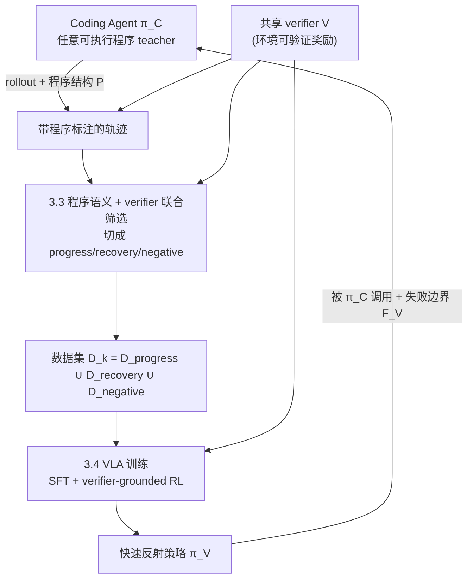

# Compiling Coding Agents into Reactive VLA Policies: Program-Semantic Supervision and Verifier-Grounded Bidirectional Co-Evolution

> 把 Coding Agent 编译成快速反射策略：以程序语义监督与 verifier 锚定的双向协同进化，将可验证的物理经验蒸馏进 VLA

## 摘要

在 "写代码控制机器人"（Code-as-Policy）范式中，Coding Agent 能灵活推理、组合感知与几何运算、处理长程结构，却**慢、每次任务都要重新推理、依赖高频大模型调用、几何轨迹多为开环、对接触扰动不够鲁棒**；而 VLA 恰好相反——**高频、闭环、反应式、抗扰动，但缺乏长程推理、需要大量示范、新技能获取成本高**。现有做法要么只用 environment reward 训练 Coding Agent 本身，要么把成功代码永远沉淀在 Skill Library 里复用，都没有把 Coding Agent 昂贵但通用的探索能力**编译**成 VLA 的快速反射能力。

我们提出 **PC²（Program-Compiled Policies via Co-evolution）**：把 Coding Agent 视为**昂贵但通用的技能探索器与数据教师**，把 VLA 视为**被逐渐编译出来的快速反射策略**，用一个 verifier 锚定的双向闭环，把 Coding Agent 产生并验证成功的物理经验持续转化为 VLA 的训练数据。核心主张有四：

1. **从固定 primitive teacher 升级为任意可执行程序 teacher**：教师不再是 grasp/place/push/pull 四类固定几何技能，而是能写条件控制流、感知 fallback、多阶段重试、几何计算、参考系变换、双臂同步、中间状态验证、以及 VLA 与解析控制混合调用的**通用程序**。
2. **程序语义监督（program-semantic supervision）**：程序结构本身提供子任务边界、物体 grounding、成功/终止条件、失败归因、预期状态变化、技能调用标签，比只有 action trajectory 的数据 richer。
3. **verifier 锚定的过程级 reward 与数据筛选**：把 CaP-RL 的可验证奖励从 "优化 Coding Agent" 扩展到 "筛选/RL 后训练 VLA、子任务级 reward、终止预测、状态变化预测、routing reward"。
4. **双向协同进化（bidirectional co-evolution）**：不是一次性 SFT，而是让新 VLA 反过来被 Coding Agent 调用、VLA 的失败边界反向更新 Coding Agent 的 routing/prompt/staging code，形成 $(\pi_C^k,\pi_V^k)\to D_k\to(\pi_C^{k+1},\pi_V^{k+1})$ 的螺旋。

一个关键工程事实贯穿全文：**成功 rollout 不能整段直接拿去 BC**。一条最终成功的自主轨迹常包含错误抓取、无效运动、碰撞、放错后恢复、多余探索；我们用程序语义 + verifier 把轨迹切成 $D=D_{\text{progress}}\cup D_{\text{recovery}}\cup D_{\text{negative}}$，只保留 progress 与 recovery，把 failure-inducing 与 idle 片段移除或作为负样本。我们从 CaP-X 分层 benchmark 出发，在 LIBERO-PRO / Robosuite / BEHAVIOR 上评价，对标 HERO、FAEA、RDGen、HELP/VLAC-CUT。

**关键词**：Code-as-Policy、Vision-Language-Action、policy compilation、program-semantic supervision、verifiable reward、trajectory curation、co-evolution、skill distillation。

## 1. 引言与动机

### 1.1 两种范式的互补缺口

Code-as-Policy 与 VLA 的能力画像几乎正交：

| 维度 | Coding Agent（Code-as-Policy） | VLA |
|---|---|---|
| 推理 | 灵活、可组合、长程 | 缺长程推理 |
| 频率/闭环 | 慢、常为开环几何轨迹 | 高频、闭环、反应式 |
| 成本 | 高频调用大模型、每任务重新推理 | 推理一次成型、边际成本低 |
| 鲁棒性 | 对接触扰动不够鲁棒 | 抗扰动、in-distribution 强 |
| 新技能获取 | 通用探索器，能"试出"新解 | 需大量示范，获取成本高 |

现有工作沿两条路各走一端：一条**只用 environment reward 训练 Coding Agent 本身**（CaP-RL 式），产物仍是慢速、需重新推理的程序；另一条把**成功代码永久沉淀进 Skill Library** 复用，但复用的仍是开环、慢速的程序表示，never becomes a fast reflex。两条路都没有回答：**能否把 Coding Agent 昂贵但通用的探索所产生并验证成功的物理经验，编译进一个高频、闭环、鲁棒的 VLA？**

### 1.2 核心视角：Coding Agent 是数据教师，VLA 是被编译出的反射策略

我们把二者的关系重构为一条**编译流水线**：

- Coding Agent = 昂贵但通用的**技能探索器 + 数据教师**：它负责在没有示范的新任务上，用程序推理"试出"成功解，并用可验证奖励确认成功；
- VLA = 被逐渐**编译**出来的快速反射策略：它把教师反复验证成功的经验固化成高频、闭环、反应式的运动技能，摊销掉"每次重新推理"的成本。

这条视角直接解决了 Code-as-Policy 的根本矛盾：**用慢而通用的推理去获取技能，用快而反应的策略去执行技能**，二者不是竞争而是编译的上下游。

### 1.3 与 HERO 的关系：基础版已被覆盖，新颖性必须上移

必须诚实：**"让 agent 成功 rollout 训练 VLA" 单独已不算完全空白。** HERO（2026-07-29）已提出非常接近的能力演化：

1. 通过 VLM grounding 和几何 primitive，从零示范执行任务；
2. 保存成功轨迹作为 exemplar；
3. 累积足够经验后，把轨迹训练进 $\pi_{0.5}$ visuomotor policy；
4. 部署时优先调用神经策略，失败后退回 exemplar 或启发式推理。

但 HERO 的初始能力主要来自四类**固定几何技能**：grasp / place / push / pull。它的 L1 更像 "VLM 标注关键点 → 执行预定义几何程序"，而**不是**可以自由编写 perception、循环、条件判断、几何运算、重试与工具组合的通用 Coding Agent。因此我们把新颖性明确上移到四点组合（见 1.4），任一点单独存在，但四者的有机结合是空白。

### 1.4 贡献

1. **任意可执行程序 teacher（arbitrary program teacher）**：把教师从固定 primitive 升级为可写控制流、fallback、重试、几何运算、参考系变换、双臂同步、中间验证、混合调用的通用 Coding Agent，产出的不只是轨迹，还有**程序结构** $P=\{f_i,\textbf{if},\textbf{while},\textbf{retry},\textbf{assert}\}$。
2. **程序语义监督**：从程序结构自动抽取子任务边界、grounding、成功/终止条件、失败归因、预期状态变化、技能调用标签，作为比 action-only 更 richer 的监督。
3. **verifier 锚定的过程级 reward 与数据筛选/RL**：把 CaP-X 的可验证奖励从 Coding Agent 复用到 VLA rollout 筛选、RL 后训练、子任务级 reward、终止/状态变化预测、routing reward。
4. **双向协同进化 + 分段化数据形式**：以 $(\pi_C^k,\pi_V^k)\to D_k\to(\pi_C^{k+1},\pi_V^{k+1})$ 的螺旋替代一次性 SFT；并把训练数据显式分为 $D_{\text{progress}}\cup D_{\text{recovery}}\cup D_{\text{negative}}$，而非 $\{\tau\mid R(\tau)=1\}$。

## 2. 相关工作

PC² 处在 "自主生成轨迹训练 VLA"、"程序/技能库蒸馏"、"可验证奖励"、"轨迹质量筛选" 四条线的交叉点。每组末尾给"分界"。

### 2.1 从成功 rollout 到 VLA（最直接前身）

- **HERO**（2026-07-29）：VLM grounding + 几何 primitive 从零示范执行 → 存成功轨迹为 exemplar → 累积后训练进 $\pi_{0.5}$ → 部署优先神经策略、失败退回 exemplar/启发式。**是本文最接近的前身。**
- **FAEA**：明确提出 Coding Agent 可在仿真中生成成功轨迹以扩增 VLA 数据，但主要作为**潜在方向**提出，未建立完整的 Coding-Agent-to-VLA 学习闭环。
- **RDGen**：证明"由非人类策略生成成功轨迹再训练 VLA"可行，但其教师是**仿真 RL policy**，而非可解释、可组合的 Coding Agent。

> **分界**：HERO 的教师是**固定四类几何 primitive**（单向 H→E→R）；FAEA 停在方向不成闭环；RDGen 的教师是黑箱 RL policy。PC² 的教师是**任意可执行程序**，且带**程序语义监督**与**双向协同进化闭环**——教师会随 VLA 变强而改变自身 routing。

### 2.2 程序/技能库与代码复用

- **Code-as-Policy / Voyager 式 Skill Library**：把成功代码沉淀为可复用技能，但表示始终是**慢速开环程序**，从不编译成反射策略。
- **CaP-X（[arXiv 2603.22435](https://arxiv.org/abs/2603.22435)）与 CaP-RL**：用可验证的物理环境奖励训练 Coding Agent，但优化目标是 **Coding Agent 本身**，不产出 VLA。

> **分界**：这些工作让"程序"越写越好或越攒越多，PC² 让程序被**编译消解**进 VLA——程序的角色从"最终产物"变为"一次性数据教师"。

### 2.3 可验证奖励与过程级监督

- **CaP-RL / 环境可验证 reward**：环境判定成功，优化 Coding Agent 的代码生成。
- **oracle-free / VLM verifier（VISOR、TOPReward、ARMOR 等）**：造成功谓词/进度奖励用于 RL 或筛选。

> **分界**：PC² 不新造 verifier，而是把**同一个** verifier 复用到一个更宽的下游集合：VLA rollout 筛选、VLA RL 后训练、子任务级 reward、终止预测、状态变化预测、routing reward。verifier 成为连接 Coding Agent 与 VLA 的**公共锚**。

### 2.4 轨迹质量与片段级筛选

- **HELP / VLAC-CUT**：表明整条最终成功的自主轨迹 ≠ 高质量示范，需区分 progress-making / idle / failure-inducing / recovery 片段；progress 与 recovery 可留，failure-inducing 与 idle 应移除或作负样本。

> **分界**：HELP/VLAC-CUT 从轨迹信号做片段划分；PC² 用**程序语义**（`if`/`retry`/`assert`/子任务边界）+ verifier **联合**做划分，切点有程序结构可依，归因更明确，且天然产出负样本标签。

### 2.5 定位小结

| 维度 | HERO | FAEA | RDGen | CaP-RL | **本文 PC²** |
|-|-|-|-|-|-|
| 教师类型 | 固定几何 primitive | Coding Agent（方向） | 仿真 RL policy | Coding Agent | **任意可执行程序** |
| 是否成闭环 | 单向 H→E→R | 否 | 单向 | 无 VLA | **双向 co-evolution** |
| 程序语义监督 | 无 | 无 | 无（黑箱） | — | **有** |
| verifier 复用到 VLA | 部分（退回判定） | — | — | 仅 Coding Agent | **筛选/RL/子任务/routing** |
| 数据形式 | 成功 exemplar | 成功轨迹 | 成功轨迹 | — | **progress∪recovery∪negative** |

## 3. 技术路线

### 3.1 总体架构：一条 verifier 锚定的编译闭环



四个模块共享同一个 verifier $V$：**程序 teacher（3.2）→ 程序语义监督 + 数据筛选（3.3）→ verifier 锚定的 VLA 训练（3.4）→ 双向协同进化（3.5）**。

### 3.2 任意可执行程序 teacher

教师是通用 Coding Agent $\pi_C$，可生成条件控制流、感知 fallback、多阶段重试、几何计算、参考系变换、双臂同步、中间状态验证、以及 VLA 与解析控制的混合调用。每次成功 rollout 产出的不只是动作序列 $\tau=(s_t,a_t)$，还有其**程序结构**

$$
P=\{f_i,\ \textbf{if},\ \textbf{while},\ \textbf{retry},\ \textbf{assert}\},
$$

以及程序执行时的调用轨迹（哪个 `f_i` 在哪些时间步生效、哪个 `assert` 通过/失败、哪次 `retry` 触发）。这是把"程序"当教师相对于"轨迹/RL policy"当教师的**根本信息增益来源**。

### 3.3 程序语义监督与联合数据筛选（核心）

**程序语义监督**。把 $P$ 的执行轨迹自动对齐到时间步，抽出六类结构标签，无需人工标注：

| 程序语义来源 | 抽出的监督信号 | 供 VLA 学什么 |
|-|-|-|
| 函数/子程序边界 `f_i` | 子任务边界、技能调用标签 | 技能分段、skill token |
| `assert` / 前后条件 | 成功条件、终止条件 | 终止预测、completion head |
| 参数中的物体引用 | 物体 grounding | language/vision grounding |
| `retry` / fallback 分支 | 失败归因、recovery 起点 | recovery 片段标注 |
| 几何计算/状态断言 | 预期状态变化 | 状态变化预测（dynamics head） |

**联合筛选（关键工程点）**。绝不整段 BC。对每条成功 rollout，用**程序语义（切点）+ verifier（片段级评分）**联合把轨迹切段并归类：

```text
输入: 成功 rollout τ, 程序结构 P, verifier V
segs = split_by_program(τ, P)      # 以 f_i/retry/assert 边界切段
for seg in segs:
    dp = progress_score(seg, V)    # 该段是否推进子任务进度
    if seg 属于 retry/fallback 且最终成功:  归入 D_recovery
    elif dp > 0 (progress-making):           归入 D_progress
    elif dp <= 0 (idle/无效运动/多余探索):    丢弃或作 D_negative
    elif seg 触发碰撞/放错/回退前的错误:      归入 D_negative
```

于是训练数据是

$$
D=D_{\text{progress}}\cup D_{\text{recovery}}\cup D_{\text{negative}},
$$

而**不是** $D=\{\tau\mid R(\tau)=1\}$。$D_{\text{progress}}$ 与 $D_{\text{recovery}}$ 做正向 BC（recovery 段尤其宝贵——它教 VLA 从错误中恢复），$D_{\text{negative}}$ 用于 RL 的负样本 / 对比学习 / 终止时避免的状态。

### 3.4 verifier 锚定的 VLA 训练

同一个环境可验证 verifier $V$（承接 CaP-RL）在 VLA 侧承担五个用途，这是 CaP-X 与 VLA 真正有机连接的地方：

1. **rollout 筛选**：只有 $V$ 判定推进的片段进入 $D_{\text{progress}}$；
2. **RL 后训练**：$V$ 作为奖励，对 SFT 后的 VLA 做 RL 微调（超越纯 BC 的上限）；
3. **子任务级 reward**：用 3.3 的子任务边界把 $V$ 分解为 per-subtask reward，缓解稀疏奖励；
4. **终止/状态变化预测**：用 `assert` 与预期状态变化监督 completion head 与 dynamics head；
5. **routing reward**：当 VLA 与解析控制混合调用时，$V$ 给出"该状态调 VLA 还是调 code"的 routing 奖励。

VLA 主体用冻结开源 backbone（$\pi_0$ / $\pi_{0.5}$ / OpenVLA）+ 轻量 head + LoRA，匹配 "sim + 少量 GPU" 的资源约束。

### 3.5 双向协同进化

不是一次性 SFT。第一轮：

$$
\pi_C^{(0)}\to D^{(0)}\to \pi_V^{(1)}.
$$

第二轮起，Coding Agent **调用新 VLA** 一起产数据（VLA 承担已编译好的高频段，Coding Agent 只在其失败边界推理）：

$$
(\pi_C^{(0)},\pi_V^{(1)})\to D^{(1)}\to \pi_V^{(2)}.
$$

同时 VLA 的失败边界 $F_V$ **反向更新** Coding Agent 的 routing rules / prompts / staging code：

$$
F_V\to \text{routing rules / prompts / staging code}.
$$

最终形成双向螺旋：

$$
(\pi_C^{k},\pi_V^{k})\to D_k\to(\pi_C^{k+1},\pi_V^{k+1}).
$$

这比 HERO 单向的 H→E→R 更接近真正的 co-evolution：教师与学生互为对方的课程设计者——VLA 把"已学会"的部分从教师负担中卸下，教师把算力集中在 VLA 尚未覆盖的失败边界，数据分布随之自动向 frontier 迁移。

### 3.6 部署期

部署时 VLA 优先执行已编译技能（高频、闭环、鲁棒），仅在其失败边界由 Coding Agent 接管长程推理与 recovery。无需 verifier 分叉，所有协同进化的数据生成与筛选离线在 sim 完成，符合 "sim 训练 → 部署" 的诚实边界。

## 4. 实验设计（从 CaP-X 出发）

遵循 4 阶段渐进框架，sim 为主，冻结开源 VLA + 轻量 head + LoRA。核心要证明三件事：**(A) 程序语义监督 + 分段筛选比整段 BC 更好；(B) verifier 锚定的过程级 reward 让 VLA 超越纯 BC；(C) 双向协同进化的多轮收益超过一次性 SFT，且超过固定 primitive teacher（HERO 式）。**

### 4.1 环境、任务与数据床

| 环境 | 用途 | 说明 |
|-|-|-|
| **Robosuite（CaP-Bench 7-task core）** | 编译收益主实验 | 从 Lift 到高精度 Peg/Nut，含大量 retry/recovery，利于测分段筛选 |
| **LIBERO-PRO** | 泛化/扰动 | Object/Goal/Spatial × Pos/Task，6 splits；测编译后 VLA 的鲁棒性 |
| **BEHAVIOR-1K** | 长程移动操作 | 长 horizon 天然含混合调用与失败边界，利于观测 co-evolution |

**协同进化协议（本文特有）**：把任务流组织成多轮 $k=0,1,2,\dots$，每轮记录教师调用成本（token/LLM 调用数）、VLA 覆盖率、数据分布向 frontier 的迁移，观测教师负担随轮次下降、VLA 覆盖上升。

### 4.2 评价指标

**主指标**
- **任务成功率**：编译后 VLA 的 zero-shot / few-shot 成功率，对齐 CaP-X。
- **单位成功成本**：达成一次成功的平均延迟 / token / LLM 调用数——编译应把成本从 Coding Agent 摊销掉。
- **教师负担下降曲线（本文独有）**：随协同进化轮次，Coding Agent 调用占比 vs VLA 执行占比。

**诊断指标**
- **分段筛选增益**：$D_{\text{progress}}\cup D_{\text{recovery}}$ vs 整段 $\{\tau\mid R=1\}$ 训练的 VLA 成功率差。
- **recovery 段价值**：加/不加 $D_{\text{recovery}}$ 对"失败后恢复率"的影响。
- **程序语义监督消融**：去掉子任务边界 / 终止条件 / 状态变化监督各自的成功率损失。
- **co-evolution 单调性**：$\pi_V^{(1)}<\pi_V^{(2)}<\dots$ 是否随轮次单调提升。

### 4.3 Baselines

1. **HERO 式固定 primitive teacher**：grasp/place/push/pull + 存 exemplar + 训 $\pi_{0.5}$ + 单向退回。**最关键对照**（检验"任意程序 teacher"的净收益）。
2. **RDGen 式黑箱 RL teacher**：教师换成仿真 RL policy，无程序语义。检验程序语义监督的净收益。
3. **整段 BC（$\{\tau\mid R=1\}$）**：不做分段筛选。检验 HELP/VLAC-CUT 式筛选的净收益。
4. **一次性 SFT（无 co-evolution）**：只跑 $\pi_C^{(0)}\to D^{(0)}\to\pi_V^{(1)}$。检验双向进化的净收益。
5. **纯 Coding Agent / 纯 VLA（$\pi_0$、OpenVLA）**：两端下界。
6. **无 verifier RL（仅 BC）**：检验过程级 reward 的净收益。

### 4.4 四阶段渐进计划

**Stage 1 — 打通**：程序 teacher 在 Cube Lift/Stack 产出带程序结构的成功 rollout；分段筛选切出 progress/recovery/negative；一次 $\pi_C\to D\to\pi_V$ 编译跑通。完成标准：编译后 VLA 成功率非平凡，且高频段延迟显著低于 Coding Agent。

**Stage 2 — 基线调优**：调筛选阈值、子任务奖励分解、LoRA 超参、RL 权重；在 ≥2 环境稳定；复现 HERO / RDGen 报告数。

**Stage 3 — 核心验证**（≥3 环境 + 协同进化协议）：
- **H1（程序 teacher）**：PC² vs HERO 式固定 primitive，成功率与可迁移任务范围更广。
- **H2（分段筛选 + 过程 reward）**：分段 + verifier RL vs 整段 BC，成功率与 recovery 率更高。
- **H3（双向进化）**：多轮 co-evolution vs 一次性 SFT，成功率单调上升且教师负担单调下降。

**Stage 4 — 系统消融**（见 4.5）。

### 4.5 消融矩阵

| 消融项 | 移除/替换 | 检验的问题 |
|-|-|-|
| teacher 类型 | 任意程序 → 固定 primitive（HERO 式） | 程序表达力的价值（主消融之一） |
| 程序语义监督 | 逐项移除子任务/终止/grounding/状态变化 | 各程序语义信号的贡献 |
| 数据筛选 | 分段 → 整段 BC | 分段筛选的净代价 |
| negative 样本 | 用 / 不用 $D_{\text{negative}}$ | 负样本对 RL 的价值 |
| verifier 用途 | 逐项关闭 筛选/RL/子任务/终止/routing | 各下游用途的贡献 |
| co-evolution 轮数 | $k\in\{1,2,3,\dots\}$ | 多轮收益是否饱和 |
| 反向更新 $F_V$ | 开/关 教师 routing 更新 | 双向 vs 单向的净收益 |

### 4.6 超参网格（初始）

```json
{
  "progress_threshold": [0.0, 0.1, 0.3],
  "subtask_reward_decompose": [true, false],
  "rl_reward_weight": [0.0, 0.5, 1.0],
  "coevolution_rounds": [1, 2, 3],
  "distill_lora_rank": [8, 16, 32],
  "negative_ratio": [0.0, 0.25, 0.5],
  "num_seeds": 3
}
```

### 4.7 预期结果与"最能代表论文的一张图"

- **代表图**：横轴协同进化轮次，双 y 轴——左轴 VLA 累计成功率（单调上升），右轴 Coding Agent 单位成功调用成本（单调下降），叠加数据分布向 frontier 迁移的示意。直观展示"教师被逐步编译进反射策略"。这是论文的记忆点。
- **筛选消融图**：分段（progress+recovery）vs 整段 BC 的成功率与 recovery 率，证明"成功 rollout 不能整段 BC"。
- **主表**：CaP-X 三床上，PC² vs HERO/RDGen/整段BC/一次性SFT/纯VLA/纯Code 的成功率 + 单位成功成本。

## 5. 风险与局限

| 风险 | 说明 | 缓解 |
|-|-|-|
| **撞车风险高** | HERO（成功 rollout→VLA）、FAEA（方向）、RDGen（非人类 teacher）均为 2026 同赛道 | 全部复现为 baseline；主张收在"任意程序 teacher + 程序语义监督 + verifier 过程 reward + 双向进化"四者组合，任一单篇不具备 |
| **整段 BC 陷阱** | 成功 rollout 含错误抓取/碰撞/多余探索 | 用程序语义 + verifier 分段，只留 progress/recovery，negative 单独处理 |
| **verifier 仅 sim 可靠** | 真实世界可验证奖励难得 | 训练/筛选离线在 sim 完成，部署只执行；诚实限定 sim→deploy |
| **co-evolution 发散** | 教师被自己坏数据污染 | verifier 硬门控 + 每轮保留 hold-out 校验，成功率不升则不接受该轮数据 |
| **程序标注对齐噪声** | 程序执行轨迹到时间步的对齐可能不准 | 用 assert/调用日志做硬对齐；消融对齐粒度 |
| **教师算力成本** | Coding Agent 高频调用大模型 | 只在 VLA 失败边界调用；报告随轮次摊销的成本曲线 |

## 6. 与文献的最终定位（一句话）

现有工作要么只用 environment reward 优化 Coding Agent（CaP-RL），要么把成功代码永久沉淀进 Skill Library，要么用固定 primitive（HERO）/黑箱 RL policy（RDGen）当教师做单向蒸馏；**本文首次把通用 Coding Agent 当作任意可执行程序 teacher，用程序语义监督 + verifier 锚定的过程级 reward 把其验证成功的物理经验分段编译进 VLA，并让教师与 VLA 双向协同进化——把 Coding Agent 从"最终产物"变为"被逐步编译消解进快速反射策略的一次性数据教师"。**

