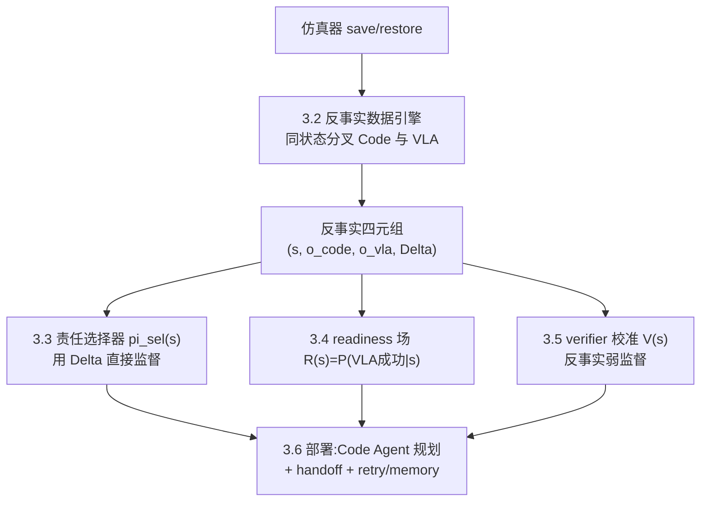

# Counterfactual Responsibility Learning for Code–VLA Hybrid Manipulation: Simulator Branching as Unbiased Supervision

需要credit assignment以及MCTS想法

> 反事实责任学习：以仿真状态分叉作为无偏监督，用于 Code–VLA 混合操作智能体

## 摘要

在"写代码控制机器人"（Code-as-Policy）的智能体范式中，一个反复出现的设计是把冻结的 VLA（Vision-Language-Action）当作 contact-rich 子技能，交给一个 coding agent 去编排：非接触阶段用解析式 primitive，接触阶段调用 VLA。这类 hybrid agent 的核心问题是**责任划分（responsibility assignment）**：在任意状态 $s$ 下，究竟应该让 Code 还是 VLA 来执行？

现有代表性工作（Harness VLA、RoboHarness、RouterVLA）都从**实际被执行的那条分支**的结果来学习责任边界、readiness 与选择策略。这引入了一个系统性的 **selection bias**：对于任意状态，我们只观测到"被选中执行器"的结果，而"未被选中执行器在同一状态下会怎样"从不被观测。责任边界因此是用有偏的、非反事实的数据估计的。

我们提出 **Counterfactual Responsibility Learning (CRL)**：利用仿真器可保存/恢复状态的特性，在**同一物理状态**上分叉出 Code 与 VLA 两条分支并各自展开，得到同状态反事实四元组 $(s, o^{\text{code}}, o^{\text{vla}}, \Delta)$。这套无偏标签同时监督三个共享同一数据源的模块：

- **(a) 责任选择器** $\pi_{\text{sel}}(s)$：直接用反事实优势 $\Delta$ 监督，而非从执行分支的有偏结果学习；
- **(b) VLA readiness 场** $R(s)=P(\text{VLA success}\mid s)$：把 VLA 反事实成功作为标签，学出可优化的成功概率场，Code Agent 据此把机器人推向 handoff state；
- **(c) 校准的成功 verifier** $V(s)$：用反事实标签弱监督校准一个 oracle-free verifier，并量化"移除 oracle 后 harness 增益退化多少、校准恢复多少"。

我们从 CaP-X 的分层 benchmark 出发，在 LIBERO-PRO / Robosuite / BEHAVIOR 上评价，并把 Harness VLA、RoboHarness、RouterVLA 作为直接 baseline。核心主张：**同状态反事实监督比执行分支监督给出更准的责任边界，且这一因果切口把 readiness 与 verifier 校准统一为同一机制的推论。**

**关键词**：Code-as-Policy、Vision-Language-Action、hybrid agent、counterfactual supervision、simulator branching、responsibility assignment、policy routing。

## 1. 引言与动机


### 1.1 背景

CaP-X 把"LLM/VLM 写机器人代码"变成可系统实验的研究对象，并系统地表明：coding agent 在高层规划、几何推理、长程组合上强，但在 contact-rich 的低层控制（如 nut_assembly 高精度插入）上存在明显缺口。与此互补，VLA 在 in-distribution 的局部视觉运动技能上强，却在部署扰动（语义重定向、目标重绑定、空间布局漂移、不稳定接触）下退化。

这两者的互补性催生了 hybrid agent如Harness VLA：让 coding agent 编排解析式 primitive 处理非接触结构，把冻结 VLA 作为可重试的 contact-rich primitive 调用。

### 1.2 核心问题：责任划分的监督信号是有偏的

hybrid agent 的关键不是"能不能调用 VLA"，而是**在哪个状态、把控制权交给谁**。形式化地，设状态 $s$，两个候选执行器 Code（记 $c$）与 VLA（记 $v$），各自从 $s$ 出发的结果（成功/进度/接触质量）为 $o^c(s), o^v(s)$。理想的责任选择器应最大化

$$
\pi_{\text{sel}}^*(s) = \arg\max_{a \in c,v} \mathbb{E}[o^a(s)].
$$

问题在于**监督信号**。真实部署（以及现有工作的训练）只能观测到**被选中分支**的结果：若在 $s$ 选了 $c$，则只见到 $o^c(s)$，$o^v(s)$ 永远缺失（反之亦然）。于是选择器只能从

$$
\mathcal{D}*{\text{exec}} = (s, a*{\text{chosen}}, o^{a_{\text{chosen}}}(s))
$$

这类**执行分支数据**中学习。这与因果推断里的 fundamental problem of causal inference 同构：我们从不同时观测同一单元的两个 potential outcomes。由此产生三重偏差：

1. **Selection bias**：训练分布由既有（很可能次优的）选择策略决定，未被选执行器在该状态的表现从不进入监督。
2. **无法估计反事实优势** $\Delta(s) = \mathbb{E}[o^c(s)] - \mathbb{E}[o^v(s)]$：而这恰是责任边界的正确学习目标。
3. **readiness 与 verifier 复用了同样有偏的信号**：readiness（"摆到什么状态 VLA 才成功"）本质是 $o^v(s)$ 的条件期望；verifier（判成功）在 harness 里驱动 retry/memory，其误差沿有偏数据级联。


### 1.3 关键洞察：仿真器可以提供反事实

仿真器（LIBERO/Robosuite/Isaac 等）支持 `save_state`/`restore_state`。这意味着我们可以在**完全相同的物理状态** $s$ 上：先展开 Code 分支得到 $o^c(s)$，`restore`，再展开 VLA 分支得到 $o^v(s)$。于是能构造**同状态反事实数据**

$$
\mathcal{D}_{\text{cf}} = (s, o^c(s), o^v(s), \Delta(s)),
$$

这正是执行分支数据 $\mathcal{D}_{\text{exec}}$ 结构性缺失的部分。这个能力在真实机器人上不可得（无法回滚物理世界），但在 sim 中几乎免费，且 CaP-X 系工作本就以 sim 为主要评价床。

### 1.4 贡献

1. **提出同状态反事实责任学习框架 CRL**：用 simulator branching 得到无偏的 $\Delta(s)$ 标签，直接监督责任选择器；与"执行分支监督"作受控对比，量化 selection bias 的代价。
2. **把 VLA readiness 从"检索/距离估计"升级为"反事实成功概率场"**：$R(s)=P(o^v(s)=\text{success})$ 由同一套反事实标签学出，Code Agent 用它规划 handoff 目标，直接对标 RoboHarness 的 Memory Bridge。
3. **oracle 敏感性分析 + verifier 反事实校准**：系统测量 harness 增益对成功谓词准确度的依赖，并用反事实标签弱监督校准 oracle-free verifier，报告增益恢复比例。
4. **统一视角**：证明责任、readiness、verifier 三者可由同一反事实机制导出，而非三个拼接的独立模块。


## 2. 相关工作

我们把相关工作分成四组，并在每组末尾用一句话说明"本文与之的分界"。所有对标工作均为 2024–2026 的 arXiv/会议工作，撞车风险高，因此定位必须精确。

### 2.1 Code-as-Policy 谱系与 CaP-X

CaP-X（[arXiv 2603.22435](https://arxiv.org/abs/2603.22435)）把 code-as-policy 拆成 CaP-Gym / CaP-Bench / CaP-Agent0 / CaP-RL 四层，用分层 benchmark 隔离 API 抽象、交互轮次、视觉 grounding 三个变量，并发现：高层 primitive 掩盖了模型真实能力，低层 S3/S4 暴露代码正确性与几何推理缺口。其谱系工作包括 Playful/RATs（自主 play 预学技能）、GaP（graph-as-policy 结构化图）、ASPIRE（失败驱动的技能发现）、RHO/HELIX（训练期整仓 reflective evolution）、ENPIRE（真实机器人 physical autoresearch）。

> **分界**：这些工作要么把 VLA 只当 baseline 去超越（CaP-X、RHO），要么根本不涉及 VLA。本文关注的是"Code 与 VLA 谁负责哪段"这一 CaP-X 谱系尚未正面处理的责任划分问题。


### 2.2 Code–VLA hybrid agent（最直接的前身）

- **Harness VLA**（[arXiv 2607.08448](https://arxiv.org/abs/2607.08448)）：把冻结 VLA 暴露为可重试的 contact-rich primitive `VLA_ACT`，与固定的解析式 primitive（grounding/staging/transport/release）组合。它明确"learns the operating range of these fixed primitives from task-specific execution traces, global success rules, and failure models"，并"learns *where the VLA should begin acting*"。在 LIBERO-Pro / RoboCasa365 上分别比最强 baseline 高 38.6 / 25.4 个百分点。
- **Tool-Aligned VLA / TAPT**（[arXiv 2605.13119](https://arxiv.org/abs/2605.13119)）：用残差 adapter 把通用 VLA 后训练成一族 bounded-subtask 工具，供 planner 选择组合。
- **CodeGraphVLP**（[arXiv 2604.22238](https://arxiv.org/abs/2604.22238)）、**Cortex**（[arXiv 2607.05377](https://arxiv.org/abs/2607.05377)）、**VLAPilot**：code/图/VLM planner 编排 VLA 执行长程任务。

> **分界**：Harness VLA 是本文的直接前身，但它的 operating range / where-to-begin **只从被执行的分支的 traces 学**——这正是本文要修正的 selection bias。本文不改变 hybrid 形态，而是替换其监督信号来源（执行分支 → 同状态反事实）。


### 2.3 异构策略路由与选择监督

- **RoboHarness**（[arXiv 2607.18060](https://arxiv.org/abs/2607.18060)）：多模态执行记忆刻画策略 capability boundary 做路由；其 **Memory Bridge** 检索目标策略的相关轨迹、估计其 in-distribution state region、生成 bridge trajectory 把机器人引导到 handoff state。
- **RoboRouter**（[arXiv 2603.07892](https://arxiv.org/abs/2603.07892)）：training-free，用相似任务的历史执行记录估计哪条 policy 最可能成功，回溯式统计。
- **RouterVLA**（[arXiv 2606.27355](https://arxiv.org/abs/2606.27355)）：把 smoke test 变成异构 VLA 选择的监督，并**明确警告 ledger 中 counterfactual expert outcome 泄漏进 profile 会造出"不可能的选择器"**，因此把 outcome separation 定义进问题本身。

> **分界**：(i) RoboHarness 的 readiness 是**检索+距离阈值的非参数估计**，本文是**学出的反事实成功概率场**；(ii) RoboRouter 是回溯统计，RouterVLA 是 i.i.d. probe——都不是**同一物理状态**上的反事实对照；(iii) RouterVLA 警示的 leakage 问题，恰好被本文的"同状态分叉、outcome 只做训练标签不进部署 profile"设计原生规避。


### 2.4 反事实数据生成、oracle-free verifier、符号-神经责任

- **同状态分叉/恢复生成监督**：MAGMA-GEN、Dream2Fix（[arXiv 2603.13528](https://www.arxiv.org/abs/2603.13528)）、PGDG（[arXiv 2605.21710](https://arxiv.org/abs/2605.21710)）、ReTRy（[arXiv 2505.09546](https://arxiv.org/abs/2505.09546)）：从同一初始状态、匹配条件重执行来验证/合成 recovery 数据。**目标是恢复动作，不是执行器责任选择。**
- **oracle-free 成功检测/reward**：VISOR（[arXiv 2605.10408](https://arxiv.org/abs/2605.10408)）、ARMOR（ICLR2026）、TOPReward（[arXiv 2602.19313](https://arxiv.org/abs/2602.19313)）、Large Reward Models（[arXiv 2603.16065](https://arxiv.org/abs/2603.16065)）：用 VLM 做成功谓词/进度 reward。**这些是"造 verifier"，本文关注的是"harness 增益对 verifier 准确度的依赖，以及用反事实标签校准它"。**
- **符号-神经责任边界**：BlendRL（[arXiv 2410.11689](https://arxiv.org/abs/2410.11689)）用 blending 权重联合 RL 学符号 vs 神经的责任；ReSET / "Prepare Before You Act"（[arXiv 2509.18043](https://arxiv.org/abs/2509.18043)）用 reduction policy 把初始状态压回 base policy 窄分布；SwitchVLA（[arXiv 2506.03574](https://arxiv.org/abs/2506.03574)）用接触状态/行为模式做执行感知的任务切换；"Diagnosing Semantic Handoff Failures"（[arXiv 2607.06256](https://arxiv.org/abs/2607.06256)）提出 next-skill-indexed readiness 谓词 $\rho(s_t,s_{t+1})$，但作为 design direction，用人写 postcondition 近似。

> **分界**：本文的新意不在"造反事实数据/verifier/责任边界"任一单点，而在**用同状态反事实这一单一因果机制，同时、无偏地导出责任选择、readiness 场、verifier 校准三者**，并对 selection bias 做首个受控量化。


### 2.5 定位小结


| 维度             | Harness VLA | RoboHarness | RouterVLA      | **本文 CRL**      |
| -------------- | ----------- | ----------- | -------------- | --------------- |
| 责任监督来源         | 执行分支 traces | 执行记忆（回溯）    | i.i.d. probe   | **同状态反事实分叉**    |
| selection bias | 存在，未处理      | 存在          | 部分意识到(leakage) | **显式消除并量化**     |
| readiness      | —           | 检索+距离(非参数)  | —              | **学出的成功概率场**    |
| verifier       | 近 oracle    | 记忆/VLM      | 二值 probe       | **反事实校准+敏感性分析** |
| 三模块关系          | 独立          | 独立          | 单一             | **同一反事实机制的推论**  |


## 3. 技术路线


### 3.1 总体架构

CRL 由四部分组成，全部共享**同一套反事实标签**：反事实数据引擎（3.2）→ 责任选择器（3.3）→ readiness 场（3.4）→ verifier 校准与敏感性分析（3.5）。部署期（3.6）不再需要 sim 分叉，仅使用学出的轻量模块。




### 3.2 反事实数据引擎（核心）

**触发状态采样**。逐状态全展开成本过高，因此只在**决策点**触发分叉：当 Code Agent 即将进入一个接触相关子任务边界（如 `grasp`/`insert`/`place` 之前），或当解析式 primitive 完成一次 staging 之后。对每个触发状态 $s$：

```text
输入: 触发状态 s, 任务指令 l, 分叉次数 K
handle = sim.save_state()
# Code 分支
for k in 1..K:
    sim.restore(handle)
    roll_code_k = execute_code_branch(s, l)   # coding agent 合成/复用的程序
# VLA 分支
for k in 1..K:
    sim.restore(handle)
    roll_vla_k  = execute_vla_branch(s, l)    # 冻结 VLA 短时 burst
# 结果聚合(见下)
o_code = aggregate(roll_code_1..K)
o_vla  = aggregate(roll_vla_1..K)
Delta  = score(o_code) - score(o_vla)
emit (s, o_code, o_vla, Delta)
```

**结果度量 $o^a(s)$**（不依赖最终 oracle，尽量用可从 sim 直接读的物理量）：

- 子任务成功指示（sim privileged 判定，仅用于训练标签，不用于部署）；
- dense progress / 接触质量（grasp 稳定性、对齐误差、力/接触事件）；
- 因随机性用 $K$ 次分叉估 $\hat{P}(o^a=\text{success})$ 与其 Wilson 下界，缓解低样本方差。

**$\Delta(s)$ 定义**：$\Delta(s) = \hat{P}(o^c=\text{succ}) - \hat{P}(o^v=\text{succ})$（或用 progress 差的连续版本），作为责任选择的无偏优势标签。

**成本控制**：$K$ 取小值（如 5，参照 RoboRouter"10 trials 足够"的观察）；VLA 分支限制为短 horizon burst；触发状态子采样。把分叉成本作为超参并报告 tokens/rollouts 预算。

### 3.3 责任选择器

学一个轻量 head $\pi_{\text{sel}}(a\mid s)$（输入为 $s$ 的多模态特征：RGB-D 编码 + proprioception + 任务嵌入），用反事实优势直接监督：

$$
\mathcal{L}*{\text{sel}} = \mathbb{E}*{s\sim\mathcal{D}*{\text{cf}}}\big[\ell\big(\pi*{\text{sel}}(s),\ \operatorname{sign}(\Delta(s))\big)\big] + \lambda|\Delta(s)|\text{-加权项}
$$

用 $|\Delta(s)|$ 加权，使边界模糊区（两者相当）不主导损失，把容量集中在责任明确的状态。

**关键对照（贡献 1 的核心实验）**：训练一个 **执行分支 baseline** $\pi_{\text{sel}}^{\text{exec}}$，它只用 $\mathcal{D}_{\text{exec}}$（模拟 Harness VLA 式"只见被执行分支"）监督。对比两者在 held-out 状态上的**责任误判率**与下游任务成功率，量化 selection bias 的代价。

### 3.4 VLA readiness 场（吸收组件 2）

把 VLA 分支的反事实成功作为标签，学 $R(s)=P(o^v(s)=\text{success})$。它有两个用途：

1. **handoff 规划**：Code Agent 在调用 VLA 前，用解析式 primitive 把机器人推向 $\arg\max_{s'\in\text{reachable}(s)} R(s')$。这与 RoboHarness Memory Bridge 目标一致，但把"检索+距离"换成"学出的成功概率场"，可对每个 handoff 目标做梯度/采样优化。
2. **责任与 readiness 的一致性约束**：当 $R(s)$ 低时 $\pi_{\text{sel}}$ 应倾向 Code；训练时加一致性正则耦合两者。

**直接对标实验**：在相同任务上比较三种 handoff 策略——(i) 无 handoff（直接调 VLA）、(ii) RoboHarness 式检索 bridge、(iii) 本文 $R(s)$ 引导——报告 VLA 子任务成功率。

### 3.5 oracle-free verifier 校准与敏感性分析（吸收组件 3）

**动机**：RATs/ASPIRE/Harness VLA 的增益很大程度建立在准确成功谓词上——它驱动 completion 判定、retry 触发、memory 写入。移除 oracle 后误差会沿这三条链路级联。

**实验设计**：

1. **敏感性分析**：在 harness 中把 oracle 谓词替换为不同准确度的 verifier（oracle → VLM verifier(VISOR/TOPReward 式) → 故意注入噪声的谓词），测量下游 (a) task success、(b) 无效 retry 率、(c) 错误 memory 写入率 的退化曲线。这一"harness 增益对谓词准确度的依赖曲线"是首个系统结果。
2. **反事实校准**：用 $\mathcal{D}_{\text{cf}}$ 中的 privileged 成功标签，**弱监督校准**一个 oracle-free verifier $V(s)$（temperature scaling / 轻量 head 微调），报告"校准前后 harness 增益恢复了多少百分比"。

> 注意：反事实标签仅在 sim 可得；校准得到的 $V(s)$ 是可迁移到无 oracle 部署的产物，这构成一个诚实的 sim→deploy 桥。


### 3.6 部署期

部署时无 sim 分叉：Code Agent 用 $\pi_{\text{sel}}$ 决定责任，用 $R(s)$ 规划 handoff，用校准后的 $V(s)$ 驱动 completion/retry/memory。全部为轻量 head，冻结 VLA 用开源 π0 / OpenVLA（可选 LoRA）。这与用户资源约束（sim + 少量 GPU 做 LoRA/小规模微调）匹配。

## 4. 实验设计（从 CaP-X 出发）

设计遵循 4 阶段渐进框架：先在最简单设置跑通，再调基线，再验证核心创新，最后系统消融。所有实验以 sim 为主，冻结开源 VLA + 轻量 head + 可选 LoRA。

### 4.1 环境、任务与数据床

直接复用 CaP-X 谱系的评价床，保证与 baseline 可比：


| 环境                                   | 用途         | 任务举例                                                                    | 协议                                                         |
| ------------------------------------ | ---------- | ----------------------------------------------------------------------- | ---------------------------------------------------------- |
| **Robosuite（CaP-Bench 7-task core）** | 主受控实验、责任分析 | Cube Lift/Stack/Re-stack、Spill Wipe、Peg Insertion、Two-Arm Lift/Handover | 每 task 100 trials；含高精度接触任务 nut_assembly 作为难例               |
| **LIBERO-PRO**                       | 泛化与扰动      | Object/Goal/Spatial × Pos/Task 扰动，6 splits                              | 每 task 10 seeds；与 CaP-Agent0/Harness VLA/π0.5/OpenVLA 同表比较 |
| **BEHAVIOR-1K**                      | 长程移动操作     | Pick up Radio、Soda Can                                                  | 分别报 navigation / task success                              |


**为何从 CaP-X 出发**：(i) 它的分层 tier（S1–S4/M1–M4）天然隔离了"高层抽象掩盖能力"的问题，便于把责任划分与抽象层级解耦；(ii) 它的 7-task core 含从简单（Lift）到高精度接触（Peg/Nut）的梯度，正是责任边界最该体现价值的地方；(iii) baseline 都在同一床上报过数。

### 4.2 评价指标

**主指标**

- **Task success rate（Zero-shot Pass@1 及 few-shot）**：核心，对齐 CaP-X。
- **责任误判率（Responsibility error）**：在有 privileged 反事实标签的 held-out 状态上，$\pi_{\text{sel}}(s)\ne \arg\max_a o^a(s)$ 的比例。**这是本文独有、直接检验主张的指标。**
- **VLA 子任务成功率 @ handoff**：readiness 引导 vs 检索 bridge vs 无 handoff。

**诊断/效率指标**

- **无效 retry 率、错误 memory 写入率**：verifier 敏感性分析用。
- **反事实数据成本**：branching rollouts 数、GPU·h、tokens（若 coding agent 用闭源后端）。
- **selection-bias gap**：$\pi_{\text{sel}}^{\text{cf}}$ 与 $\pi_{\text{sel}}^{\text{exec}}$ 的成功率/误判率差，随训练数据量的曲线。


### 4.3 Baselines

必须复现以守住 novelty（这三篇同赛道、2026 年）：

1. **CaP-Agent0**（纯 code hybrid 的下界参照）。
2. **Harness VLA**（[2607.08448](https://arxiv.org/abs/2607.08448)）：直接前身，其 operating range 只从执行分支学——**最关键对照**。
3. **RoboHarness**（[2607.18060](https://arxiv.org/abs/2607.18060)）：其 Memory Bridge 作为 readiness 的对照。
4. **RouterVLA**（[2606.27355](https://arxiv.org/abs/2606.27355)）/ **RoboRouter**（[2603.07892](https://arxiv.org/abs/2603.07892)）：路由/选择监督对照。
5. **纯 VLA**（OpenVLA、π0/π0.5）与 **纯 Code**：两端参照。
6. **本文的执行分支消融** $\pi_{\text{sel}}^{\text{exec}}$：内部最重要的 apples-to-apples 对照（同架构、仅监督信号不同）。


### 4.4 四阶段渐进计划

**Stage 1 — 打通（最简设置）**

- 目标：反事实数据引擎在 Robosuite Cube Lift/Stack 跑通；`save/restore` 一致性验证（同 seed 分叉结果可复现）；产出第一批 $\mathcal{D}_{\text{cf}}$。
- 完成标准：能训出非平凡的 $\pi_{\text{sel}}$，责任误判率显著低于随机（0.5）。
- 迭代上限：5。

**Stage 2 — 基线调优**

- 目标：不改架构，调 $K$、触发采样密度、head 学习率/损失权重 $\lambda$；在 ≥2 个环境（Robosuite + LIBERO-PRO）稳定。
- 完成标准：训练曲线稳定，责任误判率、task success 均优于 Stage 1；复现出 Harness VLA / RoboHarness 的报告数（±可接受误差）。

**Stage 3 — 核心创新验证**

- 目标：在 ≥3 个环境（+ BEHAVIOR-1K）验证三大主张：
  - **H1（selection bias）**：$\pi_{\text{sel}}^{\text{cf}}$ vs $\pi_{\text{sel}}^{\text{exec}}$ 的责任误判率与 task success 显著差异（多 seed，报显著性）。
  - **H2（readiness）**：$R(s)$ 引导的 handoff 优于 RoboHarness 检索 bridge 与无 handoff。
  - **H3（verifier）**：oracle 敏感性曲线 + 反事实校准恢复的增益比例。
- 完成标准：H1 至少在高精度接触任务（Peg/Nut/Handover）上成立并有统计显著性。

**Stage 4 — 系统消融**

- 与 Stage 3 同数据床，逐组件分析（见 4.5）。
- 完成标准：所有计划消融完成，能归因各组件贡献。


### 4.5 消融矩阵


| 消融项             | 移除/替换什么                 | 检验的问题                    |
| --------------- | ----------------------- | ------------------------ |
| 监督信号            | 反事实 → 执行分支              | selection bias 的净代价（主消融） |
| 分叉次数 $K$        | $K\in1,3,5,10$          | 反事实估计方差 vs 成本权衡          |
| readiness 来源    | 学出场 → 检索/距离 / 无         | readiness 的增益归属          |
| readiness 一致性正则 | 开/关                     | 责任与 readiness 耦合是否有用     |
| verifier        | oracle / VLM / 校准后 / 噪声 | 增益对谓词准确度的依赖与校准恢复         |
| 触发采样            | 决策点触发 → 均匀/随机           | 触发策略对数据效率的影响             |
| $\Delta$ 形式     | 成功差 → progress 连续差      | 连续优势是否更稳                 |


### 4.6 超参网格（初始）

```json
{
  "K_branches": [1, 3, 5, 10],
  "selector_lr": [1e-4, 3e-4, 1e-3],
  "lambda_delta_weight": [0.0, 0.5, 1.0],
  "vla_burst_horizon": [10, 20, 40],
  "readiness_consistency_coef": [0.0, 0.1, 0.5],
  "num_seeds": 3
}
```


### 4.7 预期结果与"最能代表论文的一张图"

- **主表**：Robosuite 7-task + LIBERO-PRO 6-split 上，CRL vs Harness VLA/RoboHarness/RouterVLA/纯VLA/纯Code 的 task success，尤其在 nut_assembly/Peg/Handover 等责任边界敏感任务上体现优势。
- **代表图**：responsibility error vs 训练数据量的双曲线（反事实 vs 执行分支），直观展示 selection bias gap 随数据不收敛闭合——这是论文的"记忆点"。
- **诊断图**：verifier 准确度 → harness 增益的退化曲线 + 校准恢复点。


## 5. 风险与局限


| 风险                  | 说明                                                | 缓解                                                                     |
| ------------------- | ------------------------------------------------- | ---------------------------------------------------------------------- |
| **撞车风险高**           | Harness VLA / RoboHarness / RouterVLA 均为 2026 同赛道 | 三者全部复现为直接 baseline；主张严格限定在"同状态反事实"这一它们都不具备的点                           |
| **反事实仅 sim 可得**     | 真实世界无法 restore state                              | 主张限定为"sim 反事实训练 → 部署 zero-shot 迁移"；verifier 校准产物可迁移，构成诚实的 sim→deploy 桥 |
| **VLA 分叉成本高**       | 每触发状态跑 $2K$ 次 rollout                             | 决策点触发 + 子采样 + 小 $K$；报告完整成本预算                                           |
| **sim-to-real 外推**  | responsibility 场可能不迁移                             | 至少做一组 BEHAVIOR/真实机器人 preliminary 迁移，诚实报告负迁移                            |
| **VLA backbone 依赖** | 结论可能随 VLA 强弱变化                                    | 至少用 2 个开源 VLA（OpenVLA + π0）验证结论稳健性                                     |


