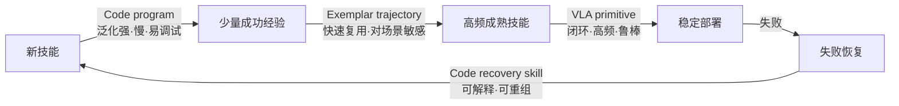
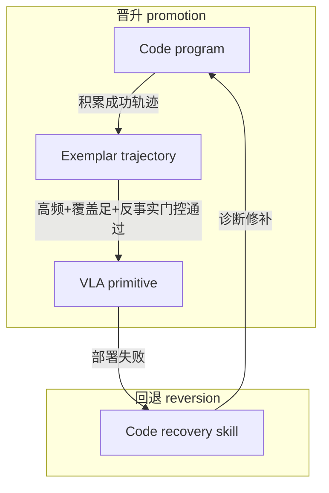

# Maturity-Driven Representation Migration for Code–VLA Skill Lifecycles: Counterfactual Promotion and Failure-Triggered Reversion

> 成熟度驱动的表示迁移：以反事实晋升与失败回退管理 Code–VLA 技能生命周期

## 摘要

现有 Code–VLA 混合操作智能体（如 Harness VLA）把"用什么表示执行一段技能"当作一个**静态的二元责任划分**：非接触用 Code，接触用冻结 VLA。但这忽略了一个基本事实——**同一个技能在其生命周期的不同阶段，最优表示是不同的**。一个刚出现的新技能最适合用可调试、强泛化的 Code program 表达；积累少量成功后可退化为快速复用的 exemplar trajectory；当它变成高频、成熟的技能时，闭环、高频、鲁棒的 VLA primitive 才是最佳载体；而一旦在部署中失败，又需要回退到可解释、可重组的 Code recovery skill 去诊断与修补。

我们提出 **Maturity-Driven Representation Migration (MDRM)**：把技能表示建模为**技能成熟度的函数**，并让表示在生命周期中自动迁移。四种表示与其角色：

| 能力阶段 | 表示 | 特点 |
|---|---|---|
| 新技能 | **Code program** | 泛化强、慢、易调试 |
| 少量成功经验 | **Exemplar trajectory** | 快速复用，但对场景变化敏感 |
| 高频成熟技能 | **VLA primitive** | 闭环、高频、鲁棒 |
| 失败恢复 | **Code recovery skill** | 可解释、可重新组合 |

核心机制有三：**(1) 成熟度估计**——用可靠性、频次、场景覆盖度刻画每个技能的成熟阶段；**(2) 反事实晋升门控（counterfactual promotion gate）**——沿用 v0 的 simulator branching，在同一状态上分叉出候选表示（如 Code vs 待蒸馏的 VLA primitive），只有当高一级表示的反事实成功率不低于当前表示时才晋升，从而无偏地决定"何时把 Code 蒸馏成 VLA primitive"；**(3) 失败触发回退（failure-triggered reversion）**——部署失败时把控制权交回 Code recovery skill，诊断后重新进入生命周期。

我们从 CaP-X 分层 benchmark 出发，在 LIBERO-PRO / Robosuite / BEHAVIOR 上评价，对标 Harness VLA、Evolving Programmatic Skill Networks、InSight、AtomicVLA。核心主张：**把"表示选择"从静态责任划分升级为"成熟度驱动的表示迁移"，且用反事实门控保证每次迁移都不降低能力，能在长期部署中同时获得 Code 的可调试性、trajectory 的复用效率与 VLA 的鲁棒高频。**

**关键词**：Code-as-Policy、Vision-Language-Action、skill lifecycle、representation migration、skill distillation、counterfactual promotion、failure recovery。

## 1. 引言与动机

### 1.1 从"责任划分"到"表示迁移"

v0（CRL）把问题定义为：在状态 $s$ 让 Code 还是 VLA 执行。这是**静态**的、且假设两种表示同时存在、能力固定。但真实的技能获取是**动态**的：一个技能会经历"从无到有、从少到多、从生疏到成熟、偶尔失败"的生命周期。把表示钉死在"接触=VLA、非接触=Code"忽视了两件事：

1. **同一段技能，最优表示随成熟度变化**。刚遇到的新任务，没有任何 VLA 训练分布覆盖它，只能靠 Code program 的强泛化+可调试性慢慢试出解；一旦有了几条成功轨迹，直接 exemplar replay 比每次重新推理更快；当这个技能被反复高频调用、且已积累足够数据，把它蒸馏进 VLA primitive 能得到闭环、高频、抗扰动的执行；而任何表示在部署中失败时，最该做的是回到可解释的 Code 去诊断，而不是让黑箱策略反复重试。
2. **表示之间应当能迁移**。Code 的成功经验可以变成 exemplar，exemplar 累积到一定量可以蒸馏成 VLA primitive，VLA 失败可以触发 Code recovery——这是一条**表示的升级/降级流水线**，而现有工作要么固定表示，要么只在单一表示内演化。

### 1.2 四种表示的互补性（用户框架）



关键观察：这四种表示不是竞争关系，而是**同一技能在不同成熟阶段的最优载体**。论文的任务是：(a) 定义成熟度并据此选表示；(b) 保证表示迁移（尤其 Code→VLA 蒸馏）不降低能力；(c) 用失败信号闭合回退环。

### 1.3 为什么现在可做、且与 v0 一脉相承

v0 的 simulator branching 反事实机制在这里获得了**新的、更自然的用途**：不再只回答"当前状态选谁"，而是回答"**该不该把这个技能从表示 A 晋升到表示 B**"——在同一批触发状态上分叉出 A 与 B 两条分支，比较反事实成功率，作为**晋升门控**。这把 v0 的单点决策扩展为生命周期级的表示管理，且天然规避了"盲目蒸馏导致能力退化"的风险（InSight 式 flywheel 缺少这种反事实门控）。

### 1.4 贡献

1. **提出成熟度驱动的表示迁移框架 MDRM**：首次把机器人技能的**表示形态**显式建模为**成熟度的函数**，并定义 Code→exemplar→VLA primitive 的晋升与 VLA→Code recovery 的回退流水线。
2. **反事实晋升门控**：用同状态 simulator branching 无偏地决定"何时蒸馏"，保证每次表示迁移不降低反事实成功率（防止 InSight/Voyager 式无门控 flywheel 的能力回退）。
3. **失败触发的可解释回退**：把失败恢复显式建模为回到 Code recovery skill 的降级路径，兼顾鲁棒性与可诊断性。
4. **长期部署视角的评价**：不只报单任务成功率，而是报"随部署时长的表示分布演化、累计成功率、单位成功成本（token/延迟）"，展示 maturity-aware 迁移的长期收益。

## 2. 相关工作

MDRM 处在 Code–VLA hybrid、自进化技能库、VLA 技能蒸馏三条线的交叉点。以下每组末尾给"分界"。

### 2.1 Code–VLA hybrid 与静态责任划分

- **Harness VLA**（[arXiv 2607.08448](https://arxiv.org/abs/2607.08448)）：冻结 VLA 作为可重试 contact primitive，与固定解析式 primitive 组合。**表示是静态的**：接触归 VLA、非接触归 Code，不随技能成熟度变化。
- **Tool-Aligned VLA / TAPT**（[arXiv 2605.13119](https://arxiv.org/abs/2605.13119)）、**Cortex**（[arXiv 2607.05377](https://arxiv.org/abs/2607.05377)）、**CodeGraphVLP**（[arXiv 2604.22238](https://arxiv.org/abs/2604.22238)）：planner 编排 VLA 工具，表示固定。

> **分界**：这些工作的表示分配是静态的、由"是否接触"决定；MDRM 的表示分配是**动态的、由技能成熟度决定**，且表示会在生命周期中迁移。

### 2.2 自进化技能库与成熟度

- **Evolving Programmatic Skill Networks (PSN)**（[arXiv 2601.03509](https://arxiv.org/abs/2601.03509)）：提出 **maturity-aware update gating**——成熟技能降低更新频率、不成熟技能保持可塑，并做在线 refactor。**与本文"成熟度"轴最接近的工作。**
- **Uni-Skill**（[arXiv 2603.02623](https://arxiv.org/abs/2603.02623)）：自进化技能库，从视频检索技能示例，混用 code 计划与轨迹参考。
- **Voyager 式** skill library（LLM 写 code 技能累积）：只在 code 单一表示内增长。

> **分界**：PSN 的 maturity gating **只调节同一（程序）表示的更新频率**，从不改变表示形态；Uni-Skill 混用 code 与 trajectory 但不做"随成熟度把 code 蒸馏成神经 primitive"的跨表示迁移。MDRM 的核心正是**跨表示的成熟度驱动迁移**（Code→exemplar→VLA→Code recovery），且用反事实门控保证不退化。

### 2.3 VLA 技能获取与蒸馏

- **InSight**（[arXiv 2606.24884](https://arxiv.org/abs/2606.24884)）：VLM 发现 primitive gap → 用低层控制自动采成功 rollout → 蒸馏进可 steer 的 VLA。**这是 Code/低层控制→VLA primitive 的直接前身。**
- **PrimitiveVLA**（[arXiv 2605.28634](https://arxiv.org/abs/2605.28634)）：把轨迹拆成可复用 motion primitive 训练 VLA（Disassemble & Assemble）。
- **AtomicVLA**（[arXiv 2603.07648](https://arxiv.org/abs/2603.07648)，CVPR 2026）：SG-MoE 技能专家库，加新技能只需扩 router + 新专家，缓解灾难遗忘。

> **分界**：InSight 的 flywheel **无晋升门控**——只要 VLM oracle 判成功就把 rollout 蒸进 VLA，可能把"当前 code 已很好的技能"蒸成更差的 VLA primitive 而不自知（Voyager 式无门控增长同理）。MDRM 用 v0 的**同状态反事实**做门控：只有 VLA primitive 的反事实成功率 ≥ 当前 Code 表示时才晋升，且保留 Code 作为回退，蒸馏是**可验证、可逆**的。AtomicVLA/PrimitiveVLA 关注 VLA 内部如何组织 primitive，不涉及"从 code 表示迁移过来"与"失败回退到 code"。

### 2.4 反事实监督（继承 v0）

v0 的 CRL 用 simulator branching 做同状态反事实责任监督（对标 RoboHarness [arXiv 2607.18060](https://arxiv.org/abs/2607.18060)、RouterVLA [arXiv 2606.27355](https://arxiv.org/abs/2606.27355)、RoboRouter [arXiv 2603.07892](https://arxiv.org/abs/2603.07892)）。MDRM **复用同一反事实机制**，但把它从"单点责任选择"重新用于"生命周期级表示晋升门控"。

> **分界**：v0 回答"此刻选谁"，MDRM 回答"该不该把这个技能从表示 A 永久迁到表示 B"——决策对象从 per-state action 变为 per-skill representation，时间尺度从单次 rollout 变为技能生命周期。

### 2.5 定位小结

| 维度 | Harness VLA | PSN | InSight | AtomicVLA | **本文 MDRM** |
|-|-|-|-|-|-|
| 表示是否随成熟度变 | 否（静态） | 否（单表示内调频） | 部分（单向蒸馏） | 否 | **是（跨表示迁移）** |
| 表示种类 | Code+VLA | 仅程序 | 轨迹→VLA | VLA 专家 | **Code / exemplar / VLA / recovery 四态** |
| 晋升是否有反事实门控 | — | 无 | 无（靠 VLM oracle） | — | **有（同状态反事实）** |
| 失败回退到可解释表示 | 重试 VLA | — | — | — | **回退到 Code recovery** |
| 长期部署表示演化评价 | 无 | 部分 | 无 | 连续学习 | **显式报告** |

## 3. 技术路线

### 3.1 技能与表示的形式化

把一个技能记为 $k$（如 "grasp mug"、"insert peg"），它在时刻 $t$ 有一个成熟度状态 $m_k(t)$ 与一个当前表示 $\rho_k(t)\in\{\text{Code},\text{Exemplar},\text{VLA},\text{Recovery}\}$。技能库 $\mathcal{K}$ 维护每个技能的 $(\rho_k, m_k, \text{stats}_k)$。目标是学一个迁移策略，使长期累计成功率与单位成功成本最优。

### 3.2 成熟度估计

$m_k$ 由三个可观测量刻画（全部来自执行日志，无需人工标注）：

- **可靠性** $r_k$：近窗成功率的 Wilson 下界（承接 v0 与 Playful/RATs 的 competence 度量）。
- **频次** $f_k$：技能被调用的频率（高频才值得蒸馏成 VLA，摊销训练成本）。
- **场景覆盖** $c_k$：成功经验覆盖的初始状态分布广度（决定 exemplar 是否够、VLA 训练数据是否足）。

成熟阶段用阈值/学习分类器映射：低 $r$→新技能（Code）；中 $r$、低 $c$→少量经验（Exemplar）；高 $r$ 且高 $f$ 且高 $c$→成熟（可晋升 VLA）。

### 3.3 表示迁移流水线



**Code → Exemplar**：当 Code program 在若干实例上成功，抽取其成功轨迹（末端轨迹 + 关键接触事件）存为 parameterized exemplar，供后续同类状态快速 replay，省去每次重新推理/编译的开销。

**Exemplar → VLA primitive（关键步，带反事实门控）**：当 $f_k$、$c_k$ 高且 exemplar 数量足，触发蒸馏候选：用累积的成功轨迹（+ 可选 LoRA）把该技能蒸馏进一个 VLA primitive（沿 InSight/PrimitiveVLA 的可 steer primitive 思路）。**但是否真正晋升由 3.4 的反事实门控裁决。**

**VLA → Code recovery（回退）**：部署中该 VLA primitive 失败（由校准 verifier 判定，承接 v0 的 $V(s)$），控制权交回一个 Code recovery skill：它可读取失败 trace、诊断（如 grasp 未闭合、对齐偏差），生成可解释的修补程序；修补后的技能重新进入生命周期（成熟度被下调，回到 Code/Exemplar 阶段）。

### 3.4 反事实晋升门控（继承并扩展 v0）

晋升是否安全，用同状态 simulator branching 无偏裁决。对技能 $k$ 的一批触发状态 $\{s_i\}$：

```text
输入: 技能 k, 当前表示 rho_cur, 候选表示 rho_new, 触发状态集 {s_i}, 分叉次数 K
for s_i in {s_i}:
    h = sim.save_state()
    for _ in 1..K: sim.restore(h); roll_cur = execute(rho_cur, s_i)
    for _ in 1..K: sim.restore(h); roll_new = execute(rho_new, s_i)
P_cur = mean_success(roll_cur over all s_i, K)   # 例如当前 Code/Exemplar
P_new = mean_success(roll_new over all s_i, K)   # 待晋升的 VLA primitive
# 晋升准则(带安全间隔 tau):
promote if  P_new >= P_cur - tau  and  P_new 的 Wilson 下界 >= 阈值
```

**核心保证**：晋升到 VLA primitive 当且仅当其反事实成功率不低于当前表示（允许一个小间隔 $\tau$ 以换取 VLA 的高频/鲁棒收益）。这直接修补了 InSight/Voyager 式 flywheel 的隐患——它们只要"这条 rollout 成功"就蒸馏，可能悄悄用更差的神经 primitive 替换掉本来更好的 code 表示。**门控不通过则保留当前表示，技能继续积累经验或维持 Code。**

反事实门控还产出两个副产品（与 v0 一致）：VLA readiness 场 $R(s)$（决定 VLA primitive 的 handoff 起点）与校准 verifier $V(s)$（驱动 3.3 的失败回退判定）。

### 3.5 部署期调度

部署时无 sim 分叉：对每次技能调用，按 $\rho_k(t)$ 选表示执行；成功则更新 $m_k$（可能触发下次晋升门控评估）；失败则由 $V(s)$ 触发回退到 Code recovery。所有迁移决策的**反事实评估离线在 sim 完成**，部署只查表与执行，符合"sim 训练 → 部署 zero-shot"的诚实边界，并匹配"sim + 少量 GPU 做 LoRA 蒸馏"的资源约束。

## 4. 实验设计（从 CaP-X 出发）

遵循 4 阶段渐进框架，sim 为主，冻结开源 VLA + 轻量 head + LoRA 蒸馏。与 v0 不同，评价强调**长期、多任务、重复调用**下的表示演化，因为 maturity 只有在长程使用中才显现价值。

### 4.1 环境、任务与数据床

| 环境 | 用途 | 说明 |
|-|-|-|
| **Robosuite（CaP-Bench 7-task core）** | 生命周期与晋升门控主实验 | 从简单 Lift 到高精度 Peg/Nut，成熟度梯度明显 |
| **LIBERO-PRO** | 泛化/扰动 + 表示对场景敏感性 | Object/Goal/Spatial × Pos/Task，6 splits；测 exemplar 的"场景敏感"弱点 |
| **BEHAVIOR-1K** | 长程移动操作 + 高频技能复用 | 长 horizon 天然含重复子技能，利于观测晋升 |

**长期部署协议（本文特有）**：把任务流组织成一个**技能会重复出现的长序列**（如连续数百个含共享子技能的 episode），使每个技能真实经历"新→少量经验→高频成熟→偶发失败"的生命周期，从而能测量表示分布随时间的演化。

**为何从 CaP-X 出发**：其分层 tier 隔离抽象层级、7-task core 覆盖成熟度梯度、baseline 同床可比；且 CaP-Agent0 的自动 skill 归纳、Playful/RATs 的 competence frontier 都为成熟度度量提供了现成参照。

### 4.2 评价指标

**主指标**
- **累计任务成功率（cumulative success over deployment）**：长序列上的总体成功，体现 maturity-aware 迁移的长期收益。
- **单位成功成本**：达成一次成功的平均延迟 / token / LLM 调用数——Code 慢、Exemplar/VLA 快，迁移应降低此值。
- **晋升安全性（promotion safety）**：晋升后技能反事实成功率相对晋升前的变化，检验"迁移不降低能力"。**本文独有。**

**诊断指标**
- **表示分布演化曲线**：随部署时长，Code/Exemplar/VLA/Recovery 各占比的变化（预期 VLA 占比随成熟上升）。
- **失败回退有效性**：回退到 Code recovery 后的修复率与再失败率。
- **错误晋升率**：无门控 baseline（如 InSight 式）把技能蒸成更差表示的比例 vs 本文门控。

### 4.3 Baselines

1. **静态 Code–VLA（Harness VLA [2607.08448](https://arxiv.org/abs/2607.08448)）**：表示固定，主对照。
2. **单表示演化（PSN [2601.03509](https://arxiv.org/abs/2601.03509)）**：maturity gating 但不跨表示，检验"跨表示迁移"的净收益。
3. **无门控蒸馏 flywheel（InSight 式 [2606.24884](https://arxiv.org/abs/2606.24884)）**：有 Code→VLA 但无反事实门控，检验"门控"的净收益——**最关键的内部对照**。
4. **纯 Code / 纯 Exemplar / 纯 VLA（OpenVLA、π0）**：三种表示各自单用的下界，说明"没有单一表示全程最优"。
5. **v0 CRL（静态二元反事实责任）**：说明从"责任划分"升级到"表示迁移"的增量。

### 4.4 四阶段渐进计划

**Stage 1 — 打通**：实现四种表示的执行接口 + 成熟度估计 + 一次 Code→Exemplar→VLA 晋升在 Cube Lift/Stack 跑通；反事实门控能正确拒绝一次"劣化蒸馏"。完成标准：晋升后成功率不低于晋升前。

**Stage 2 — 基线调优**：调成熟度阈值、晋升间隔 $\tau$、蒸馏数据量、LoRA 超参；在 ≥2 环境稳定；复现 Harness VLA / InSight 报告数。

**Stage 3 — 核心验证**（≥3 环境 + 长期部署协议）：
- **H1（迁移收益）**：MDRM 的累计成功率 / 单位成功成本优于静态 Harness VLA 与任一单表示。
- **H2（门控必要性）**：MDRM vs 无门控 InSight 式——错误晋升率显著更低，长期成功率更高。
- **H3（回退价值）**：开/关 Code recovery，比较失败后的恢复率。

**Stage 4 — 系统消融**（见 4.5）。

### 4.5 消融矩阵

| 消融项 | 移除/替换 | 检验的问题 |
|-|-|-|
| 反事实门控 | 有 → 无（InSight 式只看 rollout 成功） | 门控防劣化蒸馏的价值（主消融） |
| 表示种类 | 四态 → 去掉 exemplar / 去掉 recovery | 各表示阶段是否必要 |
| 成熟度信号 | $r,f,c$ 逐项移除 | 哪个信号驱动正确晋升 |
| 晋升间隔 $\tau$ | $\{0, 0.05, 0.1\}$ | 保守 vs 激进晋升的权衡 |
| 分叉次数 $K$ | $\{3,5,10\}$ | 门控反事实估计成本 vs 可靠性 |
| 部署长度 | 短 vs 长序列 | maturity 收益是否随时长放大 |

### 4.6 超参网格（初始）

```json
{
  "maturity_reliability_thresh": [0.6, 0.75, 0.9],
  "promote_freq_thresh": [5, 10, 20],
  "promotion_margin_tau": [0.0, 0.05, 0.1],
  "K_branches": [3, 5, 10],
  "distill_lora_rank": [8, 16, 32],
  "num_seeds": 3
}
```

### 4.7 预期结果与"最能代表论文的一张图"

- **代表图**：横轴部署时长、纵轴四种表示占比的堆叠面积图，叠加累计成功率曲线——直观展示"技能随成熟从 Code 迁移到 VLA、失败时回退 Code recovery"，且成功率随迁移单调上升。这是论文的记忆点。
- **门控消融图**：MDRM vs 无门控 flywheel 的错误晋升率与长期成功率，证明反事实门控不可省。
- **主表**：CaP-X 三床上累计成功率 + 单位成功成本，MDRM vs 所有 baseline。

## 5. 风险与局限

| 风险 | 说明 | 缓解 |
|-|-|-|
| **撞车风险高** | PSN（maturity gating）、InSight（Code→VLA 蒸馏）、AtomicVLA（技能专家库）均为 2026 同赛道 | 三者全部复现为直接 baseline；主张收在"跨表示 + 反事实门控 + 失败回退"的组合，任一单篇都不具备 |
| **蒸馏成本** | 每次 Exemplar→VLA 需 LoRA 训练 | 只对高频技能触发；用小 LoRA rank；报告摊销成本（高频技能才划算） |
| **反事实仅 sim 可得** | 真实世界无法 restore 做门控 | 门控离线在 sim 完成，部署只查表；诚实限定 sim 训练→部署迁移 |
| **成熟度度量脆弱** | 阈值/分类器可能误判阶段 | 用 $r,f,c$ 多信号 + Wilson 下界；消融各信号贡献 |
| **表示接口工程量大** | 四种表示需统一调用/切换接口 | 复用 Harness VLA 的 primitive 接口 + InSight 的 steerable VLA 接口 |

## 6. 与 v0 的关系与最终定位

- **与 v0（CRL）的关系**：v0 回答"此刻状态选 Code 还是 VLA"（静态、单点、二元）；v1 回答"一个技能随成熟度应采用什么表示、何时安全迁移"（动态、生命周期、四态）。**v1 把 v0 的同状态反事实机制从"责任选择"复用为"晋升门控"，是 v0 的自然放大。** 可将 v0 作为 v1 的一个特例/组件（无 maturity、只有 Code/VLA 两态、每步决策）。
- **最终定位（一句话）**：现有工作要么把 Code–VLA 表示钉死（Harness VLA），要么只在单一表示内按成熟度调频（PSN），要么无门控地单向蒸馏（InSight）；**本文首次把机器人技能表示建模为成熟度的函数，用同状态反事实门控保证 Code→exemplar→VLA 的每次迁移都不降低能力，并以失败回退到 Code recovery 闭合生命周期。**
