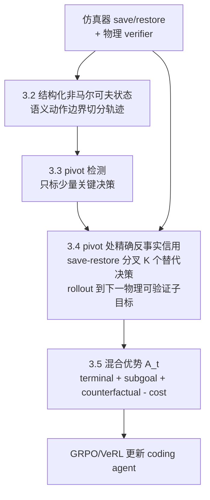

# Exact Counterfactual Credit Assignment for Embodied Code Agents: Simulator Branching as Unbiased Turn-Level Supervision

> 面向具身代码智能体的精确反事实信用分配：以仿真分叉作为无偏的轮次级监督

## 摘要

在"写代码控制机器人"（Code-as-Policy）范式中，一个 coding agent 要经过**几十轮**决策才能解出一个接触丰富的操作任务：理解指令 → 定位可用 API → 起草控制程序 → 在仿真中执行 → 分析接触失败 → 修补程序 → 回归验证。这条长序列轨迹的信用分配（credit assignment）与 SWE Agent 面临的问题同构：最终只有一个稀疏的二值执行奖励 $R(\tau)=\mathbb{I}[\text{任务通过}]$，而 GRPO 式方法把它均匀摊到轨迹里每一个决策上，于是成功轨迹里的无效探索、错误抓取被一并强化，失败轨迹里正确的定位与复现被一并惩罚。

代码智能体社区已经发展出一整套长序列信用分配技术：在工具调用边界分配 turn-level credit（TRACE）、用多 rollout 分叉树估计局部 Q 值（RTMC）、用状态重置做反事实重采样（SRPO/RRPO）、识别 pivot step 做昂贵归因（PiCA），以及"精确反事实只在可完整恢复状态时才可得"的判断（C3）。但这些方法**无一例外是纯文本智能体**：它们要么因为文本状态永不重复而必须用 state signature *近似*匹配，要么因为无法恢复隐藏环境状态而只能重置*语言*推理链，要么用冻结参考模型的 log-ratio *近似*"正确答案变得多可预测"。C3 明确指出：在一般 POSG 设定下，精确反事实"需要一个能恢复隐藏环境状态的仿真器"——而它自己没有。

我们的核心观察是：**具身代码智能体恰好是这个被让渡的场景。** 它同时拥有 (i) 一个能对完整非马尔可夫物理状态做精确 `save_state`/`restore_state` 的仿真器，与 (ii) 一个无偏的可验证物理奖励。这意味着代码智能体的信用分配在这里可以从一个*估计问题*变成一个*测量问题*：不需要 state signature、不需要 critic、不需要 gold program。

我们提出 **ECCA（Exact Counterfactual Credit Assignment）**：把信用分配的对象从代码智能体所编排的*执行器*（Code vs VLA，即前作 CRL/MDRM 处理的层次）下移到代码智能体*自身的决策轮次*。ECCA 有四个要素：**(1) 结构化非马尔可夫状态**记录，在语义动作边界（LOCALIZE/HYPOTHESIZE/EDIT/SIMULATE/ANALYZE/ROLLBACK/FINISH）而非任意 token 上切分轨迹；**(2) pivot 检测**，只对少量关键决策做昂贵归因；**(3) 精确反事实信用**，在 pivot 处 `save_state`、从冻结策略采样 $K$ 个替代决策、各自只 rollout 到**下一个物理可验证子目标**、用 leave-one-out 基线得到无偏的 per-decision advantage；**(4) 混合优势**，把反事实信用与终局物理 verifier 组合，保证最终执行奖励始终拥有否决权。

为守住新颖性，我们额外构造 **ECCA-Probe**：一个程序化生成的 bifurcation benchmark——同一前缀下，决策 A 可证明保留正确接触路径、决策 B 隐蔽地破坏下游步骤；因为在仿真中可计算 ground-truth 反事实 Q，我们能直接评价"一个信用分配方法是否给 A 更高 advantage"。这是首个评价信用分配**正确性**（而非仅最终 pass rate）的具身 benchmark。我们从 CaP-X 分层 benchmark 出发，在 Robosuite / LIBERO-PRO / BEHAVIOR 上评价，以 CaP-RL（flat GRPO）、RTMC 式 signature tree、TRACE 式 log-ratio 为直接 baseline。核心主张：**具身代码智能体是唯一能对自身决策做精确（而非近似）反事实信用分配的场景，且把反事实 horizon 缩短到下一个物理可验证子目标使其在算力上可负担。**

**关键词**：Code-as-Policy、embodied code agent、credit assignment、counterfactual advantage、simulator branching、turn-level reward、pivot step、verifiable reward。


## 1. 引言与动机

### 1.1 背景：具身代码智能体也有一条长序列信用分配问题

CaP-X 把"LLM/VLM 写机器人代码"变成可系统实验的对象，并证明：在多轮交互（M1–M4）设定下，coding agent 通过多轮视觉 differencing、结构化执行反馈、技能库合成把成功率大幅拉高。但这带来一个被 CaP-X 自己回避的问题——**多轮代码智能体的轨迹是一条长序列决策链，最终只有一个稀疏的执行奖励**。CaP-RL 的做法是用 GRPO 直接 post-train coding agent；而其论文明确写道：为保证收敛稳定，他们只在 tier S1 的 privileged state-based API 上训练，"以避免 tier S2 中复合感知与控制误差导致的信用分配歧义（credit assignment ambiguity）"。

换句话说，**CaP-RL 通过限制到最干净的 API 层来*绕开*信用分配，而不是*解决*它**。一旦进入真正困难的低层、接触丰富、多轮修补的设定（S2–S4/M2–M4），"哪一轮决策真正推动了成功"就重新成为核心障碍。这正是本文要攻击的缺口。

### 1.2 问题形式化：四个嵌套层级

设代码智能体的完整轨迹为

$$
\tau=(s_1,a_1,o_1,\dots,s_T,a_T,o_T),
$$

其中 $s_t$ 是"当前代码/程序状态 + 机器人及物理场景状态"，$a_t$ 是一次语义决策（定位 API、起草一段控制程序、在仿真中执行、分析失败、修补、回归），$o_t$ 是环境（仿真器 + 执行结果）反馈。最终奖励通常是稀疏二值的：

$$
R(\tau)=\mathbb{I}[\text{最终程序使任务通过物理 verifier}].
$$

GRPO 式方法为同一轨迹的所有决策分配近似相同的优势：

$$
A_t \approx R(\tau)-b(x),
$$

这在具身代码智能体上造成与 SWE Agent 同构、但更严重的问题：

1. **成功轨迹含坏决策**：一个最终通过的程序可能经过多次错误抓取姿态、无效运动、放错后恢复，仅靠终局奖励会把它们一起强化。
2. **失败轨迹含好决策**：智能体可能正确定位了目标物体、复现了接触失败、理解了对齐误差，只因最后一段插入程序的一个参考系错误而失败——二值奖励把整条轨迹判负。
3. **早期决策影响很晚显现**：错误读取一个物体位姿不会立即失败，却可能导致二十轮后的插入程序反复对不齐。
4. **状态高度非马尔可夫**：同样的自然语言对话历史，可能对应完全不同的**未提交 diff、机器人构型、接触状态、已执行的仿真结果、场景中物体位姿**。单纯以对话文本作为 $s_t$ 不足以估计真实的 $Q(s_t,a_t)=\mathbb{E}[R\mid s_t,a_t]$。

于是问题天然是四层嵌套的：

$$
\underbrace{\text{最终任务结果}}_{\text{terminal verifier}}\to\underbrace{\text{工程/操作阶段}}_{\text{subgoal}}\to\underbrace{\text{工具调用/决策轮次}}_{\text{turn-level}}\to\underbrace{\text{单次生成中的 token}}_{\text{token}}.
$$

合理的做法不是在 token 级追踪上百轮因果，而是先把轨迹切成有工程语义的决策单元，再在**工具调用边界 / 关键决策点 / 子目标完成点**做信用分配。

### 1.3 关键洞察：具身场景让"反事实"从近似变为精确

代码智能体社区已经把上述思路发展得相当成熟，但都卡在同一个天花板上——**文本智能体无法精确恢复状态**：

- **RTMC**（Rollout-Tree Monte Carlo）想比较"同一状态下不同动作分支的最终回报"，但 SWE 文本状态几乎从不逐字重复，所以必须引入 **state-action signature** 去*近似*匹配两个"语义相同"的状态。
- **SRPO/RRPO**（Credit Assignment with Resets）想在中间状态重采样反事实续写，但它能重置的只是**语言推理链**，不是外部环境。
- **TRACE** 想度量"读完这个文件后正确答案更可预测了吗"，只能用冻结参考模型对 gold answer 的 log-probability 做*近似* potential。
- **C3（"Exact Is Easier"）** 一针见血：合作式文本智能体之所以能做*精确*反事实信用，是因为"可观测文本就是完整状态"，从而把信用分配从估计问题变成测量问题；但它同时声明——**"在一般 POSG 设定下，固定历史需要一个能恢复隐藏环境状态的仿真器。"**

**具身代码智能体正是 C3 让渡出去的那个场景。** 仿真器（Robosuite/LIBERO/Isaac 等）支持 `save_state`/`restore_state`，能把**完整的非马尔可夫物理状态**（物体位姿、接触、机器人构型、未提交 diff 对应的执行效果）精确恢复；同时具身任务自带**无偏的可验证物理奖励**（子任务是否完成、抓取是否稳定、是否对齐）。这意味着：

$$
\text{代码智能体信用分配}\ \xrightarrow{\text{具身}}\ \text{从"估计问题"变为"测量问题"}.
$$

不需要 state signature（状态可精确恢复）、不需要 critic（回报可直接 Monte Carlo 测量）、不需要 gold program（物理 verifier 直接判定）。这是本文与所有文本信用分配方法的根本分界。

### 1.4 与前作的关系与本文的对象下移

本文与作者前作（CRL/MDRM/PC²）共享同一件仪器——**仿真器同状态分叉**——但**信用分配的对象不同**：

- 前作把分叉用于代码智能体所*编排的执行器*：在状态 $s$ 该让 Code 还是 VLA 执行（CRL）、一个技能该用哪种表示（MDRM）。决策对象是 **executor / representation**。
- 本文把分叉用于代码智能体*自身的决策轮次*：在多轮解题过程中，第 $t$ 轮的 LOCALIZE/EDIT/SIMULATE 决策对最终成功贡献几何。决策对象是 **agent 的 turn-level action**。

因此 ECCA 是一个**独立**的贡献：它回答的是"如何训练一个更好的具身 coding agent"，而不是"如何在 Code 与 VLA 间路由"。（前作可作为正交的执行层机制被 ECCA 复用，但不构成依赖。）

### 1.5 贡献

1. **提出 ECCA 框架**：首次把长序列信用分配从代码智能体所编排的执行器下移到**代码智能体自身的决策轮次**，并指出具身场景是唯一能对此做*精确*（而非近似）反事实信用的设定——恰是 C3 让渡、RTMC/SRPO/TRACE 只能近似的那个缺口。
2. **精确反事实信用 + 子目标 horizon 缩短**：在 pivot 决策处用 `save/restore` 精确恢复物理状态，从冻结策略采样 $K$ 个替代决策，各自只 rollout 到**下一个物理可验证子目标**（而非整条任务），用 leave-one-out 基线得到无偏 per-decision advantage，把反事实成本从"整任务"压到"下一里程碑"。
3. **混合优势 + verifier 否决权**：把精确反事实信用与子目标、终局物理奖励组合，终局 verifier 权重始终足够高，避免 process reward 劫持任务目标（明确规避 SWE-Shepherd 式"高 PRM 分数反而降低成功率"的风险）。
4. **ECCA-Probe：首个信用分配*正确性* benchmark**：程序化构造同前缀 bifurcation，可计算 ground-truth 反事实 Q，直接评价方法是否给"保留正确路径的决策"更高 advantage——不再只用最终 pass rate 间接衡量。


## 2. 相关工作

ECCA 处在四条线的交叉点：具身代码智能体的 RL、代码智能体长序列信用分配、反事实/重置式信用分配、以及层级 credit。每组末尾给"分界"。

### 2.1 具身代码智能体与 Code-as-Policy RL

- **CaP-X / CaP-RL**（[arXiv 2603.22435](https://arxiv.org/abs/2603.22435)，ICML 2026）：CaP-Gym 让 agent 通过合成并执行程序控制机器人；CaP-RL 用 GRPO + 可验证环境奖励 post-train coding agent，7B 模型在仿真中从 20% 提到 72%，并 zero-shot 迁移到真实 Franka。**但 CaP-RL 是 flat GRPO——整条程序生成轨迹共享同一个 group-relative advantage**，且论文明确只在 privileged S1 API 上训练"以避免 S2 的信用分配歧义"。
- **CaP-Agent0**：training-free 多轮框架（视觉 differencing、技能库、集成推理），刻画了多轮轨迹结构，但不做任何 turn-level 优化。

> **分界**：CaP-RL 用限制 API 层的方式*绕开*了信用分配；ECCA 正面攻击它绕开的 S2–S4/M2–M4 长序列信用分配，把 flat GRPO 的均匀优势替换为 pivot 处的精确反事实优势。

### 2.2 代码/长序列智能体的 turn-level 信用分配（本文的方法论前身）

- **TRACE**（[arXiv 2607.13988](https://arxiv.org/abs/2607.13988)）：在工具调用边界，用冻结参考模型对 gold answer 的 log-probability 构造 log-ratio state value，相邻前缀差作为 turn-level reward，无需 critic/step label，并与终局 outcome advantage 混合。
- **RTMC**（[arXiv 2604.11037](https://www.arxiv.org/pdf/2604.11037)）：把同题多 rollout 组织成共享前缀树，聚合同一状态-动作分支的 Monte Carlo return 得 step-varying advantage，无需 critic；在 SWE-bench Verified 上比 GRPO 提升 pass@1 3.2 点。**其核心工程负担是 state-action signature**——因为 SWE 文本状态几乎不逐字重复。
- **SWE-TRACE**（[arXiv 2604.14820](https://arxiv.org/abs/2604.14820)）：issue-specific rubric PRM 做轨迹级过程评分 + 最短路径蒸馏 + test-time 引导。
- **PiCA**（[arXiv 2605.09287](https://arxiv.org/abs/2605.09287)）：识别 pivot step（信息峰值）做 potential-based 过程奖励，锚定到最终目标，保持分布一致性。
- **Agent Lightning**（microsoft/agent-lightning）：把一次 LLM 调用的完整输出视为一个动作，把 agent 运行记录转成 state-action-reward transition，并支持把轨迹级回报分配到每次模型调用。

> **分界**：这些方法**都是纯文本智能体**，其信用分配的精度都受限于"状态不可精确恢复"：TRACE 用 log-ratio *近似* potential，RTMC 用 signature *近似*状态匹配，PiCA 用 pivot 的 golden sub-query *近似*信息增益。ECCA 继承它们"在工具调用边界 / pivot 做 credit"的思路，但因为具身仿真可精确恢复物理状态、物理 verifier 可直接判定回报，**把这些近似全部替换为精确测量**。

### 2.3 反事实与重置式信用分配

- **C3（Exact Is Easier）**（[arXiv 2603.06859](https://arxiv.org/abs/2603.06859)）：合作式 LLM 智能体的可观测文本即完整状态，可固定历史、从冻结策略采样替代动作、Monte Carlo 评估、leave-one-out 得无偏 per-decision advantage。**明确声明一般 POSG 需要"能恢复隐藏环境状态的仿真器"。**
- **SRPO / RRPO（Credit Assignment with Resets）**（[arXiv 2605.25507](https://arxiv.org/abs/2605.25507)）：在推理链中间重置并重采样多条续写，把结果差归因到该决策点；SRPO 自定位错误步。**重置的是语言状态，不是外部环境。**
- **HCAPO / hindsight**：用 LLM 事后 critic 依据完整后续轨迹重估关键步 Q 值。

> **分界**：C3 把 ECCA 要占据的场景明确让渡给"状态可恢复的仿真器"；ECCA 就是那个场景，且状态是**非马尔可夫物理状态**（接触、位姿、未提交 diff 的执行效果），根本无法被文本历史捕获。SRPO 的语言重置无法恢复机器人接触状态。ECCA 的 leave-one-out 结构承接 C3，但作用在物理分叉上。

### 2.4 层级 credit 与具身长序列 RL

- **HiPER**（[arXiv 2602.16165](https://arxiv.org/pdf/2602.16165)）：分离高层 planner 与低层 executor，用 Hierarchical Advantage Estimation 在两层分别分配 credit，降方差。
- **MGR（Local Validity × Global Effectiveness）**（ICLR 2026）：把"动作是否合法"与"轨迹是否有效"相乘而非相加，阻止无效动作获得正 credit。
- **OmniReset**（[arXiv 2603.15789](https://arxiv.org/abs/2603.15789)）：用密集多样的仿真重置扩大状态覆盖，让 RL 解长程灵巧操作。
- **Cortex**（[arXiv 2607.05377](https://arxiv.org/abs/2607.05377)）：高层 VLM 编排 32 个技能 primitive 给低层 VLA。

> **分界**：HiPER/MGR 是文本/交互智能体的层级或门控 credit，不含物理反事实；OmniReset 的重置服务于低层 VLA 的**探索**，不是给**代码智能体决策轮次**分配 credit；Cortex 是执行层编排，不涉及 agent 自身轨迹的 credit。ECCA 借用层级思想（子目标 DAG 缩短 horizon），但每个子目标由**物理可验证谓词**界定，反事实在物理状态上做。

### 2.5 定位小结

| 维度 | CaP-RL | TRACE | RTMC | C3 | SRPO | **本文 ECCA** |
|-|-|-|-|-|-|-|
| 信用粒度 | flat（整轨迹均匀） | turn-level | step（树聚合） | per-decision | 重置点 | **pivot 决策轮次** |
| 状态是否可精确恢复 | — | 否（log-ratio 近似） | 否（signature 近似） | 是（文本=状态） | 仅语言 | **是（物理 save/restore）** |
| 反事实是否精确 | 无反事实 | 近似 | 近似 | 精确（文本域） | 近似（语言域） | **精确（物理域）** |
| 奖励来源 | 物理 verifier | 冻结参考 log-prob | MC return | 任务奖励 | 任务奖励 | **物理 verifier + 子目标谓词** |
| 反事实 horizon | — | — | 整任务 | 整对话 | 整推理链 | **下一物理可验证子目标** |
| 是否评价 credit 正确性 | 否（只看 pass） | 否 | 否 | 否 | 否 | **是（ECCA-Probe）** |


## 3. 技术路线

### 3.1 总体架构：四层信用分配

ECCA 把长序列信用分配组织成四层，从粗到细、从便宜到昂贵：**结构化状态与语义动作（3.2）→ pivot 检测（3.3）→ pivot 处精确反事实信用（3.4）→ 混合优势与训练（3.5）**。核心原则贯穿全文：

- **原则一**：credit 的基本单位是有工程语义的状态转移，不是任意 token。
- **原则二**：局部反事实信用必须与终局物理 verifier 组合，不能取代它。
- **原则三**：不对所有步骤做精确因果归因，只识别少量 pivot step 再做昂贵反事实。



### 3.2 结构化非马尔可夫状态与语义动作边界

**语义动作**。不把每个 token 当 action，而在工具调用边界定义如下事件（承接 TRACE/Agent Lightning 的 turn 抽象，但针对具身代码智能体）：

| 事件 | 含义 |
|-|-|
| `LOCALIZE` | 定位可用 API、符号、物体、相关代码片段 |
| `HYPOTHESIZE` | 形成或更新对根因/几何约束/所需 primitive 的假设 |
| `DRAFT/EDIT` | 起草或修改一段控制程序 |
| `SIMULATE` | 在仿真中执行当前程序，得到物理反馈 |
| `ANALYZE` | 分析接触失败、对齐误差、执行日志 |
| `ROLLBACK` | 撤销失败的程序修改 |
| `FINISH` | 声明任务完成 |

**结构化状态**。每个事件保存一个结构化状态，而非仅对话文本：

$$
s_t=\big(\text{ProgramState}_t,\ \text{Diff}_t,\ \text{PhysScene}_t,\ \text{ContactState}_t,\ \text{TestState}_t,\ \text{Hypotheses}_t,\ \text{PlanDAG}_t\big),
$$

其中 $\text{PhysScene}_t$（物体位姿/关节构型）、$\text{ContactState}_t$（接触事件/力）、$\text{TestState}_t$（子任务谓词通过情况）是**文本历史无法捕获、但决定最终结果**的非马尔可夫量。为便于后续精确反事实，我们采用 event-sourced state model + 确定性 replay（借鉴 OpenHands V1 式架构），使任意事件对应的完整状态都可由仿真器 `restore` 精确重建。

**每个转移的可观测增量**：

$$
e_t=(s_t,a_t,o_{t+1},\ \Delta\text{Diff}_t,\ \Delta\text{Test}_t,\ \Delta\text{Belief}_t,\ \text{cost}_t),
$$

分别记录程序/文件变化、子任务谓词变化、假设置信度变化、以及本轮 token/时间/rollout 成本。

### 3.3 pivot 检测（只对关键决策做昂贵归因）

对每一步做精确反事实太贵。我们用一个 pivot score 只挑出少量关键决策：

$$
p_t=\lambda_1\,|\Delta \hat V_t| + \lambda_2\,\text{StateChange}_t + \lambda_3\,\text{BranchEntropy}_t + \lambda_4\,\text{Irreversibility}_t,
$$

其中 $|\Delta\hat V_t|$ 是一个廉价 potential（可用 TRACE 式 log-ratio 或子目标谓词的变化近似）的跳变，$\text{StateChange}_t$ 度量 $\Delta\text{Diff}/\Delta\text{Contact}$ 的幅度，$\text{BranchEntropy}_t$ 是策略在该状态候选动作的熵，$\text{Irreversibility}_t$ 标记难以撤销的决策。典型 pivot 包括：

- 第一次锁定目标物体 / 目标 API；
- 从探索（LOCALIZE/ANALYZE）切换到修改（DRAFT/EDIT）；
- 第一次改变接触相关程序或公共接口参数；
- 某个子任务谓词从失败翻转为通过；
- 引入新的回归失败；
- 决定 ROLLBACK 还是继续修补。

只有 $p_t$ 高的步骤进入 3.4 的昂贵反事实。其余步骤沿用便宜的子目标 / 终局信用（3.5）。

### 3.4 pivot 处精确反事实信用（核心）

在 pivot 状态 $s_t$，我们直接**测量**该决策的反事实贡献。定义理想目标：

$$
C_t=Q(s_t,a_t)-\mathbb{E}_{a'_t\sim\pi(\cdot\mid s_t)}\big[Q(s_t,a'_t)\big],
$$

即"若当时不选 $a_t$ 而采用合理替代动作，最终结果会差多少"。在文本智能体上这只能近似；在具身仿真上可精确测量：

```text
输入: pivot 状态 s_t, 冻结策略 π, 分叉数 K, 下一子目标 verifier V_next
handle = sim.save_state()               # 精确保存完整非马尔可夫物理状态
# 采样 K 个替代决策(含实际所选 a_t)
cand = {a_t} ∪ sample_alternatives(π, s_t, K-1)
for a in cand:
    returns[a] = []
    for _ in 1..M:                      # M 次前向, 处理执行随机性
        sim.restore(handle)             # 精确恢复到同一物理状态
        rollout = run_forward(a, s_t)   # 只跑到下一个物理可验证子目标
        returns[a].append( V_next(rollout) )   # 物理谓词判定, 无偏
Q_hat[a] = mean(returns[a])
# leave-one-out 无偏基线(承接 C3)
b = (Σ_{a} Q_hat[a] - Q_hat[a_t]) / (|cand|-1)
A_cf_t = Q_hat[a_t] - b
```

三个使它*精确*而非近似的要素：

1. **状态精确恢复**：`restore(handle)` 恢复完整物理状态，不需要 RTMC 的 state signature 近似匹配，也不像 SRPO 只能重置语言。
2. **回报无偏测量**：$V_\text{next}$ 是物理子任务谓词（抓取是否稳定、是否对齐、phase 是否推进），直接 Monte Carlo 估计，不需要 critic，也不需要 gold program。
3. **horizon 缩短**：rollout **只到下一个物理可验证子目标**，而非整条任务。这把反事实成本从 $O(\text{整任务})$ 压到 $O(\text{下一里程碑})$，是让精确反事实在具身长序列上可负担的关键工程点：

$$
\hat Q(s_t,a_t)=\Pr[\text{下一子目标成功}\mid s_t,a_t]\quad\text{（而非}\ \mathbb{E}[R_\text{task}\mid s_t,a_t]\text{）}.
$$

**子目标 DAG**。任务被切成物理可验证的子目标 DAG（理解需求 → 复现 → 定位根因 → 起草补丁 → 构造回归 → 全量验证），每个子目标有一个 $V_k=\mathbb{I}[\text{Verifier}_k(S)=1]$。反事实只需 rollout 到 $s_t$ 的下一个子目标节点，缩短奖励传播距离。

### 3.5 混合优势与训练

把四种信用组合成最终优势，**终局物理 verifier 始终保有否决权**：

$$
A_t=\alpha\,A_t^{\text{terminal}}+\beta\,A_t^{\text{subgoal}}+\gamma\,A_t^{\text{cf}}-\eta\,C_t,
$$

- $A_t^{\text{terminal}}$：终局物理执行奖励（GRPO group-relative），保证最终程序真正正确，权重 $\alpha$ 始终足够高；
- $A_t^{\text{subgoal}}$：便宜的子目标谓词进度信号，覆盖非 pivot 步；
- $A_t^{\text{cf}}$：仅在 pivot 处由 3.4 给出的精确反事实优势；
- $C_t$：token/时间/重复动作/高风险修改的惩罚。

用策略梯度更新 coding agent：

$$
\nabla_\theta J=\mathbb{E}\Big[\textstyle\sum_t A_t\,\nabla_\theta\log\pi_\theta(a_t\mid s_t)\Big].
$$

**verifier 否决权（明确规避已知风险）**：即使某决策 $A_t^{\text{cf}}$ 很高，只要终局 $R_\text{final}=0$ 就不能判成功——这直接对标 SWE-Shepherd 观察到的风险：PRM 引导虽减少步骤数，但成功率反而低于无 PRM 基线，说明局部高 reward 动作不一定导向全局正确补丁。因此过程/反事实信用只做**塑形与排序**，绝不取代最终物理 verifier。部署期不需要仿真分叉：训练完成的 coding agent 直接多轮解题，所有昂贵反事实评估离线在 sim 完成。


## 4. 实验设计（从 CaP-X 出发）

设计遵循 4 阶段渐进框架：先跑通，再调基线，再验证核心创新，最后系统消融。以 sim 为主，冻结/LoRA 开源 coder + GRPO/VeRL，匹配"sim + 少量 GPU"的资源约束。

### 4.1 环境、任务与数据床

直接复用 CaP-X 谱系评价床，保证与 CaP-RL 可比：

| 环境 | 用途 | 说明 |
|-|-|-|
| **Robosuite（CaP-Bench 7-task core）** | 主受控实验、信用分析 | 从 Cube Lift 到高精度 Peg/Nut，含大量 retry/recovery，长序列信用最该体现价值 |
| **LIBERO-PRO** | 泛化/扰动 | Object/Goal/Spatial × Pos/Task，6 splits；测学到的策略鲁棒性 |
| **BEHAVIOR-1K** | 长程移动操作 | 长 horizon 天然含几十轮决策与多子目标，利于观测 turn-level credit |

**关键**：训练在 CaP-Gym 的**低层/多轮 tier（S2–S4/M2–M4）**上进行——这正是 CaP-RL 为规避信用分配歧义而**回避**的设定，也是 ECCA 的主场。

### 4.2 ECCA-Probe：信用分配正确性 benchmark（本文独有）

**动机**：最终 pass rate 只能评价 agent 是否变强，不能判断分配给每一步的 credit 是否*正确*。我们构造可计算 ground-truth 反事实 Q 的诊断集。

**构造**：程序化生成同前缀 bifurcation 任务——

```text
共享前缀 h_t  (相同物理状态, 由 save_state 固定)
 ├── 决策 A: 可证明保留正确接触路径 (下游子目标可达)
 └── 决策 B: 隐蔽破坏下游 (如错误参考系/错误抓取宽度, 表面看合理)
```

因为在 sim 中可对 A、B 各自大量 rollout 到终局，**ground-truth 反事实优势 $A^\star(A)-A^\star(B)$ 可精确计算**。评价指标：一个信用分配方法在 bifurcation 上给 A 的 advantage 是否 > B（**pivot 判别准确率**），以及其估计的 advantage 与 ground-truth 的相关性（Spearman $\rho$）。

**这是首个直接评价 credit *正确性* 的具身 benchmark**，让 ECCA 的"精确"主张可被独立检验，而不必绕道最终成功率。

### 4.3 评价指标

**主指标**
- **Task success rate（Pass@1）**：核心，对齐 CaP-X。
- **信用分配正确性（ECCA-Probe 判别准确率 + Spearman $\rho$）**：本文独有，直接检验"精确 vs 近似"。
- **反事实估计误差**：ECCA 精确反事实 vs RTMC-signature/TRACE-logratio 近似值，相对 ground-truth Q 的偏差。

**诊断/效率指标**
- **成功轨迹中坏决策被强化的比例**、**失败轨迹中好决策被惩罚的比例**（用 Probe 的 ground-truth 标签度量）。
- **反事实成本**：pivot 数 × $K$ × $M$ × 子目标 horizon 的 rollout 数、GPU·h、tokens。
- **horizon 缩短收益**：反事实 rollout 到"下一子目标" vs "整任务"的成本/方差对比。

### 4.4 Baselines

必须复现以守住 novelty：

1. **CaP-RL（flat GRPO）**：最关键外部对照，整轨迹均匀优势。
2. **RTMC 式 signature tree**：用 state-action signature 近似匹配状态做树聚合——检验"精确恢复 vs signature 近似"的净收益。
3. **TRACE 式 log-ratio turn credit**：冻结参考模型 log-ratio potential——检验"物理 verifier vs 语言 potential"的净收益。
4. **SRPO 式语言重置**：只重置推理链、不恢复物理状态——检验"物理反事实 vs 语言反事实"。
5. **subgoal-only（去掉 pivot 反事实）**：只用子目标谓词进度——检验精确反事实的净增量。
6. **ECCA 内部对照（apples-to-apples）**：同架构、同 pivot 检测，仅把反事实来源从"精确 save/restore"换成"signature 近似"，隔离本文核心机制的贡献。

### 4.5 四阶段渐进计划

**Stage 1 — 打通（最简设置）**
- 目标：在 Robosuite Cube Lift/Stack 上跑通 event-sourced 状态记录 + `save/restore` 一致性验证（同 seed 分叉可复现）+ pivot 处一次精确反事实优势计算。
- 完成标准：能在 ECCA-Probe 上给出非平凡（显著优于随机 0.5）的 pivot 判别准确率。
- 迭代上限：5。

**Stage 2 — 基线调优**
- 目标：不改架构，调 $K$、$M$、pivot 阈值、混合权重 $\alpha,\beta,\gamma,\eta$；在 ≥2 环境（Robosuite + LIBERO-PRO）稳定；复现 CaP-RL 报告数（±可接受误差）。
- 完成标准：训练曲线稳定，Pass@1 与信用正确性均优于 Stage 1。

**Stage 3 — 核心创新验证**（≥3 环境 + BEHAVIOR-1K）
- **H1（精确 vs 近似）**：ECCA 精确反事实在 ECCA-Probe 上的判别准确率与 Spearman $\rho$ 显著高于 RTMC-signature / TRACE-logratio / SRPO-language（多 seed，报显著性）。
- **H2（下游收益）**：ECCA 的 Pass@1 显著高于 CaP-RL flat GRPO，尤其在接触丰富任务（Peg/Nut）上——那里 flat GRPO 最容易错误强化"幸运轨迹"。
- **H3（horizon 缩短）**：反事实 rollout 到下一子目标相比整任务，在同等信用正确性下成本显著更低、方差更小。
- 完成标准：H1 与 H2 至少在高精度接触任务上成立且有统计显著性。

**Stage 4 — 系统消融**（见 4.6）。

### 4.6 消融矩阵

| 消融项 | 移除/替换 | 检验的问题 |
|-|-|-|
| 反事实来源 | 精确 save/restore → signature 近似 | 精确性的净代价（主消融） |
| 反事实 horizon | 下一子目标 → 整任务 / 固定步数 | horizon 缩短的成本-方差权衡 |
| pivot 检测 | pivot-only → 全步 / 随机步 | pivot 策略对成本与效果的影响 |
| 分叉数 $K$ / 前向数 $M$ | $K\in\{3,5,10\}$, $M\in\{1,3,5\}$ | 反事实估计方差 vs 成本 |
| 混合权重 | 去掉 $A^{\text{cf}}$ / 去掉 $A^{\text{subgoal}}$ / 去掉 terminal | 各信用源的贡献与 verifier 否决权必要性 |
| 状态表示 | 结构化状态 → 仅对话文本 | 非马尔可夫物理状态的价值 |
| 语义动作边界 | 语义事件 → 固定 token 窗口 | "工程语义单元"是否优于任意 token |

### 4.7 超参网格（初始）

```json
{
  "K_branches": [3, 5, 10],
  "M_forward": [1, 3, 5],
  "pivot_score_thresh": [0.5, 0.7, 0.9],
  "alpha_terminal": [0.5, 0.7, 1.0],
  "beta_subgoal": [0.1, 0.3, 0.5],
  "gamma_counterfactual": [0.1, 0.3, 0.5],
  "eta_cost": [0.0, 0.05, 0.1],
  "num_seeds": 3
}
```

### 4.8 预期结果与"最能代表论文的一张图"

- **代表图**：横轴"反事实近似误差"、纵轴"ECCA-Probe 信用判别准确率"，把 CaP-RL(flat) / TRACE-logratio / RTMC-signature / SRPO-language / **ECCA(exact)** 画成散点——ECCA 落在"零近似误差、最高判别准确率"的角上。这是"精确 vs 近似"主张的记忆点。
- **主表**：Robosuite 7-task + LIBERO-PRO 6-split 上，ECCA vs CaP-RL/TRACE/RTMC/SRPO 的 Pass@1，尤其在 Nut/Peg 等长序列接触任务上体现优势。
- **诊断图**：成功轨迹中坏决策被强化比例、失败轨迹中好决策被惩罚比例，flat GRPO vs ECCA 的对比。


## 5. 风险与局限

| 风险 | 说明 | 缓解 |
|-|-|-|
| **撞车风险** | TRACE / RTMC / SRPO / C3 均为 2026 同赛道信用分配工作 | 全部复现为 baseline；主张严格限定在"具身代码智能体是唯一能对自身决策做*精确*物理反事实的场景"这一它们都不具备的点；C3 明确把该场景让渡出去 |
| **反事实仅 sim 可得** | 真实世界无法 restore 物理状态 | 主张限定为"sim 反事实训练 → 部署 zero-shot"；部署期不需分叉，只跑训练好的 agent；与 CaP-RL 的 sim→real 迁移边界一致 |
| **精确反事实成本高** | 每 pivot 跑 $K\times M$ 次 rollout | pivot-only + 只到下一子目标 + 小 $K,M$；报告完整成本预算，并以 H3 量化 horizon 缩短的收益 |
| **子目标谓词设计** | 物理可验证子目标需人工/程序定义 | 复用 CaP-X 的子任务谓词与 privileged 判定；消融"子目标粒度"的影响 |
| **状态恢复的确定性** | 部分仿真器随机性/非确定性 | 固定 seed + event-sourced 确定性 replay；用 $M$ 次前向估计残余随机性，报告方差 |
| **pivot 漏检** | pivot 检测器可能错过关键决策 | pivot 阈值消融 + 与"全步反事实"上界对比，量化漏检代价 |

## 6. 与文献的最终定位（一句话）

代码智能体的长序列信用分配已发展出 turn-level（TRACE）、rollout tree（RTMC）、语言重置（SRPO）、精确文本反事实（C3）等路线，但它们**都是纯文本智能体，受限于"状态不可精确恢复"而只能做近似**，而 CaP-RL 干脆用限制 API 层来*绕开*信用分配；**本文指出具身代码智能体是 C3 明确让渡、且唯一同时拥有"可精确恢复的非马尔可夫物理状态"与"无偏物理 verifier"的场景，从而把代码智能体自身决策的反事实信用分配从估计问题变成测量问题，并用"只 rollout 到下一物理可验证子目标"使精确反事实在长序列上可负担，配以首个评价信用*正确性*的 ECCA-Probe benchmark。**

