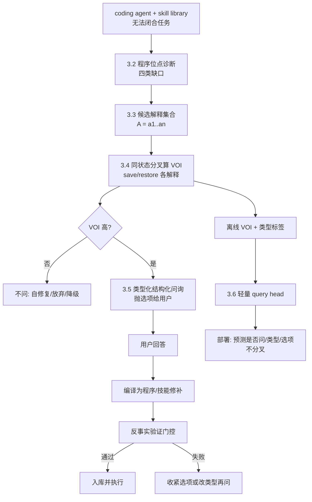

# Counterfactual Information-Querying for Embodied Code Agents: Program-Locus Diagnosis and Verified Skill Repair

> 反事实信息问询：以程序位点诊断与经验证的技能修补，让具身代码智能体在 skill library 不足时结构化抛出待确认问题

## 摘要

现代 coding agent（如 Cursor 类交互式 agent）在任务指令不明确时，不会盲目执行，而是把歧义结构化为可选项，待用户确认后再落实。具身 code agent（Code-as-Policy + skill library）面对的是同一类问题的更难版本：当现成 skill library **无法闭合**用户提出的任务时，失败原因可能是指称歧义、参数欠定、缺失子技能，或指令与物理场景的逻辑矛盾——盲目重试或幻觉式补全都会浪费交互轮次与物理执行成本。

现有"机器人会问人"的工作（KnowNo、UPS、CLASP 等）已覆盖"不确定就问 / 缺技能就要 demo"，但其问询触发多依赖**模型不确定性**，问什么多从黑箱动作集枚举，回答处理多停留在存储 correction。它们没有利用 code-as-policy 的关键结构优势：**失败有程序级位点**；也没有利用仿真器可 `save/restore` 的因果切口去问"这个问题的答案会不会反事实改变程序结果"。

我们提出 **CIQ（Counterfactual Information-Querying）**：当 coding agent 无法用现有 skill library 闭合任务时，(1) 把失败定位到程序位点并归入四类缺口（澄清指称 / 选择参数 / 补缺技能 / 消解矛盾）；(2) 枚举候选解释，用同状态仿真分叉估计每个候选问询的**反事实信息价值（VOI）**，只抛出高 VOI 的结构化选项；(3) 把用户回答编译为程序/技能修补，并用反事实验证门控保证提交前不降低成功率；(4) 离线用 VOI 标签训一个轻量 query head，部署时不再分叉——与 v0 CRL 的诚实 sim→deploy 边界一致。

我们从 CaP-X 分层 benchmark 出发，在 LIBERO-PRO / Robosuite / BEHAVIOR 上评价，把 UPS、KnowNo、CLASP 作为直接 baseline。核心主张：**不是不确定就问，而是只问那个答案会反事实改变程序行为的问题；问题类型对齐被诊断的程序位点；修补后先反事实验证再提交。**

**关键词**：Code-as-Policy、interactive clarification、Value of Information、program-locus diagnosis、skill library gap、counterfactual querying、human-in-the-loop、verified repair。

## 1. 引言与动机

### 1.1 从 interactive code agent 到 embodied code agent

交互式 coding agent 的一个成熟能力是：**Interactive User Interference**——对任务指令不清楚的地方提出结构化选项，待用户确认后再改代码。具身 code agent 理应具备同类能力：当用现成 skill library 无法解决用户问题时，应把矛盾或困惑点结构化抛出，待用户提供新信息、或与用户讨论新解决方案后，再落实执行。

但具身场景比软件工程更苛刻：

1. **失败成本高**：一次错误抓取/插入会改变物理状态，不能像 git revert 一样廉价回滚（真实世界）；
2. **歧义来源更杂**：语言指称、几何参数、缺失技能、物理不可行可能同时存在；
3. **人机交互昂贵**：每一次问询都消耗用户注意力，乱问比不问更糟。

因此，"会问"本身不够——必须回答三个问题：**何时问、问什么、如何把回答变成可验证的能力增量**。

### 1.2 现有工作的公共盲区：uncertainty ≠ 值得问

KnowNo 用 conformal prediction 构造多选预测集，非单例就问；UPS 进一步把场景分流为 confident→act / ambiguous→clarify / incapable→intervene+residual learning；CLASP 检测 skill library 能力缺口并请求 demonstration。这些工作证明"分流何时问"是可行的，但共享三个局限：

1. **触发信号是 uncertainty，不是 Value of Information**：模型不确定 ≠ 问了就会改变结果；很多不确定选项在反事实上通向同一失败；
2. **问询内容来自黑箱动作/自然语言枚举，不是程序位点**：丢失了 code-as-policy 失败时"卡在哪一行 / 哪个 assert / 哪个未绑定参数"的结构化线索；
3. **回答处理偏存储，缺编译+验证**：correction 写入 memory/skillbook 后，缺少"修补后反事实是否更好"的门控，可能引入劣质技能。

### 1.3 关键洞察：程序位点 + 反事实 VOI

Code-as-Policy 的失败不是黑箱的。一次无法闭合的尝试通常落在四类**程序位点**上：

| 缺口类型 | 程序位点表现 | 结构化问询形态 |
|---|---|---|
| 澄清指称（clarify-referent） | 物体/区域 grounding 多解或空解 | "你指的是 A 还是 B？" |
| 选择参数（choose-parameter） | 自由几何/姿态参数欠定 | "把手朝左还是朝右？" |
| 补缺技能（supply-missing-skill） | 需要的子程序不在 library 中 | "我缺 insert 技能：请给 demo / 伪代码 / 约束" |
| 消解矛盾（resolve-contradiction） | 指令与场景逻辑/物理冲突 | "指令要求 X，但场景只有 Y——改目标还是改约束？" |

同时，仿真器支持 `save_state`/`restore_state`（v0 CRL 已用其做 Code vs VLA 责任反事实）。这里把它重新用于**解释空间上的分叉**：对同一失败状态 $s$，枚举候选答案 $\{a_i\}$，各自展开修补后的程序，若结果分布分歧大，则问询 $a$ 的 VOI 高；若所有答案通向同一结果，则**不问**——即使模型很不确定。

### 1.4 贡献

1. **提出 CIQ 框架**：把 interactive clarification 从"不确定就问"升级为"反事实有用才问"，专为具身 code agent + skill library 设计。
2. **程序位点诊断 + 四类类型化问询**：用失败程序的结构（未绑定参数、失败 assert、缺失调用、矛盾约束）决定问什么，而不是从黑箱动作集猜。
3. **反事实 VOI 门控**：用同状态仿真分叉估计问询的期望成功增益，最小化无效人机交互。
4. **经反事实验证的修补提交 + hybrid 部署**：用户回答编译为程序/技能修补后，须通过反事实成功率门控才入库；离线 VOI 标签训轻量 query head，部署不分叉。

## 2. 相关工作

CIQ 处在"机器人会问人"、"library 缺口驱动的技能获取"、"反事实/VOI"与本项目 v0–v2 机制四条线的交叉点。每组末尾给分界。

### 2.1 不确定就问：KnowNo 与 UPS（最直接前身）

- **KnowNo**（[arXiv 2307.01928](https://arxiv.org/abs/2307.01928)）：用 conformal prediction 校准 LLM planner 的不确定性；构造多选预测集，非单例则向人求助，提供任务成功的统计保证并最小化求助次数。
- **UPS — When to Act, Ask, or Learn**（[arXiv 2602.22474](https://arxiv.org/abs/2602.22474)）：用校准的 VLM verifier + conformal prediction，把场景分流为执行高置信动作 / 自然语言澄清歧义 / 请求干预并用 residual learning 补低层能力。**是本文最接近的前身。**

> **分界**：KnowNo/UPS 的触发是**不确定性校准**，选项来自 LLM/VLM 对黑箱动作的枚举。CIQ 的触发是**反事实 VOI**，选项来自**失败程序的位点诊断**；且 CIQ 多一类"消解矛盾"的协商式问询，并把回答编译为经反事实验证的 skill repair，而非仅 intervene+residual。

### 2.2 Library 缺口与人在回路的技能增长

- **CLASP**（[arXiv 2606.08169](https://arxiv.org/abs/2606.08169)）：VLM 选择/组合技能；当现有技能与合法组合都无法满足请求时，检测 capability gap 并生成 demo 请求（"我没有 insert 技能，请演示"），再扩库。
- **MEMO**（[arXiv 2603.04560](https://arxiv.org/abs/2603.04560)）：把用户局部自然语言 correction 聚类、改写为更一般的文本指导与 coded skill template，形成可检索 skillbook。
- **Growing with Your Embodied Agent**（[arXiv 2509.18597](https://arxiv.org/abs/2509.18597)）：人在回路的终身代码生成框架，把反馈编码为可复用技能并用 RAG/hint 支持长程任务。

> **分界**：CLASP 的问询类型几乎单一（缺技能→要 demo）；MEMO/Growing 侧重**如何沉淀**人的反馈。CIQ 覆盖四类缺口，用 VOI 决定**值不值得问、问哪一个最小问题**，并用反事实验证门控决定**修后是否入库**——问询决策与修补验证是一等公民，而不只是交互后的存储。

### 2.3 反事实分叉、VOI 与本项目 v0

- **v0 CRL**（本项目）：同状态分叉 Code 与 VLA，用 $\Delta(s)$ 无偏监督责任选择、readiness 与 verifier 校准。
- 仿真分叉用于恢复/合成数据的工作（MAGMA-GEN、Dream2Fix、PGDG、ReTRy）目标是恢复动作，不是问询选择。
- 经典 VOI / 主动学习文献给出"信息价值"形式，但很少与可执行机器人程序的位点诊断结合。

> **分界**：CIQ **复用 v0 的同状态反事实机制**，但决策对象从"此刻选 Code 还是 VLA"变为"该不该问、问哪个候选解释"。分叉空间是**解释/修补程序**，不是执行器。

### 2.4 Code-as-Policy 平台与 skill library

CaP-X（[arXiv 2603.22435](https://arxiv.org/abs/2603.22435)）提供 CaP-Gym / CaP-Bench / CaP-Agent0，其自动合成的 task-agnostic skill library 与多轮交互是 CIQ 的自然宿主：CIQ 不替换 library 的增长方式，而是在 library **无法闭合**时插入一层结构化人机接口。Harness VLA / RoboHarness 等 hybrid 执行器可作为底层执行后端，与问询层正交。

> **分界**：CaP-Agent0 的多轮交互主要是环境反馈驱动的自修复；CIQ 显式引入**面向用户的类型化问询**，并在库不足时主动寻求人的信息或新方案，而非仅靠环境 retry。

### 2.5 定位小结

| 维度 | KnowNo | UPS | CLASP | MEMO/Growing | **本文 CIQ** |
|-|-|-|-|-|-|
| 问询触发 | conformal 不确定 | 语义/动作不确定分流 | library 缺口 | 失败后 correction | **反事实 VOI** |
| 问什么 | LLM 多选动作 | NL 澄清或要干预 | 要 demo | 用户自由文本 | **程序位点类型化选项** |
| 缺口覆盖 | 主要歧义 | 歧义+无能力 | 主要缺技能 | 执行后修正 | **四类（含矛盾协商）** |
| 回答处理 | 选动作执行 | residual 学习 | 扩库 | 写入 skillbook | **编译修补 + 反事实验证门控** |
| 部署是否需 sim 分叉 | 否 | 否 | 否 | 否 | **训练要、部署不要（hybrid）** |

## 3. 技术路线

### 3.1 总体架构

CIQ 由五部分组成：程序位点诊断（3.2）→ 候选解释枚举（3.3）→ 反事实 VOI 引擎（3.4）→ 类型化问询与修补验证（3.5）→ hybrid 部署 query head（3.6）。训练期共享同一套仿真分叉标签；部署期只跑轻量 head。



### 3.2 程序位点诊断

当 coding agent 在预算内（多轮代码生成 + 环境反馈）仍无法使 verifier/oracle 判成功，或静态分析发现程序无法实例化时，触发诊断。输入为：任务指令 $l$、场景观测 $o$、当前程序草稿 $P$、skill library $\mathcal{L}$、失败 trace $T$。

诊断器（LLM/VLM + 程序分析规则）输出一个位点标签 $\tau\in\{\text{referent},\text{parameter},\text{missing-skill},\text{contradiction}\}$ 与位点描述 $\ell$（如"第 12 行 `grasp(?)` 的物体参数未绑定到唯一实例"）。

启发式规则（可与学习分类器并联，规则保证可解释性）：

- **referent**：感知返回多个匹配或零匹配，且 $P$ 中存在未消歧的物体/区域符号；
- **parameter**：符号已绑定，但自由连续/离散参数（朝向、高度、力阈值）无约束，且不同取值改变后续分支；
- **missing-skill**：计划需要的子任务在 $\mathcal{L}$ 中无实现，且无法由现有技能合法组合覆盖（对齐 CLASP 的 gap，但只是四类之一）；
- **contradiction**：指令约束与场景事实冲突（目标物体不存在、互斥约束同时出现、物理可达性断言失败且非感知噪声）。

### 3.3 候选解释枚举

给定 $(\tau,\ell)$，从 $P$ 与场景生成候选答案集合 $\mathcal{A}=\{a_1,\ldots,a_n\}$（$n$ 小，典型 2–5）：

- referent：候选物体/区域实例列表；
- parameter：离散化后的合法取值（或少数代表点）；
- missing-skill：候选补救通道（用户 demo / 用户给伪代码骨架 / 放宽为近邻技能组合）；
- contradiction：候选协商方案（改目标 / 改约束 / 放弃子目标）。

每个 $a_i$ 对应一个**修补算子** $\mathcal{R}(P,a_i)\mapsto P_i'$：把答案编译回程序（绑定参数、插入新 skill 接口、改写目标断言等）。

### 3.4 反事实 VOI 引擎（核心）

对失败触发状态 $s$（或最近可恢复检查点），用仿真分叉估计问询 $q$（对应候选集 $\mathcal{A}$）的信息价值：

```text
输入: 状态 s, 程序 P, 候选答案 A={a_i}, 分叉次数 K, 先验 p(a_i)
handle = sim.save_state()
for a_i in A:
    P_i = repair(P, a_i)          # 把答案编译进程序
    for k in 1..K:
        sim.restore(handle)
        roll_ik = execute(P_i, s)  # 短 horizon 或至子任务结束
    p_succ_i = mean_success(roll_i1..K)
# 不问时的基线: 用当前最佳猜测或随机选一个 a
p_succ_base = max_i p_succ_i 的无信息估计  # 或按 p(a) 加权执行一次"盲选"
VOI(q) = sum_i p(a_i) * p_succ_i  -  p_succ_base
# 额外: 反事实分歧度
divergence = Var({p_succ_i}) 或 pairwise outcome 不一致率
仅当 VOI(q) >= tau_voi 且 divergence >= tau_div 时允许提问
```

直觉：若所有 $a_i$ 的反事实成功率几乎一样，则问了也白问（VOI≈0），即使模型熵很高——这正是相对 KnowNo/UPS 的因果切口。$K$ 取小（3–5），只在诊断触发点分叉，控制成本；与 v0 一样报告 branching rollouts 预算。

### 3.5 类型化问询、回答编译与反事实验证门控

**问询生成**。将 $(\tau,\ell,\mathcal{A})$ 渲染为结构化 UI/对话卡片（多选 + 可选自由补充），风格对齐 interactive code agent 的 confirm 面板。同一失败状态若有多个候选问询，选

$$
q^\*=\arg\max_{q}\ \mathrm{VOI}(q)-\lambda\cdot\mathrm{cost}(q),
$$

其中 $\mathrm{cost}$ 编码用户负担（选项数、是否要 demo、是否要协商）。**一次只问一个最高净 VOI 的问题**，避免问卷式打扰。

**回答编译**。用户选择 $a^\*$（或提供 demo/伪代码）后，生成修补程序 $P^\*=\mathcal{R}(P,a^\*)$；若类型为 missing-skill，则同步写入 library 候选条目。

**反事实验证门控**（对齐 v1 MDRM 的晋升门控精神）：

```text
在同一批触发状态上分叉:
P_old  vs  P*
promote/commit 当且仅当
  P_succ(P*) >= P_succ(P_old) - tau
  且 P* 的 Wilson 下界达到阈值
否则: 不入库, 收紧选项或改问询类型后重问
```

这避免"用户随口给的方案"或"幻觉修补"污染 skill library——**人的回答是提案，反事实门控才是准入**。

### 3.6 Hybrid 部署：从 VOI 标签到轻量 query head

反事实分叉仅在 sim 训练/离线标注阶段可得。对一批失败情景，离线产出监督：

$$
\mathcal{D}_{\text{query}}=\{(o,l,P,T;\ \tau^\*,\ \mathbf{1}_{\text{ask}},\ q^\*,\ \mathcal{A})\}.
$$

训练轻量 query head $h$（可用冻结 VLM 编码器 + 小分类/生成头）：

- 预测位点类型 $\hat{\tau}$；
- 预测是否提问 $\widehat{\text{ask}}$（监督来自 VOI 门控标签，而非 entropy）；
- 生成/检索结构化选项 $\hat{\mathcal{A}}$。

**部署期**：coding agent 失败 → $h$ 决定是否问、问哪类、抛哪些选项 → 用户回答 → 编译修补 →（可选）用部署侧 verifier 做弱检查；**不再 sim 分叉**。这与 v0/v1/v2 的诚实边界一致：反事实机制在 sim 提供无偏标签，部署产物是可迁移的轻量模块。

## 4. 实验设计（从 CaP-X 出发）

遵循四阶段渐进框架；sim 为主；冻结开源 coding backend + 轻量 query head；用人模拟器（oracle-user）回答类型化问询以可控复现。

### 4.1 环境、任务与问询协议

| 环境 | 用途 | 说明 |
|-|-|-|
| **Robosuite（CaP-Bench 7-task core）** | 主受控实验 | Lift→Peg/Nut 梯度上制造四类缺口 |
| **LIBERO-PRO** | 泛化与语言/空间扰动 | 自然产生 referent/parameter 歧义 |
| **BEHAVIOR-1K** | 长程组合 | missing-skill 与 contradiction 更常见 |

**问询增强协议（本文特有）**：在标准任务指令上系统注入四类缺口（指称歧义、参数欠定、抽掉某 skill、加入矛盾约束），使"该不该问、问对类型"可标注。Oracle-user 按脚本回答正确选项；另设噪声用户（随机/对抗回答）测门控鲁棒性。

### 4.2 评价指标

**主指标**

- **单位人力任务成功率**：$\mathrm{Success}/(1+\\#\text{queries}\cdot w_{\text{type}})$，按问询类型加权成本（demo > 多选 > 是非）；
- **相对 VOI oracle 的问询精召**：以离线分叉算出的"应问集合"为 oracle，测是否只问反事实有用的问题——**本文独有、直接检验主张**；
- **问题类型准确率**：$\hat{\tau}$ 与注入/标注类型一致的比例；
- **修补提交成功率**：过门控入库后的后续任务成功 vs 无门控直接入库。

**诊断指标**

- 无效问询率（VOI≈0 仍问）、漏问率（高 VOI 却不问）；
- 人机轮次、token、仿真 branching 成本；
- success-vs-#queries **帕累托前沿**（论文记忆点图）。

### 4.3 Baselines

1. **ask-never**：纯 CaP-Agent0 式自修复，不问人；
2. **ask-always**：每次失败都把 LLM 枚举选项抛给用户；
3. **KnowNo**：conformal 多选，非单例则问；
4. **UPS**：act / clarify / intervene 三分流（最关键外部对照）；
5. **CLASP 式**：仅检测 missing-skill 并要 demo；
6. **uncertainty-gated CIQ 消融**：同架构同 head，但门控换为熵/置信度而非 VOI——**最关键内部对照**，量化"VOI vs uncertainty"的净收益。

### 4.4 四阶段渐进计划

**Stage 1 — 打通**：在 Cube Lift/Stack 上跑通位点诊断 + 分叉 VOI + 一次类型化问询 + 修补门控；完成标准：高 VOI 问询提升成功率，低 VOI 问询被正确抑制。

**Stage 2 — 基线调优**：调 $\tau_{\text{voi}}$、$\tau_{\text{div}}$、$K$、问询成本权重 $\lambda$；在 ≥2 环境稳定；复现 KnowNo/UPS 报告趋势（同床可比即可）。

**Stage 3 — 核心验证**（≥3 环境 + 缺口注入协议）：

- **H1（VOI 必要）**：CIQ vs uncertainty-gated 消融，在相同问询预算下成功率更高、无效问询更少；
- **H2（位点类型化必要）**：去掉类型诊断、只抛通用多选，类型准确率与单位人力成功率下降；
- **H3（验证门控必要）**：去掉反事实验证门控后，噪声用户条件下 library 污染导致长期成功率下降。

**Stage 4 — 系统消融**（见 4.5）。

### 4.5 消融矩阵

| 消融项 | 移除/替换 | 检验的问题 |
|-|-|-|
| VOI 门控 | VOI → entropy/置信度 | 反事实触发相对 uncertainty 的净收益（主消融） |
| 位点类型化 | 四类 → 单一通用多选 | 程序结构是否让"问什么"更好 |
| 反事实验证门控 | 有 → 无 | 防 library 污染 |
| 问询预算 | 每任务 0/1/2/∞ | 边际问询收益 |
| 部署形态 | sim 分叉 oracle vs query head | hybrid 迁移落差 |
| 分叉次数 $K$ | $\{1,3,5,10\}$ | VOI 估计方差 vs 成本 |

### 4.6 超参网格（初始）

```json
{
  "K_branches": [1, 3, 5, 10],
  "tau_voi": [0.05, 0.1, 0.2],
  "tau_div": [0.05, 0.1],
  "lambda_query_cost": [0.0, 0.5, 1.0],
  "max_queries_per_task": [1, 2, 3],
  "num_seeds": 3
}
```

### 4.7 预期结果与"最能代表论文的一张图"

- **代表图**：横轴累计问询次数（或人力成本）、纵轴任务成功率的帕累托前沿——CIQ 支配 KnowNo/UPS/ask-always：同样成功用更少问询，或同样问询预算更高成功。
- **诊断图**：VOI 门控 vs uncertainty 门控的无效问询率对照；四类缺口上的类型混淆矩阵。
- **主表**：三床 + 缺口注入协议上，单位人力成功率与问询精召。

## 5. 风险与局限

| 风险 | 说明 | 缓解 |
|---|---|---|
| **与 UPS 撞车风险高** | UPS 已做 act/ask/learn 分流 | 复现 UPS 为直接 baseline；主张严格收在「VOI + 程序位点类型化 + 反事实修补验证」组合，UPS 不具备任一完整组合 |
| **反事实仅 sim 可得** | 真机无法 restore 做 VOI | hybrid：sim 标注 → 部署 query head；诚实报告 head 相对分叉 oracle 的落差 |
| **Oracle-user 理想化** | 真实用户吵闹、答错、不愿 demo | 噪声用户协议 + 门控拒绝劣质修补；真实用户小样本研究作附录 |
| **诊断器自身会错** | 位点类型分类错误导致问错类 | 规则+学习并联；报类型混淆矩阵；允许用户纠正类型 |
| **分叉成本** | 每失败点 $n\cdot K$ 次 rollout | 小 $n/K$、仅触发点分叉、缓存；报告完整预算 |
| **矛盾协商难自动评** | resolve-contradiction 的"正确"依赖用户偏好 | 用注入式矛盾 + 脚本化可接受方案集；真实协商作定性案例 |

## 6. 与 v0/v1/v2 的关系与最终定位

- **与 v0（CRL）**：v0 在执行器空间做同状态反事实（Code vs VLA）；CIQ 在**解释/修补空间**做同状态反事实（候选答案 $a_i$）。机制同源，决策对象不同。
- **与 v1（MDRM）**：v1 的反事实晋升门控保证表示迁移不降能力；CIQ 把同一门控思想用于**人供修补的入库准入**。
- **与 v2（PC²）**：v2 把成功程序经验编译进 VLA；CIQ 处理的是编译/复用之前的更前端——**library 与指令尚未对齐时，如何用最小结构化人力对齐**。三者可串联：CIQ 补齐缺口 → library/program 可执行 → PC² 再编译为反射策略。

**最终定位（一句话）**：现有工作要么按不确定性让机器人提问（KnowNo/UPS），要么在缺技能时要 demo（CLASP），要么把人的 correction 存进 skillbook（MEMO）；**本文首次在具身 code agent 上把问询触发换成反事实信息价值，把问询内容钉在程序位点类型上，并把用户回答变成须经反事实验证才入库的技能修补，从而让 interactive user interference 在 embodied 场景中既敢问、又少问、且问完真的变强。**
