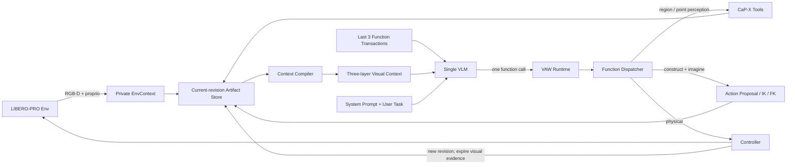

# ARCHIVED — VAW M0–M1.4 单 VLM Context Runtime 历史设计

> **ARCHIVED / SUPERSEDED：本文不再定义当前 Runtime。** 单 VLM、K=8、Persistent Waypoint、
> 旧 Function 数量和旧 Canvas 尺寸只记录 M0–M1.4 当时的设计，不应据此修改或运行现有代码。
> 当前实现契约见 [`CURRENT_ARCHITECTURE.md`](CURRENT_ARCHITECTURE.md)，运行入口见
> [`README.md`](README.md)，完成定义和研究验收见
> [`M1_5_AGENTIC_SYSTEM_COMPLETION.md`](M1_5_AGENTIC_SYSTEM_COMPLETION.md)。

> 状态：M1.3 核心 Runtime 已完成；M1.3.1 Dynamic Context Canvas 已实现，2026-08-03。
>
> 范围：定义 M1.2 之后的 Agent 输入、Context 生命周期、Function Space、单 VLM
> Runtime 与实施里程碑。现有 `docs/vaw_implementation_plan.md` 仍记录已经完成的
> M0–M1.2 实现与历史决策；本文件更新其中关于固定 Canvas、最近 K 张历史图片、
> 全量 state summary 和 post-M1.2 执行顺序的设计。
>
> 本文件只描述 VAW，不修改 CaP-X、LIBERO-PRO、控制器或训练框架。

## 0. 目标与结论

VAW 的目标不是给 VLM 一个可点击的机器人 GUI，而是把当前视觉观测、工具产生的视觉
证据、机器人本体状态和下一动作想象，编译成一份 VLM 可以直接阅读的视觉工作记忆。

Post-M1.2 的核心工作不再是继续硬编码新的面板，而是建立：

```text
单个 VLM
  + 静态 System Prompt
  + LIBERO User Task
  + 当前一张双区 Dynamic Visual Context
  + 最近八个 Function Call / Result
  + 小而稳定的 Function Space
```

当前定稿决策：

1. **只使用一个 VLM**。同一个模型产生感知调用、Action Proposal、commit 和终止判断；
   不引入独立 Actor/Critic VLM。
2. **每轮恰好一个 Function Call**。不执行批量、并行或同轮多动作。
3. **策略可见 History 最多八个 Function Transaction**。旧图片、旧 rationale 和完整
   对话不保留；M1.3 不尝试用后台世界模型补回长期历史。
4. **Context 是 revision-local 的类马尔可夫状态**：当前 observation、当前区域/点证据、
   proprioception、active action proposal 与最近八个调用共同近似充分状态。
5. **Intent 与 Preview 合并为一次 Action Proposal**。每个运动动作函数同时描述“想做
   什么”并自动尝试生成 IK/FK prediction；Agent 下一次只需决定 commit、修改还是放弃。
   `solve_ik` returned/error/unavailable 会如实显示，但 Runtime 不增加额外 pass/fail
   判定，也不把 prediction 变成 commit 的语义硬门控。
6. **开/关夹爪是特殊直接动作**。它不创建 Action Proposal，但执行后必须刷新 observation、
   revision 和 gripper state。
7. **Function Contract 只承担调度所需的最小检查**：JSON 可解析、function 存在、必需
   参数存在、引用能够解析。Runtime 不硬编码阶段、调用顺序、数值范围、工作区边界、
   自动候选切换或“这个动作在语义上是否聪明”；backend 的真实成功或错误直接回灌。
8. **Context Compiler 是确定性程序，不是第二个 VLM**。Agent 通过 Function Call 创建
   artifact，Compiler 决定如何把当前 artifact 编译为固定世界区和动态决策区。
9. **LIBERO reward、BDDL predicate、真值物体 pose 和 success 不进模型 Context**。
   它们只进入 trace meta 和未来训练奖励。
10. **M1.3 不实现物体持久性**。没有跨 revision 的 `obj1`、后台 tracking、实体关联或
    Scene Memory；物理世界变化后，Agent 必须基于新图像重新调用感知工具。场景记忆只在
    M1.3/M1.4 跑通并由真实失败 trace 证明必要后，作为独立后续设计进入。

## 1. 为什么现有 M1.2 代码不能直接成为 Runtime 架构

现有实现证明了真实 LIBERO、CaP-X 工具、preview、commit、trace 和 Web renderer
可以贯通，但它仍是上一版界面的直接编码：

- `WorkspaceSnapshot` 固定包含 Scene、Focus、Self、Intent、Candidates 和 Receipt；
- `web_presenter.py` 总是生成同一组 raster，React 总是按同一位置排版；
- candidate rail 默认适合 grasp proposal，不适合表达连续 delta action、rotate、
  长程 place、recovery 或其他 LIBERO 任务；
- `ChatSession` 只裁剪旧图片，旧 assistant/tool 文本仍无限增长；
- Runtime 每轮重发全量 `ActionState.summary()`，与图片文字重复，并让“视觉 Context”
  容易退化为 JSON ReAct；
- `move_xyz` 当前是直接物理动作，`nudge/rotate` 只编辑 candidate，尚未统一为通用
  Action Proposal；
- 当前 Context 是“系统预先决定 Agent 看什么”，而不是当前 Function 调用产生的语义
  artifact 所组成的工作记忆。

因此 M1.2 renderer 继续作为可运行 baseline 和视觉素材生产器，但 post-M1.2 不在
现有 snapshot 上继续堆字段。新的 Context Runtime 先建立语义模型，再让 PIL/Web
renderer 消费同一个 `ContextPacket`。

## 2. Runtime 总体架构



### 2.1 Private EnvContext

只在 Runtime/工具内部存在：

- RGB-D；
- intrinsics / camera pose；
- raw mask / raw cloud；
- simulator/backend handle；
- 非策略可见的 env success/reward。

它不能直接序列化进 prompt、Web snapshot 或 Context image。

### 2.2 Public ContextState

Agent 可见的当前类马尔可夫状态采用最小结构：

```text
ContextState
├── task_prompt
├── observation_revision
├── camera_views
│   ├── agentview_rgb_ref
│   └── wrist_rgb_ref
├── regions: RegionEvidence[]
├── points: PointEvidence[]
├── candidates: ActionCandidate[]
├── robot: RobotState
├── active_action: ActionProposal | null
├── last_receipt: ExecutionReceipt | null
└── recent_calls: FunctionRecord[<=3]
```

原则：存引用而不复制重数据；区域、点和候选只属于创建它们的 observation revision。
M1.3 的 `ContextState` 不承担长期 Scene Memory。

### 2.3 Artifact 类型

#### RegionEvidence

```text
region_id
query
within_region_id | null
bbox_xyxy_px
source_revision
```

`region_id` 是 episode 内唯一、但只在当前 revision 可调用的证据 handle。它表示“在这张
图像上，对 query 执行感知得到的区域”，不宣称它与其他 revision 中某个物体具有持久身份。

`detection_and_sam(query)` 在一次 Agent-visible Function Call 内完成现有 VLM detection → SAM3 →
segmentation 链路。`within_region_id` 可选：提供时在已有 region 的 crop 内继续查找杯把、
容器内部或局部表面；不提供时直接搜索完整 agentview。bbox 和可视化 contour 可以进入
Context；raw mask 仍只存在于 Private EnvContext。失败调用只进入 FunctionRecord，不伪造
RegionEvidence。Private EnvContext 以同一个 region ID 保存对应 raw mask，供
`propose_grasps(region_id)` 使用，但该内部引用不序列化给 Agent。

RegionEvidence 不包含 OBB。OBB 不是物体、部件、表面和自由空间的通用表达，也不再是
`detection_and_sam` 的固定输出；动作工具按需要直接消费 region 对应的 mask/depth/局部点云。

#### PointEvidence

```text
point_id
query
within_region_id | null
pixel_xy
position_xyz
source_revision
```

`locate_point(query, within_region_id?)` 调用现有 VLM point detection，在 agentview 上产生
像素点，再使用该像素附近的有效 depth、intrinsics 和 camera pose 将它提升到 robot-base
frame。`position_xyz` 是传感器和 VLM 共同产生的 metric estimate，不是 simulator object
pose 或绝对真值。若局部 depth 无效、落在提供 region 之外或深度断层无法消解，则工具返回
错误，不创建 PointEvidence。

#### ActionCandidate

```text
candidate_id
kind
source_ref | null
target_pose
source_revision
```

它只是从当前 RegionEvidence 派生出的动作候选，不是物体身份。VLM 看到候选的视觉
表达和 ID；精确 pose 可由工具结果与 Action Proposal 使用。

#### RobotState

```text
ee_position_xyz
ee_quaternion_xyzw
joint_positions_rad
gripper_opening
source_revision
```

#### ActionProposal

所有非夹爪运动动作统一形成一个可引用的 Action Proposal。Intent 和 prediction 在同一
Function Transaction 中产生，但在数据语义上仍然分开：前者表示目标，后者表示系统
能够提供的反事实证据。

```text
action_id
kind: grasp | pose | future spatial action
source_ref | null
source_revision
target_pose
prediction
  solve_ik: returned | error | unavailable
  joint_positions_rad | null   # 只供 trusted compiler 生成 FK raster
  trajectory_checked
  collision_checked
  detail | null
```

公共 pose 统一使用 robot-base `position_xyz` 和 `quaternion_xyzw`；现有 CaP-X backend 若
使用 `wxyz`，只允许在 adapter 边界转换。`source_ref` 是创建该 proposal 的 candidate ID
或 point ID，不引入 object identity。

Action Proposal 即使 `solve_ik` 报错或不可用也必须保留，便于 Agent 看见失败原因并
修改动作。`returned` 只表示 backend 返回了 joints，Runtime 不另做 workspace bounds、
residual 或“可行性”判定。Prediction 不自动批准、不自动拒绝、不自动换候选。

#### ExecutionReceipt

```text
receipt_id
function_name
action_id | null
revision_before
revision_after
position_error_m | absent
gripper_opening | absent
discrepancy | absent
```

Receipt 只描述最近一次物理执行结果；完整执行历史进入 trace，不在 ContextState 中累积。

#### FunctionRecord

策略可见 History 的唯一单位：

```text
function_name
arguments
result_summary
ok
revision_before
revision_after
action_id | null
```

不保存旧 Canvas，也不保存旧 chain-of-thought。

### 2.4 ContextPacket v2

`ContextState` 是 trusted compiler 使用的非 privileged 语义状态，不直接整体发送给模型。
每轮由确定性的 `ContextCompiler` 产生：

```text
ContextPacket
├── schema / revision / fixed viewport
├── WorldContextSpec
├── EvidenceCatalogSpec
├── DecisionWorkspaceSpec
└── policy-visible RGB rasters
```

Compiler 可以读取当前 RGB-D、相机参数和 private mask 来完成投影、crop、contour 与 FK
渲染；这些中间数据不进入 Packet。Packet 只保留最终 RGB raster、可验证文本字段和 raster
ID。Web renderer 只能读取 Packet，不能访问 Workspace、backend 或 Private EnvContext。

M1.3.1 页面固定为 `1440×1080`。EvidenceCatalog 保存当前 revision 的规范化证据，
DecisionWorkspaceSpec 只通过 ID 引用本轮相关内容，不复制 evidence。M1.2 的
历史上曾保留 `1024×576` schema-v1 页面作为 baseline；2026-08-04 的实现收敛后，
运行时代码只保留 `1440×1080` schema-v3 页面，旧实现由 Git checkpoint `fd8d89a` 保存。

## 3. 模型每轮真正看到什么

### 3.1 System Prompt

System Prompt 只放跨任务不变的规则：

- VAW 的角色和 Function Call 协议；
- 一轮一个调用；
- frame/quaternion/单位约定；
- current evidence / imagined / executed 语义，以及 revision-local 引用规则；
- Persistent World Context 与 Dynamic Decision Workspace 的读图规则；
- 运动函数会同时创建 Action Proposal 并尝试 prediction，prediction 不是 commit 硬门控；
- gripper open/close 是直接动作；
- 不允许编造 tool result、receipt 或 env success；
- task 完成或不可完成时调用 `done`。

System Prompt 不包含当前感知结果、当前 pose、当前 action proposal 或历史。

### 3.2 User Prompt

一个 episode 的 User Prompt 是 LIBERO-PRO reset 返回的原始任务文本。除非任务本身
发生外部变更，不在每轮伪造新的 user instruction。

### 3.3 Current Dynamic Visual Context

每轮只发送**一张固定 `1440×1080` 当前 Context**，不发送旧 Canvas。页面由两个固定区域组成。

#### Persistent World Context

- 左侧大幅当前 `agentview`；右侧同列放 wrist RGB 与文本状态；
- 文本状态包含 Task Prompt、active action、最新 Function/result、有效 ID、EE pose、
  七关节角、gripper opening 和最近 physical receipt；
- agentview 只叠加当前 region contour/ID 与 point marker/ID，不显示 EE-now 标记；
- RobotState 使用紧凑数值，不再用大面积 joint bars。

#### Dynamic Decision Workspace

下区跟随最新 Function result，在 `idle / grounding / candidates / proposal / receipt /
error / terminal` 之间切换。mode 由 `action_id`、`candidate_ids`、`region_id`、`point_id`、
`error` 等公共结果以及内部 observation transition 推导，不是 pick/place phase，也不限制
下一工具。`receipt_id` 是 trace-only 审计字段，不参与 Agent-visible result 或 UI 路由。

- `grounding`：显示最新 region/point crop、relation 与 metric evidence；
- `candidates`：最多五个等尺寸 ActionCandidate 卡片，每张只包含一个候选；
- `proposal`：显示 target TCP、整臂 returned-joints FK 和同源候选缩略轨；
- `receipt/error`：显示执行归因、revision 变化或恢复信息；
- 非 proposal Function 会立即切换下区，但 active action 继续在上区显示并可 commit。

未来 move、rotate 或 place 只要产生匹配当前 active action 的 `action_id`，即可复用 proposal
模式，不需要在 renderer 中新增 Function 名称白名单。所有 proposal 始终显示 trajectory 与
collision 未检查边界。

### 3.4 Revision 生命周期

M1.3 使用简单而严格的证据生命周期：

1. `detection_and_sam`、`locate_point` 和 proposal Function 不改变 revision，可继续引用当前
   region/point/candidate；
2. Runtime 在 reset 时自动采集 R1；`commit`、`open_gripper`、`close_gripper` 等物理
   Function 执行后自动采集新 observation，revision +1。M1.3 不把 `observe` 暴露给 Agent；
3. 任何 revision 更新都会使旧 RegionEvidence、PointEvidence、ActionCandidate 和未执行的
   ActionProposal 失效；旧 region/point/candidate 从**当前 Context**移除，active
   ActionProposal 在物理执行后结算为 receipt，未执行 proposal 则直接清空；
4. 最近八个 FunctionRecord 可继续说明“刚刚执行了什么”，但其中旧 ID 不再可调用；
5. Runtime 若收到旧 revision 的 region/point/candidate/action ID，只返回结构化引用错误，
   不尝试猜测它在新图像中对应哪个物体；
6. Agent 若仍需要该区域或位置，可以在新图像上调用 `detection_and_sam` 或 `locate_point` 建立新的 revision-local 引用。

这会牺牲物体持久性，但让 M1.3 的语义、实现与训练数据保持清楚。跨 revision 关联不以
隐藏启发式混入该基线。

### 3.5 Minimal Context Manifest

Legacy Runtime 每轮重发完整 `ActionState.summary()`。新 Runtime 默认只发送最小文本
manifest，避免图片和 JSON 双份描述同一世界：

```json
{
  "revision": 4,
  "active_action_id": "a3",
  "valid_region_ids": ["region1"],
  "valid_point_ids": ["point1"],
  "valid_candidate_ids": ["g1", "g2"]
}
```

精确工具结果保留在最近八个 Function Result 中；当前有效 region/point 进入第二层
Evidence Board。
M1.3 不额外构造“长期事实”。保留 `legacy_full_summary=true` 对照开关，但默认 Context
不依赖全量 JSON。

## 4. History：最多八个 Function Transaction

History 不是八张图，也不是最近八个自然语言回复，而是最近八个完整调用事务。模型输出的
`decision_basis` 只写 trace，不作为下一轮的证据回放：

```text
assistant function call
→ tool result
```

例如：

```json
[
  {
    "name": "detection_and_sam",
    "arguments": {"query": "basket"},
    "result": {"region_id": "region1", "bbox_xyxy_px": [311, 146, 492, 338]}
  },
  {
    "name": "locate_point",
    "arguments": {
      "query": "a free placement point near the center",
      "within_region_id": "region1"
    },
    "result": {
      "point_id": "point1",
      "pixel_xy": [404, 241],
      "position_xyz": [0.46, -0.12, 0.08]
    }
  },
  {
    "name": "propose_pose",
    "arguments": {"point_id": "point1", "offset_xyz": [0.0, 0.0, 0.12]},
    "result": {
      "action_id": "a3",
      "solve_ik": "returned",
      "trajectory_checked": false,
      "collision_checked": false
    }
  }
]
```

淘汰规则：

1. 新 Function Result 写入后，超过八个时删除最旧 transaction；
2. assistant rationale 从不进入策略 History，旧 image 也不保留；
3. System Prompt 与初始 User Task 始终保留；
4. active action、当前 revision 的 region/point evidence 和 robot state 是 `ContextState`，
   不依赖 History 存活；
5. protocol 需要的 assistant call + tool result 成对保留，不能留下 orphan tool call；
6. trace 可以保留完整 episode，但策略输入严格只取最近八个 transaction。

这构成一个 bounded-memory POMDP：Runtime 内部可以保存完整 trace，VLM 只见当前
类马尔可夫状态与有限短历史。

## 5. Agent-visible Function Space

### 5.1 分层原则

CaP-X 原始 API 是 backend primitive，不应全部一对一暴露给 VLM。Agent-visible
Function 描述语义动作，Runtime adapter 负责参数传递、frame 转换和 artifact 生命周期。

| Agent Function | 语义 | 主要 CaP-X backend |
|---|---|---|
| `detection_and_sam(query, within_region_id?)` | 建立区域/部件证据 | VLM bbox + SAM3 |
| `locate_point(query, within_region_id?)` | 建立有 metric XYZ 的操作点证据 | VLM point + RGB-D lift |
| `propose_grasps(region_id)` | 从 region mask 产生 grasp candidates | GraspNet / plan_grasp |
| `propose_pose(point_id, offset_xyz, quaternion_xyzw?)` | 从空间 anchor 创建 Action Proposal 并自动 prediction | point + offset + solve_ik/FK |
| `select(candidate_id)` | 从 candidate 创建 active Action Proposal 并自动 prediction | ContextState + solve_ik/FK |
| `commit(action_id)` | 执行 active Action Proposal | move_to_joints/controller |
| `open_gripper()` | 特殊直接物理动作 | gripper control |
| `close_gripper()` | 特殊直接物理动作 | gripper control |
| `done(success)` | 声明 episode 结束 | Runtime/env boundary |

M1.3 的新协议固定为以上九个 Function。首帧 observation 和物理动作后的 observation
由 Runtime 自动产生，不占 Agent turn；`view`、`delta_move` 和 `rotate` 不进入 M1.3
Function Space。第一版也不增加 `pin/forget/compose_page` 等布局工具。

`detection_and_sam` 和 `locate_point` 是 Agent-visible 的语义感知工具；内部 CaP-X primitive 仍写入
完整 trace，但不要求 VLM 手工搬运 bbox、mask、depth 或相机矩阵。它们彼此没有固定先后：
Agent 可以直接 `locate_point("basket center")`，也可以先 `detection_and_sam("basket")`，再通过
`within_region_id` 对杯把、容器内部或局部表面做细粒度查询。

### 5.2 最小输入与结构化返回

成功结果不额外携带 `ok`、confidence、raw mask、depth、camera matrix、cloud、backend
名称或 simulator truth。失败统一为 `{"error": "..."}`。以下字段就是 M1.3 的
Agent-visible contract：

```text
detection_and_sam(query, within_region_id?)
→ {
    "region_id": "region1",
    "bbox_xyxy_px": [x1, y1, x2, y2]
  }

locate_point(query, within_region_id?)
→ {
    "point_id": "point1",
    "pixel_xy": [u, v],
    "position_xyz": [x, y, z]
  }

propose_grasps(region_id)
→ {"candidate_ids": ["g1", "g2", "g3"]}

propose_pose(point_id, offset_xyz, quaternion_xyzw?)
select(candidate_id)
→ {
    "action_id": "a1",
    "solve_ik": "returned | error | unavailable",
    "trajectory_checked": false,
    "collision_checked": false
  }

commit(action_id)
→ {
    "position_error_m": 0.012
  }

open_gripper() / close_gripper()
→ {
    "gripper_opening": 0.39
  }

done(success)
→ {}
```

`position_error_m` 只在 backend 能计算时出现，它比较 achieved fingertip/contact TCP 与
target TCP；若 observation 返回 `panda_hand` pose，Runtime 先逆用与 `solve_ik` 相同的
local TCP offset，不将 hand-link 原点与 TCP target 直接相减。`gripper_opening` 沿用当前 observation 的
归一化定义（0=closed，1=open），不伪称为米制宽度。省略字段表示没有该项证据，不使用
`null` 占位。`quaternion_xyzw` 省略时保持当前 EE orientation。`offset_xyz` 在 robot-base frame
中直接加到 PointEvidence 的 `position_xyz`；Runtime 不替 Agent 猜测 hover 高度、下降
距离、抓取部位或放置顺序。

### 5.3 现有 op 的迁移

- `commit_gripper(action)` 拆成 `open_gripper()` / `close_gripper()`，减少 union 参数；
- 新 `detection_and_sam(query, within_region_id?)` 复用当前 `ground(text)` 的 detection → SAM3
  主链，但不计算或返回 OBB；旧
  `ground(text)` 和旧 `inspect(object_id)` 仅作为 legacy trace adapter，不进入新协议；
- 现有 `ObjectEntry objN` 只可暂时存在于兼容实现内部；新 Context 和新 teacher 数据只
  暴露 revision-local region/point ID，不赋予 `objN` 跨 observation 身份；
- `vlm_point_detection` 接入新 `locate_point`；point 的 XYZ 由当前 RGB-D 在 adapter 内
  提升，不暴露 raw depth 或相机参数；
- `move_xyz`、`nudge` 和当前 candidate-only `rotate` 只属于 legacy adapter；M1.3 新协议
  不暴露它们。通用 `delta_move` / `rotate` 的命名和 ActionProposal 接入留到 M1.4；
- `preview(candidate_id)` 只保留为 legacy adapter；新 `select(candidate_id)` 在创建
  Action Proposal 时内部调用同一 prediction backend，不再暴露独立 `preview` Function；
- `commit()` 迁移到显式 `commit(action_id)`，减少选择错绑；
- legacy op 在 M1.3 期间可通过 adapter 继续跑旧 trace，但不进入新 teacher 数据。

### 5.4 软协议，不做行为状态机

Runtime 不实现：

```text
固定 pick/place phase 或 allowed_next_tools
detection_and_sam 后自动调用 locate_point / propose_grasps
locate_point 后自动决定 hover/descend/release
solve_ik returned 才允许 commit
solve_ik error 自动换 candidate
按人工 workspace bounds 拦截或 clamp 数值
```

这些是 VLM 应学习的决策。JSON Schema 用于告诉模型参数形状，不是行为状态机。Runtime
只拒绝无法调度的调用：JSON/function/必需参数损坏，或引用不存在、已过 revision；不做
额外枚举、数值区间、动作顺序或任务语义判断。Backend 的 detection、depth、IK 和执行
结果如实返回，不增加人工工作区边界拦截、自动 fallback 或语义 hard gate。

## 6. 单 VLM Agent Loop

```text
reset LIBERO episode
  → 获取 task_prompt
  → Runtime 自动采集 R1
  → 构建 Layer 1 + Layer 2

repeat:
  → 编译当前 ContextPacket
  → 发送 System + User Task + Current Context + Last 3 Calls + Tools
  → 单 VLM 输出一个 Function Call
  → 仅做调度所需解析与引用解析
  → 执行 Function
  → 写入 FunctionRecord，裁剪为最近八个

  if perception/context function:
      更新当前 revision 的 RegionEvidence 或 PointEvidence
      不改变物理世界

  if motion proposal function:
      创建/修改 ActionProposal
      在同一调用中调用 solve_ik；若返回 joints 则生成 FK prediction
      Dynamic Decision Workspace 显示 target、predicted robot 与检查边界

  if commit:
      prediction 已返回 joints 时执行同一组 joints；否则允许重试 solve_ik
      采集新 observation/revision
      从当前 Context 移除旧 region/point/candidate evidence
      清空已结算的 active Action Proposal
      写入 receipt/discrepancy

  if open_gripper / close_gripper:
      直接执行，不创建 ActionProposal
      强制采集新 observation/revision
      清除旧视觉证据并更新 gripper state

  if done:
      终止 episode
```

新的运动主线是 `Construct & Imagine → Commit`：构造目标与生成 prediction 是同一个
Function Transaction，Agent 不再为 preview 多花一轮调用。solve_ik 报错、不可用或
只返回 endpoint joints 时，Action Proposal 仍然存在，Runtime 仍不做语义 hard gate；该选择
进入 trace，未来由任务成功、执行偏差和工具成本学习。

## 7. Trace 与训练接口

Runtime 每轮至少记录：

```text
episode_id
turn
context_schema_version
context_image/path
context_manifest
visible_recent_calls
function_call
function_result
revision_before / revision_after
valid_region_ids / valid_point_ids / valid_candidate_ids
active_action_id
receipt/discrepancy
env_reward / env_success       # 只落训练侧，不进模型输入
done
```

训练数据保持同一个 action 语法：

- Function-call SFT：学习工具路由、视觉证据引用、Action Proposal 参数和 commit 时机；
- 类 VLA 参数学习：学习 `delta_move`、`rotate`、gripper command 的连续参数；
- RL：在相同 Context Runtime 上使用 LIBERO sparse success、过程 evaluator 和执行
  discrepancy；不另写第二套 rollout Context。

Teacher、student、SFT replay 和 verl AgentLoop 必须调用同一个 `ContextCompiler` 和
同一个 History 裁剪函数。

## 8. 更新后的 Milestones

### 8.1 与旧计划的映射

| Milestone | 当前状态 | 本文件中的解释 |
|---|---|---|
| M0 | 已完成 | ActionState、Workspace、ops、protocol、trace 基线 |
| M0.5 | 已完成 | 单 op Agent Runtime 与 provider 基线 |
| M1.1 | 已完成 | CaP-X + LIBERO-PRO 真实接线 |
| M1.2 | 已完成实验实现 | PIL/Web renderer、真实 trace 与早期固定 Canvas 原型 |
| M1.3 | 已完成 | revision-local Context、九 Function、K=8 与真实 scripted trace |
| M1.3.1 | 已完成 | 通用 ActionCandidate、ContextPacket v2 与 `1440×1080` Dynamic Canvas |
| 旧 M1.3 | 被本计划取代 | “reward 推迟”仍成立，但不再占一个空里程碑；reward 仍留 M5 |
| 旧 M1.4 | 合并进新 M1.4 | 真模型实跑改为验证新 Context Runtime，而非固定四区 Canvas |

### 8.2 M1.3 — Context Contract 与 Runtime 重构

目标：不改变底层 CaP-X/Controller，以当前 observation revision 为边界，完成新的
类马尔可夫 Context 输入。M1.3 不承担跨帧场景记忆。

实施项：

1. 定义最小 `ContextState`、`RegionEvidence`、`PointEvidence`、`ActionCandidate`、`RobotState`、
   `ActionProposal`、`FunctionRecord`；Action Proposal 内部保留 intent 与 prediction
   两部分语义；
2. 实现 `detection_and_sam(query, within_region_id?)`，复用现有 bbox detection → SAM3；只返回
   revision-local region，不计算通用 OBB，不建立跨 observation 的 object ID；
3. 实现 `locate_point(query, within_region_id?)`，接入 VLM point detection，并用局部有效
   depth 将像素提升为 robot-base XYZ；无可靠 depth 时返回错误而不是伪造坐标；
4. 将现有 candidate 路线接入 ActionProposal：`propose_grasps(region_id)`、
   `select(candidate_id)` 和
   `propose_pose(point_id, offset_xyz, quaternion_xyzw?)` 在同一调用中自动尝试 IK/FK
   prediction，`commit(action_id)`
   显式执行；新 Context 协议不暴露独立 `preview`，旧 op 只留 replay adapter；
5. 定义 Context compiler/packet 边界，renderer 从 packet 渲染，不直接读取
   固定 WorkspaceSnapshot；
6. 实现最近八个 Function Transaction 的 protocol-safe History 裁剪；
7. 每轮只发当前 Context image，移除最近 K 张 Canvas 的默认策略；
8. 新建 Context System Prompt、九个 Function definitions 与 minimal manifest；
9. 物理动作产生新 revision 时，从当前 Context 清除旧 region/point/candidate，旧 ID
   调用返回引用错误，不做后台关联；
10. 保留旧 protocol/renderer 开关用于受控对照；
11. 为 point depth lift、within crop 坐标还原、source revision、证据失效、软协议和私有
    数据隔离写测试。

验收：

- 任意 turn 的模型输入只包含当前 Context image 和最多八个 Function Transaction；
- 移除更早 History 后，当前 revision 的 region/point、robot、active action 不丢失；
- 新协议精确暴露九个 Function，不包含 `observe`、`view`、`preview`、`delta_move`、
  `rotate` 或 OBB 工具；
- `detection_and_sam` 返回 bbox/contour region，`locate_point` 返回 pixel + metric XYZ；Agent 不需要
  手工传递 mask、depth、intrinsics 或 camera pose；
- `select` / `propose_pose` 一次调用同时得到 Action Proposal 和 prediction，模型可见
  tool definitions 中不存在独立 `preview`；
- solve_ik returned/error/unavailable 都保留 Action Proposal；`returned` 不被包装成额外的
  IK pass 判定，commit 不做语义硬门控；
- 物理动作刷新 revision 后旧 region/point/candidate 不再出现在当前 Context，旧 ID 被明确
  拒绝且不会被 Runtime 猜测性重绑；
- Runtime 不包含 phase/allowed-next-tools、自动调用链、人工 workspace bounds 或数值 clamp；
- 同一 ContextState 产生确定性相同的 ContextPacket；
- Context snapshot 不含 depth、camera matrix、raw mask/cloud、reward 或 privileged pose；
- 相机、Task、Evidence、proprio 与 Action Proposal 均由真实 LIBERO state 生成，
  不读取 prototype HTML 的硬编码内容；
- fake backend 和真实 `libero_object_swap:0` trace 均可运行。

实现验收（2026-08-02）：

- 新 Context 相关离线回归在可启动 Chromium 的环境中为
  `33 passed`；
- TypeScript production build 与 Ruff 检查通过；
- 真实 `libero_object_swap:0` scripted smoke 完成
  `open_gripper → detection_and_sam → locate_point → propose_grasps → select → commit →
  close_gripper → done`，共生成九张 Context trace；
- 02 证据层重构后，同一五候选真实状态由约 `2783px` 收敛到约 `2473px`，同时增加
  region→point 关系、候选相对位移、approach/双指方向、selected attribution 和本体视觉
  编码；commit 后 revision 从 `R2` 更新为 `R3`，旧 region/point/candidate 清除；
- 真实 trace 中 target TCP 与 returned-joints FK 的位置误差约为 `0.11m`，页面保留该
  差异且仅标记 `solve_ik: returned`，没有伪装为可行性通过。scripted smoke 只验证接线，
  不把任务 success 作为 M1.3 验收条件。

### 8.3 M1.3.1 — Dynamic Context Canvas 重构

目标：保持九 Function 与执行语义不变，将长图收敛为固定尺寸、result-driven 的视觉工作记忆。

实施项：

1. 将内部 grasp-only candidate 收敛为通用 `ActionCandidate`，`ActionProposal.source_ref` 可选；
2. ContextPacket 升级为 `WorldContextSpec + EvidenceCatalogSpec + DecisionWorkspaceSpec`；
3. renderer 固定为 `1440×1080`，上区显示 persistent world，下区显示动态决策内容；
4. mode 由最新 Function result 字段推导，不引入 phase 或 Function 名称白名单；
5. trace 记录 decision mode，并从真实 active action 生成 manifest；
6. 固定 M1.3.1 `1440×1080` renderer；后续实现收敛删除 schema-v1 分流。

验收：九工具无变化；固定截图确定性；非 proposal 调用切换下区但不误删 active action；
合成 future action 无需 renderer 新分支即可进入 proposal；真实 scripted trace 覆盖完整 mode 序列。

实现验收（2026-08-03）：完整 VAW 回归 `39 passed`，TypeScript build 与 Ruff 通过；真实
`libero_object_swap:0` scripted trace 的九张图片均为 `1440×1080`，mode 顺序为
`idle → receipt → grounding → grounding → candidates → proposal → receipt → receipt → terminal`。
真实候选区显示五个独立 grasp candidates，proposal 区显示整臂 FK 与五个重选缩略图，
commit receipt 的 fingertip/contact TCP 位置误差为 `0.034665m`。

### 8.4 M1.4 — Hybrid Function Space 与单 VLM 真任务验证

目标：让同一个 VLM 在 object/spatial/goal 类任务中同时使用高层 CaP-X skill 与
VLA-like 增量动作。

实施项：

1. 增加 action-producing `delta_move(delta_xyz_m, frame="base", action_id?)` 和
   `rotate(axis, angle_deg, frame="tool", action_id?)`；它们复用 M1.3 的 ActionProposal
   pipeline，在一次调用中生成目标并自动尝试 IK/FK prediction；
   `delta_move` 每轴单次限制为 `[-0.03, 0.03]m`，`rotate` 单次限制为
   `[-90, 90]°`，超限拒绝而不是静默裁剪；
2. 将 grasp/pose/delta/rotate/recovery 的 prediction、commit 和 discrepancy 收敛到
   同一个 ActionProposal lifecycle；
3. 扩展 legacy op adapter，旧 trace 可以 replay，但新 rollout 只记录新协议；
4. 在 Dynamic Decision Workspace 实现 grasp、pose、delta translation、rotation 的通用表达；
5. 用一个 VLM、同一个 System Prompt、同一个 Function Space 跑 3–5 个 LIBERO-PRO
   任务，覆盖 object/spatial/goal，而不是只跑 scripted pick。

验收：

- 每轮 Function Call 可解析，Runtime 不依赖第二个 VLM；
- gripper 直接动作执行后强制刷新 observation；
- delta/rotate 调用生成带 prediction 的 Action Proposal，动态决策区正确显示；
- solve_ik returned/error/unavailable 均如实保留，Runtime 不增加 pass/fail 判定或
  commit 硬门控；
- commit 后 receipt、discrepancy、revision 更新与旧 region/point 清除正确；
- episode trace 完整，失败可归因到 Context、Tool、Controller 或 Model；
- 此阶段仍不以成功率为主要验收，但至少有完整可执行的多任务 episode。

实现状态（2026-08-04）：两个 Function 已接入 revision-local ActionProposal、默认 CuRobo
规划与缓存 commit；省略 `action_id` 时从观测 `panda_hand` 反算 fingertip/contact TCP，
传入 `action_id` 时从 active target 累积编辑并产生新 ID。base/tool translation、base/tool
rotation、grasp-aware replan、旧 plan 失效及 Dynamic Canvas adjustment 表达均已实现。
实现验收（2026-08-04）：VAW 定向回归为 `51 passed`，Ruff 与 `vaw-ui`
TypeScript build 通过；真实 `libero_object_swap:0` scripted smoke 覆盖了
`delta_move(+0.03 m, base)`、`rotate(+5 deg, tool)`、CuRobo proposal 与最终
`commit`，末次 TCP position error 为 `0.010654 m`。该 smoke 只验证局部抬升与
旋转链路，没有执行完整 place，因此环境任务结果为未完成；真实单 VLM 多任务成功率仍在
后续实验中评估。

### 8.4.1 M1.4.1 — Persistent Waypoint 连续 Preview

目标：把 pose、局部平移、旋转与夹爪目标统一为一个 revision-local、可连续编辑的虚拟
Waypoint；只有 `commit(action_id)` 能改变真实世界。

实施项：

1. 公共核心状态收敛为最小 `WaypointDraft(action_id, target_pose?,
   target_gripper_state?)`；motion plan、grasp planning context、latest visual edit 与
   trace-only edit index 保存在 episode-private `DraftArtifacts`；
2. `select/propose_pose/delta_move/rotate/open_gripper/close_gripper` 在当前 revision 内持续
   编辑同一个 action ID；`delta_move/rotate` 不再接收 `action_id`；
3. `open_gripper/close_gripper` 只设置虚拟目标指宽，不访问 controller、不刷新 observation；
4. `commit` 固定按 `ARM → GRIPPER` 执行最新 cached plan；arm 失败跳过 gripper，任何结果只
   refresh 一次，并在 trace receipt 标记实际完成阶段和失败阶段；
5. Context 升级为 `vaw-context-v4` / Web schema 5 / `context-web-v4-waypoint`。Proposal
   继续采用经真实实验验证更清楚的 RGB focus preview：当前 RGB 上叠加紫色预测整臂/夹爪，
   并保留小型全局整臂 inset；Persistent World 仍提供当前 gripper-local 点云；
6. Persistent agentview 只增加标定后的大号 BASE axes；gripper-local 增加完整 TOOL axes。
   无 returned joints 时不伪造 predicted FK；上区统一标为 `OBSERVED NOW`，下区 proposal
   统一标为 `IF COMMITTED · VIRTUAL PREVIEW · NOT OBSERVED`，避免把当前近场点云误读为
   Waypoint 的未来结果；Prompt 不允许以 closed/opening 或局部邻近关系单独证明抓持。
7. GraspNet→Franka adapter 在既有 local-Z `+90°` 轴映射后，对平行夹爪的 `R` 与
   `R·RotZ(π)` 等价姿态做 current-hand canonicalization，避免不改变抓取几何的无意义腕部翻转。

验收：Function 仍严格为十一项；所有 preview editor 保持相同 action ID、revision 和证据；
纯 arm、纯 gripper、arm+gripper Waypoint 都可 commit；cached plan 原子替换；只有 commit
计入 physical-op budget 与 environment success 检查；截图保持固定 `1440×1080`。

### 8.4.2 M1.4.2 — Geometry Preview Canvas

目标：让 VLM 在同一个当前近场点云中直接比较真实夹爪与虚拟 Waypoint，减少把 planner
状态误读为抓取质量的情况，并让 `delta_move` / `rotate` 具备明确的视觉参数映射。

实施项：

1. Context 升级为 `vaw-context-v5` / Web schema 6 / `context-web-v5-geometry`，固定输出
   `1920×1440`，DPR=1；near-field 原生 raster 提升到 `640×720`；
2. agentview 保持真实 RGB 与 BASE axes，不叠加 Waypoint；gripper-local 使用同一份当前
   RGB-D 点云叠加蓝色 current FK 与紫色 preview FK；
3. gripper-local 角落显示投影到当前近场视图的 `BASE / WORLD` 三轴，与 agentview 使用同一
   公共坐标语义；`delta_move` 显示 reference→target 的绿色位移箭头和 frame/XYZ 数值，
   `rotate` 显示符合右手定则的旋转圆弧以及 axis/frame/angle；
4. Canvas 删除 `solve_ik returned`、`FK RETURNED`、路径/碰撞检查与 contact/dynamics 等
   planner 协议文字；这些状态继续保留在 Function History、trace 与 debug log；
5. Proposal facts 只保留 action ID、target position/quaternion、目标指宽、最近一次 adjustment
   和精简的 Move/Rotate Function 提示；candidate card 只保留 ID 与视觉候选。

验收：无 Waypoint 时近场只显示蓝色 current；连续 editor 只更新紫色 preview 和几何提示，
不刷新当前点云；commit 后紫色消失并以新 observation 更新蓝色 current；Canvas 严格为
`1920×1440×3`，且 planner 状态仍可在 trace 中审计。

### 8.5 M2 — Scene Memory（由真实失败驱动的可选扩展）

M2 不预先塞进 M1.3，也不把当前 region/point ID 悄悄升级成永久 object ID。只有满足以下
进入条件后才启动 Scene Memory 设计：

- M1.3/M1.4 已在多个真实 LIBERO-PRO episode 中稳定运行；
- 失败 trace 明确显示：Agent 在物理动作刷新画面后，因重复感知、遮挡或引用丢失而失败；
- 该失败无法只通过更好的当前 Context、query 或短 History 解决。

进入 M2 后再根据 trace 选择最小机制，候选包括跨 revision region/point association、
visible/occluded/gone 状态与持物记忆。是否需要 tracker、VLM re-identification、几何关联
或 PDDL-like predicates 不在 M1.3 预先定稿，且必须作为版本化 `SceneMemory` 独立于
revision-local `RegionEvidence` / `PointEvidence`。

验收重点是减少由物体持久性缺失造成的失败，同时不引入错误关联；错误关联率、恢复能力
和任务成功率必须与无 Scene Memory 的 M1.3/M1.4 baseline 对照。

### 8.6 M3 — Context/Prompt/Function 冻结与教师采集

在采集前冻结：

- Context schema version；
- 双区 Dynamic Context 页面语法；
- System Prompt；
- Function names/parameters；
- History K=8；
- minimal manifest；
- renderer 分辨率与字体。

随后使用 frontier teacher 采集多任务成功 trace。冻结后任何上述变化都需要新 schema
version，并原则上重新采集数据。

### 8.7 M4–M6

- **M4 SFT**：成功 trace 过滤、图文交错 Function Call 数据、单 VLM student baseline；
- **M5 RL**：verl 多轮 AgentLoop，reward 只在训练侧；比较 GRPO/PPO；
- **M6 实验**：CaP-X ReAct、legacy Canvas、Dynamic Context、去动态决策区、
  History K={0,1,3,8,all}、有/无 prediction evidence、high-level-only vs hybrid action space，
  以及在 M2 被启动时的有/无 Scene Memory 对照。

## 9. 非目标

M1.3/M1.4 不做：

- 第二个 VLM、独立 critic/world model；
- 跨 revision 物体 tracking、稳定 object identity 或 Scene Memory；
- EntityBelief、PredicateBelief 或 PDDL-like world model；
- 将 OBB 规定为所有视觉目标的公共表示；
- GUI 点击、DOM action、按钮或拖拽；
- Agent 输出 CSS/layout；
- 无限历史、自动自然语言压缩或旧图片拼接；
- privileged PDDL/BDDL truth 注入；
- 新 affordance 模型；
- reward shaping、GRPO/PPO 实现；
- 并行 rollout 或分布式训练。

## 10. 实施顺序

```text
M1.2 visual prototypes（已有）
  → M1.3 region/point evidence + candidate ActionProposal pipeline
  → M1.3 History K=8 + Prompt input
  → M1.3 ContextCompiler + real LIBERO rendering
  → M1.4 ActionProposal + delta/rotate baseline
  → M1.4.1 Persistent Waypoint + continuous preview + commit-only physics
  → M1.4.2 current/preview near-field geometry + Move/Rotate cues
  → M1.4 single-VLM multi-task validation
  → failure analysis
      ├─ object persistence is a major failure source → M2 versioned Scene Memory
      └─ current Context is sufficient → skip M2
  → M3 freeze and teacher collection
  → M4 SFT
  → M5 RL
  → M6 experiments
```

实施中必须保留 legacy runner/renderer 作为回归与论文对照；新 Runtime 通过版本化
Context schema 和 op adapter 渐进接入，不在一次提交里重写 Workspace、renderer、
protocol 和 trace 全部路径。
