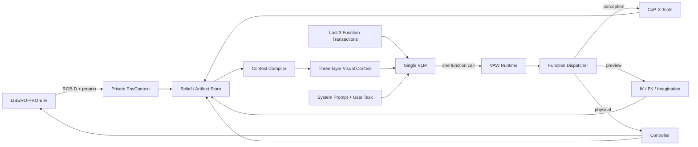

# VAW Context Runtime：单 VLM 设计与 Post-M1.2 Milestones

> 状态：设计基线，2026-08-02。
>
> 范围：定义 M1.2 之后的 Agent 输入、Context 生命周期、Function Space、单 VLM
> Runtime 与实施里程碑。现有 `docs/vaw_implementation_plan.md` 仍记录已经完成的
> M0–M1.2 实现与历史决策；本文件更新其中关于固定 Canvas、最近 K 张历史图片、
> 全量 state summary 和 post-M1.2 执行顺序的设计。
>
> 本文件只描述 VAW，不修改 CaP-X、LIBERO-PRO、控制器或训练框架。

## 0. 目标与结论

VAW 的目标不是给 VLM 一个可点击的机器人 GUI，而是把当前视觉观测、世界 belief、
机器人本体状态和下一动作想象，编译成一份 VLM 可以直接阅读的视觉工作记忆。

Post-M1.2 的核心工作不再是继续硬编码新的面板，而是建立：

```text
单个 VLM
  + 静态 System Prompt
  + LIBERO User Task
  + 当前三层 Visual Context
  + 最近三个 Function Call / Result
  + 小而稳定的 Function Space
```

当前定稿决策：

1. **只使用一个 VLM**。同一个模型产生感知调用、Action Intent、preview 决策、commit
   和终止判断；不引入独立 Actor/Critic VLM。
2. **每轮恰好一个 Function Call**。不执行批量、并行或同轮多动作。
3. **策略可见 History 最多三个 Function Transaction**。旧图片、旧 rationale 和完整
   对话不保留；当前 belief state 承担长期状态。
4. **Context 是类马尔可夫状态**：当前 observation、Scene Belief、proprioception、
   active intent/preview 与最近三个调用共同近似充分状态。
5. **运动动作采用软性的 intent–preview–commit 路线**。Prompt 和 Context 鼓励先看
   preview，但 Runtime 不用硬编码状态机禁止未 preview 的 commit。
6. **开/关夹爪是特殊直接动作**。它不要求 preview，但执行后必须刷新 observation、
   revision、gripper state 和 holding belief。
7. **只保留最小 Function Contract 校验**：JSON 可解析、function 存在、参数类型/长度
   合法、引用存在。Runtime 不判断“这个动作在语义上是否聪明”，也不硬编码工具顺序。
8. **Context Compiler 是确定性程序，不是第二个 VLM**。Agent 通过 Function Call 创建
   artifact，Compiler 决定如何把当前 artifact 渲染为三层 Context。
9. **LIBERO reward、BDDL predicate、真值物体 pose 和 success 不进模型 Context**。
   它们只进入 trace meta 和未来训练奖励。

## 1. 为什么现有 M1.2 代码不能直接成为 Runtime 架构

现有实现证明了真实 LIBERO、CaP-X 工具、preview、commit、trace 和 Web renderer
可以贯通，但它仍是上一版界面的直接编码：

- `WorkspaceSnapshot` 固定包含 Scene、Focus、Self、Intent、Candidates 和 Receipt；
- `web_presenter.py` 总是生成同一组 raster，React 总是按同一位置排版；
- candidate rail 默认适合 grasp proposal，不适合表达连续 delta action、rotate、
  长程 place、recovery 或其他 LIBERO 任务；
- `ChatSession` 只裁剪旧图片，旧 assistant/tool 文本仍无限增长；
- Runtime 每轮重发全量 `ActionState.summary()`，与图片文字重复，并让“视觉 Context”
  容易退化为 JSON ReAct；
- `move_xyz` 当前是直接物理动作，`nudge/rotate` 只编辑 candidate，尚未统一为通用
  Action Intent；
- 当前 Context 是“系统预先决定 Agent 看什么”，而不是当前 Function 调用产生的语义
  artifact 所组成的工作记忆。

因此 M1.2 renderer 继续作为可运行 baseline 和视觉素材生产器，但 post-M1.2 不在
现有 snapshot 上继续堆字段。新的 Context Runtime 先建立语义模型，再让 PIL/Web
renderer 消费同一个 `ContextPacket`。

## 2. Runtime 总体架构



### 2.1 Private EnvContext

只在 Runtime/工具内部存在：

- RGB-D；
- intrinsics / camera pose；
- raw mask / raw cloud；
- simulator/backend handle；
- 非策略可见的 env success/reward。

它不能直接序列化进 prompt、Web snapshot 或 Context image。

### 2.2 Public ContextState

Agent 可见的当前类马尔可夫状态，建议最小结构：

```text
ContextState
├── task_prompt
├── observation_revision
├── camera_views
│   ├── agentview_rgb_ref
│   └── wrist_rgb_ref
├── entities: EntityBelief[]
├── robot: RobotBelief
├── active_intent: ActionIntent | null
├── preview: PreviewArtifact | null
└── recent_calls: FunctionRecord[<=3]
```

原则：存引用而不复制重数据；每个 artifact 都有来源 revision 和认识状态。

### 2.3 Artifact 类型

#### EntityBelief

```text
id
semantic_name | null
bbox
mask_ref | null
obb | null
source_revision
freshness
predicates[]
```

`predicates` 是 PDDL-like belief，不是 LIBERO BDDL 真值。每个 predicate 必须区分：

- `observed`：直接由当前视觉证据支持；
- `derived`：由几何或工具推导；
- `hypothesis`：尚待 ground/inspect/执行验证，视觉上以 `?` 标记。

任务文本里出现、但尚未视觉绑定的实体必须显示为 `UNRESOLVED`，不能伪造 bbox。

#### RobotBelief

```text
ee_position
ee_quaternion
joint_positions
gripper_opening
estimated_gripper_width
holding_entity | null | unknown
source_revision
```

#### ActionIntent

所有非夹爪运动动作统一形成可引用 Intent：

```text
intent_id
kind
arguments
source_entities[]
source_revision
status: proposed | previewed | committed | rejected | stale
```

#### PreviewArtifact

```text
intent_id
endpoint_ik_ok
predicted_robot_state
trajectory_checked
collision_checked
notes
```

Preview 只陈述已有证据，不自动批准、不自动拒绝、不自动换候选。

#### FunctionRecord

策略可见 History 的唯一单位：

```text
function_name
arguments
result_summary
ok
revision_before
revision_after
intent_id | null
```

不保存旧 Canvas，也不保存旧 chain-of-thought。

## 3. 模型每轮真正看到什么

### 3.1 System Prompt

System Prompt 只放跨任务不变的规则：

- VAW 的角色和 Function Call 协议；
- 一轮一个调用；
- frame/quaternion/单位约定；
- observed / derived / hypothesis / imagined / executed / stale 语义；
- Visual Context 三层读图规则；
- intent–preview–commit 是推荐路线，但 preview 不是硬门控；
- gripper open/close 是直接动作；
- 不允许编造 tool result、receipt 或 env success；
- task 完成或不可完成时调用 `done`。

System Prompt 不包含当前物体、当前 pose、当前 intent 或历史。

### 3.2 User Prompt

一个 episode 的 User Prompt 是 LIBERO-PRO reset 返回的原始任务文本。除非任务本身
发生外部变更，不在每轮伪造新的 user instruction。

### 3.3 Current Visual Context

每轮只发送**一份当前 Context**。不发送最近三张旧 Canvas。

#### 第一层：Mandatory Observation

固定存在：

- 左侧大幅 `agentview` 主视角；
- 右侧同一列：上部 wrist RGB，下部 Task Prompt + Current Action Intent；
- 当前 observation revision 和物理/重建视角来源。

第一层回答：“现在看到了什么，当前要做什么？”

Task 的权威文本仍是 User Prompt；第一层重复显示它，是为了让视觉页面自身保持可读，
不是创建第二份任务状态。

#### 第二层：World/Self Belief

固定存在，以清晰大字文本为主：

- Scene Belief Tree；
- 已绑定对象的 bbox、几何引用、freshness；
- PDDL-like predicates 与认识状态；
- task entity 的 visual binding 状态；
- RobotBelief：gripper width、EE Pose、joints、holding belief；
- 当前最重要的 perception gap，例如 `ground("basket")`。

第二层不展示未经感知工具产生的“看起来合理”的对象状态。

#### 第三层：Intent-conditioned Imagination

只有存在 active motion intent 时才出现，布局按 intent 动态组织：

- `grasp`：对象、目标 TCP、gripper orientation、FK preview；
- `place/propose_pose`：held object、目标区域、object footprint、target pose；
- `delta_move`：current EE、delta vector、predicted EE/robot；
- `rotate`：current orientation、rotation axis/delta、predicted orientation；
- recovery：失败前状态、receipt、修正 intent。

第三层必须同时显示：来源 revision、是否 stale、IK、trajectory/collision 是否检查。

### 3.4 Minimal Context Manifest

Legacy Runtime 每轮重发完整 `ActionState.summary()`。新 Runtime 默认只发送最小文本
manifest，避免图片和 JSON 双份描述同一世界：

```json
{
  "revision": 4,
  "active_intent_id": "i3",
  "valid_entity_ids": ["obj1"],
  "valid_candidate_ids": ["g1", "g2"],
  "context_schema": "vaw-context-v1"
}
```

精确工具结果保留在最近三个 Function Result 中；长期事实进入第二层 Belief Tree。
M1.3 保留 `legacy_full_summary=true` 对照开关，但默认 Context 不依赖全量 JSON。

## 4. History：最多三个 Function Transaction

History 不是三张图，也不是最近三个自然语言回复，而是最近三个完整调用事务：

```text
assistant function call
→ tool result
```

例如：

```json
[
  {
    "name": "inspect",
    "arguments": {"object_id": "obj1"},
    "result": "fresh bbox/mask/OBB created",
    "revision": 4
  },
  {
    "name": "delta_move",
    "arguments": {"delta_xyz": [0.0, -0.03, 0.02], "frame": "base"},
    "result": "intent i3 created",
    "revision": 4
  },
  {
    "name": "preview",
    "arguments": {"intent_id": "i3"},
    "result": "endpoint IK pass; trajectory/collision unchecked",
    "revision": 4
  }
]
```

淘汰规则：

1. 新 Function Result 写入后，超过三个时删除最旧 transaction；
2. 删除时同时删除对应旧 assistant rationale 和旧 image；
3. System Prompt 与初始 User Task 始终保留；
4. active intent、当前 entity 和 holding belief 是 `ContextState`，不依赖 History 存活；
5. protocol 需要的 assistant call + tool result 成对保留，不能留下 orphan tool call；
6. trace 可以保留完整 episode，但策略输入严格只取最近三个 transaction。

这构成一个 bounded-memory POMDP：Runtime 内部可以保存完整 trace，VLM 只见当前
类马尔可夫状态与有限短历史。

## 5. Agent-visible Function Space

### 5.1 分层原则

CaP-X 原始 API 是 backend primitive，不应全部一对一暴露给 VLM。Agent-visible
Function 描述语义动作，Runtime adapter 负责参数传递、frame 转换和 artifact 生命周期。

| Agent Function | 语义 | 主要 CaP-X backend |
|---|---|---|
| `observe()` | 采集当前 observation，revision +1 | RGB-D/proprio observation |
| `ground(query)` | 创建/绑定 EntityBelief | VLM bbox/point + SAM3 |
| `inspect(object_id)` | 补充 bbox/mask/OBB/PDDL evidence | SAM3 + get OBB |
| `view(...)` | 重渲染同一 observation，不动机器人 | 本地 cloud/camera renderer |
| `propose_grasps(object_id)` | 产生 grasp candidates | GraspNet / plan_grasp |
| `propose_pose(...)` | 创建 pose intent/candidate | 本地 ActionIntent |
| `delta_move(delta_xyz, frame)` | 创建平移 ActionIntent，不立即执行 | current EE + solve_ik |
| `rotate(...)` | 创建旋转 ActionIntent，不立即执行 | current EE + solve_ik |
| `select(candidate_id)` | 将 candidate 设为 active intent | ContextState |
| `preview(intent_id)` | 产生 IK/FK/轨迹证据 | solve_ik + FK；未来 cuRobo |
| `commit(intent_id)` | 执行 active intent | move_to_joints/controller |
| `open_gripper()` | 特殊直接物理动作 | gripper control |
| `close_gripper()` | 特殊直接物理动作 | gripper control |
| `done(success)` | 声明 episode 结束 | Runtime/env boundary |

第一版不增加 `pin/forget/compose_page` 等 Context 布局工具。Agent 通过 `ground`、
`inspect`、intent 和 preview 间接构建语义 Context；Compiler 负责排版。

### 5.2 现有 op 的迁移

- `commit_gripper(action)` 拆成 `open_gripper()` / `close_gripper()`，减少 union 参数；
- `move_xyz` 不再作为主线直接物理动作；迁移为创建 intent 的 `delta_move`；
- 当前 `rotate(candidate_id, axis, degrees)` 保留为 candidate edit 兼容层；新通用
  `rotate` 需要能以 current EE 或 active intent 为输入，具体命名在 M1.3 冻结；
- `nudge` 继续作为 candidate edit，或在协议冻结时并入 `delta_move(target="candidate")`；
- `preview(candidate_id)` 迁移到 `preview(intent_id)`，candidate 被 select 后生成 intent；
- `commit()` 迁移到显式 `commit(intent_id)`，减少选择错绑；
- legacy op 在 M1.3 期间可通过 adapter 继续跑旧 trace，但不进入新 teacher 数据。

### 5.3 软协议，不做行为状态机

Runtime 不实现：

```text
ground 后才允许 inspect
inspect 后才允许 propose
preview pass 才允许 commit
IK fail 自动换 candidate
stale 自动禁止动作
```

这些是 VLM 应学习的决策。Runtime 只保证 function 可以被安全解析和调度；工具失败
以结构化 result 回灌，让模型学习恢复。Backend 的 IK 结果如实返回，不增加人工工作区
边界拦截或语义 hard gate。

## 6. 单 VLM Agent Loop

```text
reset LIBERO episode
  → 获取 task_prompt
  → observe R1
  → 构建 Layer 1 + Layer 2

repeat:
  → 编译当前 ContextPacket
  → 发送 System + User Task + Current Context + Last 3 Calls + Tools
  → 单 VLM 输出一个 Function Call
  → 最小 contract 校验
  → 执行 Function
  → 写入 FunctionRecord，裁剪为最近三个

  if perception/context function:
      更新 EntityBelief / view
      不改变物理世界

  if motion intent function:
      创建/修改 ActionIntent
      生成 Layer 3 target representation

  if preview:
      追加 PreviewArtifact
      Layer 3 显示 predicted robot 与检查边界

  if commit:
      执行物理动作
      采集新 observation/revision
      旧 evidence 按 revision 标 stale
      写入 receipt/discrepancy

  if open_gripper / close_gripper:
      直接执行，不要求 preview
      强制采集新 observation/revision
      更新 gripper 与 holding belief

  if done:
      终止 episode
```

`intent–preview–commit` 由 System Prompt、Layer 3 和训练数据塑造，不由 Runtime
硬门控。模型可以跳过 preview，但该选择会进入 trace，未来由任务成功、执行偏差和
工具成本学习。

## 7. Trace 与训练接口

Runtime 每轮至少记录：

```text
episode_id
turn
context_schema_version
context_image/path
context_manifest
visible_recent_calls
function_call
function_result
revision_before / revision_after
active_intent_id
receipt/discrepancy
env_reward / env_success       # 只落训练侧，不进模型输入
done
```

训练数据保持同一个 action 语法：

- Function-call SFT：学习工具路由、对象引用、intent 参数和 commit 时机；
- 类 VLA 参数学习：学习 `delta_move`、`rotate`、gripper command 的连续参数；
- RL：在相同 Context Runtime 上使用 LIBERO sparse success、过程 evaluator 和执行
  discrepancy；不另写第二套 rollout Context。

Teacher、student、SFT replay 和 verl AgentLoop 必须调用同一个 `ContextCompiler` 和
同一个 History 裁剪函数。

## 8. 更新后的 Milestones

### 8.1 与旧计划的映射

| Milestone | 当前状态 | 本文件中的解释 |
|---|---|---|
| M0 | 已完成 | ActionState、Workspace、ops、protocol、trace 基线 |
| M0.5 | 已完成 | 单 op Agent Runtime 与 provider 基线 |
| M1.1 | 已完成 | CaP-X + LIBERO-PRO 真实接线 |
| M1.2 | 已完成实验实现，视觉设计未冻结 | PIL/Web renderer、真实 trace、三层 Context 视觉原型 |
| 旧 M1.3 | 被本计划取代 | “reward 推迟”仍成立，但不再占一个空里程碑；reward 仍留 M5 |
| 旧 M1.4 | 合并进新 M1.4 | 真模型实跑改为验证新 Context Runtime，而非固定四区 Canvas |

### 8.2 M1.3 — Context Contract 与 Runtime 重构

目标：不改变底层 CaP-X/Controller，完成新的类马尔可夫 Context 输入。

实施项：

1. 定义 `ContextState`、`EntityBelief`、`RobotBelief`、`ActionIntent`、
   `PreviewArtifact`、`FunctionRecord`；
2. 定义 `ContextPacket` 与三层 `PageSpec`，renderer 从 PageSpec 渲染，不直接读取
   固定 WorkspaceSnapshot；
3. 实现最近三个 Function Transaction 的 protocol-safe History 裁剪；
4. 每轮只发当前 Context image，移除最近 K 张 Canvas 的默认策略；
5. 新建 Context System Prompt 与 minimal manifest；
6. 保留 `legacy_full_summary` 和旧 renderer 开关用于受控对照；
7. 为 source revision、stale、UNRESOLVED、PDDL belief epistemic status 写测试。

验收：

- 任意 turn 的模型输入只包含当前 Context image 和最多三个 Function Transaction；
- 移除更早 History 后，当前 entity、robot、active intent 不丢失；
- 同一 ContextState 产生确定性相同的 ContextPacket；
- Context snapshot 不含 depth、camera matrix、raw mask/cloud、reward 或 privileged pose；
- 第一层相机/Task/Intent、第二层 Scene Tree/proprio、第三层动态 intent 均由真实
  LIBERO state 生成，不读取 prototype HTML 的硬编码内容；
- fake backend 和真实 `libero_object_swap:0` trace 均可运行。

### 8.3 M1.4 — Hybrid Function Space 与单 VLM 真任务验证

目标：让同一个 VLM 在 object/spatial/goal 类任务中同时使用高层 CaP-X skill 与
VLA-like 增量动作。

实施项：

1. 增加 intent-producing `delta_move` 和通用 `rotate`；
2. 将 candidate/select/preview/commit 统一映射到 ActionIntent；
3. 拆分 `open_gripper` / `close_gripper` 直接物理动作；
4. 实现 legacy op adapter，旧 trace 可以 replay，但新 rollout 只记录新协议；
5. 在 Context Layer 3 实现至少 grasp、pose、delta translation、rotation 四种模板；
6. 用一个 VLM、同一个 System Prompt、同一个 Function Space 跑 3–5 个 LIBERO-PRO
   任务，覆盖 object/spatial/goal，而不是只跑 scripted pick。

验收：

- 每轮 Function Call 可解析，Runtime 不依赖第二个 VLM；
- gripper 直接动作执行后强制刷新 observation；
- delta/rotate 调用先创建 intent，Context Layer 3 正确显示；
- preview 可被使用或跳过，Runtime 均不硬门控；
- commit 后 receipt、discrepancy、stale lifecycle 正确；
- episode trace 完整，失败可归因到 Context、Tool、Controller 或 Model；
- 此阶段仍不以成功率为主要验收，但至少有完整可执行的多任务 episode。

### 8.4 M2 — Scene Belief 与 Imagination 完善

沿用旧计划，但从“pick-place scene memory”扩展为通用 ContextState：

- observe-bound scene inventory 与跨 revision entity association；
- held/free/visible/unseen/gone 状态；
- PDDL-like predicate 证据来源与不确定性；
- task entity resolution 和 perception gap；
- cuRobo trajectory/collision preview；
- held object 从 collision cloud 排除；
- grasp/place/delta/rotate/recovery 的统一 PreviewArtifact 与 discrepancy。

验收：跨 observation 不错绑 entity；不确定 predicate 不伪装成事实；不同 intent 使用
同一个 Context/preview 数据模型。

### 8.5 M3 — Context/Prompt/Function 冻结与教师采集

在采集前冻结：

- Context schema version；
- 三层页面语法；
- System Prompt；
- Function names/parameters；
- History K=3；
- minimal manifest；
- renderer 分辨率与字体。

随后使用 frontier teacher 采集多任务成功 trace。冻结后任何上述变化都需要新 schema
version，并原则上重新采集数据。

### 8.6 M4–M6

- **M4 SFT**：成功 trace 过滤、图文交错 Function Call 数据、单 VLM student baseline；
- **M5 RL**：verl 多轮 AgentLoop，reward 只在训练侧；比较 GRPO/PPO；
- **M6 实验**：CaP-X ReAct、legacy Canvas、三层 Context、去 Layer 2、去 Layer 3、
  History K={0,1,3,all}、有/无 preview、high-level-only vs hybrid action space。

## 9. 非目标

M1.3/M1.4 不做：

- 第二个 VLM、独立 critic/world model；
- GUI 点击、DOM action、按钮或拖拽；
- Agent 输出 CSS/layout；
- 无限历史、自动自然语言压缩或旧图片拼接；
- privileged PDDL/BDDL truth 注入；
- 新 affordance 模型；
- reward shaping、GRPO/PPO 实现；
- 并行 rollout 或分布式训练。

## 10. 实施顺序

```text
M1.2 visual prototypes（已有）
  → M1.3 Context data model
  → M1.3 History K=3 + Prompt input
  → M1.3 ContextCompiler + real LIBERO rendering
  → M1.4 ActionIntent + delta/rotate + gripper direct ops
  → M1.4 single-VLM multi-task validation
  → M2 belief/preview completion
  → M3 freeze and teacher collection
  → M4 SFT
  → M5 RL
  → M6 experiments
```

实施中必须保留 legacy runner/renderer 作为回归与论文对照；新 Runtime 通过版本化
Context schema 和 op adapter 渐进接入，不在一次提交里重写 Workspace、renderer、
protocol 和 trace 全部路径。
