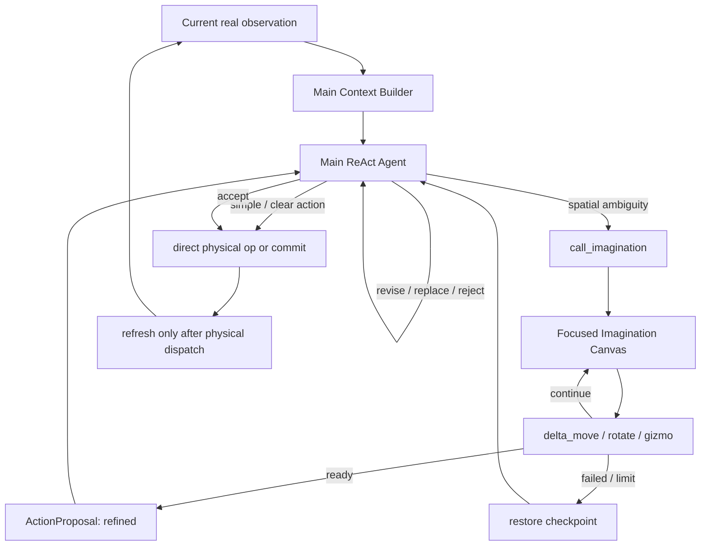

# VAW M1.5.2：Imagination Agent Call 与 ActionProposal 收敛设计

> 状态：设计冻结，部分落地——取消 commit 硬门控、失败回滚、失败分类、连续失败可见性、
> pre-dispatch Function Event 修正与领域命名收敛已随 `vaw-context-v38-optional-imagination`
> 实装；§7.2 的单次 edit 原子性随后补齐。尚未实现：optional `action_id`（从当前 TCP 启动
> Imagination）。
> 代码基线：`1c38175 feat(vaw): checkpoint agentic context OS and imagination canvas`  
> 相关现行文档：[`AGENTIC_CONTEXT_OS.md`](AGENTIC_CONTEXT_OS.md)、
> [`CURRENT_ARCHITECTURE.md`](CURRENT_ARCHITECTURE.md)  
> 本版新增：§16 运行证据（v40 四条 run 的定量分析）、§17 落地顺序与验收指标、
> §18 与自进化（RSI）的接口约定
>
> **语义修订（2026-08-20，schema `vaw-context-v43-partial-imagination`）**：turn_limit 不再
> 回滚。m16s seed2 的 imagination_0001 显示：子代理 6 轮编辑每步都通过规划校验、净收益为正，
> 却因未调用 finish_imagination 被整体回滚，前 6 轮预算全部作废。新契约：预算耗尽 ≠ 质量判定，
> runtime 把最后一次已通过规划校验的编辑作为 `status=partial`（reason=turn_limit）交回 Main
> 审查——可 commit、可从已推进状态继续委派、可 reject。回滚只保留给语义失败
> （geometry_unresolved / plan_unavailable / agent_failed，子代理自己判定目标不可解）与
> subagent_error（内部错误，状态不可信）；预算耗尽且手上无可执行计划时退化为
> plan_unavailable 回滚。质量把关不变：Main 审查 Preview 才能 commit，这与 ready 路径一致。

## 1. 这轮讨论要解决什么

当前 VAW 已经具备 Main ReAct、局部 Imagination、Current Canvas、Task Memory、Live References 和
Function Event，但 Imagination 的控制语义仍然不够干净：

- `refine_action` 这个名字把 Imagination 限定成了“修改一个已有 pose”；
- 所有空间 Action 都必须先经过 Imagination 才能 commit，使 SubAgent 变成了强制审批门；
- 物理动作刷新 revision 后，旧 `action_id` 被销毁，Main 即使已把机器人移动到安全 pre-pose，
  也不能直接从当前真实 TCP 请求 Imagination；
- Imagination 失败或达到编辑上限时，当前实现会丢弃整个 Action，而不是恢复进入前的有效提案；
- planner 失败、Imagination 失败和真实执行失败的生命周期边界还需要严格分开。

本轮目标不是增加更多字段，而是把三件事彻底分开：

```text
Main 选择一个准备执行的动作
Imagination 可选地对它做空间反事实推理
Main 最终决定是否执行
```

## 2. 用户的核心设想

### 2.1 Main 仍然是完整的 ReAct Agent

Main 不是只负责调用工具的调度器，也不是看不到 Canvas 的高层 planner。它始终接收当前真实世界的
完整 Context，并负责：

- 阅读当前 Canvas；
- 根据 User Task 选择关注对象；
- 调用 perception、grounding 和 proposal API；
- 选择一个具体动作；
- 直接执行简单、明确、低风险的动作；
- 在空间关系复杂或接触条件不确定时，把局部问题交给 Imagination；
- 审核 Imagination 返回的结果并决定 commit、继续调整、换动作或放弃。

### 2.2 Imagination 是空间推理 SubAgent，不是 `refine_action` 状态机

Imagination 的价值是让 VLM 在一个更聚焦的视觉面板中发挥：

- 3D 空间理解；
- 反事实比较；
- 局部位置和方向调整；
- 接触前的几何检查；
- 未来可扩展的遮挡分析、放置分析和多步空间想象。

它当前仍通过 `delta_move`、`rotate` 等局部工具编辑一个虚拟目标，但产品与论文语义不应再被
“refinement”限制。因此公开调用应命名为：

```text
call_imagination(instruction, action_id?)
```

论文和 Canvas 中统一称为 **Imagination Agent Call**。

### 2.3 Imagination 是可选能力，不是 commit 的硬门控

以下动作 Main 可以直接执行，不必进入 Imagination：

- 明确的 free-space pre-pose；
- 远离障碍物的抬升或后退；
- 简单的 Main `delta_move` 恢复动作；
- `open_gripper` / `close_gripper`；
- Main 已能从当前真实视觉判断安全、且已经有可执行计划的空间 Action。

以下情况适合调用 Imagination：

- candidate 只是粗略建议，夹爪位置或方向仍需确认；
- 抓取碗沿、把手、薄物体或拥挤场景；
- place 前需要同时理解容器边界、夹爪姿态和局部净空；
- 需要连续组合多个 `delta_move` / `rotate`；
- Main 无法仅从全局视图可靠判断接触几何。

Runtime 不根据 pick/place phase 或物体类型强制调用 Imagination。

## 3. 最小领域模型

### 3.1 三个概念必须分开

```text
ActionSeed
    粗候选，还没有被 Main 选中

ActionProposal
    Main 已选择的具体、未执行动作

Executed Physical Action
    commit 或直接物理 Function 已经实际 dispatch 的动作
```

`PendingAction` 应重命名为 `ActionProposal`。它不是轨迹，也不是动作历史，更不是物体已经被抓住的
信念；它只表示 Main 当前准备执行的一个虚拟目标。

### 3.2 Agent-visible `ActionProposal`

```python
@dataclass(frozen=True)
class ActionProposal:
    action_id: str
    intent: str
    target_pose: Pose
    state: Literal["planned", "refined"]
```

字段含义：

- `action_id`：当前 revision 内的短期句柄；
- `intent`：Main 创建该动作时的一句简短意图；
- `target_pose`：准备执行的目标 TCP pose；
- `state`：该动作来自 Main 的初始规划，还是经过 Imagination 编辑。

`planned` 与 `refined` 只记录来源，不代表安全等级，也不构成 commit gate。只要 episode-private
artifacts 中存在与当前 target 对齐的可执行 cached plan，二者都可以由 Main commit。

以下内容不进入 `ActionProposal`：

- CuRobo/PyRoki 对象；
- trajectory；
- returned joints；
- collision/IK telemetry；
- candidate、region 的完整历史；
- 无限增长的 edit 链。

它们继续保存在 episode-private `ActionArtifacts[action_id]` 中。

## 4. `action_id` 的最终设计

### 4.1 为什么不能永远必填

典型抓碗过程可能是：

```text
Main 创建碗上方 pre-pose
→ Main 直接 commit
→ observation 刷新，旧 action_id 按 revision 生命周期失效
→ 机器人真实 TCP 已经位于碗上方
→ Main 想在这个真实位置启动局部 Imagination
```

若 `call_imagination` 强制要求旧 `action_id`，Main 必须为了获得句柄而伪造一次
`propose_pose/select`。这既增加 turn，也扭曲了 Action 的含义。

因此最终接口采用可选 `action_id`：

```text
call_imagination(instruction, action_id?)
```

### 4.2 有 `action_id`

```text
call_imagination(
  action_id="a3",
  instruction="调整两指相对碗沿的位置与方向，形成可执行的抓取几何"
)
```

语义：编辑当前 revision 中已存在的 `ActionProposal a3`。

- 进入前保存私有 checkpoint；
- Imagination 从 `a3.target_pose` 开始；
- `ready` 后仍使用 `a3`，状态更新为 `refined`；
- `failed`、turn limit 或 provider error 时，完整恢复进入前的 `a3` 和 artifacts。

### 4.3 无 `action_id`

```text
call_imagination(
  instruction="从当前真实 TCP 开始，寻找适合接近碗沿的局部位姿"
)
```

语义：以当前 observation 中的真实 TCP pose 作为唯一 anchor，创建一个临时 `ActionProposal`。

- Runtime 分配新的 `aN`；
- 初始 target 严格等于当前真实 TCP，不猜测语义目标；
- `created_action=True` 只存在于私有 session；
- Imagination 至少要产生一个成功规划的空间 edit，才可返回 `ready`；
- `ready` 时该提案成为 Main 可见的 `active_proposal`；
- `failed` 时删除临时提案，恢复为无 active proposal。

这不是“无 anchor 想象”。anchor 是当前真实 TCP，只是不要求 Main 先人为创建一个空 Action。

### 4.4 歧义处理

如果省略 `action_id`，但当前已经存在 `active_proposal`，调用应返回简短错误，要求 Main 显式指定
要编辑的 Action。Runtime 不应暗中猜测是覆盖当前提案还是从真实 TCP 重新开始。

## 5. Main 与 Imagination 的职责边界

| 能力 | Main | Imagination |
|---|---:|---:|
| 阅读完整当前世界 Canvas | 是 | 否 |
| perception / grounding | 是 | 否 |
| 生成/选择 ActionSeed | 是 | 否 |
| 创建初始 ActionProposal | 是 | 可从当前 TCP 临时创建 |
| 直接 `delta_move` | 是，物理执行 | 否 |
| 局部累计 `delta_move` / `rotate` | 通过调用 SubAgent | 是，只编辑 Preview |
| 打开/关闭真实夹爪 | 是 | 否 |
| commit | 是 | 否 |
| done | 是 | 否 |
| 判断任务是否完成 | 是，依据当前真实视觉 | 否 |

Imagination 不拥有任务控制权，不执行物理动作，也不声称物体会被抓住、附着、滑动、释放或进入
容器。它只交付一个空间 ActionProposal 或一个有限类别的失败结果。

## 6. 同步调用流程



对 Main 而言，一次 Imagination session 是一个同步 Function transaction。Imagination 内部多轮调用、
edit summary 和局部 rationale 只写 nested trace，不进入 Main transcript。

## 7. Imagination 的事务语义

### 7.1 进入时

Runtime 创建 episode-private checkpoint：

```text
ImaginationCheckpoint
├── original_proposal | None
├── original_action_artifacts | None
└── created_from_current_tcp
```

checkpoint 不进入 Agent Context。

### 7.2 编辑时

每一次空间 edit 必须原子完成：

```text
derive target
→ request planner
→ planner returns usable result
→ replace working proposal + cached plan
```

如果单次规划失败：

- 保留上一份有效 working proposal 和 plan；
- 不把失败 target 变成可 commit 状态；
- 向 Imagination 提供一条短、可行动的反馈；
- 完整 planner telemetry 只写 trace。

### 7.3 `ready`

- 现有 Action：保留同一 `action_id`，发布编辑后的 target 与 plan；
- 当前 TCP 创建的 Action：发布新 `action_id`；
- 将 `state` 标为 `refined`；
- 返回 Main 审核，不自动 commit。

```json
{"status":"ready","action_id":"a3"}
```

### 7.4 `failed` / turn limit / provider error

- 编辑已有 Action：恢复进入前的 ActionProposal、state 和完整 artifacts；
- 从当前 TCP 临时创建：删除该 Action 和 artifacts；
- 不修改 RGB、revision、Task Memory、Contact Camera session、region、point 或 seed；
- 不把 `failed` 当成可交付或可 commit 的动作。

失败原因只允许有限的策略级类别：

```text
geometry_unresolved
plan_unavailable
turn_limit
subagent_error
```

编辑已有 Action 时：

```json
{"status":"failed","action_id":"a3","reason":"turn_limit"}
```

从当前 TCP 临时创建且失败时，新 ID 已无效，因此不返回 live action 引用：

```json
{"status":"failed","reason":"geometry_unresolved"}
```

原始异常、solver status 和内部临时 ID 仍保存在 trace。

#### 7.4.1 当前实现的两处失败混淆（必须随本条一起修）

现状是 `_fail_imagination` 只返回 `{"status": "failed", "source_ref": ...}`，
`termination_reason` 只写 trace，`memory.py` 给 Main 的失败文案是一句写死的通用句子。
Main 无法区分「几何不可解，该换 seed」和「预算耗尽，再给一次可能就成」，而这两种情况的
正确应对完全相反。此外代码里有两处类别混淆：

1. Agent 主动 `ready` 但没有可执行 plan 时走
   `_fail_imagination("agent_ready_without_executable_plan")`，对 Main 而言与 turn limit
   完全同形——但前者是 `plan_unavailable`，后者是 `turn_limit`；
2. provider 抛异常时 `runtime.py` 调 `limit_refinement()`，最终落到
   `_fail_imagination("turn_limit")`——网络/模型错误被记成了预算耗尽，应单独走
   `subagent_error` 路径。

内部 termination reason 到策略级类别的映射：

```text
agent_failed                        → geometry_unresolved
*_without_executable_plan           → plan_unavailable
turn budget 真实耗尽                 → turn_limit
provider 异常 / runtime 异常         → subagent_error
```

#### 7.4.2 失败类别必须机器可读地落盘

`reason` 除了进入 Function result 供 Main 当轮决策外，还必须写入该 session 的
`meta.json`（与 instruction、结果状态并列）。这不是冗余：session 级
`(instruction, reason, 后续 commit 是否成功)` 三元组是 §18 自进化循环的最小 reward
记录，本轮顺手落盘的成本接近零，事后补的成本很高。

### 7.5 连续失败对 Main 的可见性（本版新增，优先级最高）

v40 的 t1（cream cheese）暴露了一个本文档此前没有覆盖的结构性缺陷：16 个 turn 里 5 次
`refine_action` 全部失败、0 次 commit，机械臂在空间动作上零进展，最终中断在第 6 次
imagination session 里。这不是模型「不听话」，而是信息上被迫重复：

- 失败的 refine 不写 Task Memory——这是正确的，因为没有 dispatch 物理控制；
- 但 `Current Function Event` 每轮被完全覆盖（`runtime.py` 的
  `project_function_event` 投影），中间隔一次 `select` / `detection_and_sam`，
  失败痕迹就消失了；
- rationale 不回放。

所以 Main 在发起第 3 次 refine 时，context 里没有任何证据表明它已经失败过两次。
失败回滚（§7.1/§7.4）和失败分类（§7.4）都不解决这个问题：回滚保证世界不被污染，
分类告诉 Main 这一次为什么失败，但都不告诉 Main「同一个 revision 内我已经试了几次」。

修复设计：在 Live References 中加入一个 revision-local 的最小失败摘要：

```json
{
  "imagination_attempts": {
    "total": 3,
    "failed": 3,
    "last_reason": "turn_limit",
    "retired_seed_ids": ["s2", "s4"]
  }
}
```

约束：

- revision-local：任何物理 dispatch 刷新 observation 后自然清零，不跨 revision；
- 只有计数、类别和已失败 source 的 ID，不含 rationale、instruction 原文或 solver
  telemetry——这些仍只进 trace；
- 不写 Task Memory，不改变 §8 生命周期表中「planning 失败不失效 evidence」的语义；
- 配套的 System Prompt 指引：同一 revision 内 imagination 连续失败达到 2–3 次后，
  Main 应换 seed、直接 commit 有效的 `planned` 提案，或主动重新 detection，而不是
  换一句 instruction 重试。

该字段是短期引用，完全符合 `AGENTIC_CONTEXT_OS.md` 的 Context 不变量（无长期失败
历史、无跨 revision 状态），实现成本估计在几十行以内，应与 §7.4 失败分类捆绑为
同一次提交（见 §17 顺序）。

## 8. commit 与 observation 生命周期

系统必须按“是否已经 dispatch 物理控制”划分失败，而不是按 Function 名称划分。

| 情况 | 真实世界可能变化 | 刷新 observation | 旧 evidence/action 失效 | Task Memory |
|---|---:|---:|---:|---:|
| perception 失败 | 否 | 否 | 否 | 不写 |
| proposal/planning 失败，未 dispatch | 否 | 否 | 否 | 不写 |
| Imagination 失败/limit | 否 | 否 | 否 | 不写 |
| commit 在 dispatch 前发现无 plan | 否 | 否 | 否 | 不写 |
| physical dispatch 成功 | 是 | 是 | 是 | `executed` |
| physical dispatch 后 backend 报错 | 可能 | 是 | 是 | `effect_unknown` |

因此：

- CuRobo/PyRoki 无法产生轨迹时，不应使 region、point、seed 或原 Action 过期；
- Imagination 失败后，Main 可以换 instruction、换 seed、直接恢复动作或主动重新检测；
- Runtime 不强制重新 detection；
- 一旦控制命令已经发给真实/仿真机器人，即使返回 error，也必须重新采集 observation，因为机器人
  可能已经发生部分运动。

### 8.1 Function result 如何进入 Memory

本轮保留用户提出的“成功 primitive 结构化记录”思路，但不把所有 Function result 原样堆进 Memory。
Runtime 应在 handler 边界做确定性归约：

```text
raw Function result
├── 对下一步仍有效的短期引用 → Live References
├── 最近一次最小结果         → Current Function Event
├── 已 dispatch 的物理 primitive → Task Memory
└── 完整参数、异常与诊断       → Trace only
```

原因是不同结果具有不同生命周期：

- detection、point、seed 和 Action 是当前 observation 的短期引用，不能伪装成跨 revision Memory；
- planning/Imagination 失败没有改变世界，只需一轮可行动 Event，不应成为长期失败历史；
- 成功 dispatch 的 `move_to/delta_move/open_gripper/close_gripper` 才构成跨 revision 的因果连续性；
- dispatch 后失败以 `effect_unknown` 写入 Memory，因为世界可能已经部分改变；
- 模型 rationale、raw JSON、solver error 和 receipt 永远只进 trace。

因此 Task Memory 仍是小型、overwrite/compact-only 的物理 primitive ledger，而不是 Function
transcript。它记录“系统实际尝试做过什么”，不声称“任务效果已经发生”。

## 9. Context 与 Canvas 如何配合

### 9.1 Main Context

Main 每轮仍只接收：

```text
System Prompt
User Task
Task Memory
Live References
Current Function Event
Current Main Canvas
Main Function definitions
```

`Live References` 中的字段应随重命名收敛为：

```json
{
  "active_proposal": {
    "action_id": "a3",
    "intent": "approach bowl rim",
    "state": "refined"
  },
  "valid_region_ids": ["region2"],
  "valid_point_ids": ["point1"],
  "valid_seed_ids": ["s4", "s5"]
}
```

Function Event 只投影仍然有效的引用和短结果，不回灌 Imagination transcript。

### 9.2 Imagination Context

Imagination 只接收：

```text
Imagination System Prompt
Imagination Task / instruction
current proposal summary
cumulative edit summary
last two edits
remaining turn budget
one current Focused Canvas
Imagination Function definitions
```

它不接收 Main Task Memory、Main transcript、旧图片或 planner telemetry。

### 9.3 Canvas 边界

- Main Canvas 继续显示当前真实世界和当前有效 Action Preview；
- Imagination Canvas 聚焦空间几何和 counterfactual target；
- SubAgent 返回 `ready` 后，Main 必须看到最终 Preview，再决定 commit；
- Preview 中的虚拟机器人、line-art 和 carried-volume/OBB 都是假设几何；
- Canvas 不模拟接触、附着、滑移、掉落或容器包含关系；
- 本重构不要求修改现有 renderer、Contact Camera、line-art 或 OBB 实现。

## 10. 抓碗示例

该示例说明职责分工，不是硬编码流程。

```text
1. Main 阅读真实 Canvas，定位碗和碗沿。
2. Main 创建一个安全的 pre-pose，例如位于碗上方若干厘米。
3. 若 free-space 几何明确，Main 直接 commit pre-pose。
4. 新 observation 到来；旧 action ID 正常失效，真实 TCP 已在碗附近。
5. Main 调用：
   call_imagination(
     instruction="从当前真实 TCP 调整夹爪，使两指适合接近碗沿并保留掌部净空"
   )
6. Runtime 以当前真实 TCP 创建临时 ActionProposal。
7. Imagination 通过 Contact Front/Side 连续 delta/rotate。
8. Imagination 返回 ready；Main 阅读最终 Main Canvas。
9. Main 可以 commit、再次 call_imagination，或 reject_action。
10. 到达后，Main 根据新的真实视觉决定是否直接 close_gripper。
```

上述设计没有规定固定高度、必须调用次数或 pick/place phase；它只保证 Action、Imagination 和真实
执行之间的因果关系清楚。

## 11. 代码改造范围

这是一次中等规模的语义重构，不是 planner 或 renderer 重写。

### 11.1 核心重命名

```text
PendingAction          → ActionProposal
pending_action         → active_proposal
RefinementSession      → ImaginationSession
RefinementResult       → ImaginationResult
refine_action          → call_imagination
begin_refinement       → begin_imagination
_run_refinement        → _call_imagination
limit_refinement       → limit_imagination
Refinement Instruction → Imagination Task
```

不保留 `refine_action` compatibility alias，避免旧语义继续污染 Prompt、trace 和实验。

### 11.2 主要文件

| 文件 | 修改内容 |
|---|---|
| `context_runtime/model.py` | ActionProposal、ImaginationSession、state 字段重命名 |
| `context_runtime/private.py` | checkpoint、created-from-current、原子 artifacts 更新 |
| `context_runtime/workspace.py` | begin/ready/fail/rollback 生命周期 |
| `context_runtime/functions.py` | `call_imagination` handler、commit 取消 refined gate |
| `context_runtime/protocol.py` | Main/Imagination Function schema 和简短中文描述 |
| `context_runtime/runtime.py` | 同步 SubAgent 调用与结果投影 |
| `context_runtime/packet.py` | presentation view 从 active proposal + private artifacts 编译 |
| `context_runtime/trace.py` | 新命名、checkpoint/rollback 和 nested trace 元数据 |
| `vaw-ui/` | 仅机械重命名文案，不改变视觉布局 |
| docs/tests | 删除旧 refinement/mandatory-ready 语义 |

预计核心语义代码约 `150–250` 行，测试约 `150–200` 行；其余主要是命名迁移和文档更新。

## 12. 测试与验收

### 12.1 离线测试

- Main `planned` Action 在 cached plan 有效时可以直接 commit；
- Runtime 不自动调用 Imagination；
- `call_imagination(action_id=...)` 成功后保持同一 ID；
- 编辑已有 Action 失败/limit/provider error 时精确恢复原 proposal 和 artifacts；
- 无 action ID 时从当前真实 TCP 创建 proposal；
- current-TCP session 失败时不留下无效 proposal；
- 省略 action ID 但已有 active proposal 时拒绝歧义调用；
- 单次 edit planning 失败时保留上一帧有效 Preview；
- Imagination 失败不刷新 revision，不清除 region/point/seed，不写 Task Memory；
- commit 在 physical dispatch 前失败时保留 Context；
- physical dispatch 后失败时刷新 observation 并写 `effect_unknown`；
- Main Function 列表只有 `call_imagination`，不再出现 `refine_action`；
- Main messages 不含 Imagination transcript、solver telemetry 或失效 action ID；
- 失败结果携带四类之一的 `reason`；`ready` 无可执行 plan 映射为 `plan_unavailable`，
  provider 异常映射为 `subagent_error`，不再与 `turn_limit` 同形；
- 每个 imagination session 的 `meta.json` 含机器可读的 `(instruction, reason, 状态)`；
- Live References 中 `imagination_attempts` 随 session 递增、随物理 dispatch 清零，
  且不含 rationale 或 instruction 原文；
- 现有 Canvas 尺寸、Contact View、line-art、OBB 和 deterministic screenshot 回归通过。

### 12.2 真实 LIBERO-PRO 验收

至少覆盖两条不依赖任务特例的路径：

```text
路径 A：select/propose_pose → Main 直接 commit
路径 B：commit pre-pose → call_imagination(no action_id) → Main review → commit
```

人工检查：

- Main 是否把 Imagination 当作可选空间工具，而不是固定阶段；
- pre-pose 后是否能从当前真实 TCP 正常启动；
- failed/limit 后是否能继续使用原 evidence 和原 Action；
- Main 是否始终在最终 Preview 后拥有 commit 决策权；
- SubAgent 是否从未直接执行物理动作。

## 13. 本轮非目标

- 不增加 object tracking、PDDL、Scene Memory 或 task phase machine；
- 不增加新的 motion planner 或自动 planner fallback；
- 不修改 CaP-X、RoboMEx 或 `capx_skill_rl`；
- 不让 Imagination 直接 perception、commit、open/close 或 done；
- 不模拟真实接触、物体附着、滑移、释放和掉落；
- 不把模型 rationale 保存为长期 Memory；
- 暂不支持完全 observation-only、没有任何空间 Action 输出的纯分析型 Imagination。

## 14. 后续扩展边界

`call_imagination` 的命名为未来能力保留空间，但扩展必须先定义明确的输出契约。可能的后续方向：

- 多 seed 的反事实比较；
- 遮挡与可见性分析；
- place 容器关系的局部空间推理；
- 带中间 waypoint 的多步空间想象；
- observation-only 分析结果，但必须是短、结构化、可验证的结论，不能返回自由文本长期记忆。

在这些能力实现前，无 `action_id` 调用仍然以当前真实 TCP 为 anchor，并最终交付一个
`ActionProposal`，不能退化成没有执行语义的聊天 SubAgent。

## 15. 决策摘要

1. Main 始终是完整 Context 驱动的 ReAct Agent。
2. Imagination 是 Main 可选调用的空间推理 SubAgent，不是 commit gate。
3. `refine_action` 改名为 `call_imagination`，不保留旧别名。
4. `PendingAction` 改名为 `ActionProposal`，它是 Main 选定但未执行的动作。
5. `action_id` 可选：有 ID 编辑现有 Proposal；无 ID 从当前真实 TCP 创建临时 Proposal。
6. Main 可以直接 commit 有效的 `planned` Proposal，也可以先交给 Imagination 变为 `refined`。
7. Imagination ready 只返回 Main 审核；SubAgent 永不 commit。
8. Imagination 失败是事务回滚，不刷新 observation、不丢 evidence、不污染 Task Memory。
9. 只有物理控制已经 dispatch 后，成功或失败才刷新 revision。
10. 本轮复用现有 v37 Canvas 视觉基线，重点收敛控制语义、Context 和失败生命周期。
11. 失败结果必须携带四类之一的策略级 `reason`，且随 session `meta.json` 机器可读落盘。
12. 同一 revision 内的 imagination 尝试次数与失败类别通过 Live References 对 Main 可见，
    物理 dispatch 后清零。

## 16. 运行证据（v40，四条 LIBERO-PRO run）

本节记录支撑各提案优先级的定量证据，供后续复测对照。

| run | 物体 | turns | refine_action | 其中失败 | commit | 结果 |
|---|---|---:|---:|---:|---:|---|
| t0 | alphabet soup | 49 | 6 | 1 | 5 | `env_success: true` |
| t1 | cream cheese | 16 | 5 | **5** | **0** | 中断于第 6 次 imagination |
| t2 | salad dressing | 52 | 8 | 1 | 7 | 中断 |
| t3 | bbq sauce | 20 | 3 | 0 | 3 | 中断 |

关键事实：

- **四条 run 中 commit 数严格等于成功 refine 数，零例外。** 这是「Imagination 事实上是
  强制门」的最硬证据，直接支撑 §2.3（该项已随 v38 实装，此后应复测该指标是否解耦：
  若出现不经 imagination 的 commit，说明门控确实是多余的税；若 Main 仍每次都调，
  说明剩余问题在 Prompt 而非 runtime）。
- **成本可量化**：t0 每个 imagination session 内部 4–6 轮，六个 session 消耗约 19.5 万
  token，占全程 58.5 万的 33%。可选化 + 失败可见性预期显著压缩这部分开销。
- **t1 是失败可见性缺陷（§7.5）的完整案例**：5 连败并非几何无解——`select` 出的 seed
  本身有 CuRobo plan——而是 Imagination 未能在 6 轮预算内主动 `ready`，而 Main 每次
  发起新尝试时 context 中没有任何此前失败的痕迹。丢弃 action 的旧「修复」没有阻止
  循环，只是让每轮多花一个 turn 重建句柄。
- **v33 `t0_s2` 是 optional `action_id`（§4）的反面证据**：隐式 current-TCP 路径曾让
  模型在已 commit 到罐顶后再次发起「继续下降包夹」的 session，把目标 z 推到 −0.001
  连烧 6 轮。§4.3 的两条约束（初始 target 严格等于当前 TCP、至少一次成功规划的 edit
  才能 ready）与 §4.4 歧义拒绝因此是该项实装的必要前提，不是可选加固。
- t2 的 `imagination_0008`（place 任务，对齐 carried-volume 与篮口）说明放置类 session
  的搜索空间大于抓取，但当前预算与抓取相同（固定 6 轮）；预算分配可在 §17 第二步
  之后按数据再议。

## 17. 落地顺序与验收指标

按「证据强度 ÷ 成本」排序，每步有独立的可验收指标：

```text
第一步（几十行，不动命名与生命周期）
    §7.4 失败分类 + §7.4.2 落盘 + §7.5 连续失败可见性
    验收：复测 t1 场景，5 连败是否收敛为「换 seed / 直接 commit planned / 重新 detection」

第二步（与已实装的取消门控配套）
    §7.1/§7.4 失败恢复 checkpoint：失败回滚到进入前的 planned 提案
    理由：门控取消后，回滚到 planned 的提案存在「直接 commit」的出口，不再是死路；
    在门控存在时单独做恢复反而诱导重复调用——两者必须以这个顺序落地
    验收：commit 数与成功 refine 数是否解耦（见 §16 关键事实第一条）

第三步（等第二步数据说话）
    §4 optional action_id
    判据：取消门控后 Main 是否仍为了获得句柄而伪造 propose_pose/select 空转；
    若不再发生则本条取消；若实装则在 trace 中单独统计无 ID session 的成功率

第四步（M3 冻结时统一做）
    §11.1 全套重命名
    理由：不改变行为但涉及 8 个文件 + 测试 + UI + 文档，且使 v33–v40 已有 trace 的
    函数名失配；与其他迁移合并成一次，避免单独消耗一个周期
    注意：门控报错文案硬编码了 "call refine_action before commit"，改名时易漏
```

已知代码卫生问题（随最近一步顺手处理）：

- `created_action` 处于半死状态：`model.py` 定义、`workspace.py` 恒设 `False`、
  `_fail_imagination` 不再读取。按 §4.3 复活或删除，不要保持现状误导后续读代码的人。

## 18. 与自进化（RSI）的接口约定

本里程碑仍是 demo，不实现任何自改进循环（见 §13 非目标）。但按 RSI 文献的核心结论，
自我改进的上限取决于验证信号的质量与成本；本节约定的唯一目的，是让当前正在打磨的
harness 同时成为未来自进化循环的验证基础设施，避免事后重建。

### 18.1 对本轮的唯一硬性要求：完整的机器可读结果标签

每个 episode 与每个 imagination session 必须落盘以下标签（大部分已存在于 trace，
本轮补齐 §7.4.2 后闭合）：

```text
episode 级
├── env_success / claimed_success
├── terminate_mode（正常 done / turn limit / 中断原因）
└── 每次 commit 的 TCP 误差

session 级（imagination meta.json）
├── instruction 原文
├── 结果状态：ready | failed
├── 失败类别：§7.4 四类之一
└── 后续关联 commit 是否成功（可由 trace 离线关联）
```

这组标签现在服务于 Main 的当轮决策与人工调试，将来直接就是自进化循环的 reward 信号。

### 18.2 预留的自进化插入点（按可验证性从高到低）

以下均为未来方向，本轮不实装，仅确认当前架构不阻塞：

1. **Refinement instruction 模板进化**。Main 写给 Imagination 的 instruction 已结构化
   存储且带结果标签；t1 类失败 session 是现成负样本。验证信号：refine 成功率与后续
   commit 成功率。这是最便宜、最可验证的一环。
2. **冻结 probe 集的自我积累**。确定性渲染器 + static VLM diagnostic 已构成廉价
   evaluator（embodied 方向稀缺资产）；每条失败 trace 可蒸馏为一个冻结场景 probe，
   使评估集随失败自动增长——进化的是 evaluator 而不只是 policy。
3. **Harness 参数搜索**。imagination 轮次预算、planner 路由阈值（6cm/20°）、canvas
   布局变体均已外置为可检查、可回滚的配置，天然满足「自改面约束在可审计结构上」。
4. **成功 trace → SFT 数据**。即既有 M3 冻结 + teacher 采集 → M4 蒸馏路线；demo
   harness 自动成为数据引擎。

### 18.3 论文切分

demo 论文只讲 harness + verified imagination + 成功率数字，一篇论文一个 claim；
自进化是第二篇的题目（同一套 harness 作为 self-improvement 的基底），届时第一篇
即其 baseline 与评估工具。
