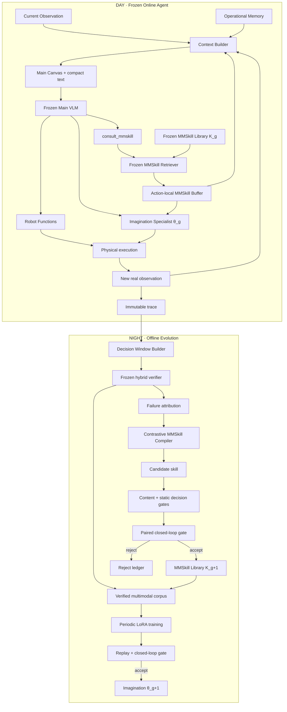

# VAW-RSI MMSkill 重构计划：删除 Playbook，建立快慢双层能力进化

> 状态：Implementation-ready design
>
> 日期：2026-08-30
>
> 适用范围：`vaw/`、`vaw-ui/`、VAW tests 与 VAW experiment tooling
>
> 不修改：CaP-X、RoboMEx、`capx_skill_rl`、LIBERO-PRO、planner/controller 本体

## 0. 一句话目标

彻底删除旧的 `CARD.md` / Task Knowledge Pack / Playbook 路线，把 VAW 的快速进化单元改为
**action-local、图文联合、可验证、可回滚的 MMSkill**；再把跨任务稳定的 MMSkill 轨迹低频蒸馏到
Imagination Specialist LoRA，形成相互独立、可分别消融的 Fast Lane 与 Slow Lane。

最终系统不是依靠一段 SOP 告诉 Agent “先做 A 再做 B”，而是在出现具体空间困难时给 Agent 一组视觉
正反例和证据边界，帮助它用现有 Canvas 与 Function 自己作出判断。

---

## 1. 这次重构解决什么问题

旧 Playbook/Knowledge Card 路线有五个根本问题：

1. **粒度错误**：task-start 一次性选择整包知识，无法针对某个抓取、旋转、放置或验证瞬间动态加载。
2. **模态错误**：纯文本很难表达手指通道、掌部净空、容器开口和相对姿态等空间关系。
3. **容易退化成 SOP**：Card 很容易写成固定 Function 序列，绑定任务、物体或 primitive。
4. **上下文污染**：长文本 Pack 在整个 episode 中常驻，既消耗 token，又可能覆盖当前真实视觉证据。
5. **进化归因不清**：Card 更新、Prompt 更新和 LoRA 更新容易同时发生，无法判断收益来自哪里。

新系统采用以下原则：

- 当前真实 Canvas 始终优先；外部技能只能作为参考，不能成为当前世界事实。
- 技能只在具体 Action 或当前 revision 内短暂存在，不进入长期 transcript。
- Function result 不直接变成“知识”；只有经过物理执行、视觉进展和闭环结果验证的局部 Decision Window
  才能成为技能候选。
- Main VLM、Function contract、Canvas 基础语义和 verifier 在一个 generation 内冻结。
- MMSkill 与 LoRA 分别评测、分别晋升、分别回滚。

---

## 2. 当前代码审计结论

### 2.1 在线路径的真实状态

当前 Main Runtime 已经不加载 Knowledge Card：

- `ContextRuntime` 在 trace meta 中记录 `knowledge_mode="disabled"`；
- Main Function 列表中没有 `search_knowledge` / `load_knowledge`；
- Main Context 不注入 Card；
- `vaw/knowledge_base/` 中没有实际 `CARD.md`。

因此删除旧 Playbook 不会切断当前真实机器人控制链路。风险主要来自残留接口和过时文档，而不是在线行为。

### 2.2 仍然残留的旧实现

| 位置 | 当前残留 | 重构动作 |
| --- | --- | --- |
| `vaw/knowledge_runtime/` | Card model、registry、bootstrap、projection | 整目录删除 |
| `vaw/knowledge_base/` | 禁用说明和 package data 入口 | 整目录删除 |
| `tests/test_vaw_knowledge.py` | 对休眠 Card/Pack 的测试 | 删除，由 MMSkill tests 替代 |
| `vaw/context_runtime/trace.py` | bootstrap logger、knowledge trace 字段 | 删除 |
| `vaw/context_runtime/trace_read.py` | historical playbook aliases | 删除，不保留 live compatibility |
| `vaw/evolution/sweep.py` | `--knowledge-base` 透传 | 删除，改为 generation/config 参数 |
| `vaw/README.md` | task-start Pack 与 knowledge sweep 文案 | 重写 |
| `vaw-ui/src/observatory/` | task knowledge pack UI/types | 删除，改为 MMSkill retrieval timeline |
| `pyproject.toml` | `knowledge_base/*` package data | 删除，加入 MMSkill library schema/assets |
| `vaw/playbooks/` | 已在工作树删除 | 确认删除并不恢复 |

### 2.3 文档处理

- `VAW_RSI_DAY_NIGHT_VISUAL_SKILL_EVOLUTION.md` 保留为论文方法设计。
- 本文成为唯一的工程实施规范。
- `MASTER_PLAN_VERIFIED_COEVOLUTION.md` 中仍有大量 Playbook/CARD 设计。实现开始时先迁移其中仍有效的
  paired evaluation、frozen verifier、LoRA gate 和 rollback 规则，然后删除该旧文件。
- `M1_6_RSI_READINESS_PLAN.md` 的 Playbook 路线不再维护；实现开始时删除。
- 历史 `vaw/out/` trace 不主动删除，但新 Runtime、新 viewer 和新 evaluator 不承诺读取旧 Playbook 字段。
- 如果论文需要 Text Playbook baseline，从 Git tag 在隔离 worktree 中重建，不在主 Runtime 保留兼容代码。

---

## 3. 目标架构



系统中必须长期保持四种状态彼此分离：

| 状态 | 生命周期 | Agent 是否可见 | 作用 |
| --- | --- | ---: | --- |
| Operational Memory | episode-local、覆盖/有界 | 是 | 保存当前操控连续性，不是世界真值 |
| MMSkill Buffer | action-local 或 revision-local | 是 | 当前决策临时加载的视觉技能 |
| MMSkill Library | generation-frozen | 否；仅检索结果可见 | 外部快速能力记忆 |
| LoRA Adapter | generation-frozen | 间接 | Imagination Specialist 的慢速参数记忆 |

MMSkill 不能取代 Operational Memory；LoRA 也不能反向改写 MMSkill 的验证记录。

---

## 4. MMSkill 最小数据结构

### 4.1 Agent 可见 Capsule

每个技能目录只包含一个结构化描述和 1–2 张图：

```text
MMSkillCapsule
├── applicable_when
├── positive_reference
├── negative_reference?       # 可选，但推荐
├── visual_cue
├── affordances[]             # 能力，不是固定 Function 顺序
├── adjustment_principle
└── verification_cue
```

推荐磁盘形式：

```text
vaw/mmskill_library/
└── generations/
    └── gen_000/
        ├── manifest.json
        └── skills/
            └── stable-parallel-grasp-contact/
                ├── skill.json
                ├── positive.png
                ├── negative.png
                └── record.json
```

`skill.json` 只包含 Agent 可见内容：

```json
{
  "schema": "vaw-mmskill-v1",
  "skill_id": "stable-parallel-grasp-contact",
  "version": 1,
  "applicable_when": "平行夹爪接近局部目标，但闭合条件仍不确定。",
  "visual_cue": "比较两指闭合扫掠区域、双侧接触和掌部净空。",
  "affordances": ["translate_preview", "rotate_preview", "gripper_close", "verify_lift"],
  "adjustment_principle": "根据正交 Contact Views 做最小、可验证的位姿修正。",
  "verification_cue": "闭合后以短距离抬升观察物体是否离开支撑并随动。",
  "positive_reference": "positive.png",
  "negative_reference": "negative.png"
}
```

这里不保存固定 API 序列。`affordances` 使用稳定的能力词汇，由 Runtime projection 映射到当前 Function
名称，避免技能因工具重命名立即失效。

### 4.2 系统私有 Record

`record.json` 不进入 Agent Context：

```text
MMSkillRecord
├── lifecycle                 # candidate | active | retired
├── parent_version
├── source_window_ids[]
├── source_asset_digests[]
├── action_families[]
├── required_views[]
├── retrieval_embedding_ref
├── paired_eval_runs[]
├── successful_uses
├── harmful_uses
├── cross_task_support
├── distillation_examples[]
└── distillation_readiness
```

统计值、分数、task/seed 和来源 trace 只允许出现在 Record 中，绝不能进入 Canvas 或模型消息。

### 4.3 内容禁区

自动拒绝包含以下内容的技能：

- 数据集任务 ID、seed、特定场景名；
- 具体目标物体名称；
- 场景绝对 XYZ、关节角或固定 offset；
- 固定 Function 调用序列；
- planner/backend 错误文本；
- reward、env success、privileged pose；
- 把 reference 当成当前世界或把 preview 当成真实结果的描述。

---

## 5. Runtime 数据流

### 5.1 新增 Main Function

```text
consult_mmskill(question, action_id?)
```

- 非物理 Function，不提升 observation revision。
- `question` 是当前具体视觉困难，不是任务全文。
- 有 `action_id` 时，技能绑定该 Action；Action 被执行、丢弃或替换后立即卸载。
- 无 `action_id` 时，技能绑定当前 revision；任何物理动作后立即卸载。
- 默认加载 1 个技能，最多 2 个。
- Function result 保持最小：`{"loaded": true}` 或 `{"error": "..."}`。
- skill ID、retrieval score、候选排名和统计值只进入 trace。

### 5.2 检索流程

检索使用两级、冻结的流程，而不是 task-start bootstrap：

1. **结构化预筛选**：依据当前 Action family、现有 Contact Views 和 skill 私有 metadata，将库缩到最多
   8 个候选；这不是任务 phase machine。
2. **冻结多模态 reranker**：读取当前决策 Canvas、自然语言 question 与候选缩略图，返回最多两个
   skill ID。

初始库较小时允许跳过预筛选，但排序器版本和 prompt digest 必须在 generation 内冻结。任何检索模型
升级都视为独立实验变量，不能与技能内容更新混在同一代。

### 5.3 Buffer 生命周期

```text
EMPTY
  └─ consult_mmskill ─► LOADED(scope=action_id or revision)

LOADED
  ├─ 再次 consult ─► REPLACED
  ├─ imagine_action ─► 保持，并传给 Imagination
  ├─ execute/discard/replace Action ─► CLEARED
  └─ 任意物理 revision 更新 ─► CLEARED
```

Buffer 不保存模型 rationale，不追加无限历史。每次最多包含两个 `MMSkillCapsule` 的冻结副本。

### 5.4 Main 与 Imagination 的可见输入

Main 仍维持一个 user turn：

```text
System Prompt
User Task
Operational Memory
Live References
当前一张 Main Canvas
可选 MMSkill Reference Panel
```

Imagination 接收：

```text
Imagination System Prompt
Main instruction
当前 Action 与累计 edit summary
当前 Focused Canvas
绑定当前 Action 的 MMSkill Capsule（若有）
剩余预算
```

不恢复 K-turn 原始 transcript，也不把旧 Canvas 或检索过程注入模型。

### 5.5 Function result 与 Memory 的边界

Function result 不能原样升级为知识：

- Runtime handler 负责把合法 result 投影成简短 Operational Event；
- 原始 result、solver telemetry 和异常进入 trace；
- 失败调用只在短期 Operational Memory 中保留一个原因类别，不能生成 MMSkill；
- 成功调用只证明 Function 完成，不证明抓取、放置或任务效果成立；
- 只有 Night Verifier 对动作前后真实观测做出可靠归因后，Decision Window 才能进入技能候选池。

这使 Runtime Memory 保持干净，也避免系统把 controller bug 学成视觉技能。

---

## 6. Context Builder 与 Canvas 接入

### 6.1 ContextPacket 扩展

在现有 packet 中增加单一可选结构：

```text
ReferenceSkillSpec
├── scope_kind               # action | revision
├── positive_raster_id
├── negative_raster_id?
├── applicable_when
├── visual_cue
├── affordance_hint
├── adjustment_principle
└── verification_cue
```

Packet 只携带已经渲染好的 reference RGB，不携带技能来源 trace、分数、embedding、reward 或
privileged metadata。

### 6.2 Reference Canvas

只有 Buffer 非空时才出现 Reference Panel：

```text
CURRENT EVIDENCE | POSITIVE REFERENCE | NEGATIVE REFERENCE
```

视觉约束：

- 每张参考图固定显示 `REFERENCE · NOT CURRENT · NOT EXECUTED`；
- 参考图不叠加到当前 RGB，不伪装成预览或观测；
- 正例和反例使用同一种 Contact Camera 约定、尺度与颜色语义；
- 文本只说明“比较什么”和“执行后验证什么”，不显示统计值和固定流程；
- 未加载技能时不保留空白卡片，空间还给当前真实世界和 Action Preview；
- Main 与 Imagination 使用同一份冻结 Capsule，但各自编译适合自身布局的 panel。

### 6.3 版本

实现时一次性升级：

```text
context schema: vaw-context-v55-mmskill
web schemaVersion: 55
renderer: context-web-v55-mmskill
```

不兼容旧 Playbook packet。已有历史 PNG/JSON 保留为实验产物，不做在线转换。

---

## 7. 代码结构

### 7.1 新目录

```text
vaw/
├── mmskill/
│   ├── __init__.py
│   ├── schema.py             # Capsule / Record / generation manifest
│   ├── registry.py           # immutable generation snapshot + digest
│   ├── retriever.py          # prefilter + frozen multimodal reranker
│   ├── buffer.py             # action/revision-local lifecycle
│   ├── projection.py         # policy-visible packet/text projection
│   └── contract.py           # privacy, generality, content validation
├── mmskill_library/
│   └── generations/
│       └── gen_000/
├── evolution/
│   ├── windows.py            # trace -> DecisionWindow
│   ├── verify.py             # V0/V1/V2/V3 verifier records
│   ├── attribution.py        # conservative failure categories
│   ├── compile_skill.py      # contrastive candidate compiler
│   ├── evaluate_skill.py     # offline probe + paired rollout
│   ├── lifecycle.py          # ADD/MERGE/REFINE/RETIRE
│   ├── ledger.py             # immutable generation ledger
│   ├── sweep.py
│   └── compare.py
└── training/
    ├── corpus.py             # verified multimodal examples
    ├── distill_lora.py       # trainer orchestration
    ├── replay_gate.py
    ├── closed_loop_gate.py
    └── deployment.py         # active adapter + rollback metadata
```

### 7.2 Runtime 修改点

| 文件 | 修改 |
| --- | --- |
| `context_runtime/protocol.py` | Main 增加 `consult_mmskill`; FunctionSpec 增加 runtime/workspace owner |
| `context_runtime/runtime.py` | 注入 frozen registry、retriever、Buffer；删除 knowledge disabled 元数据 |
| `context_runtime/context_projection.py` | 投影当前 loaded Capsule；不投影检索统计 |
| `context_runtime/packet.py` | 编译 `ReferenceSkillSpec` 和 raster assets |
| `context_runtime/private.py` | 保存 episode-local Buffer，不写入公共 state |
| `context_runtime/trace.py` | 新增 generation/retrieval/buffer trace；删除 bootstrap/pack 字段 |
| `context_runtime/trace_read.py` | 读取新 MMSkill 事件；删除 Playbook aliases |
| `scripts/run_context_agent.py` | 增加 generation/retriever 配置；删除 knowledge 参数 |
| `evolution/sweep.py` | 实验矩阵改为 generation + adapter version |
| `vaw-ui/src/context/` | 动态 Reference Panel |
| `vaw-ui/src/observatory/` | 显示 retrieval timeline、skill digest 和 gate provenance |

### 7.3 Main Function dispatch 清理

当前 Runtime 已对 `imagine_action` 做名字分支。增加 `consult_mmskill` 时不继续堆 `if name == ...`。
将 FunctionSpec 扩展为：

```text
FunctionSpec
├── definition
├── owner                 # workspace | runtime
├── world_effect
└── effect_channel
```

Runtime-owned handler map 只包含 `imagine_action` 与 `consult_mmskill`。Robot Functions 仍由 Workspace
处理。这是 executor ownership，不是任务 phase 或 allowed-tools 状态机。

---

## 8. Trace 与 Decision Window

### 8.1 新 trace 内容

每个 episode 固定记录：

```text
meta.json
├── context_schema
├── mmskill_generation
├── mmskill_registry_digest
├── retriever_version
├── main_model
└── imagination_model / adapter_version

mmskill/
├── registry_snapshot.json
└── retrieval_XXXX/
    ├── query.json
    ├── ranking.json
    └── loaded.json

steps.jsonl
├── exact model-visible context ref
├── function call/result
├── mmskill_buffer_before/after
├── requested action
├── achieved action
└── physical observation revision
```

Agent 看不到 ranking、score、registry digest、env success 和 verification labels。

### 8.2 DecisionWindow

Night 不总结整条 episode，而是围绕真实物理变化切局部窗口：

```text
DecisionWindow
├── window_id
├── before_context_ref
├── operational_memory_before
├── loaded_skill_ids[]
├── proposed / refined action
├── requested_physical_action
├── achieved_physical_action
├── after_context_ref
├── subsequent verification evidence
└── terminal outcome ref
```

window 不复制图片，只引用 immutable trace assets 和 digests。

### 8.3 requested 与 achieved 强制分离

- requested：VLM/Planner 想执行什么；
- achieved：机器人状态和新 observation 证明实际发生了什么；
- execution mismatch：进入工程问题队列；
- 只有二者一致时，视觉决策才可能被归因为 skill 成败。

---

## 9. Night Fast Lane

### 9.1 验证层级

| 层级 | 内容 | 用途 |
| --- | --- | --- |
| V0 Protocol | Function 和参数是否合法 | 数据清洗 |
| V1 Execution | requested 是否被 controller 实现 | 排除 backend 问题 |
| V2 Visual Progress | ADVANCE/SUPPORT/NEUTRAL/HARM/UNKNOWN | 窗口挖掘，不直接晋升 |
| V3 Terminal | 固定环境终局结果 | 最终闭环采纳依据 |

Progress Critic 只能负责 V2。它不能访问 candidate diff，不能自行改变技能，也不能单独批准晋升。

### 9.2 失败归因

```text
perception_gap
visual_reasoning_gap
execution_gap
effect_verification_gap
missing_capability
unknown
```

只有高置信度 `visual_reasoning_gap` 或 `effect_verification_gap` 能生成候选；其它类别进入工程队列。

### 9.3 对比式技能编译

优先寻找：

```text
相似意图 + 相似局部几何
失败窗口 vs 成功窗口
```

Compiler 分两次冻结 VLM 调用：

1. **Diagnoser**：只描述关键可见差异，不提出技能文本；
2. **Skill Compiler**：读取差异、规范化正反例与内容契约，生成 Candidate Capsule。

参考图由系统从原 trace 重渲染/裁剪，Compiler 不能上传一张任意合成图冒充经验。

### 9.4 三层 Gate

1. **Gate A — Contract**：schema、隐私、通用性、图像 provenance、无 SOP。
2. **Gate B — Static counterfactual probe**：同一冻结状态有/无技能成对比较决策质量。
3. **Gate C — Paired closed loop**：相同 task/seed/model/budget 下比较 `K_g` 与
   `K_g + candidate`。

Gate C 至少要求：

- train `fail→success` 多于 `success→fail`；
- validation 无净退化；
- HARM、重复动作和非法 Function 不增加；
- token、turn、physical-op 预算一致；
- final test 在所有 generation 完成前密封。

每代默认只晋升一个技能变更，确保可以归因和回滚。

---

## 10. LoRA Slow Lane

### 10.1 训练对象

v1 只训练 Imagination Specialist，不训练 Main：

- 输入窄：Focused Canvas + Main instruction + edit summary + 可选 MMSkill；
- 输出窄：`shift_preview`、`rotate_preview`、`inspect_rotation` 或 `finish_imagination`；
- Main 仍拥有是否调用 Imagination、是否执行和何时结束任务的决定权。

### 10.2 语料结构

```text
MMSkillTrainingExample
├── instruction
├── focused_canvas_ref
├── loaded_reference_refs[]
├── edit_summary
├── target_function_call
└── provenance              # private
```

训练输入必须与部署输入同构。禁止添加 reward、env success、未来画面、solver telemetry 或 privileged pose。

### 10.3 进入语料的条件

- 对应 DecisionWindow 通过 V0/V1；
- 不属于 perception/execution/unknown；
- 对应 MMSkill 已晋升并在跨任务上获得稳定支持；
- 物理结果获得可靠局部进展或最终成功支持；
- target call 来自实际有效轨迹，不是 Teacher 凭空编造；
- 对失败 edit 的负例必须和正例共享同一初始视觉状态或可验证的匹配条件。

### 10.4 LoRA Gate

```text
static spatial probes
→ historical decision replay
→ held-in closed-loop validation
→ independent non-regression suite
```

只有全部通过才发布新 adapter。失败时保留当前 adapter，不影响 MMSkill Fast Lane。

### 10.5 Fast/Slow 解耦实验

必须分别报告：

| 配置 | MMSkill | Imagination |
| --- | --- | --- |
| Gen-0 | 初始 K0 | base |
| H-only | evolved K | base |
| W-only | K0 | LoRA |
| H+W | evolved K | LoRA |
| no-retrieval | 不加载 | LoRA |

先分别通过 H-only、W-only Gate，再测试 H+W。禁止同一候选实验同时改变 skill 与 adapter。

---

## 11. 分阶段实施

### R0 — 冻结基线与删除旧 Playbook

改动：

- 为当前无知识 Runtime 建立 tag/commit 和固定 eval 配置；
- 删除第 2.2 节全部旧代码、CLI、trace、UI 与 tests；
- 删除旧 Playbook master/readiness 文档；
- README 只描述真实 v54 baseline；
- `rg` 验证 active source 中不存在 `CARD.md`、`TaskKnowledgePack`、`knowledge_base`、
  `search_playbooks`、`load_playbook`。

验收：

- Main/Imagination 真任务 smoke 保持现有行为；
- VAW tests、TypeScript build、Ruff 通过；
- Runtime 能在没有任何技能库时正常运行。

### R1 — MMSkill Contract 与人工种子库

改动：

- 实现 Capsule/Record/Generation schema；
- registry 冻结内容并计算 digest；
- 实现 contract validator；
- 人工制作 5–10 个不含任务特例的 reference skills，只用于验证接口。

验收：

- 修改磁盘文件不会改变运行中 snapshot；
- 非法路径、泄漏字段、固定 SOP、绝对坐标被拒绝；
- library 为空或技能无匹配时行为与 R0 完全一致。

### R2 — 动态检索、Buffer 与 Reference Canvas

改动：

- 增加 `consult_mmskill`；
- 实现两级 frozen retrieval；
- 实现 action/revision-local Buffer；
- Main/Imagination Canvas 接入 Reference Panel；
- trace/observatory 接入 retrieval timeline。

验收：

- 每次最多两项、scope 结束即清空；
- reference 不进入当前观测区域，也不改变物理世界；
- Agent 请求仍只有一张当前合成 Canvas；
- H-only 静态诊断集证明技能能改善至少一种可解释空间判断。

### R3 — Decision Window 与 Hybrid Verifier

改动：

- 编译 requested/achieved/before/after；
- 接入 V0–V3；
- 校准 Progress Critic；
- 建立 failure attribution 与工程问题队列。

验收：

- controller 未实现动作时不会归因给 VLM；
- Progress Critic 不访问 skill candidate；
- 人工审阅样本上 `visual_reasoning_gap`/`execution_gap` 有可接受一致性；
- window 可完全追溯到 immutable trace assets。

### R4 — Candidate Compiler 与技能晋升闭环

改动：

- 正反窗口匹配；
- reference 规范化；
- Diagnoser/Compiler 角色隔离；
- Gate A/B/C；
- generation ledger 与 ADD/MERGE/REFINE/RETIRE。

验收：

- candidate 不能直接写入 active generation；
- paired evaluator 能在完全相同 task/seed/budget 下复现比较；
- reject 原因、来源、digest 和 parent version 完整；
- 连续 3 个 generation 可运行且可一键回滚。

### R5 — Verified Corpus 与 LoRA

改动：

- corpus builder；
- SFT/LoRA training orchestration；
- replay gate、closed-loop gate、adapter deployment；
- skill-conditioned 与 skill-dropped 混合训练。

验收：

- 训练/部署消息结构一致；
- corpus 无 privileged leakage；
- adapter 失败不会影响 active library；
- W-only 在独立 non-regression suite 上通过后才允许联合评测。

### R6 — 联合代际实验

改动：

- 固定 train/validation/final-test；
- 运行 Gen-0、H-only、W-only、H+W、no-retrieval；
- 记录成功率、HARM、turn、token、latency、skill hit-rate 和 retrieval cost。

验收：

- final test 只在方法冻结后运行一次；
- 所有 claim 都有对应 ablation；
- 如果只提升 train 而 validation/final-test 不提升，降级为 harness analysis，不宣称 RSI。

---

## 12. 测试计划

### 12.1 删除回归

- active Python/TS/README/CLI 中无旧 Playbook/Card/Pack 接口；
- package build 不包含 `knowledge_base`；
- Observatory 不再读取 `task_knowledge_pack`；
- sweep 不再接受 `--knowledge-base`。

### 12.2 MMSkill 单元测试

- schema 最小且拒绝额外字段；
- visual asset 路径不能逃逸 generation；
- digest 对内容和图片变化敏感；
- registry snapshot immutable；
- prefilter/reranker 在固定 fixture 下确定性；
- top-k 不超过 2；
- Buffer 的 action/revision lifecycle；
- public projection 不含私有统计和 provenance。

### 12.3 Runtime 集成测试

- `consult_mmskill` 不产生物理调用、不更新 revision；
- skill 被 Main 加载后能进入对应 Imagination Canvas；
- execute/discard/replace/physical refresh 后自动清空；
- retrieval error 返回最小错误，Robot Runtime 仍可继续；
- empty/no-match 与 baseline 一致；
- no-call/multi-call 逻辑不受影响。

### 12.4 Canvas 测试

- 固定 `2048×1280×3`、DPR=1、确定性；
- Reference Panel 只在 loaded 时出现；
- 正/反例与 current 有明显视觉分区；
- 不泄漏 depth、intrinsics、raw cloud/mask、reward、env success；
- 不因 reference 改变 current Contact Camera framing；
- skill 过长文本被 schema 拒绝，不在 UI 截断后产生歧义。

### 12.5 Evolution 测试

- DecisionWindow 边界与物理 revision 对齐；
- requested/achieved mismatch 被标为 execution gap；
- unknown 不生成 candidate；
- Compiler 不能访问 final-test 或 privileged fields；
- paired task/seed 对齐；
- generation accept/reject/rollback 原子化；
- final-test split 在 evolution loop 中不可读。

### 12.6 LoRA 测试

- corpus 输入与 Runtime provider request 同构；
- future observation/reward 不进入输入；
- skill/reference provenance 完整；
- adapter version 与 library generation 分别冻结；
- H-only/W-only/H+W 命令无法意外共享可变目录。

---

## 13. 提交策略

为避免一次大提交难以审阅，按可独立回滚的边界提交：

1. `remove-playbook-runtime`：只删除旧 Card/Pack/CLI/trace/UI/docs，不加入 MMSkill。
2. `add-mmskill-contract`：schema、registry、validator、空库 baseline。
3. `wire-action-local-mmskill`：Function、retriever、Buffer、Context、Canvas、trace。
4. `add-decision-window-verifier`：Night 数据与 verifier。
5. `add-mmskill-compiler-gates`：候选、paired eval、generation ledger。
6. `add-verified-lora-slow-lane`：corpus、trainer、gate、deployment。
7. `add-coevolution-evaluation`：H/W ablation 与论文报告脚本。

每个提交必须同时包含对应 tests；不提交“旧接口仍在但已 deprecated”的中间兼容层。

---

## 14. 实现边界

本次明确不做：

- 自动修改 Function schema、planner、controller 或 Canvas 基础语义；
- object tracker、PDDL、任务 phase machine；
- 在线边跑边修改 active skill library；
- 用 Progress Critic 替代终局闭环验证；
- 让 LoRA 自动修改 Main VLM；
- 从单次 Function success 直接写入永久记忆；
- 为旧 Playbook trace/runtime 保留 adapter。

---

## 15. 完成定义

重构只有在以下条件全部满足时才算完成：

1. active source、CLI、tests、UI 和当前文档中不存在旧 Playbook/Card/Pack 路线；
2. VAW 在空技能库下可作为纯 Visual Action Workspace baseline 正常运行；
3. Main 能在具体 Action 困难处显式调用 `consult_mmskill`；
4. 最多两个 action-local 图文技能进入同一张 Context Canvas，scope 结束自动清空；
5. trace 能从真实交互编译 Decision Window，并区分 requested 与 achieved；
6. candidate 只有经过 Contract、静态反事实和配对闭环三层 Gate 才能晋升；
7. LoRA 只消费 verified corpus，并通过独立 replay/closed-loop gate；
8. H-only、W-only、H+W 与 no-retrieval 可以独立复现实验；
9. 任一 skill generation 或 LoRA adapter 都能单独回滚；
10. 所有论文 claim 都能指向固定代码版本、generation digest、adapter version 和 sealed evaluation。

最终方法的核心不是“保存一套成功流程”，而是：

> 将机器人自身的真实交互编译成可检索的多模态视觉技能，用冻结验证器和闭环配对实验决定哪些技能能
> 进入下一代；再把跨任务稳定的技能低频压缩到 Imagination Specialist 的参数中。
