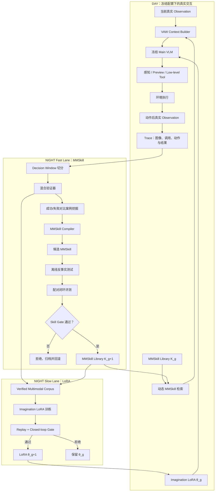

# VAW-RSI：Verifier-Governed Day–Night MMSkill Co-Evolution

> 状态：方法设计草案 v2（2026-08-30）
> 目标：定义 VAW 最关键的 DAY–NIGHT 自进化机制
> 边界：本文档只定义方法目标；工程实施边界见 `MMSKILL_RSI_REFACTOR_PLAN.md`
> 工作名称：**VAW-RSI / Verifier-Governed Day–Night MMSkill Co-Evolution**

---

## 0. 核心立场

VAW 的研究出发点不是为某一个原子动作写出更好的 SOP，而是解决预训练 VLM 与具身操作接口之间的
能力落差：通用 VLM 已具有丰富的语义、视觉与常识能力，但它缺少面向机器人操作的度量空间锚点、
可观测物理状态、动作接口和反事实视觉参照。

因此，VAW 不把 VLM 重新训练成固定任务策略，而是通过三类外部结构释放其已有能力：

1. **Grounded Perception Tools**：将语义目标连接到区域、像素和 robot-base XYZ；
2. **Embodied Action Tools**：提供可组合的低层物理动作与空间 Preview；
3. **Visual Action Workspace**：把当前真实世界、局部接触几何和未执行动作想象编译为视觉锚点。

当 VLM 权重保持冻结时，剩余问题是：模型在陌生空间关系下不知道应重点观察什么、怎样判断姿态是否
合理，以及下一步如何做最小而可验证的调整。VAW-RSI 的解法不是增加固定流程，而是从系统自己的真实
交互中提取经过验证、可跨任务复用的 **MMSkills（Multimodal Skills）**，并在未来相似决策中按需
加载。MMSkill 不是纯图片或纯文本，而是把视觉正反例、短语言提示、可用工具能力和动作后验证条件
组织成一个最小多模态技能单元。

一句话定义：

> VAW-RSI 将真实机器人交互编译为可检索的 MMSkill，并通过固定验证器和配对闭环评测决定这些技能
> 是否进入下一代 Agent Harness；经过多代验证的稳定技能可进一步蒸馏进 Imagination Specialist 的
> LoRA 权重。

---

## 1. RSI 的准确边界

本文使用的是 **bounded, verifier-governed recursive harness improvement**，而不是允许系统任意重写
自身代码的开放式 RSI。

| 系统部分 | 是否进化 | 内容 |
| --- | ---: | --- |
| Embodied Substrate | 否 | 感知工具、动作 API、坐标约定、基础 Canvas 语义、安全边界 |
| Frozen Reasoner | 否 | Main VLM 与 Imagination VLM 权重 |
| Verification Contract | 否 | 证据格式、验证器、数据划分、采纳门槛 |
| Fast Evolvable Memory | 是 | MMSkill Library、技能可靠性统计与检索排序 |
| Slow Evolvable Memory | 是，周期性 | Imagination Specialist 的 LoRA adapter |

系统采用快慢双记忆，而不是让所有模块同时变化：

- **MMSkill Fast Lane**：每代都可生成、验证、晋升和回滚，负责快速吸收显式经验；
- **LoRA Slow Lane**：只周期性蒸馏已经稳定、跨任务复用的 MMSkill 轨迹，负责将重复出现的空间能力
  压缩进 Imagination Specialist 权重。

两条路线独立提出候选、独立评测，最后才进行联合部署测试。Prompt、Function schema、Canvas 基础语义、
Main VLM 权重和 verifier 始终冻结。这样能够分别回答“外部多模态技能是否有效”“权重蒸馏是否有效”
以及“两者是否互补”，避免同时改变 MMSkill 与 LoRA 后无法归因。

---

## 2. 方法总览



令冻结的 Main VLM、工具、Canvas contract 和验证器分别为 \(M,T,C,V\)，第 \(g\) 代 MMSkill 库为
\(K_g\)，Imagination Specialist 的 LoRA 权重为 \(\theta_g\)。DAY 产生交互数据：

\[
D_g \sim \pi(M,T,C,K_g,\theta_g).
\]

Fast Lane 使用自己的轨迹提出候选变化 \(\Delta K_g\)。Slow Lane 只使用已经通过技能验证、执行结果
可信且跨任务复用的多模态轨迹构造训练集 \(B_g\)，周期性产生 \(\Delta\theta_g\)。二者分别通过独立
门控：

\[
K_{g+1} =
\begin{cases}
K_g \oplus \Delta K_g, & \text{if contract and paired evaluation pass},\\
K_g, & \text{otherwise}.
\end{cases}
\]

\[
\theta_{g+1} =
\begin{cases}
\operatorname{LoRA}(\theta_g, B_g), & \text{if replay and closed-loop gates pass},\\
\theta_g, & \text{otherwise}.
\end{cases}
\]

新的 \(K_{g+1}\) 先显式改变下一代 Agent 的视觉参考；经过多代稳定验证的知识再被压缩到
\(\theta_{g+1}\)。新 Harness 和新 Specialist 共同改变下一代轨迹分布，下一代轨迹又暴露新的显式知识
缺口与权重能力缺口，由此形成快慢双时间尺度的递归改进。

---

## 3. MMSkill：进化的基本单位

### 3.1 为什么不是 SOP

SOP 将一段成功行为压缩成固定动作顺序，很容易绑定某个物体、任务或 primitive。VAW-RSI 的知识单元
不规定“先调用什么、再调用什么”，而是教授一个可跨任务复用的视觉—物理关系，并由 VLM 根据当前
真实场景决定动作。

> SOP 教 Agent 复现一条路径；MMSkill 教 Agent 识别一个多模态视觉—物理关系。

### 3.2 Agent 可见表示

```text
MMSkillCapsule
├── applicable_when       # 参考适用于什么可见条件
├── positive_reference    # 合理几何关系的视觉参考
├── negative_reference    # 可选：典型误判或失败反例
├── visual_cue            # 应重点比较什么关系
├── tool_affordances       # 可考虑哪些 Function 能力，不规定调用顺序
├── adjustment_principle  # 如何从当前关系推导局部调整
└── verification_cue      # 执行后应观察什么证据
```

MMSkill 的“多模态”不是简单把一张图片和一段文字拼在一起。图片负责表达空间关系，语言负责指出比较
对象和证据边界，Function affordance 负责连接 VAW 的可操作能力，verification cue 负责将建议重新连接
到动作后的真实世界。任何一个模态都不能独立替代其它模态。

例如，一个平行夹爪抓取技能可以描述：

```text
适用条件：
平行夹爪正在接近一个局部可见物体，但闭合条件不确定。

正例：
物体截面位于两指闭合扫掠区域内，掌部与物体保留净空。

反例：
物体仅位于指尖下方，或掌部会先于两指接触物体。

调整原则：
根据两个正交 Contact Views 判断平移或旋转方向，只做能够从视觉中验证的最小修正。

执行后验证：
闭合不等于抓持。小幅抬升后，物体离开支撑面并随夹爪运动才支持抓持成立。
```

它不包含罐头、任务 ID、绝对坐标或固定 `select → move → close` 序列。

### 3.3 系统私有表示

以下内容服务于检索、统计和治理，不进入 Agent Context：

```text
skill_id
multimodal_embedding
source_trace_ids
verification_support
successful_uses / harmful_uses
covered_action_families
distillation_examples
distillation_readiness
version / parent_version
```

`distillation_examples` 只引用已经验证的 Decision Window，不复制进 Agent Context；
`distillation_readiness` 表示该技能是否已经跨多个对象、布局或任务获得稳定支持。只有 ready 的 MMSkill
能够进入 LoRA Slow Lane。

知识库禁止存储：

- task ID、seed 或场景特例；
- 具体物体名；
- 绝对 XYZ 或针对某个场景的精确 offset；
- 固定 Function 序列；
- planner/backend 错误文本；
- reward、env success 或其它 privileged truth。

---

## 4. 动态 MMSkill 加载

当前 task-start Knowledge Pack 适合为 episode 提供稳定先验，但无法在具体空间困难发生时即时提供参考。
VAW-RSI 增加一个非物理、非控制型工具：

```text
consult_mmskill(question, action_id?)
```

示例：

```json
{
  "question": "当前夹爪相对目标是否适合闭合，应从哪个方向微调？",
  "action_id": "a3"
}
```

检索输入包括：

- 当前 Main 或 Imagination Canvas；
- Agent 的自然语言问题；
- 当前 Action 类型及可用视角；
- 当前有效的 region/point/action 引用。

系统只加载最高相关的 1–2 个技能。Function result 保持最小：

```json
{"loaded": true}
```

技能内容进入下一张 Canvas，而不是以长文本 Function result 注入。推荐的视觉结构为：

```text
CURRENT EVIDENCE | POSITIVE REFERENCE | NEGATIVE REFERENCE
```

所有外部参考必须明确标注：

```text
REFERENCE — NOT CURRENT — NOT EXECUTED
```

技能的生命周期是 action-local：Action 被执行、丢弃或替换后自动卸载，不进入几十轮的长期上下文。
未来可加入通用的恢复提示：当 Progress Critic 检测到连续停滞时，仅提示“存在可查询视觉参考”，而不
强制加载某个流程。

---

## 5. DAY：交互与经验采集

### 5.1 Generation 冻结

同一代 DAY 期间，以下内容保持冻结：

- Main/Imagination VLM；
- Function schema 与 backend；
- Prompt 基础契约；
- Canvas 基础语义；
- MMSkill Library；
- verifier 版本与评测预算。

DAY 期间不在线修改技能，避免同一 generation 内的策略漂移和不可复现实验。

### 5.2 Decision Window

每个真实物理变化形成一个局部决策窗口：

```text
DecisionWindow
├── task
├── before_canvas
├── loaded_visual_skills
├── VLM function call
├── requested_action
├── achieved_action
├── after_canvas
└── terminal_outcome       # trace-only
```

窗口通常覆盖：

```text
感知/创建 Action
→ 一组 Preview 或 Imagination edits
→ 物理执行
→ 新真实 Observation
```

`requested_action` 和 `achieved_action` 必须分开保存。如果控制器只实现了部分位移，Night 不能把结果
错误归因给 VLM 的空间理解，否则知识库会学习如何补偿 controller bug。

---

## 6. NIGHT：从轨迹到技能

### 6.1 决策窗口切分

Night 不直接总结完整 episode，而是围绕真实物理变化切分局部窗口。局部窗口使系统能够判断一个视觉
决策是否产生了预期物理效果，也避免完整 transcript 中的大量感知和恢复调用淹没关键因果关系。

### 6.2 混合验证器

验证分为四层：

| 层级 | 作用 | 是否可作为最终采纳依据 |
| --- | --- | ---: |
| V0 Protocol | Function 是否合法、是否实际调用 | 否 |
| V1 Execution | 请求动作是否被 controller 实现 | 否 |
| V2 Visual Progress | 真实 Canvas 前后是否前进、停滞或退化 | 仅用于挖掘/诊断 |
| V3 Terminal | episode 最终任务是否成功 | 是 |

Progress Critic 可以输出：

```text
ADVANCE
SUPPORT
NEUTRAL
HARM
UNKNOWN
```

它用于定位关键窗口、发现停滞和构造正反例，不直接决定候选技能是否晋升。最终晋升仍需依赖固定预算、
相同 task/seed 的闭环配对结果，避免视觉 critic 被候选知识投机利用。

### 6.3 保守失败归因

Night 对失败只做以下粗粒度归因：

```text
perception_gap
visual_reasoning_gap
execution_gap
effect_verification_gap
missing_capability
unknown
```

只有高置信度的 `visual_reasoning_gap` 和 `effect_verification_gap` 可以产生 MMSkill 候选。

下列问题必须进入工程问题队列，不能被知识卡掩盖：

- detector/SAM 错误；
- 坐标变换错误；
- PyRoki/CuRobo 没有实现请求动作；
- 观测或 Canvas 渲染错误；
- 缺少必要的 Action API。

无法可靠归因时标记为 `unknown`，不生成技能。

### 6.4 对比式经验挖掘

最有价值的 Night 输入不是单条成功轨迹，而是：

```text
相似意图 + 相似初始几何
失败决策 vs 成功决策
```

例如，两个抓取窗口中，一个只在 Agentview 看似对齐但闭合失败，另一个在两个 Contact Views 中都
进入闭合扫掠区域并成功抓持。Night 从真实 trace 中重渲染规范化参考：

- 使用相同 Contact Camera 约定；
- 使用相同尺寸与视觉语义；
- 去掉任务名称、ID、错误文本；
- 保留手指、物体表面、闭合通道与净空关系；
- 必要时包含正例和一个最接近的反例。

随后由冻结 VLM 在角色隔离的调用中生成简短 `visual_cue` 与 `verification_cue`。诊断调用只描述
发生了什么，技能编译调用再读取诊断和内容契约；禁止一边诊断一边直接改库。

---

## 7. 候选技能晋升

候选知识不能直接部署，必须依次通过三个 Gate。

### Gate A：内容契约

自动拒绝：

- 任务名、物体名、seed 或 scene 特例；
- 精确绝对坐标；
- 固定 API 序列；
- privileged truth；
- 伪 phase machine；
- 与工具、frame 或视觉语义冲突的内容；
- 无法追溯到已验证 Decision Window 的图片。

### Gate B：离线反事实决策测试

在冻结的历史决策状态上进行成对请求：

```text
同一 VLM + 当前 Canvas
同一 VLM + 当前 Canvas + 候选 MMSkill
```

测试候选是否改善：

- 空间调整方向；
- close/open 时机；
- observed/preview 归因；
- 动作后效果核验；
- 无意义重复调用。

该 Gate 只做低成本预筛选，不构成最终成功证据。

### Gate C：配对闭环评测

在完全相同的 task、seed 和预算下比较：

```text
K_g
vs
K_g + candidate
```

晋升要求：

1. train 上 `fail→success` 多于 `success→fail`；
2. validation 不出现净退化；
3. HARM 行为不增加；
4. token、turn 和 physical-op 使用相同预算；
5. final test 在所有进化结束前保持密封。

每代默认只接受一个技能变更，保证可以归因、版本化和回滚。小样本时报告完整配对表和置信区间，不用
单次偶然成功宣称进化成立。

---

## 8. MMSkill Library 治理

技能库不能只增不减。Night 必须支持：

```text
ADD      新增可靠视觉关系
MERGE    合并语义与行为重复的技能
REFINE   用更强的正反例替换旧参考
RETIRE   下线低价值或有害技能
```

检索排序可以使用私有评分：

\[
score = similarity + reliability + crossTaskReuse - harmRate - redundancy.
\]

这些统计不能进入 Agent Context。库中每个版本保存来源 trace、内容 hash、父版本、评测结果和拒绝原因，
保证完整可审计性。

---

## 9. LoRA Slow Lane：稳定技能的权重蒸馏

### 9.1 为什么保留 LoRA

MMSkill 适合快速、显式和可回滚的经验更新，但每次检索都会增加视觉 token 和推理成本，也要求大模型
在运行时重新理解同一类空间关系。对于已经跨对象、布局和任务反复验证的能力，可以将其蒸馏到一个
小型 Imagination Specialist，使常见的局部平移、旋转、视角比较和停止判断成为权重中的慢速能力。

Main VLM 在 v1 中始终冻结。LoRA 只训练窄接口的 Imagination Specialist，原因是它的输入和输出更
受控：输入是当前 Focused Canvas、Main instruction 和可选 MMSkill，输出只包含局部 Preview edit 或
`ready/failed` 判断。

### 9.2 Verified Multimodal Corpus

每个训练样本严格复用部署时可见的输入，不能把训练期 privileged signal 注入模型：

```text
MMSkillTrainingExample
├── task-agnostic instruction
├── current focused Canvas
├── loaded MMSkill references
├── current edit summary
├── target Function call
└── provenance               # private, never model-visible
```

语料进入条件：

1. Function 和坐标语义合法；
2. requested action 与 achieved action 一致；
3. 对应 MMSkill 已通过 Skill Gate，而不是刚生成的候选；
4. 该 Decision Window 不属于 `execution_gap`、`perception_gap` 或 `unknown`；
5. 最终动作得到闭环任务成功或可靠的局部物理进展支持；
6. 输入中不含 reward、env success、planner telemetry 或未来画面。

planner returned/ready 只说明运动计算完成，不能单独把轨迹变成正样本。

### 9.3 训练与部署门控

第一阶段使用 SFT 学习 verified Imagination edit。若正反例数量足够，可在后续加入偏好优化，但负例
必须来自同一初始视觉状态下经过验证的有害或无效 edit，不能由语言模型凭空编造。

LoRA candidate 依次通过：

```text
Frozen static spatial probes
→ historical decision replay
→ held-in closed-loop validation
→ independent non-regression set
```

门控检查：

- 空间方向、旋转方向和停止条件不退化；
- Function protocol 合法率不退化；
- validation task success 不退化；
- harmful edit 和重复 edit 不增加；
- 在相同预算下达到更低 token/latency，或更高成功率。

LoRA 失败时保留当前现役权重，不影响 MMSkill Fast Lane。

### 9.4 快慢时间尺度

两条路线不应每晚同步更新：

```text
每个 generation：MMSkill 提议、评测、晋升
每 N 个稳定 generation：汇总 ready MMSkill 语料并训练 LoRA
LoRA 独立通过门控后：再评测 MMSkill + LoRA 联合配置
```

MMSkill 是快速、可解释的外部记忆；LoRA 是低频、不可直接编辑的压缩记忆。LoRA 学会某个技能后不
立即删除对应 MMSkill，只有在 no-retrieval 消融证明 Specialist 已能稳定处理该能力后，Router 才可
降低其检索优先级。

---

## 10. Context 与 Memory 分层

VAW-RSI 不把原始 Function history 或完整成功轨迹放回 Agent Context。系统保留四种用途不同的 Memory：

```text
Operational Memory
    当前操作对象、当前 Action、最近物理变化
    episode-local，overwrite-only

MMSkill Buffer
    当前动态加载的 1–2 个视觉参考
    action-local，用完即清除

MMSkill Library
    跨 episode 的已验证视觉经验
    generation-level，只能由 NIGHT 修改

LoRA Specialist Memory
    跨 generation 的已蒸馏空间能力
    slow-timescale，只能通过独立 Deployment Gate 更新
```

原始 transcript、旧 rationale、planner telemetry、错误栈和旧图片属于 Trace Archive，不属于 Agent
Memory。

---

## 11. 与 SOP 和普通 RAG 的区别

| 方法 | 存储内容 | 谁决定动作 | 是否包含物理验证 | 泛化单元 |
| --- | --- | --- | ---: | --- |
| SOP | 固定步骤 | SOP 主导 | 通常局限于 primitive | 任务/流程 |
| Text RAG | 相似文本 | VLM | 不一定 | 语义相似性 |
| Image RAG | 相似图片 | VLM | 不一定 | 图像相似性 |
| VAW-RSI | 经物理结果验证的多模态关系、正反例与工具 affordance | VLM 保持控制权 | 是 | 可观测视觉—物理关系 |

VAW-RSI 不是“检索一张相似图片”而已。它要求参考来自可审计轨迹、经过结果验证、使用规范化视角、包含
适用条件和动作后验证条件，并经过闭环晋升。

---

## 12. 论文 Claim 与证据

### Claim 1：Dynamic MMSkill Retrieval

动态加载经过验证的视觉参考能够提高冻结 VLM 的空间操作决策。

所需证据：

- static Canvas；
- handwritten SOP；
- text-only skill；
- image-only exemplar；
- 完整 MMSkill Capsule；
- budget-matched test-time sampling。

### Claim 2：Day–Night Recursive Improvement

由系统自身轨迹生成并经闭环验证的 MMSkill 可以跨 generation 提高未见任务表现。

所需证据：

- Gen-0 → Gen-1 → Gen-N 曲线；
- 固定 task/seed 配对；
- 固定 token/turn/physical-op budget；
- final test sealed；
- 每代接受/拒绝账本。

### Claim 3：Cross-Task Skill Reuse

收益来自可复用视觉关系，而不是任务补丁。

所需证据：

- held-out object；
- held-out layout；
- held-out task template；
- 同一技能跨任务的检索次数、正收益次数和 harm rate。

### Claim 4：Fast–Slow MMSkill/LoRA Co-Evolution

显式 MMSkill 与 LoRA Specialist 承担互补的快慢记忆：MMSkill 提供可审计的快速适应，LoRA 将稳定、
高频的空间模式压缩为更低成本的内部能力。

所需证据：

- frozen Specialist + K0；
- MMSkill-only；
- LoRA-only；
- MMSkill + LoRA；
- teacher Imagination 上界；
- no-retrieval 测试与 token/latency 对比；
- 相同训练轨迹和 rollout budget。

核心实验矩阵：

| 配置 | Main | Imagination | MMSkill |
| --- | --- | --- | --- |
| Gen-0 | frozen | frozen teacher 或 base Specialist | K0 |
| H-only | frozen | 原权重 | evolved K |
| W-only | frozen | LoRA | K0 |
| H+W | frozen | LoRA | evolved K |
| TTS | frozen | 原权重 | K0 + budget-matched sampling |

### Claim–Evidence Map

| Claim | 必需证据 | 当前状态 |
| --- | --- | --- |
| 冻结 VLM 可由 MMSkill 增强 | 静态与闭环消融 | Needs evidence |
| DAY–NIGHT 能产生代际提升 | 多代、配对、sealed test | Needs evidence |
| 技能可跨任务复用 | object/layout/task held-out | Needs evidence |
| MMSkill 与 LoRA 互补 | H-only/W-only/H+W 与成本消融 | Needs evidence |
| Progress Critic 能可靠定位进展 | 标注集、校准、错误分析 | Partial implementation |

在这些实验完成前，论文应使用“we propose”与“we investigate”，不能提前写成已验证结论。

---

## 13. 与当前 VAW 的代码距离

当前系统已经具备大部分 DAY 侧基础：

- grounded perception 与 XYZ；
- low-level physical tools；
- Main 与 Imagination；
- 多视角 Canvas；
- 完整 trace/video；
- Task Knowledge Registry；
- Progress Critic 原型。

关键缺口是：

1. action-local 动态 MMSkill；
2. MMSkill Capsule 数据结构和 Reference Canvas；
3. trace 到 DecisionWindow 的编译器；
4. Progress Critic 的校准与 Night 接入；
5. contrastive MMSkill Compiler；
6. paired evaluator、generation ledger 和回滚；
7. 跨代技能合并、更新和淘汰；
8. verified multimodal corpus builder；
9. Imagination LoRA trainer、replay gate 和独立部署版本管理。

旧的文本 Card、task-start Pack 与固定流程方案已经退出当前代码和实施文档；本方法不为它们保留在线
兼容层。

---

## 14. 实施里程碑

### RSI-0：冻结实验基座

- 冻结工具、坐标约定和 Canvas 基础语义；
- 固定 train/validation/final-test；
- 校准 Progress Critic；
- trace 同时记录 requested 与 achieved action；
- 建立 generation ledger。

### RSI-1：动态 MMSkill

- 定义 `MMSkillCapsule`；
- 实现 `consult_mmskill`；
- 实现 action-local Reference Canvas；
- 先用 5–10 张人工但符合契约的技能卡验证机制价值。

### RSI-2：Night Experience Compiler

- DecisionWindow 切分；
- 正反例匹配；
- 视觉规范化与匿名化；
- 候选技能生成；
- 内容契约检查。

### RSI-3：晋升闭环

- 离线反事实 probe；
- task/seed 配对 rollout；
- accept/reject/rollback；
- ADD/MERGE/REFINE/RETIRE 生命周期。

### RSI-4：MMSkill 递归实验

- 连续运行 3–5 代；
- 每代冻结部署；
- sealed final-test 最终验收；
- 对比 SOP、Text RAG、Image RAG、TTS 和 static Canvas。

### RSI-5：LoRA Slow Lane

- 只使用已晋升 MMSkill 支持、且物理结果已验证的 Imagination 轨迹；
- 构造与运行时输入同构的 multimodal corpus；
- 蒸馏到小型 Imagination Specialist；
- 运行 static probe、decision replay 与 closed-loop gate；
- 与纯 MMSkill Evolution 分开报告；
- 不允许蒸馏结果反向修改 MMSkill 采纳历史或 verifier。

### RSI-6：快慢联合进化

- LoRA 与 MMSkill 候选先分别通过独立门控；
- 比较 Gen-0、H-only、W-only、H+W 和 TTS；
- 测量 no-retrieval 能力恢复、token、latency 和闭环成功率；
- 只有联合配置不发生回归时才成为下一代默认部署。

---

## 15. 高风险问题与防线

| 风险 | 防线 |
| --- | --- |
| MMSkill 变成任务 SOP | 禁止任务名、绝对量值与固定序列；做跨任务复用测试 |
| 参考图被误认为当前画面 | 独立布局并标注 `REFERENCE — NOT CURRENT` |
| Progress Critic 幻觉 | 只用于挖掘；闭环终局结果决定晋升 |
| 知识库吸收 backend bug | requested/achieved 分离；execution gap 不生成技能 |
| 库无限膨胀 | MERGE/RETIRE、冗余惩罚、每次最多加载两张 |
| 反复查看 held-out 导致过拟合 | train/validation/final-test 三分；final test 密封 |
| MMSkill 与 LoRA 同时变化无法归因 | 两条独立 Gate；先 H-only/W-only，再评测 H+W |
| LoRA 放大错误技能 | 只蒸馏已晋升且跨任务稳定的 MMSkill；训练集保存 provenance |
| LoRA 过拟合少量场景 | task/object/layout 分层切分；no-retrieval 和 sealed test |
| RSI claim 过度 | 明确 bounded harness RSI，不宣称通用自我重写 |

---

## 16. 明确非目标

VAW-RSI v1 不做：

- 自动修改机器人 Function schema；
- 自动修改 planner/controller；
- 自动修改基础 Canvas 语义；
- 自动修改 verifier 或 success 判定；
- object tracker、PDDL 或任务 phase machine；
- 将整条成功 episode 直接作为 Agent History；
- 用 Progress Critic 分数直接替代终局闭环评测；
- 无约束地自动生成并部署代码。

---

## 17. 方法自审计

### Contribution

- 方法单元是经过物理验证的视觉关系，而不是 task-specific SOP。
- DAY–NIGHT 将运行经验转化为下一代视觉 Harness，形成可审计的递归闭环。
- MMSkill 快记忆与 LoRA 慢记忆形成独立可消融的双时间尺度进化。

### Clarity

- `Operational Memory`、`MMSkill Buffer`、`MMSkill Library` 和 `LoRA Specialist Memory` 必须始终
  使用固定术语。
- `reference`、`preview` 和 `observation` 必须在视觉和文字上严格区分。

### Experimental Strength

- 必须有固定预算、配对 task/seed、多代曲线和 sealed final-test。
- 必须报告被拒绝技能，而不只展示成功案例。

### Evaluation Completeness

- 需要单独验证 Progress Critic 的校准；
- 需要报告 retrieval miss、harmful retrieval 与技能库膨胀；
- 需要跨 object/layout/task template 测试复用性。
- 需要独立报告 H-only、W-only 和 H+W，不能只报告联合最优结果。

### Method Soundness

- soft critic 只用于诊断，fixed terminal verifier 用于晋升；
- 进化对象与评价对象分离；
- 工程错误不能被知识演化吸收。

---

## 18. 最终论文表述

推荐的核心表述是：

> VAW-RSI is a bounded, verifier-governed recursive improvement framework that converts an embodied
> agent's own interaction traces into action-local multimodal skills. MMSkills provide a fast,
> inspectable memory that combines visual references, concise cues, tool affordances, and observable
> verification conditions. Stable skills are periodically distilled into a narrow Imagination
> Specialist through independently gated LoRA updates, yielding a fast-slow co-evolution loop while
> the Main VLM, tool contract, Canvas semantics, and verifier remain frozen.

中文概括：

> VAW-RSI 进化的不是一条机器人程序，而是一套快慢双层能力：MMSkill 负责快速、可审计的多模态经验
> 更新，LoRA 负责将跨任务稳定的经验压缩进 Imagination Specialist；冻结 Main VLM 仍然保留最终决策权。
